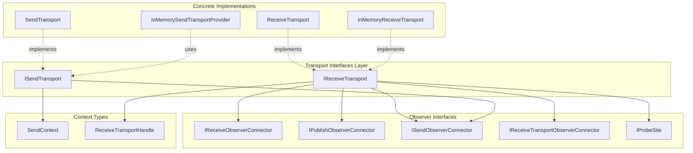
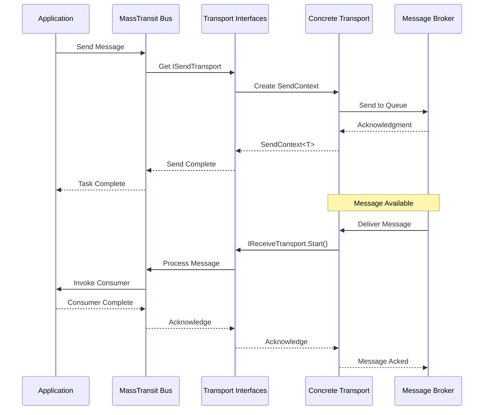

# Transport Interfaces Module

## Introduction

The Transport_Interfaces module provides the fundamental abstractions for message transport operations in MassTransit. It defines the core contracts that enable communication between different messaging systems and the MassTransit framework. This module serves as the bridge between the abstract messaging concepts and concrete transport implementations.

## Overview

The Transport_Interfaces module contains two primary interfaces that form the foundation of MassTransit's transport layer:

- **IReceiveTransport**: Defines the contract for receiving messages from a transport
- **ISendTransport**: Defines the contract for sending messages through a transport

These interfaces abstract the underlying messaging infrastructure, allowing MassTransit to work with various transport technologies (RabbitMQ, Azure Service Bus, Amazon SQS, In-Memory, etc.) through a unified API.

## Core Components

### IReceiveTransport

The `IReceiveTransport` interface is responsible for managing the reception of messages from the underlying transport infrastructure. It provides the contract for starting message reception and connecting various observers to monitor the receive pipeline.

```csharp
public interface IReceiveTransport :
    IReceiveObserverConnector,
    IPublishObserverConnector,
    ISendObserverConnector,
    IReceiveTransportObserverConnector,
    IProbeSite
{
    /// <summary>
    /// Start receiving on a transport, sending messages to the specified pipe.
    /// </summary>
    /// <returns></returns>
    ReceiveTransportHandle Start();
}
```

**Key Responsibilities:**
- Initiating message reception from the transport
- Managing observer connections for monitoring receive operations
- Supporting publish and send observation for comprehensive pipeline monitoring
- Providing diagnostic capabilities through `IProbeSite`

### ISendTransport

The `ISendTransport` interface defines the contract for sending messages through the transport infrastructure. It provides methods for creating send contexts and sending messages with customizable pipes.

```csharp
public interface ISendTransport :
    ISendObserverConnector
{
    Task<SendContext<T>> CreateSendContext<T>(T message, IPipe<SendContext<T>> pipe, CancellationToken cancellationToken)
        where T : class;

    Task Send<T>(T message, IPipe<SendContext<T>> pipe, CancellationToken cancellationToken)
        where T : class;
}
```

**Key Responsibilities:**
- Creating send contexts for message transmission
- Sending messages through the transport
- Supporting customizable pipes for message processing
- Providing cancellation support for send operations

## Architecture

### Transport Layer Architecture



### Transport Integration Flow



## Dependencies and Relationships

### Interface Dependencies

The transport interfaces depend on several observer and context interfaces from the [Core_Abstractions](Core_Abstractions.md) module:

- **IReceiveObserverConnector**: Enables connection of receive observers for monitoring message reception
- **IPublishObserverConnector**: Supports publish operation observation
- **ISendObserverConnector**: Enables monitoring of send operations
- **IReceiveTransportObserverConnector**: Provides transport-level observation capabilities
- **IProbeSite**: Supports diagnostic and introspection capabilities

### Related Modules

- **[Core_Abstractions](Core_Abstractions.md)**: Provides fundamental context types like `SendContext<T>`, `ReceiveContext`, and observer interfaces
- **[Transports_Core](Transports_Core.md)**: Contains concrete implementations of these interfaces and additional transport-related components
- **[Endpoint_Implementations](Endpoint_Implementations.md)**: Builds on transport interfaces to provide endpoint functionality
- **[InMemory_Transport](InMemory_Transport.md)**: Provides in-memory implementations of transport interfaces for testing and development

## Usage Patterns

### Send Transport Usage

```csharp
// Typical usage within MassTransit
public async Task SendMessage<T>(T message, ISendTransport transport) 
    where T : class
{
    // Create send context with custom pipe for headers, etc.
    var sendContext = await transport.CreateSendContext(
        message, 
        pipe: Pipe.Empty<SendContext<T>>(),
        cancellationToken: CancellationToken.None);
    
    // Send the message
    await transport.Send(message, pipe, CancellationToken.None);
}
```

### Receive Transport Usage

```csharp
// Starting message reception
public ReceiveTransportHandle StartReceiving(IReceiveTransport transport)
{
    // Start the transport to begin receiving messages
    var handle = transport.Start();
    
    // The handle can be used to stop reception later
    return handle;
}
```

## Implementation Considerations

### Transport Development

When implementing custom transports, developers must:

1. **Implement Observer Connectors**: Properly implement all observer connector interfaces to enable monitoring
2. **Handle Context Creation**: Create appropriate send contexts that carry all necessary message metadata
3. **Support Cancellation**: Implement proper cancellation token support for async operations
4. **Provide Diagnostics**: Implement `IProbeSite` to support system introspection

### Error Handling

Transport implementations should:
- Handle transport-level errors gracefully
- Provide meaningful error information through observers
- Support retry mechanisms where appropriate
- Maintain message ordering guarantees when required

## Integration Points

### With Middleware Pipeline

Transport interfaces integrate with MassTransit's middleware pipeline through:
- **SendContext**: Carries message through send pipeline
- **ReceiveContext**: Provides received message context
- **Observer Pattern**: Enables middleware to monitor transport operations

### With Endpoint System

Transport interfaces work with the endpoint system:
- **SendEndpoint**: Uses `ISendTransport` for message delivery
- **ReceiveEndpoint**: Uses `IReceiveTransport` for message reception
- **Endpoint Providers**: Create and manage transport instances

## Monitoring and Observability

The transport interfaces provide comprehensive observability through:

- **Send Observers**: Monitor message sending operations
- **Receive Observers**: Track message reception
- **Transport Observers**: Monitor transport-level events
- **Publish Observers**: Track publish operations
- **Probe Sites**: Enable runtime introspection

This multi-layered observation system allows for detailed monitoring of message flow and transport health.

## Summary

The Transport_Interfaces module provides the essential abstractions that enable MassTransit to work with diverse messaging systems. By defining clear contracts for send and receive operations, along with comprehensive observer support, these interfaces create a flexible foundation for building robust, observable, and maintainable messaging applications. The design supports both simple and complex messaging scenarios while maintaining consistency across different transport implementations.