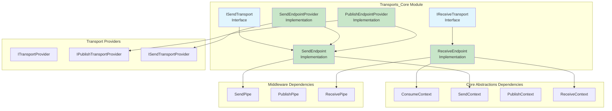
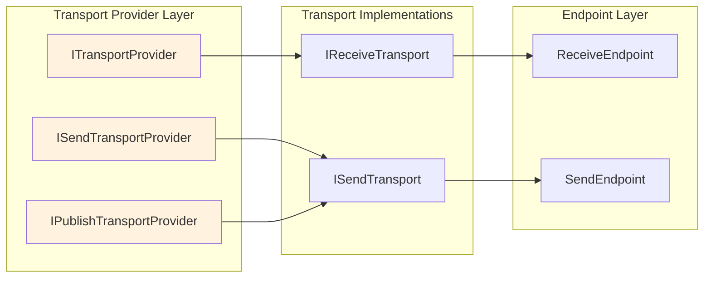

# Transports_Core Module Documentation

## Overview

The Transports_Core module is a fundamental component of the MassTransit message bus system, responsible for managing the low-level transport mechanisms that enable message sending and receiving across different transport providers. This module provides the core abstractions and implementations for send/receive endpoints, transport providers, and endpoint management.

## Purpose

The Transports_Core module serves as the bridge between MassTransit's high-level messaging abstractions and the underlying transport infrastructure. It handles:

- **Message Transport Management**: Abstracts transport-specific operations for sending and receiving messages
- **Endpoint Lifecycle Management**: Manages the creation, starting, stopping, and disposal of message endpoints
- **Transport Provider Integration**: Provides interfaces and implementations for different transport providers (RabbitMQ, Azure Service Bus, In-Memory, etc.)
- **Message Routing**: Handles the routing of messages to appropriate endpoints based on addressing schemes

## Architecture

## Core Components

### Transport Interfaces

The transport interfaces define the contracts for transport implementations. For detailed information, see [Transport_Interfaces](Transport_Interfaces.md).

**Key Interfaces:**
- **IReceiveTransport**: Defines the contract for transport implementations that can receive messages
- **ISendTransport**: Defines the contract for transport implementations that can send messages to specific destinations

### Endpoint Implementations

The endpoint implementations provide concrete message sending and receiving capabilities. For detailed information, see [Endpoint_Implementations](Endpoint_Implementations.md).

**Key Implementations:**
- **SendEndpoint**: Provides message sending capabilities with multiple overloads and middleware integration
- **ReceiveEndpoint**: Manages the lifecycle of message receiving operations with state machine pattern

### Endpoint Providers

The endpoint providers create and manage endpoint instances. For detailed information, see [Endpoint_Providers](Endpoint_Providers.md).

**Key Providers:**
- **SendEndpointProvider**: Creates and caches send endpoints for specific addresses
- **PublishEndpointProvider**: Creates send endpoints specifically for publish operations using message topology

## Integration with Other Modules

### Core Abstractions Integration
The Transports_Core module heavily relies on the [Core_Abstractions](Core_Abstractions.md) module for:
- **ConsumeContext**: Provides message consumption context
- **SendContext**: Provides message sending context  
- **PublishContext**: Provides message publishing context
- **ReceiveContext**: Provides message receiving context

### Middleware Integration
Integration with [Middleware_Core](Middleware_Core.md) provides:
- **Send Pipes**: Process messages before sending
- **Receive Pipes**: Process messages after receiving
- **Publish Pipes**: Process messages before publishing

### Configuration Integration
Works with [Configuration_Core](Configuration_Core.md) for:
- Endpoint configuration
- Transport-specific settings
- Topology configuration

## Transport Provider Architecture

## Key Design Patterns

### 1. Abstract Factory Pattern
Transport providers act as abstract factories for creating transport instances.

### 2. Observer Pattern
Extensive use of observers for monitoring transport and endpoint activities.

### 3. Pipeline Pattern
Integration with middleware pipes for message processing.

### 4. State Machine Pattern
ReceiveEndpoint uses a state machine for lifecycle management.

### 5. Cache Pattern
Endpoint providers use caching to optimize endpoint creation.

## Error Handling and Resilience

The module implements several resilience patterns:

- **Connection Exception Handling**: Special handling for transient vs. non-transient connection errors
- **Cancellation Support**: Proper cancellation token propagation throughout the pipeline
- **Resource Cleanup**: Async disposal patterns for proper resource management
- **Observer Fault Isolation**: Faults in observers don't affect message processing

## Performance Considerations

- **Endpoint Caching**: Reduces overhead of repeated endpoint creation
- **Async/Await**: Extensive use of async patterns for I/O operations
- **Object Pooling**: Potential for object pooling in high-throughput scenarios
- **Batching**: Support for batch operations where transport allows

## Extension Points

The module provides several extension points:

1. **Custom Transport Providers**: Implement `ISendTransportProvider` and `IPublishTransportProvider`
2. **Custom Transports**: Implement `ISendTransport` and `IReceiveTransport`
3. **Observers**: Connect custom observers to monitor transport activities
4. **Pipes**: Add custom middleware through pipe configurations

## Related Documentation

- [Core_Abstractions](Core_Abstractions.md) - Core messaging abstractions
- [Middleware_Core](Middleware_Core.md) - Middleware and pipeline processing
- [Configuration_Core](Configuration_Core.md) - Configuration interfaces
- [InMemory_Transport](InMemory_Transport.md) - In-memory transport implementation