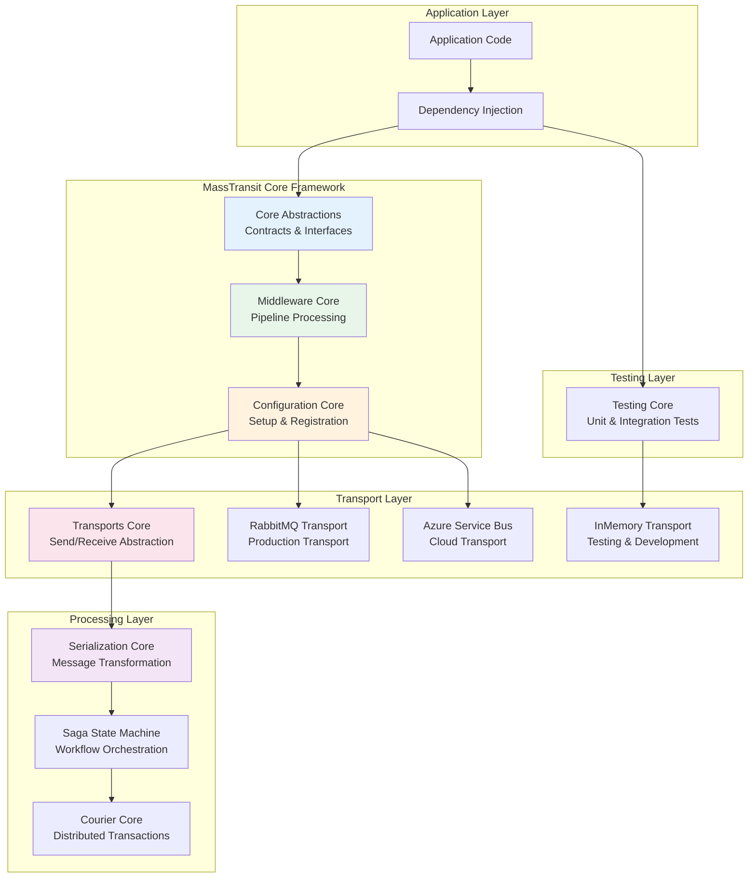
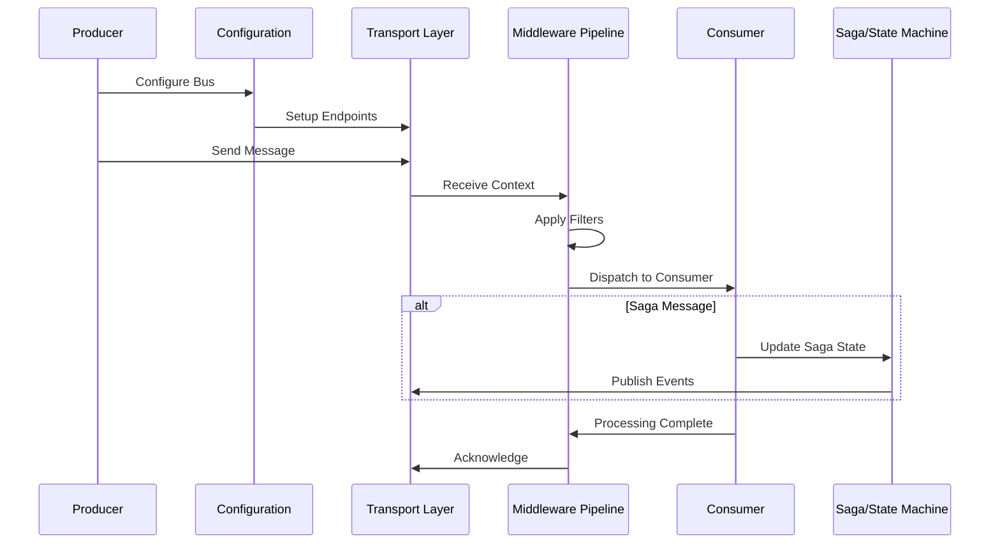

# MassTransit Repository Overview

## Purpose

MassTransit is a comprehensive .NET messaging framework that provides a unified abstraction layer over various message transport technologies. The repository implements a distributed application framework built on message-based communication patterns, enabling developers to build scalable, loosely-coupled systems using publish/subscribe, request/response, and saga orchestration patterns.

## End-to-End Architecture

## Message Processing Flow

## Core Module Documentation

### [Core Abstractions](Core_Abstractions.md)
Foundational interfaces and contracts defining message consumers, sagas, contexts, and correlation mechanisms. This module establishes the fundamental building blocks for all message-based communication patterns.

### [Middleware Core](Middleware_Core.md)
Pipeline processing engine implementing the middleware pattern for message transformation, filtering, and routing. Provides extensible filter chains for cross-cutting concerns like logging, metrics, and error handling.

### [Configuration Core](Configuration_Core.md)
Comprehensive configuration system with fluent API for bus setup, endpoint configuration, and component registration. Manages transport settings, serialization options, and middleware pipeline configuration.

### [Transports Core](Transports_Core.md)
Transport abstraction layer providing unified interfaces for message sending and receiving. Implements endpoint lifecycle management and transport provider integration patterns.

### [Serialization Core](Serialization_Core.md)
Message transformation infrastructure supporting multiple serialization formats with JSON as the primary format. Implements the message envelope pattern for metadata preservation and cross-platform compatibility.

### [Saga State Machine Core](Saga_StateMachine_Core.md)
Advanced state machine framework built on Automatonymous for building complex, event-driven workflows. Provides correlation, persistence integration, and request/response pattern support within state machine contexts.

### [Courier Core](Courier_Core.md)
Distributed transaction processing framework implementing the Routing Slip pattern. Enables reliable execution of distributed transactions with automatic compensation capabilities.

### [Dependency Injection Core](DependencyInjection_Core.md)
Comprehensive DI integration supporting Microsoft.Extensions.DependencyInjection and other containers. Provides convention-based registration, scoped context management, and automatic endpoint discovery.

### [Testing Core](Testing_Core.md)
Complete testing infrastructure with in-memory test harnesses for unit and integration testing. Supports consumer testing, saga verification, and message flow validation without external dependencies.

### [InMemory Transport](InMemory_Transport.md)
High-performance in-memory transport implementation for testing and development scenarios. Provides zero-latency message delivery and seamless integration with the testing framework.