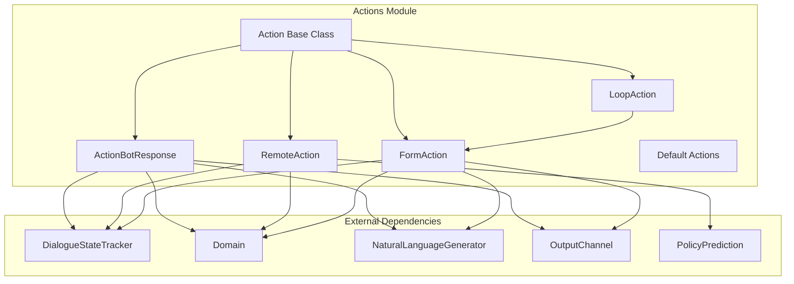
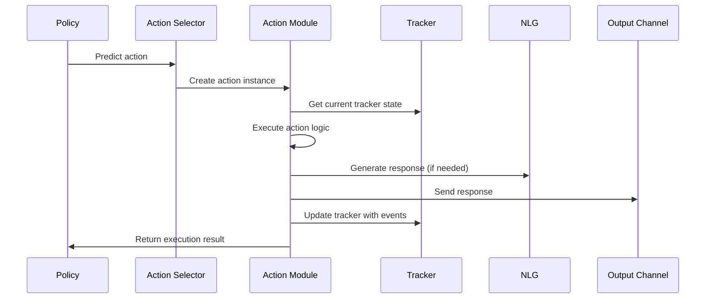

# Actions Module Documentation

## Overview

The Actions module is a core component of the Rasa Core dialogue management system, responsible for executing bot responses and handling various types of actions during conversation flow. Actions represent the bot's capabilities to respond to user inputs, manage conversation state, and interact with external systems.

## Purpose

The Actions module provides:
- **Action Execution Framework**: A unified interface for executing different types of bot actions
- **Built-in Actions**: Default actions for common conversation management tasks
- **Custom Action Support**: Infrastructure for running custom actions via action servers
- **Form Handling**: Complex multi-turn conversation flows through form actions
- **Fallback Management**: Graceful handling of misunderstood user inputs
- **Loop Actions**: Support for iterative conversation patterns

## Architecture



## Core Components

### 1. Action Base Class (`rasa.core.actions.action.Action`)
The abstract base class for all actions in Rasa, defining the standard interface that every action must implement.

**Key Responsibilities:**
- Define action name and execution interface
- Handle event generation for successful execution
- Provide foundation for specialized action types

### 2. Action Types

#### Bot Response Actions
- **ActionBotResponse**: Handles utterance responses from the domain
- **ActionRetrieveResponse**: Retrieves responses from NLU response selector
- **ActionEndToEndResponse**: Handles end-to-end bot responses

#### System Actions
- **ActionListen**: Waits for user input (default first action)
- **ActionRestart**: Resets conversation state
- **ActionSessionStart**: Manages conversation session lifecycle
- **ActionDefaultFallback**: Handles fallback scenarios

#### Custom Actions
- **RemoteAction**: Executes custom actions via action server endpoints
- **ActionExecutionRejection**: Handles action execution failures

### 3. Form Actions (`rasa.core.actions.forms.FormAction`)
Specialized loop actions for multi-turn conversations to collect required information from users.

**Key Features:**
- Slot filling with validation
- Multi-turn conversation management
- Custom validation actions
- Dynamic slot requests

### 4. Loop Actions (`rasa.core.actions.loops.LoopAction`)
Abstract base class for actions that require iterative execution patterns.

**Key Features:**
- Activation/deactivation lifecycle
- Iterative execution patterns
- Event accumulation
- Loop termination conditions

### 5. Fallback Actions (`rasa.core.actions.two_stage_fallback.TwoStageFallbackAction`)
Two-stage fallback mechanism for handling low-confidence NLU predictions.

**Process Flow:**
1. Ask user to affirm predicted intent
2. Ask user to rephrase if affirmation fails
3. Execute default fallback if rephrasing fails

## Data Flow



## Integration Points

### With Dialogue Management Core
- **MessageProcessor**: Triggers action execution after policy prediction
- **DialogueStateTracker**: Provides conversation context and state
- **PolicyPrediction**: Determines which action to execute

### With NLU Pipeline
- **ResponseSelector**: Provides contextually appropriate responses
- **IntentClassification**: Informs action selection
- **EntityExtraction**: Provides data for slot filling

### With Domain & Training Data
- **Domain**: Provides action definitions, responses, and slot configurations
- **SlotMappings**: Define how slots are filled from user input
- **Forms**: Define multi-turn conversation structures

## Sub-modules

### [Built-in Actions](Built-in_Actions.md)
Default actions provided by Rasa for common conversation management tasks, including system actions like listening for user input, restarting conversations, and managing sessions.

### [Form Actions](Form_Actions.md)
Complex multi-turn conversation handling through structured form interactions, with slot validation, dynamic requests, and custom validation actions.

### [Loop Actions](Loop_Actions.md)
Iterative action patterns for conversations requiring multiple interaction cycles, providing activation/deactivation lifecycle management and event accumulation.

### [Fallback Actions](Fallback_Actions.md)
Graceful error handling and recovery mechanisms for misunderstood inputs, including two-stage fallback processes and user affirmation workflows.

## Key Features

### 1. Action Resolution
The module provides intelligent action resolution based on:
- Action names from domain configuration
- Custom action endpoints
- Form definitions
- Retrieval intents

### 2. Event Generation
Actions generate events that update the conversation state:
- `ActionExecuted`: Records action execution
- `BotUttered`: Records bot responses
- `SlotSet`: Updates slot values
- `UserUtteranceReverted`: Handles fallback scenarios

### 3. Validation and Error Handling
- Action execution validation
- Custom validation actions
- Graceful error handling with fallback mechanisms
- Action rejection handling

### 4. External Integration
- HTTP-based custom action execution
- Configurable endpoints
- Request/response validation
- Error recovery

## Usage Patterns

### Basic Action Execution
```python
# Action selection and execution
action = action_for_name_or_text(action_name, domain, action_endpoint)
events = await action.run(output_channel, nlg, tracker, domain)
```

### Form-based Conversations
```python
# Form activation and execution
form_action = FormAction(form_name, action_endpoint)
events = await form_action.run(output_channel, nlg, tracker, domain)
```

### Custom Action Development
```python
# Custom action implementation
class CustomAction(Action):
    def name(self) -> Text:
        return "custom_action_name"
    
    async def run(self, output_channel, nlg, tracker, domain):
        # Custom logic here
        return [SlotSet("slot_name", value)]
```

## Configuration

### Domain Configuration
Actions are defined in the domain file:
```yaml
actions:
  - utter_greet
  - action_check_weather
  - validate_booking_form

forms:
  booking_form:
    required_slots:
      - destination
      - date
```

### Endpoint Configuration
Custom actions require endpoint configuration:
```yaml
action_endpoint:
  url: "http://localhost:5055/webhook"
```

## Error Handling

The module implements comprehensive error handling:
- **ActionNotFoundException**: When requested action doesn't exist
- **ActionExecutionRejection**: When action refuses to execute
- **RasaException**: General execution failures
- **Network Errors**: Custom action server connectivity issues

## Performance Considerations

- **Caching**: Action instances can be cached to avoid repeated instantiation
- **Async Execution**: All actions support asynchronous execution
- **Batch Processing**: Multiple events can be processed in single action execution
- **Timeout Handling**: Configurable timeouts for custom action execution

## Testing

The module supports comprehensive testing:
- Unit testing of individual actions
- Integration testing with tracker and domain
- Mock output channels for response validation
- Event sequence validation

## Related Documentation

- [Dialogue Management Core](Dialogue_Management_Core.md) - Core dialogue processing
- [Domain & Training Data](Domain_Training_Data.md) - Domain configuration and training data
- [NLG Module](NLG_Module.md) - Natural language generation
- [Communication Channels](Communication_Channels.md) - Output channel implementations