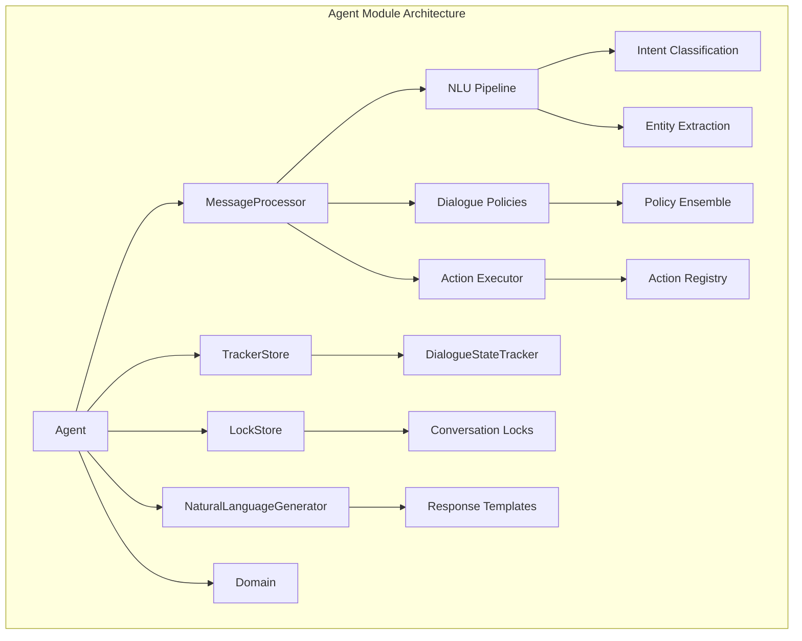
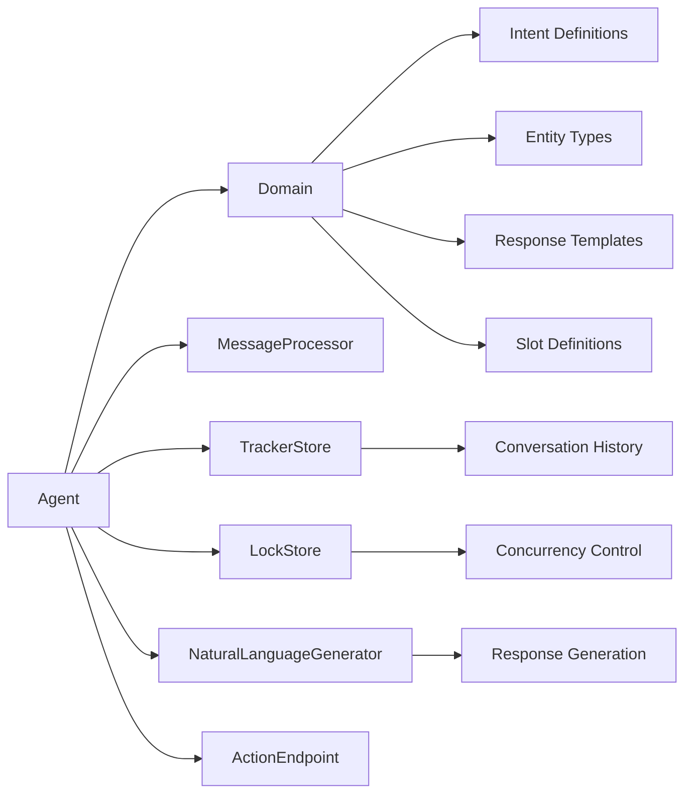
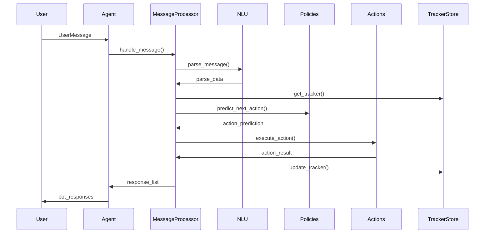
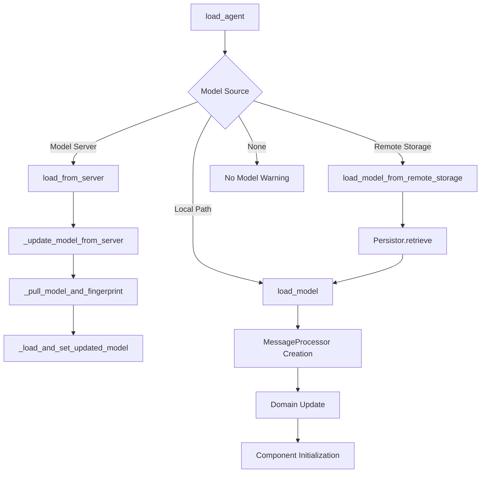
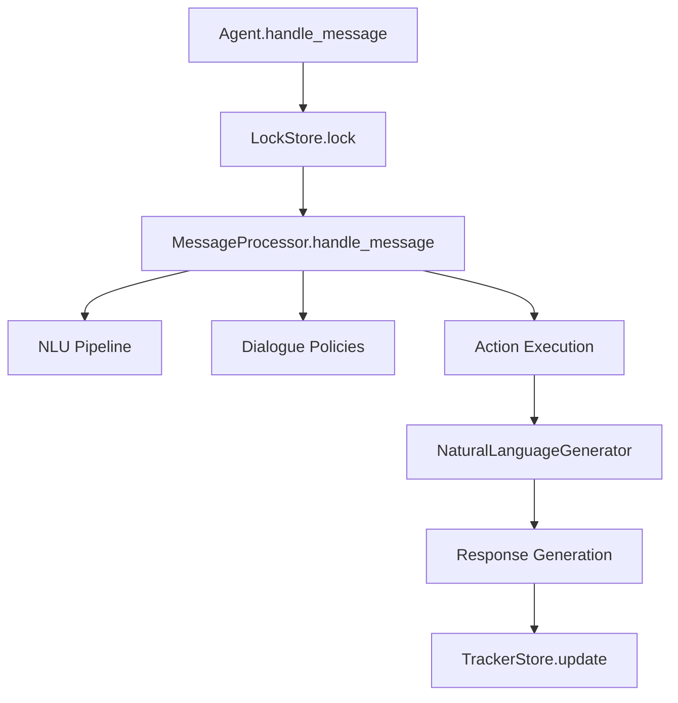
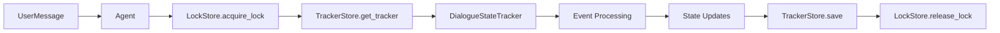
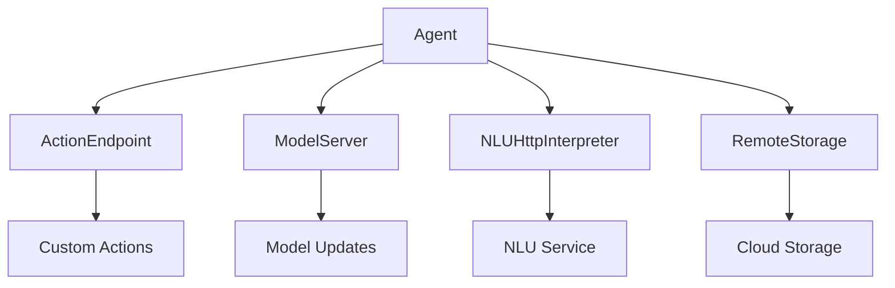

# Agent Module Documentation

## Introduction

The Agent module is the central orchestrator of the Rasa Core dialogue management system. It serves as the primary interface between external communication channels and the internal dialogue processing pipeline, managing the complete lifecycle of conversational interactions. The Agent coordinates between natural language understanding (NLU), dialogue policies, action execution, and response generation to provide a seamless conversational experience.

As the core component of the Dialogue Management Core module, the Agent encapsulates the complexity of the underlying system and provides a unified API for handling messages, predicting actions, and managing conversation state across multiple users and sessions.

## Architecture Overview

The Agent module follows a layered architecture pattern that separates concerns between model loading, message processing, conversation tracking, and action execution. The architecture is designed to be asynchronous and scalable, supporting multiple concurrent conversations while maintaining state consistency.

## Core Components

### Agent Class

The `Agent` class is the primary interface of the module, providing methods for:
- Model loading and management
- Message handling and processing
- Action prediction and execution
- Conversation state management
- External integrations

#### Key Properties

- **model_id**: Unique identifier for the loaded model
- **model_name**: Human-readable name of the loaded model
- **is_ready()**: Validation method ensuring all components are properly initialized

#### Initialization Dependencies

The Agent requires several key components to function properly:

## Data Flow Architecture

### Message Processing Flow

The Agent orchestrates a complex message processing pipeline that transforms user input into appropriate system responses:

### Model Loading Flow

The Agent supports multiple model loading strategies to accommodate different deployment scenarios:

## Component Interactions

### Message Processing Integration

The Agent delegates message processing to the [MessageProcessor](MessageProcessor.md) component, which coordinates between multiple subsystems:

### Conversation State Management

The Agent maintains conversation state through a sophisticated tracking system:

## Key Functionalities

### Message Handling

The Agent provides multiple interfaces for message processing:

- **handle_message()**: Primary method for processing UserMessage objects
- **handle_text()**: Convenience method for text-based interactions
- **parse_message()**: NLU-only processing without dialogue management
- **log_message()**: Message logging without action prediction

### Action Management

The Agent supports various action execution patterns:

- **predict_next_for_sender_id()**: Predict next action for a specific user
- **predict_next_with_tracker()**: Predict action given a conversation tracker
- **execute_action()**: Direct action execution with custom parameters
- **trigger_intent()**: External intent triggering for proactive interactions

### Model Management

The Agent implements comprehensive model lifecycle management:

- **load_model()**: Load model from local filesystem
- **load_model_from_remote_storage()**: Load model from cloud storage
- **load_from_server()**: Continuous model updates from remote server
- **fingerprint tracking**: Model version management and updates

## Integration Points

### External System Integration

The Agent integrates with various external systems through configurable endpoints:

### Storage Backend Support

The Agent supports multiple storage backends for conversation tracking:

- **InMemoryTrackerStore**: Development and testing scenarios
- **RedisTrackerStore**: High-performance production deployments
- **SQLTrackerStore**: Persistent relational database storage
- **FailSafeTrackerStore**: Wrapper providing fault tolerance

## Error Handling and Resilience

### Fault Tolerance Mechanisms

The Agent implements several resilience patterns:

- **AgentNotReady Exception**: Ensures proper initialization before operation
- **Model Loading Fallbacks**: Graceful degradation when models fail to load
- **FailSafe Wrappers**: Protection against storage backend failures
- **Lock Timeout Management**: Prevention of deadlocks in concurrent scenarios

### Monitoring and Observability

The Agent provides comprehensive logging and monitoring capabilities:

- Model loading and update events
- Message processing metrics
- Error conditions and recovery attempts
- Performance timing information

## Performance Considerations

### Concurrency Management

The Agent uses sophisticated locking mechanisms to handle concurrent conversations:

- **Sender-based Locking**: Per-user conversation consistency
- **Async/Await Pattern**: Non-blocking I/O operations
- **Connection Pooling**: Efficient resource utilization
- **Model Caching**: Reduced loading overhead

### Scalability Patterns

The Agent supports horizontal scaling through:

- **Stateless Design**: No local conversation state
- **External Storage**: Shared conversation tracking
- **Model Server Integration**: Centralized model management
- **Load Balancing**: Multiple agent instances

## Configuration and Deployment

### Initialization Parameters

The Agent accepts numerous configuration parameters:

- **domain**: Conversation domain definition
- **generator**: Response generation strategy
- **tracker_store**: Conversation storage backend
- **lock_store**: Concurrency control mechanism
- **action_endpoint**: Custom action server configuration
- **model_server**: Remote model management
- **remote_storage**: Cloud storage configuration
- **http_interpreter**: External NLU service

### Deployment Patterns

The Agent supports various deployment scenarios:

- **Single Instance**: Development and testing
- **Multi-instance**: Production with load balancing
- **Model Server**: Continuous deployment pipeline
- **Hybrid Cloud**: Mixed on-premise and cloud components

## Dependencies and Related Modules

### Direct Dependencies

The Agent module depends on several core Rasa modules:

- **[MessageProcessor](MessageProcessor.md)**: Core message processing logic
- **[TrackerStore](TrackerStore.md)**: Conversation state persistence
- **[LockStore](LockStore.md)**: Concurrency control
- **[Domain](Domain.md)**: Conversation structure definition
- **[NaturalLanguageGenerator](NaturalLanguageGenerator.md)**: Response generation

### Indirect Dependencies

Through its dependencies, the Agent integrates with:

- **[NLU Pipeline](NLU_Pipeline.md)**: Intent classification and entity extraction
- **[Dialogue Policies](Dialogue_Policies.md)**: Action prediction logic
- **[Actions](Actions.md)**: Custom and default action execution
- **[Communication Channels](Communication_Channels.md)**: User interaction interfaces

## Best Practices

### Development Guidelines

- Always check `is_ready()` before operations
- Use appropriate storage backends for production
- Implement proper error handling for model loading
- Configure appropriate lock timeouts
- Monitor model fingerprint changes

### Production Considerations

- Use Redis or SQL tracker stores for persistence
- Implement health checks using model status
- Configure appropriate model update intervals
- Set up proper logging and monitoring
- Use fail-safe wrappers for critical components

## API Reference

### Primary Methods

- `load_agent()`: Factory function for agent creation
- `handle_message()`: Main message processing interface
- `load_model()`: Model loading and initialization
- `predict_next_for_sender_id()`: Action prediction
- `execute_action()`: Direct action execution

### Utility Methods

- `is_ready()`: Component validation
- `parse_message()`: NLU-only processing
- `trigger_intent()`: External intent triggering
- `handle_text()`: Text-based interaction convenience

This documentation provides a comprehensive overview of the Agent module's architecture, functionality, and integration patterns. The Agent serves as the central hub of the Rasa Core system, orchestrating complex conversational AI workflows while providing a simple interface for developers and maintainers.