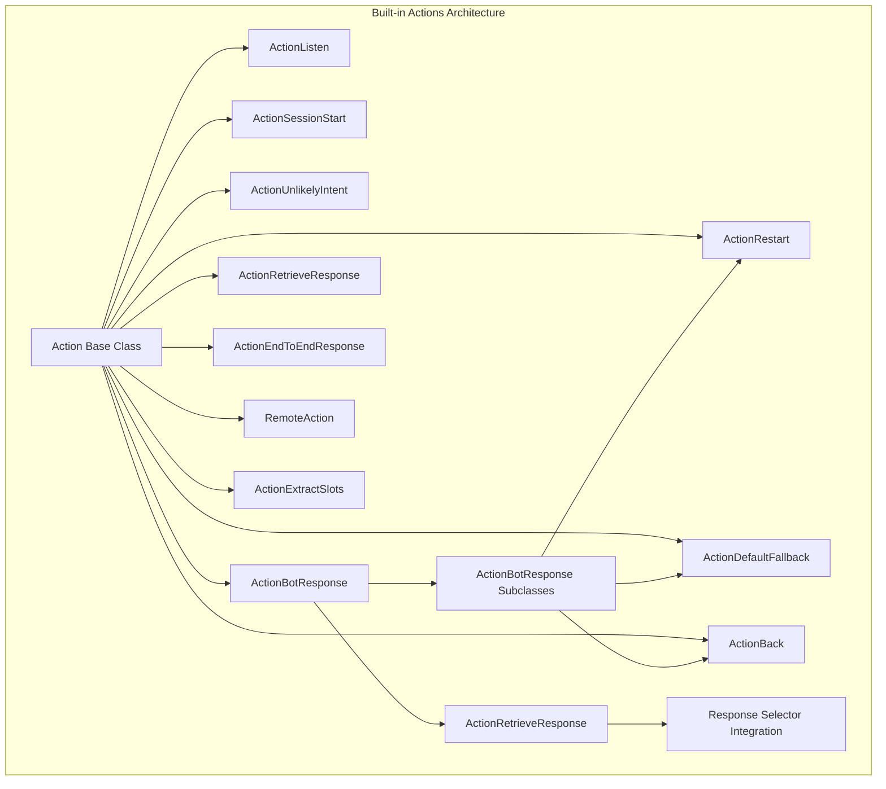
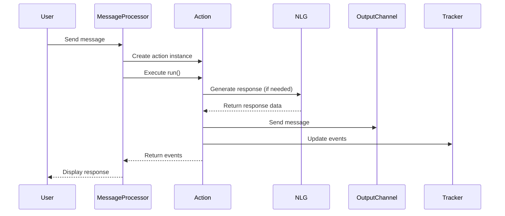
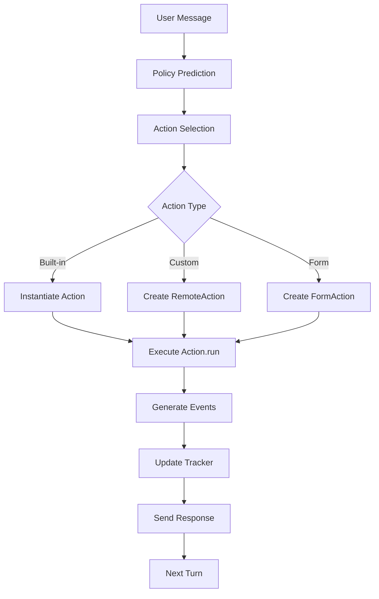
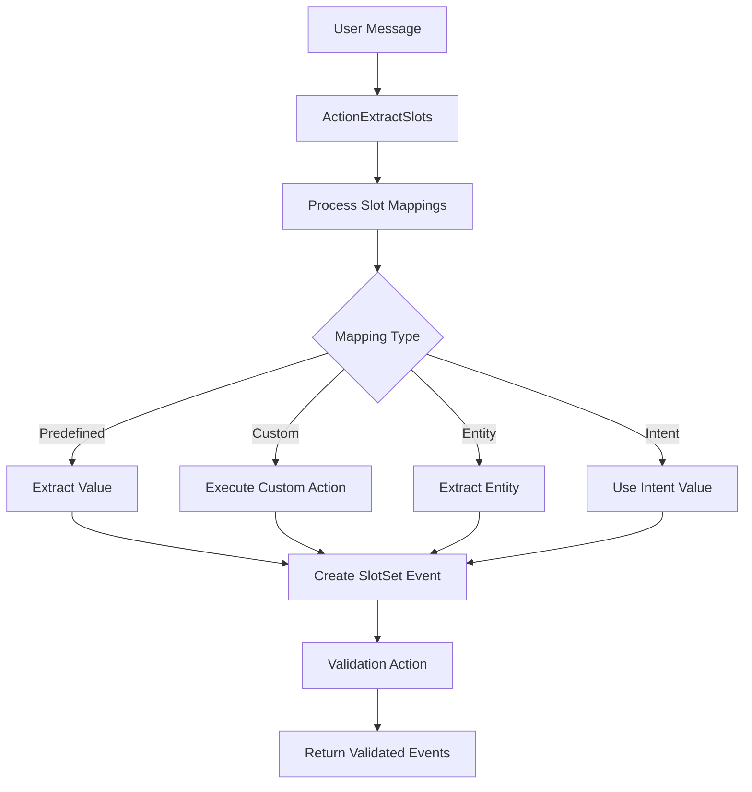

# Built-in Actions Module Documentation

## Introduction

The Built-in Actions module is a fundamental component of the Rasa Core dialogue management system, providing a comprehensive set of pre-defined actions that handle essential conversation flows and system behaviors. These actions are automatically available in every Rasa assistant and form the backbone of conversation management, handling everything from basic user input listening to complex fallback scenarios and session management.

Built-in actions eliminate the need for developers to implement common conversation patterns from scratch, ensuring consistent behavior across Rasa applications while providing a solid foundation for custom action development.

## Architecture Overview

The Built-in Actions module follows a hierarchical design pattern with the base `Action` class at its core, providing a consistent interface for all action types. The architecture is built around the principle of modularity, where each action has a single responsibility and can be easily extended or customized.



## Core Components

### Action Base Class

The `Action` class serves as the foundation for all built-in actions, defining the standard interface that every action must implement. It provides the essential contract for action execution, ensuring consistency across the entire action ecosystem.

**Key Responsibilities:**
- Define the action name through the `name()` method
- Execute the action logic via the `run()` method
- Generate appropriate events for successful execution
- Provide string representation for debugging and logging

### Action Classification

Built-in actions are categorized into several distinct types based on their functionality:

#### 1. Conversation Control Actions

**ActionListen**
- **Purpose**: Signals the bot to wait for user input
- **Behavior**: Returns empty event list, indicating the conversation should pause
- **Usage**: First action in every conversation turn
- **Integration**: Works with [MessageProcessor](MessageProcessor.md) to control conversation flow

**ActionRestart**
- **Purpose**: Resets the conversation to initial state
- **Behavior**: Clears conversation history and restarts session
- **Events Generated**: `Restarted()` event
- **Response**: Optionally utters restart message if configured

**ActionBack**
- **Purpose**: Reverts the last two user utterances
- **Behavior**: Provides conversation undo functionality
- **Events Generated**: Two `UserUtteranceReverted()` events
- **Use Case**: Error recovery and conversation correction

#### 2. Session Management Actions

**ActionSessionStart**
- **Purpose**: Manages conversation session lifecycle
- **Behavior**: Handles session initialization and slot carryover
- **Configuration**: Respects `session_config.carry_over_slots` setting
- **Events Generated**: `SessionStarted()`, slot events, `ActionExecuted(ACTION_LISTEN_NAME)`

#### 3. Response Generation Actions

**ActionBotResponse**
- **Purpose**: Generates bot responses using NLG system
- **Integration**: Works with [NaturalLanguageGenerator](Natural_Language_Generation.md)
- **Configuration**: Uses domain responses and templates
- **Extensibility**: Base class for other response actions

**ActionRetrieveResponse**
- **Purpose**: Retrieves contextually appropriate responses
- **Integration**: Interfaces with [ResponseSelector](Response_Selectors.md)
- **Behavior**: Dynamically selects responses based on conversation context
- **Use Case**: Retrieval-based conversational AI

**ActionEndToEndResponse**
- **Purpose**: Handles end-to-end conversation responses
- **Behavior**: Direct text response without template processing
- **Use Case**: Neural conversation models and direct response generation

#### 4. Error Handling Actions

**ActionDefaultFallback**
- **Purpose**: Handles unrecognized user input
- **Behavior**: Reverts conversation state and provides fallback response
- **Integration**: Works with [FallbackClassifier](Intent_Classifiers.md)
- **Events Generated**: `UserUtteranceReverted()`

**ActionUnlikelyIntent**
- **Purpose**: Indicates low-confidence intent predictions
- **Integration**: Triggered by [UnexpecTEDIntentPolicy](Dialogue_Policies.md)
- **Behavior**: Placeholder for handling uncertain predictions

#### 5. Data Processing Actions

**ActionExtractSlots**
- **Purpose**: Extracts slot values from user messages
- **Behavior**: Processes slot mappings and validation
- **Integration**: Works with domain slot configurations
- **Customization**: Supports custom action validation

**RemoteAction**
- **Purpose**: Executes custom actions on external servers
- **Integration**: Communicates with Rasa SDK or custom action servers
- **Features**: Supports selective domain sharing and response validation
- **Error Handling**: Comprehensive error reporting and recovery

## Data Flow Architecture



## Integration Points

### Dialogue Management Integration

Built-in actions integrate seamlessly with the [Dialogue Management Core](Dialogue_Management_Core.md) system:

- **Policy Integration**: Actions are selected by [Dialogue Policies](Dialogue_Policies.md) based on conversation state
- **Tracker Updates**: All actions generate events that update the [DialogueStateTracker](Dialogue_Management_Core.md)
- **Event Processing**: Events flow through the [MessageProcessor](Dialogue_Management_Core.md) for state management

### NLU Pipeline Integration

Several built-in actions interact with the [NLU Pipeline](NLU_Pipeline.md):

- **ActionExtractSlots**: Processes entity extraction results
- **ActionRetrieveResponse**: Interfaces with response selectors
- **ActionUnlikelyIntent**: Handles low-confidence predictions

### Domain Integration

Built-in actions work closely with the [Domain Model](Domain_&_Training_Data.md):

- **Response Templates**: Access domain responses for bot utterances
- **Slot Management**: Process domain-defined slot mappings
- **Action Configuration**: Respect domain action definitions

## Configuration and Customization

### Default Actions Registration

All built-in actions are automatically registered and available without explicit configuration:

```python
def default_actions(action_endpoint: Optional[EndpointConfig] = None) -> List["Action"]:
    """List default actions."""
    return [
        ActionListen(),
        ActionRestart(),
        ActionSessionStart(),
        ActionDefaultFallback(),
        ActionDeactivateLoop(),
        ActionRevertFallbackEvents(),
        ActionDefaultAskAffirmation(),
        ActionDefaultAskRephrase(),
        TwoStageFallbackAction(action_endpoint),
        ActionUnlikelyIntent(),
        ActionBack(),
        ActionExtractSlots(action_endpoint),
    ]
```

### Action Selection Logic

The `action_for_name_or_text()` function determines which action to instantiate based on the action name:

1. **Built-in Actions**: Check against default actions list
2. **Retrieval Actions**: Detect `utter_` prefix with retrieval intent
3. **End-to-End Actions**: Handle direct text responses
4. **Bot Response Actions**: Process template-based responses
5. **Form Actions**: Delegate to [Form Actions](Form_Actions.md)
6. **Remote Actions**: Execute custom actions on external servers

### Response Generation

The response generation system supports multiple formats:

```python
def create_bot_utterance(message: Dict[Text, Any]) -> BotUttered:
    """Create BotUttered event from message."""
    bot_message = BotUttered(
        text=message.pop("text", None),
        data={
            "elements": message.pop("elements", None),
            "quick_replies": message.pop("quick_replies", None),
            "buttons": message.pop("buttons", None),
            "attachment": message.pop("attachment", None) or message.get("image", None),
            "image": message.pop("image", None),
            "custom": message.pop("custom", None),
        },
        metadata=message,
    )
    return bot_message
```

## Error Handling and Recovery

### Action Execution Errors

The module implements comprehensive error handling for various failure scenarios:

- **Connection Errors**: Handle action server connectivity issues
- **Validation Errors**: Validate action server responses against schema
- **Execution Rejections**: Allow actions to reject execution with custom messages
- **Fallback Mechanisms**: Provide graceful degradation when actions fail

### Validation and Schema

Action server responses are validated against a strict schema:

```python
@staticmethod
def action_response_format_spec() -> Dict[Text, Any]:
    """Expected response schema for an Action endpoint."""
    schema = {
        "type": "object",
        "properties": {
            "events": EVENTS_SCHEMA,
            "responses": {"type": "array", "items": {"type": "object"}},
        },
    }
    return schema
```

## Process Flows

### Standard Action Execution Flow



### Slot Extraction Flow



## Best Practices

### Action Development

1. **Inheritance**: Extend appropriate base classes for consistency
2. **Event Generation**: Always return proper event lists
3. **Error Handling**: Implement robust error handling and logging
4. **Testing**: Test action behavior in isolation and integration
5. **Documentation**: Document action behavior and requirements

### Performance Optimization

1. **Async Operations**: Utilize async/await for I/O operations
2. **Caching**: Cache frequently accessed data when appropriate
3. **Selective Domain**: Use selective domain sharing for remote actions
4. **Validation**: Validate inputs early to avoid unnecessary processing

### Security Considerations

1. **Input Validation**: Validate all external inputs
2. **Endpoint Security**: Secure action server endpoints
3. **Data Privacy**: Handle user data according to privacy requirements
4. **Error Messages**: Avoid exposing sensitive information in error messages

## Dependencies

The Built-in Actions module has several key dependencies within the Rasa ecosystem:

- **[Dialogue Management Core](Dialogue_Management_Core.md)**: Core conversation processing
- **[Domain & Training Data](Domain_&_Training_Data.md)**: Domain configuration and slot definitions
- **[Natural Language Generation](Natural_Language_Generation.md)**: Response generation
- **[Communication Channels](Communication_Channels.md)**: Message delivery
- **[Dialogue Policies](Dialogue_Policies.md)**: Action selection logic

## Conclusion

The Built-in Actions module provides a robust foundation for conversation management in Rasa applications. Through its comprehensive set of pre-defined actions and extensible architecture, it enables developers to build sophisticated conversational AI systems while maintaining consistency and reliability. The module's design promotes best practices in action development and provides clear patterns for customization and extension.