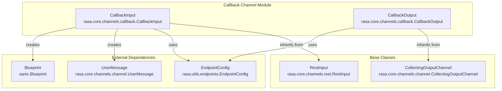
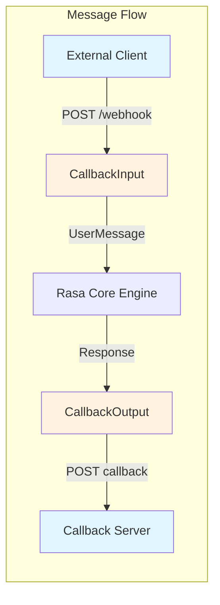
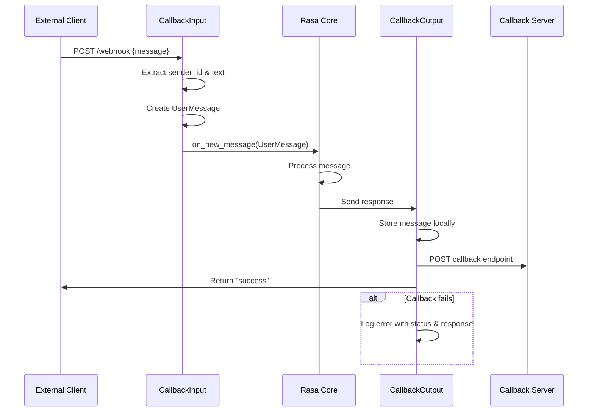
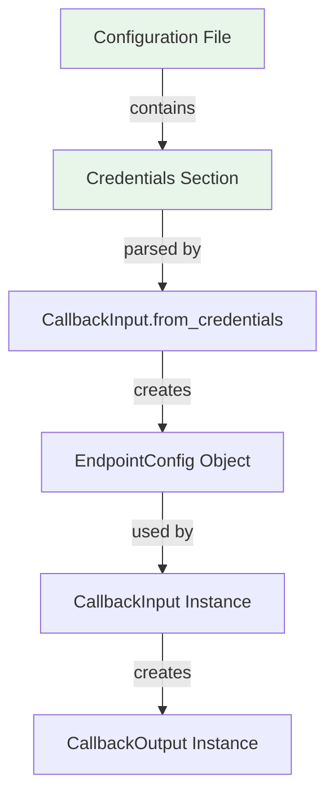
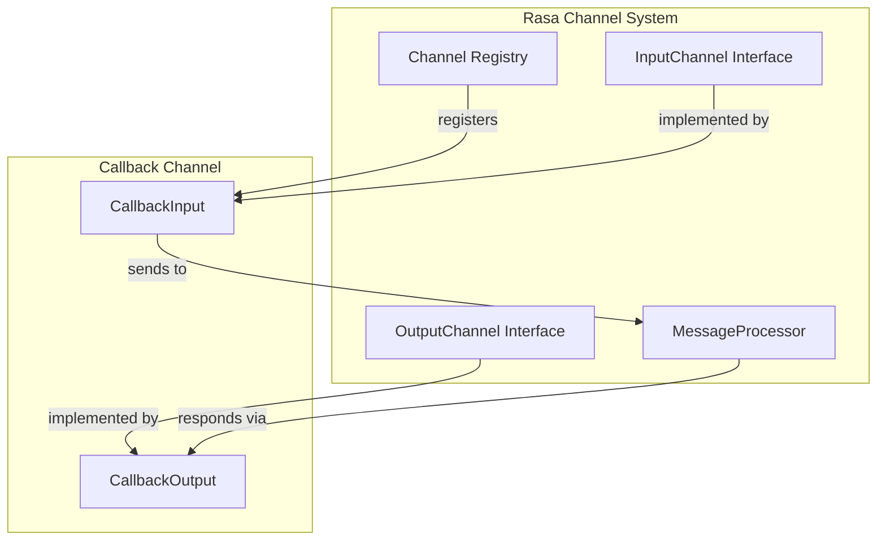
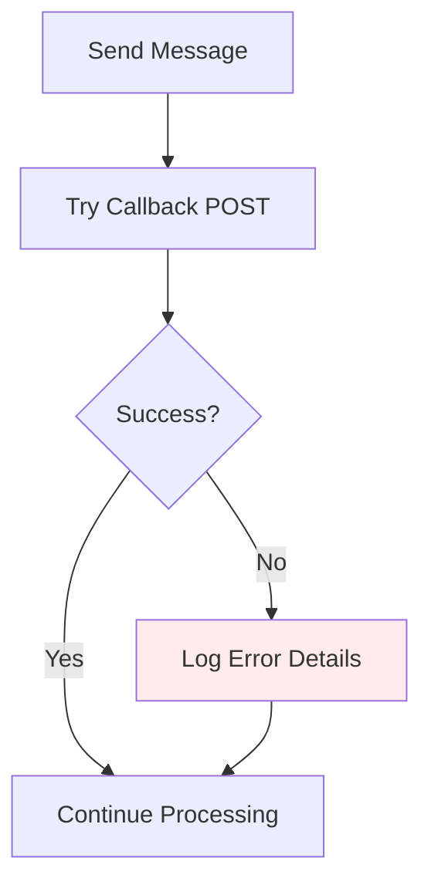
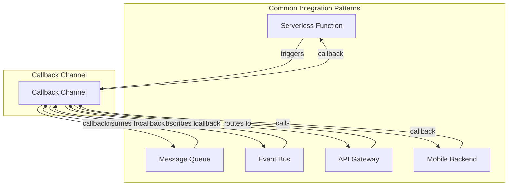

# Callback Channel Module

## Introduction

The Callback Channel module provides a bidirectional communication mechanism for Rasa chatbots that enables asynchronous message handling through external REST endpoints. This module implements a webhook-based architecture where incoming messages are received via REST API calls, and outgoing responses are delivered asynchronously to a configured callback URL.

The Callback Channel is particularly useful for scenarios where the chatbot needs to integrate with external systems that cannot maintain persistent connections or require asynchronous response handling, such as serverless architectures, microservices, or third-party platforms with webhook-based integrations.

## Architecture Overview

### Core Components

The Callback Channel module consists of two primary components that work together to provide complete bidirectional communication:



### Component Relationships



## Detailed Component Documentation

### CallbackInput

**Class**: `rasa.core.channels.callback.CallbackInput`

**Purpose**: Handles incoming HTTP requests and converts them into Rasa's internal message format for processing by the dialogue management system.

**Key Features**:
- Extends `RestInput` to leverage existing REST channel functionality
- Provides webhook endpoints for message reception
- Creates `UserMessage` objects for Rasa Core processing
- Configures callback endpoints for response delivery

**Key Methods**:
- `name()`: Returns "callback" as the channel identifier
- `from_credentials()`: Factory method to create instance from configuration
- `blueprint()`: Creates Sanic blueprint with webhook routes
- `get_output_channel()`: Returns configured `CallbackOutput` instance

**HTTP Endpoints**:
- `GET /`: Health check endpoint returning `{"status": "ok"}`
- `POST /webhook`: Main webhook endpoint for receiving messages

### CallbackOutput

**Class**: `rasa.core.channels.callback.CallbackOutput`

**Purpose**: Handles outgoing messages by sending them asynchronously to a configured callback URL while maintaining message collection for debugging and logging.

**Key Features**:
- Extends `CollectingOutputChannel` to maintain message history
- Asynchronously posts messages to external callback endpoints
- Handles HTTP errors gracefully with detailed logging
- Maintains compatibility with Rasa's output channel interface

**Key Methods**:
- `name()`: Returns "callback" as the channel identifier
- `_persist_message()`: Overrides parent method to add callback functionality

## Data Flow Architecture

### Message Processing Flow



### Configuration Flow



## Integration with Rasa Core

### Channel Registration

The Callback Channel integrates with Rasa's channel system through the following mechanism:



### Message Transformation

```mermaid
graph LR
    HTTP[HTTP Request]
    Extract[Extract Parameters]
    UserMessage[UserMessage Object]
    Process[Core Processing]
    Response[Response Message]
    Callback[Callback Request]
    
    HTTP -->|parse| Extract
    Extract -->|create| UserMessage
    UserMessage -->|send to| Process
    Process -->|generate| Response
    Response -->|POST| Callback
    
    style HTTP fill:#ffebee
    style Callback fill:#ffebee
```



## Error Handling and Resilience

### Callback Failure Handling

The CallbackOutput component implements robust error handling for callback failures:



**Error Logging Details**:
- HTTP status codes
- Response text content
- Timestamp of failure
- Message content (for debugging)

## Configuration

### Credentials Configuration

The Callback Channel requires the following configuration in the `credentials.yml` file:

```yaml
callback:
  url: "https://your-callback-server.com/webhook"
  headers:
    Authorization: "Bearer your-token"
    Content-Type: "application/json"
  # Optional: basic auth
  username: "user"
  password: "pass"
  # Optional: SSL verification
  verify: true
```

### Endpoint Configuration

The `EndpointConfig` object supports various configuration options:
- **URL**: The callback server endpoint
- **Headers**: Custom HTTP headers
- **Authentication**: Basic auth or custom headers
- **SSL**: Certificate verification settings
- **Timeouts**: Request timeout configuration

## Dependencies

### Internal Dependencies

The Callback Channel module depends on several Rasa core components:

- **[REST Channel](REST Channel.md)**: Inherits from `RestInput` for base REST functionality
- **[Channel Base](Communication Channels.md)**: Uses `CollectingOutputChannel` and `UserMessage`
- **[Endpoint Utilities](Endpoint Utilities.md)**: Leverages `EndpointConfig` for HTTP configuration

### External Dependencies

- **Sanic**: Web framework for handling HTTP requests
- **AsyncIO**: Asynchronous message processing
- **HTTP Client**: For callback requests (via EndpointConfig)

## Use Cases and Applications

### Suitable Scenarios

1. **Serverless Architectures**: Integrate with AWS Lambda, Azure Functions, or Google Cloud Functions
2. **Microservices**: Communicate between distributed services
3. **Third-party Platforms**: Integrate with platforms that support webhook callbacks
4. **Event-driven Systems**: Asynchronous message processing pipelines
5. **Mobile Applications**: Backend services for mobile apps

### Integration Patterns



## Best Practices

### Security Considerations

1. **Authentication**: Always use secure authentication methods
2. **HTTPS**: Use encrypted connections for callback URLs
3. **Input Validation**: Validate incoming message formats
4. **Rate Limiting**: Implement rate limiting to prevent abuse
5. **Error Monitoring**: Monitor callback failures and retry mechanisms

### Performance Optimization

1. **Async Processing**: Leverage asynchronous processing for better performance
2. **Connection Pooling**: Use connection pooling for callback requests
3. **Timeout Configuration**: Set appropriate timeouts for callback requests
4. **Message Batching**: Consider batching responses when appropriate

### Monitoring and Debugging

1. **Logging**: Enable detailed logging for troubleshooting
2. **Metrics**: Monitor callback success/failure rates
3. **Health Checks**: Implement health check endpoints
4. **Message Tracing**: Trace messages through the system

## Testing

### Unit Testing

Test individual components in isolation:
- `CallbackInput` message parsing
- `CallbackOutput` callback functionality
- Error handling scenarios
- Configuration validation

### Integration Testing

Test complete message flows:
- End-to-end message processing
- Callback server integration
- Error recovery mechanisms
- Performance under load

## Migration and Compatibility

### Version Compatibility

The Callback Channel maintains compatibility with:
- Rasa Core 2.x and 3.x
- Sanic web framework
- Standard REST interfaces

### Migration from REST Channel

When migrating from the standard REST channel:
1. Update credentials configuration
2. Implement callback endpoint on client side
3. Test asynchronous response handling
4. Monitor for any behavioral differences

## Troubleshooting

### Common Issues

1. **Callback Failures**: Check network connectivity and endpoint configuration
2. **Authentication Errors**: Verify credentials and headers
3. **Message Format Issues**: Validate JSON payload structure
4. **Timeout Problems**: Adjust timeout settings for slow endpoints

### Debug Information

Enable debug logging to capture:
- HTTP request/response details
- Message content and metadata
- Error messages and stack traces
- Performance metrics

## Future Enhancements

### Potential Improvements

1. **Retry Mechanisms**: Automatic retry for failed callbacks
2. **Message Queuing**: Persistent message queue for reliability
3. **Batch Processing**: Support for batch message processing
4. **WebSocket Support**: Real-time bidirectional communication
5. **Custom Headers**: Dynamic header generation

### Extension Points

The modular design allows for:
- Custom authentication mechanisms
- Message transformation pipelines
- Custom error handling strategies
- Integration with monitoring systems