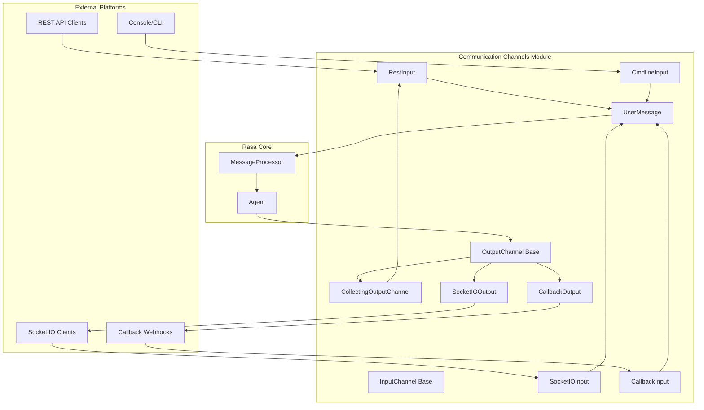
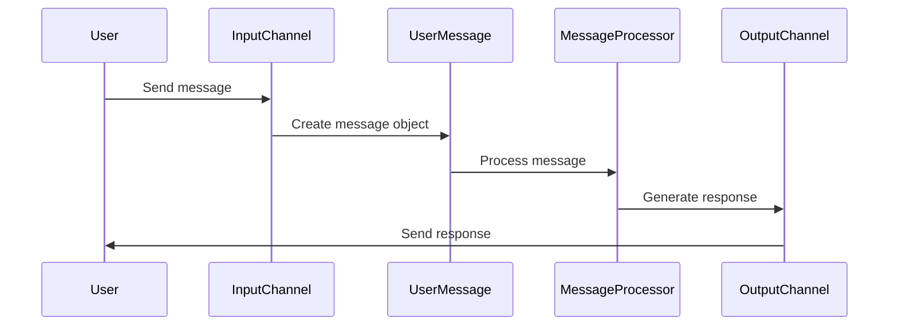

# Communication Channels Module

## Overview

The Communication Channels module serves as the interface layer between Rasa assistants and external messaging platforms. It provides a unified abstraction for handling incoming messages from various channels (REST API, Socket.IO, console, callbacks) and sending responses back to users. This module enables Rasa bots to communicate across different platforms while maintaining a consistent internal message format.

## Architecture

The Communication Channels module follows a plugin-based architecture with clear separation between input and output channels:



## Core Components

### Base Classes

#### InputChannel (`rasa.core.channels.channel.InputChannel`)
The abstract base class for all input channels. Defines the interface that every input channel must implement:
- `blueprint()`: Creates Sanic blueprint for handling HTTP routes
- `get_metadata()`: Extracts additional metadata from incoming requests
- `get_output_channel()`: Creates appropriate output channel for responses

#### OutputChannel (`rasa.core.channels.channel.OutputChannel`)
The abstract base class for all output channels. Provides methods for sending different types of messages:
- Text messages, images, attachments
- Interactive elements (buttons, quick replies)
- Custom JSON payloads

#### UserMessage (`rasa.core.channels.channel.UserMessage`)
Represents an incoming message with metadata:
- Message text content
- Sender identification
- Input/output channel references
- Additional metadata

### Channel Implementations

#### [REST Channel](REST Channel.md)
Standard HTTP-based communication channel supporting both synchronous and streaming responses. Features:
- JSON message format
- Optional response streaming
- Bearer token authentication support
- Health check endpoints

#### [Socket.IO Channel](Socket.IO Channel.md)
Real-time bidirectional communication using WebSockets. Features:
- Session persistence
- JWT authentication
- Room-based message routing
- Event-driven architecture

#### [Console Channel](Console Channel.md)
Command-line interface for local development and testing. Features:
- Interactive button selection
- Color-coded output
- Message streaming support
- Development-friendly interface

#### [Callback Channel](Callback Channel.md)
Asynchronous communication pattern where responses are sent to external endpoints. Features:
- Webhook-based responses
- External callback URLs
- Asynchronous message handling
- Integration with external systems

## Data Flow



## Integration Points

### With Dialogue Management Core
The Communication Channels module integrates with the [Dialogue Management Core](Dialogue Management Core.md) through:
- `MessageProcessor`: Handles incoming messages and coordinates responses
- `Agent`: Manages conversation flow and state
- `DialogueStateTracker`: Maintains conversation context

### With NLU Pipeline
Incoming messages are processed by the [NLU Pipeline](NLU Pipeline.md) for:
- Intent classification
- Entity extraction
- Message parsing and understanding

## Configuration

Each channel can be configured independently with specific credentials and settings:

```yaml
# REST channel configuration
rest:
  # Basic configuration

# Socket.IO channel configuration  
socketio:
  user_message_evt: user_uttered
  bot_message_evt: bot_uttered
  session_persistence: true
  jwt_key: your-secret-key

# Callback channel configuration
callback:
  url: http://external-service.com/webhook
  token: your-auth-token
```

## Security Features

- JWT token authentication for Socket.IO channels
- Bearer token support for REST endpoints
- CORS configuration for cross-origin requests
- Input validation and sanitization

## Error Handling

The module implements comprehensive error handling:
- Connection failure recovery
- Message timeout handling
- Invalid payload validation
- Graceful degradation for unsupported features

## Extensibility

New channels can be added by:
1. Extending `InputChannel` or `OutputChannel` base classes
2. Implementing required abstract methods
3. Registering the channel in the Rasa configuration
4. Providing necessary credentials and settings

## Related Documentation

- [Dialogue Management Core](Dialogue Management Core.md) - Core conversation handling
- [NLU Pipeline](NLU Pipeline.md) - Natural language understanding
- [Actions](Actions.md) - Bot response generation
- [Domain & Training Data](Domain & Training Data.md) - Conversation design