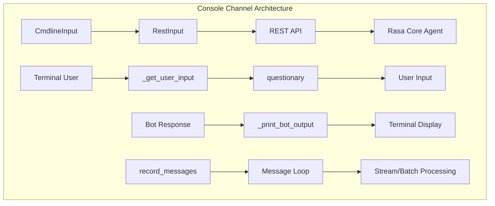
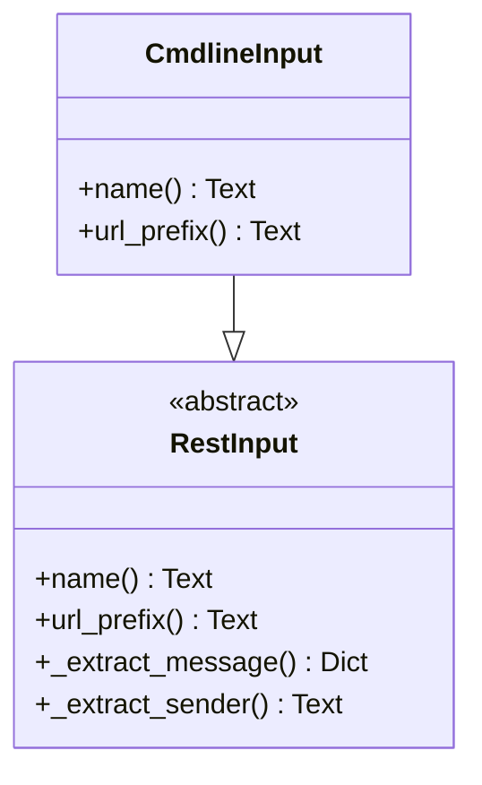
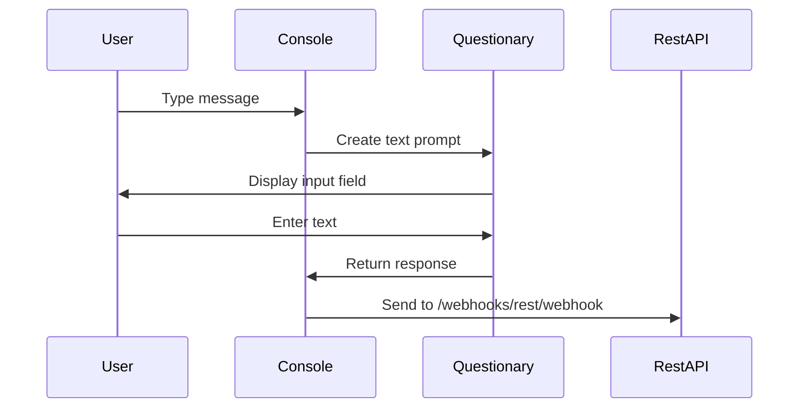
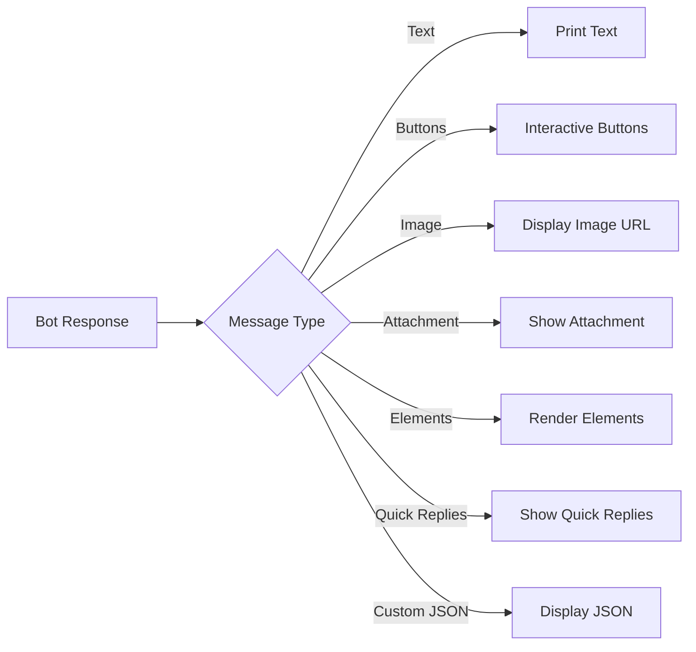
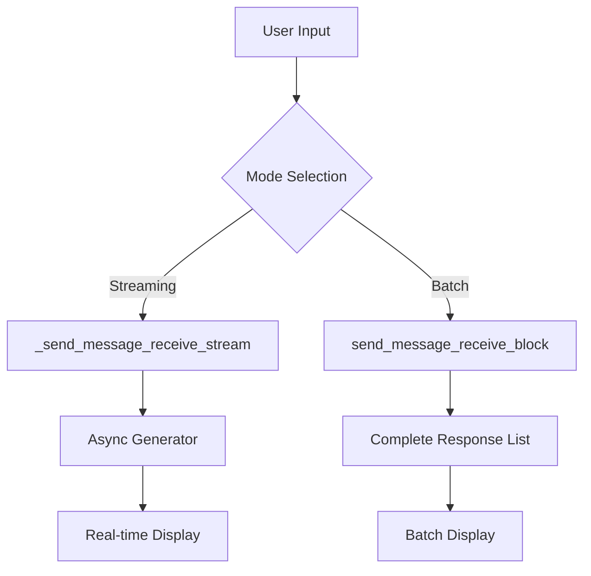
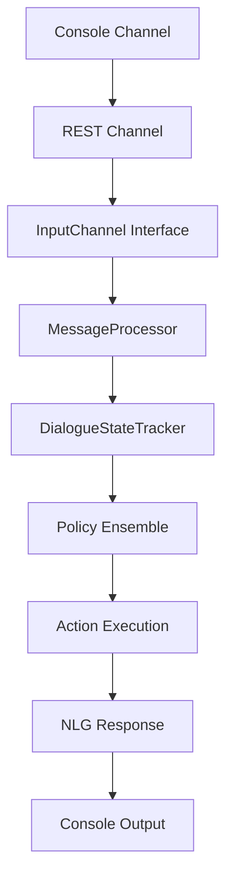
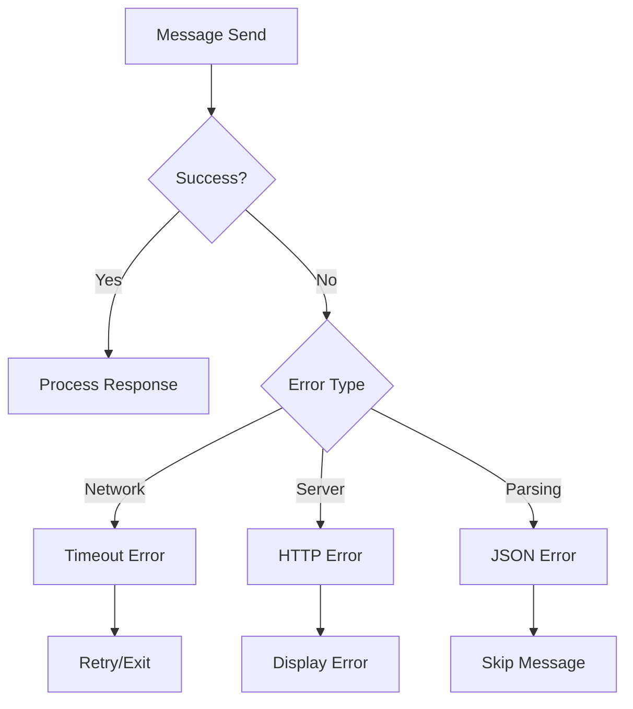
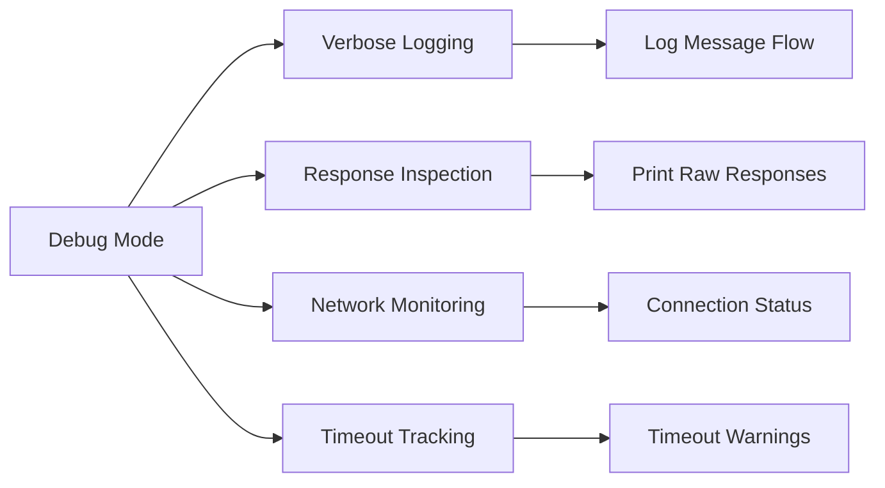

# Console Channel Module Documentation

## Introduction

The Console Channel module provides a command-line interface for interacting with Rasa chatbots. It enables developers to test and debug their conversational AI agents directly from the terminal, offering a simple yet powerful way to validate bot behavior without requiring complex frontend setups or external communication channels.

This module serves as a bridge between the Rasa Core engine and terminal users, facilitating real-time conversation testing with support for various message types including text, buttons, images, attachments, and custom JSON payloads.

## Architecture Overview

The Console Channel is built on top of the REST Channel infrastructure, inheriting its core communication capabilities while adding terminal-specific features for interactive user experience.



## Core Components

### CmdlineInput Class

The `CmdlineInput` class is the primary component of the Console Channel, extending the `RestInput` class to provide command-line specific functionality.



**Key Characteristics:**
- Inherits from `RestInput` for HTTP communication capabilities
- Provides "cmdline" as the channel identifier
- Uses REST API endpoints for message processing

### Message Processing Functions

#### Input Handling



**Core Functions:**

- **`_get_user_input()`**: Asynchronously collects user input through interactive prompts
- **`print_buttons()`**: Renders interactive button choices in the terminal
- **`_print_bot_output()`**: Displays various message types (text, images, attachments, custom JSON)

#### Output Processing

The console supports multiple message formats:



### Communication Modes

The Console Channel supports two communication patterns:

#### 1. Streaming Mode (Default)
- Real-time message processing
- Uses `_send_message_receive_stream()` for continuous response streams
- Suitable for long-running conversations
- Configurable timeout via environment variables

#### 2. Batch Mode
- Collects all responses before display
- Uses `send_message_receive_block()` for complete response sets
- Better for testing complete conversation flows



## Integration with Rasa Core

The Console Channel integrates with the broader Rasa ecosystem through several key interfaces:

### Dependency Chain



### Configuration and Usage

The Console Channel is typically used through Rasa CLI commands:

```bash
# Interactive shell mode
rasa shell

# With custom server URL
rasa shell --server-url http://localhost:5005

# With authentication
rasa shell --auth-token your-token

# With message limit
rasa shell --max-messages 100
```

## Key Features

### Interactive Elements

The console channel supports rich interactive elements:

- **Buttons**: Converted to numbered choices with free-text fallback
- **Quick Replies**: Displayed as selectable options
- **Images/Attachments**: URLs displayed in terminal
- **Custom JSON**: Pretty-printed for debugging

### Error Handling



### Timeout Management

The module implements sophisticated timeout handling:

- **Environment Variable**: `RASA_SHELL_STREAM_READING_TIMEOUT_IN_SECONDS`
- **Command Line**: `--request-timeout` parameter
- **Default Fallback**: `DEFAULT_STREAM_READING_TIMEOUT` (60 seconds)

## Testing and Debugging

### Message Recording

The `record_messages()` function provides comprehensive conversation tracking:

- **Message Counting**: Tracks number of exchanged messages
- **Exit Handling**: Supports `/stop` command for graceful termination
- **Response Buffering**: Maintains previous response for button interactions
- **Async Processing**: Non-blocking message handling

### Debug Features



## Dependencies

The Console Channel relies on several external libraries:

### Core Dependencies
- **[questionary](https://github.com/tmbo/questionary)**: Interactive command-line user interfaces
- **[aiohttp](https://docs.aiohttp.org/)**: Asynchronous HTTP client for REST communication
- **[prompt_toolkit](https://python-prompt-toolkit.readthedocs.io/)**: Advanced terminal input handling

### Rasa Internal Dependencies
- **[REST Channel](REST Channel.md)**: Base communication infrastructure
- **[CLI Utils](CLI Utils.md)**: Command-line interface utilities
- **[Shared Utils](Shared Utils.md)**: Common utility functions

## Best Practices

### Development Usage

1. **Local Testing**: Use console channel for rapid bot iteration
2. **Conversation Flow Validation**: Test complete dialogue paths
3. **Intent/Entity Verification**: Validate NLU performance
4. **Action Testing**: Verify custom action behavior

### Production Considerations

- Console channel is primarily for development/testing
- Not recommended for production user interfaces
- Consider security implications of command-line access
- Monitor resource usage during extended testing sessions

## Troubleshooting

### Common Issues

1. **Connection Timeouts**: Adjust `RASA_SHELL_STREAM_READING_TIMEOUT_IN_SECONDS`
2. **Authentication Failures**: Verify auth token configuration
3. **Server Unreachable**: Check server URL and network connectivity
4. **Response Parsing Errors**: Validate server response format

### Debug Commands

```bash
# Enable debug logging
export LOG_LEVEL=DEBUG

# Test connection
rasa shell --server-url http://localhost:5005 --debug

# Monitor network traffic
curl -X POST http://localhost:5005/webhooks/rest/webhook \
  -H "Content-Type: application/json" \
  -d '{"sender": "test", "message": "hello"}'
```

## Related Documentation

- [REST Channel](REST Channel.md) - Base HTTP communication channel
- [Dialogue Management Core](Dialogue Management Core.md) - Core conversation processing
- [Actions](Actions.md) - Bot action execution system
- [NLU Pipeline](NLU Pipeline.md) - Natural language understanding
- [Communication Channels](Communication Channels.md) - Overview of all channel types

## Conclusion

The Console Channel module provides an essential development tool for Rasa chatbot creators, offering immediate feedback and interactive testing capabilities. Its integration with the REST API infrastructure ensures consistency with production channels while providing terminal-specific optimizations for developer productivity.