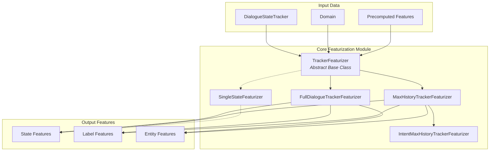
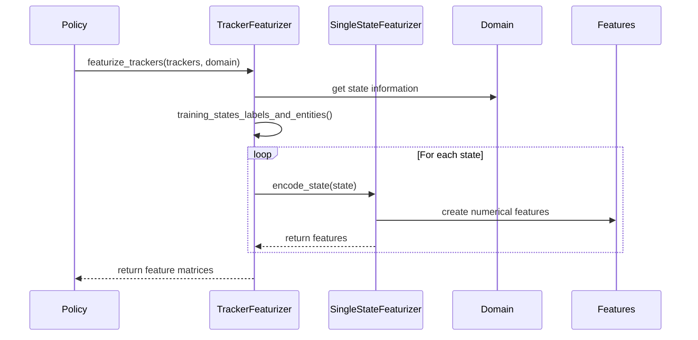

# Core Featurization Module

## Overview

The Core Featurization module is a critical component of the Rasa Core dialogue management system. It transforms dialogue state information into numerical feature representations that machine learning models can process. This module bridges the gap between the symbolic representation of dialogue states and the numerical format required by neural network policies.

## Purpose

The primary purpose of the Core Featurization module is to:
- Convert dialogue tracker states into machine-readable feature vectors
- Support different featurization strategies for various policy architectures
- Handle both full dialogue histories and truncated sequences
- Process entity information for entity-aware policies
- Enable efficient training and prediction for dialogue policies

## Architecture

## Core Components

### 1. Tracker Featurizers

Tracker featurizers are responsible for converting dialogue trackers into training data. They implement different strategies for handling dialogue history. For detailed information, see [Tracker Featurizers](Tracker%20Featurizers.md).

Key components include:
- **TrackerFeaturizer**: Abstract base class defining the common interface
- **FullDialogueTrackerFeaturizer**: Processes entire dialogue history for time-distributed architectures
- **MaxHistoryTrackerFeaturizer**: Truncates history to maximum number of states
- **IntentMaxHistoryTrackerFeaturizer**: Specialized version for intent prediction

### 2. State Featurizers

State featurizers handle the transformation of individual dialogue states into feature representations. For detailed information, see [Single State Featurizer](Single%20State%20Featurizer.md).

The main component is:
- **SingleStateFeaturizer**: Converts individual dialogue states into numerical features, processing user intents, text, previous actions, slot values, active loops, and entity information

## Data Flow

## Integration with Other Modules

The Core Featurization module integrates with several other Rasa modules:

- **[Dialogue Management Core](Dialogue%20Management%20Core.md)**: Uses featurizers to prepare training data for policies
- **[Dialogue Policies](Dialogue%20Policies.md)**: Consumes featurized data for training and prediction
- **[NLU Pipeline](NLU%20Pipeline.md)**: Leverages precomputed NLU features through the MessageContainerForCoreFeaturization
- **[Domain & Training Data](Domain%20&%20Training%20Data.md)**: Uses domain information to create feature mappings

## Key Features

### Flexible Featurization Strategies
- Full dialogue history processing for comprehensive context
- Truncated history for memory-efficient training
- Intent-based featurization for specialized policies

### Entity Support
- BILOU tagging scheme for entity extraction
- Entity tag specifications for different entity types
- Integration with NLU entity extraction

### Precomputation Support
- Leverages precomputed NLU features for efficiency
- Reduces redundant computation during training
- Supports feature caching mechanisms

### Serialization
- Complete persistence support for trained featurizers
- JSON-based configuration storage
- Cross-platform compatibility

## Usage Patterns

### Training Phase
During training, featurizers process entire dialogue datasets to create feature matrices that policies can learn from. The featurization process involves:
1. Converting trackers to state sequences
2. Extracting labels for supervised learning
3. Creating numerical feature representations
4. Handling entity information for entity-aware policies

### Prediction Phase
During prediction, featurizers convert the current dialogue state into features that trained policies can use to make decisions. This process is optimized for real-time performance and typically involves:
1. Converting the current tracker to states
2. Applying the appropriate featurization strategy
3. Creating feature vectors for policy input

## Performance Considerations

The Core Featurization module is designed with performance in mind:
- Efficient state slicing for max history approaches
- Sparse feature representation to reduce memory usage
- Batch processing capabilities for training datasets
- Optimized feature caching to avoid redundant computation

## Extensibility

The module's architecture supports easy extension through:
- Abstract base classes for new featurizer types
- Plugin-based registration system for custom featurizers
- Configurable parameters for different use cases
- Clear separation of concerns between state and tracker featurization