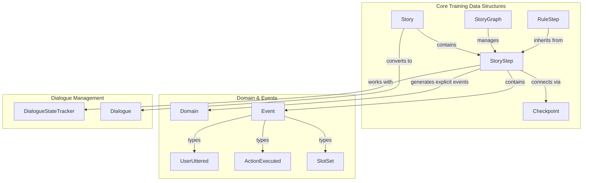
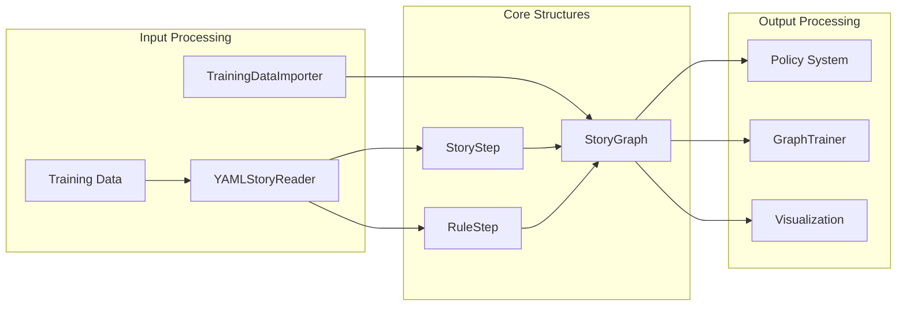
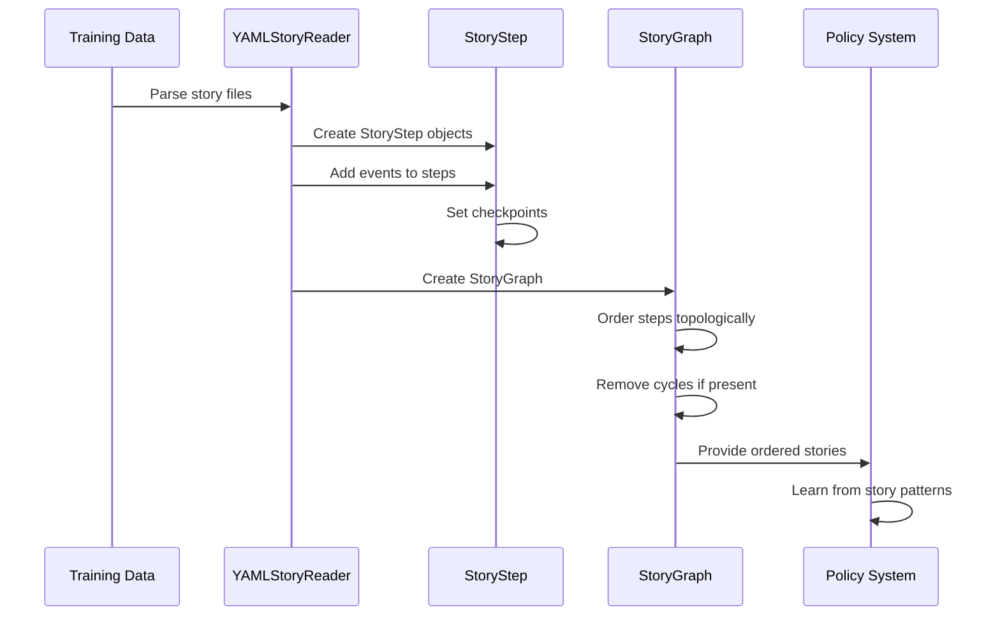
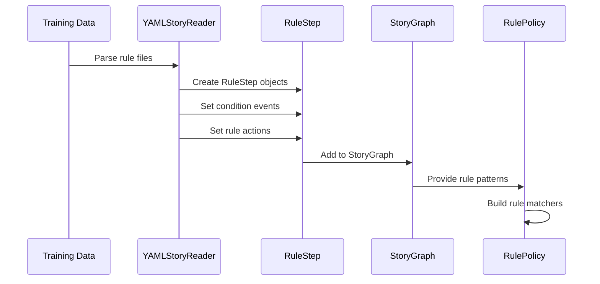
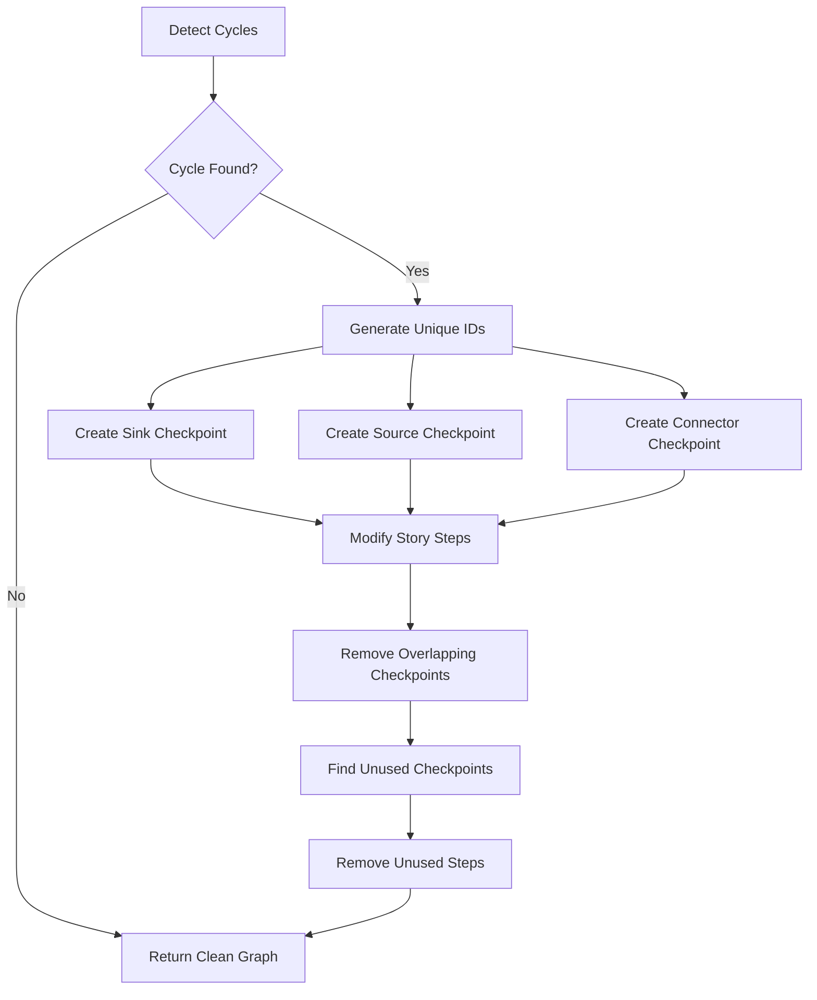
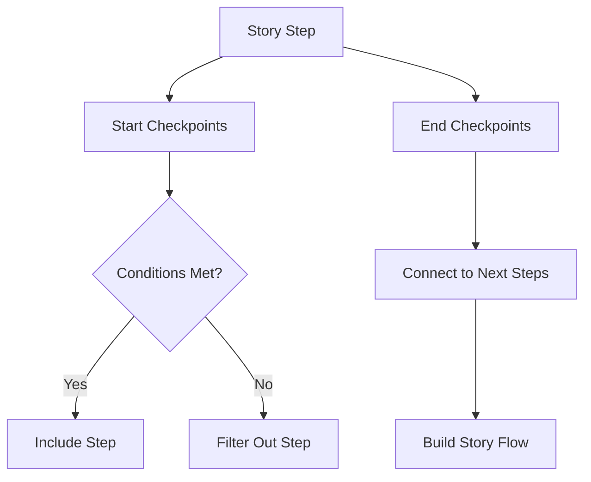

# Core Training Data Structures Module

## Introduction

The Core Training Data Structures module provides the foundational data structures for representing and managing conversational training data in Rasa. This module defines how stories, rules, and their relationships are structured, stored, and processed within the Rasa Core dialogue management system. It serves as the bridge between raw training data and the dialogue policies that learn from conversational patterns.

## Core Components

### StoryStep
A `StoryStep` represents a contiguous section of a conversation between two checkpoints. It encapsulates a sequence of events (user inputs, bot actions, slot settings) that occur in a specific order during a dialogue.

**Key Responsibilities:**
- Store sequences of dialogue events (user utterances, bot actions, slot sets)
- Manage checkpoint connections for story flow control
- Convert story representations to and from string format
- Handle explicit and implicit events (like action_listen)

**Key Features:**
- Support for OR statements in user inputs
- Automatic handling of implicit events
- Checkpoint-based story segmentation
- Serialization to story string format

### RuleStep
A `RuleStep` is a specialized `StoryStep` that represents conversation rules. Rules are deterministic patterns that should always be followed regardless of conversation history.

**Key Responsibilities:**
- Store rule conditions and consequent actions
- Separate conditional events from rule actions
- Provide rule-specific processing logic

**Key Features:**
- Condition-event separation for precise rule matching
- Inherits all StoryStep functionality
- Special handling for rule-based dialogue management

### StoryGraph
A `StoryGraph` represents the complete collection of story steps from all training stories, organized as a directed acyclic graph (DAG) for efficient processing and analysis.

**Key Responsibilities:**
- Manage collections of story steps
- Perform topological sorting for story ordering
- Handle cyclic dependencies in stories
- Provide story visualization capabilities
- Merge multiple story graphs

**Key Features:**
- Topological ordering for consistent story processing
- Cycle detection and removal for problematic stories
- Graph-based visualization support
- Fingerprinting for story comparison
- Checkpoint management across stories

### Checkpoint
A `Checkpoint` represents a point in conversation where the dialogue can branch or converge. Checkpoints enable modular story design and story reuse.

**Key Responsibilities:**
- Define story branching points
- Apply slot-based filtering conditions
- Enable story modularity and reuse

**Key Features:**
- Conditional execution based on slot values
- Support for manual and generated checkpoints
- Integration with story step connections

## Architecture

### Component Relationships



### Data Flow Architecture



## Key Interactions

### Story Processing Pipeline



### Rule Processing Flow



## Integration with Other Modules

### Dialogue Management Integration
The Core Training Data Structures module integrates closely with the [Dialogue Management Core](Dialogue Management Core.md) module:
- `StoryStep` objects are processed by `MessageProcessor` to handle incoming messages
- `StoryGraph` provides the training data structure for `Agent` learning
- Checkpoints work with `DialogueStateTracker` to manage conversation flow

### Policy System Integration
Integration with the [Dialogue Policies](Dialogue Policies.md) module:
- `StoryGraph` provides ordered training data for policy learning
- `RuleStep` objects are specifically processed by `RulePolicy`
- Story patterns are learned by policies like `MemoizationPolicy` and `TEDPolicy`

### Training Data Integration
Connection with [Domain & Training Data](Domain & Training Data.md) module:
- `StoryStep` works with `Domain` to validate actions and intents
- Events within stories are validated against domain definitions
- Training data importers create `StoryGraph` objects from file formats

## Advanced Features

### Cycle Detection and Removal
The `StoryGraph` implements sophisticated cycle detection to handle problematic story structures:



### Topological Sorting
The module uses topological sorting to ensure consistent story processing order:


### Checkpoint Management
Advanced checkpoint handling enables flexible story composition:



## Usage Patterns

### Story Creation and Management
```python
# Create a story step with events
story_step = StoryStep(
    block_name="greeting_story",
    events=[
        UserUttered("hello"),
        ActionExecuted("utter_greet")
    ]
)

# Add checkpoints for story connection
story_step.start_checkpoints = [Checkpoint("STORY_START")]
story_step.end_checkpoints = [Checkpoint("greeting_complete")]
```

### Rule Definition
```python
# Create a rule with conditions
rule_step = RuleStep(
    block_name="weather_rule",
    events=[
        UserUttered("what's the weather"),
        ActionExecuted("action_check_weather")
    ]
)

# Mark first event as condition
rule_step.add_event_as_condition(UserUttered("what's the weather"))
```

### Story Graph Operations
```python
# Create story graph from steps
story_graph = StoryGraph(story_steps)

# Get topologically ordered steps
ordered_steps = story_graph.ordered_steps()

# Remove cycles if present
clean_graph = story_graph.with_cycles_removed()

# Visualize story structure
graph = story_graph.visualize("story_graph.png")
```

## Best Practices

### Story Design
- Use meaningful checkpoint names for story clarity
- Keep story steps focused on single conversation segments
- Leverage OR statements for intent variations
- Ensure proper checkpoint connections for story flow

### Rule Usage
- Clearly separate rule conditions from actions
- Use rules for deterministic behavior only
- Keep rules simple and maintainable
- Validate rule conditions against domain

### Performance Considerations
- Minimize cyclic dependencies in stories
- Use topological ordering for consistent processing
- Leverage story merging for modular training data
- Optimize checkpoint usage to reduce graph complexity

## Error Handling

### Common Issues
- **Cycle Detection**: Stories with circular dependencies are automatically processed to remove cycles
- **Invalid Events**: Event type validation ensures only appropriate events are used in OR statements
- **Checkpoint Conflicts**: Overlapping checkpoint names are resolved during graph construction
- **Missing Connections**: Disconnected story segments are identified and handled

### Validation
- Event type checking for OR statement compatibility
- Checkpoint name uniqueness validation
- Story step connectivity verification
- Domain compatibility checks for events

## Extension Points

### Custom Story Steps
Developers can extend the base `StoryStep` class to create specialized story representations:
- Custom event handling logic
- Specialized serialization formats
- Domain-specific validation rules

### Checkpoint Strategies
Custom checkpoint implementations can provide:
- Advanced filtering conditions
- Dynamic checkpoint generation
- Context-aware checkpoint resolution

### Graph Algorithms
The `StoryGraph` class can be extended with:
- Custom topological sorting strategies
- Alternative cycle removal approaches
- Specialized visualization techniques

This module provides the essential foundation for representing conversational patterns in Rasa, enabling sophisticated dialogue management through structured training data organization and processing.