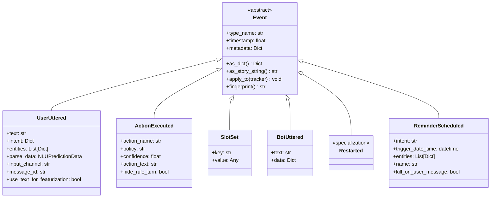
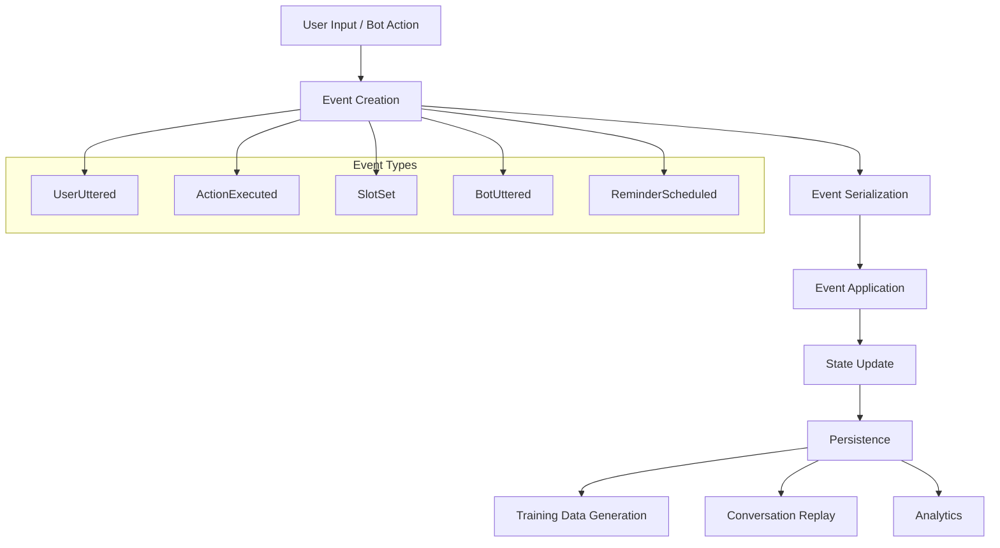
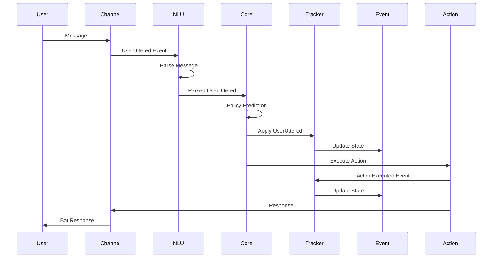
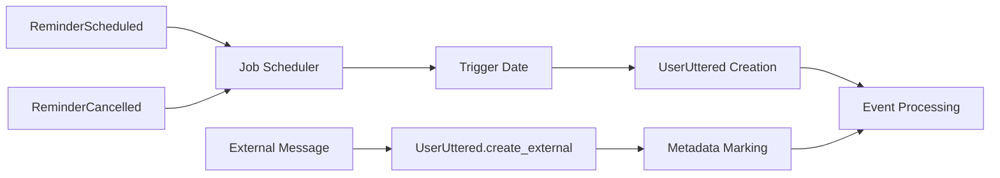

# Dialogue Events Module Documentation

## Introduction

The Dialogue Events module is the foundational component of Rasa's conversation tracking system. It provides an immutable event-driven architecture that captures every interaction and state change within a conversation. Events serve as the single source of truth for conversation history, enabling Rasa to maintain consistent dialogue state across sessions and facilitating features like conversation replay, training data generation, and debugging.

This module defines the core event types that represent all possible occurrences in a Rasa conversation, from user messages and bot responses to slot changes and action executions. Each event type encapsulates specific data and behavior, following a consistent interface for serialization, application to conversation state, and story representation.

## Architecture Overview

### Core Event Hierarchy

The Dialogue Events module implements a hierarchical event system with `Event` as the abstract base class. All events share common properties like timestamps and metadata while providing specialized functionality through polymorphic methods.

### Event Processing Pipeline

Events flow through a well-defined pipeline that ensures consistent state management and enables various Rasa features:

## Core Components

### Event Base Class

The `Event` abstract base class provides the foundation for all dialogue events:

- **Immutable Design**: Events are immutable once created, ensuring conversation history integrity
- **Serialization Support**: Built-in support for dictionary and story string representations
- **Type Resolution**: Dynamic event type resolution for deserialization
- **Fingerprinting**: Unique hash generation for event deduplication and comparison
- **Tracker Integration**: Standardized `apply_to()` method for state updates

### Key Event Types

#### UserUttered

The `UserUttered` event represents user messages and encapsulates NLU parsing results:

- **Text Processing**: Stores original user text and featurization preferences
- **Intent Classification**: Contains predicted intent with confidence scores
- **Entity Extraction**: Maintains extracted entities with roles and groups
- **Parse Data**: Comprehensive NLU results including intent ranking
- **Channel Information**: Tracks input source and message metadata

**Key Features:**
- Supports both intent-based and end-to-end text featurization
- Entity annotation for training data generation
- External message support for programmatic interactions
- Sub-state extraction for policy featurization

#### ActionExecuted

The `ActionExecuted` event records bot actions and their execution context:

- **Action Identification**: Stores action name or end-to-end predicted text
- **Policy Information**: Tracks which policy predicted the action and its confidence
- **Execution Context**: Records timing and metadata for debugging
- **Rule Integration**: Supports hiding rule-based actions from ML policies

**Key Features:**
- Dual representation for traditional and end-to-end actions
- Policy attribution for training and debugging
- Story serialization for training data generation
- Sub-state extraction for dialogue featurization

#### SlotSet

The `SlotSet` event manages conversation state through slot updates:

- **Key-Value Storage**: Simple interface for setting slot values
- **Type Flexibility**: Supports any JSON-serializable value
- **State Synchronization**: Updates tracker slots immediately
- **Story Representation**: JSON format for training data compatibility

**Key Features:**
- Atomic slot updates with timestamp tracking
- Support for complex data types through serialization
- Integration with form and entity extraction systems
- Training data generation through story strings

#### BotUttered

The `BotUttered` event captures bot responses:

- **Response Content**: Stores text and structured response data
- **Rich Responses**: Supports buttons, images, and custom payloads
- **Metadata Tracking**: Records response metadata for analytics
- **Channel Integration**: Works with various output channels

**Key Features:**
- Flexible response data structure
- Integration with NLG components
- Message formatting for different channels
- Analytics and debugging support

### Specialized Event Mixins

The module provides several mixin classes for common event behaviors:

#### AlwaysEqualEventMixin

For events without additional attributes that should always be considered equal:
- `Restarted`
- `UserUtteranceReverted`
- `AllSlotsReset`
- `ConversationPaused`
- `ConversationResumed`

#### SkipEventInMDStoryMixin

For events that should not appear in Markdown story representations:
- `BotUttered`
- `DefinePrevUserUtteredFeaturization`
- `EntitiesAdded`
- `AgentUttered`
- `LoopInterrupted`
- `ActionExecutionRejected`

## Data Flow and Integration

### Event Lifecycle

### Integration Points

#### NLU Pipeline Integration

The `UserUttered` event serves as the primary interface between NLU and Core:

- **Parse Data Transfer**: NLU results are encapsulated in the event
- **Entity Propagation**: Extracted entities flow to slot filling and policy features
- **Intent Confidence**: Confidence scores influence policy decisions
- **Training Data Generation**: Events can be serialized back to training formats

#### Policy System Integration

Events provide the state basis for policy decisions:

- **State Featurization**: Events contribute to dialogue state representation
- **History Tracking**: Policy decisions are recorded in `ActionExecuted` events
- **Confidence Tracking**: Policy confidence is preserved for debugging and fallback
- **Rule Integration**: Rule-based actions are marked for appropriate handling

#### Tracker Store Integration

Events enable persistent conversation storage:

- **Serialization**: Events can be serialized to various formats for storage
- **Replay Capability**: Event sequences can reconstruct conversation state
- **Migration Support**: Legacy event formats are handled for backward compatibility
- **Fingerprinting**: Event hashes enable efficient storage and deduplication

## Advanced Features

### Reminder System

The module provides sophisticated reminder functionality:

**Features:**
- Scheduled intent triggering with entity support
- Cancellation by name, intent, or entity matching
- External message support for programmatic interactions
- Kill-on-user-message functionality for interruption handling

### Conversation Control Events

Specialized events for conversation flow management:

- **Restarted**: Complete conversation reset with session restart
- **UserUtteranceReverted**: Undo user message and replay history
- **ActionReverted**: Undo last action and its effects
- **ConversationPaused/Resumed**: Human handoff support
- **FollowupAction**: Force specific action execution

### Form and Loop Integration

Events support complex conversational patterns:

- **ActiveLoop**: Form and loop activation/deactivation
- **LoopInterrupted**: Form validation control
- **LegacyForm**: Backward compatibility for old form events
- **Entity Addition**: Dynamic entity injection into user messages

## Error Handling and Validation

### Event Validation

The module implements comprehensive validation:

- **Required Fields**: Ensures critical data is present
- **Type Checking**: Validates data types and structures
- **Consistency Checks**: Verifies event relationships
- **Legacy Support**: Handles deprecated event formats gracefully

### Error Recovery

Robust error handling for production deployments:

- **Deserialization Safety**: Graceful handling of malformed events
- **Type Resolution**: Fallback mechanisms for unknown event types
- **Partial Recovery**: Continues operation despite individual event failures
- **Logging Integration**: Comprehensive error reporting and debugging

## Performance Considerations

### Memory Efficiency

- **Immutable Design**: Prevents accidental state corruption
- **Lazy Evaluation**: Defers expensive operations until needed
- **Serialization Optimization**: Efficient formats for storage and transmission
- **Fingerprint Caching**: Cached hashes for repeated comparisons

### Processing Optimization

- **Batch Operations**: Support for event sequence processing
- **State Minimization**: Efficient state representation for policies
- **Filtering Support**: Event type-based filtering for specific use cases
- **Indexing**: Timestamp-based ordering and retrieval

## Testing and Debugging

### Event Inspection

Comprehensive debugging support:

- **String Representations**: Human-readable event descriptions
- **Dictionary Serialization**: Complete event data inspection
- **Story Generation**: Training data format for conversation replay
- **Metadata Tracking**: Additional context for debugging

### Testing Utilities

Built-in support for testing scenarios:

- **Event Factories**: Convenient event creation methods
- **Empty Events**: Placeholder events for testing
- **Comparison Methods**: Event equality and hashing
- **Sequence Validation**: Event ordering and consistency checks

## References

- [Dialogue Management Core](Dialogue Management Core.md) - For tracker integration and state management
- [NLU Pipeline](NLU Pipeline.md) - For UserUttered event creation and parse data
- [Actions](Actions.md) - For ActionExecuted event generation and action execution
- [Domain & Training Data](Domain & Training Data.md) - For slot definitions and story generation
- [Dialogue Policies](Dialogue Policies.md) - For policy integration and confidence tracking