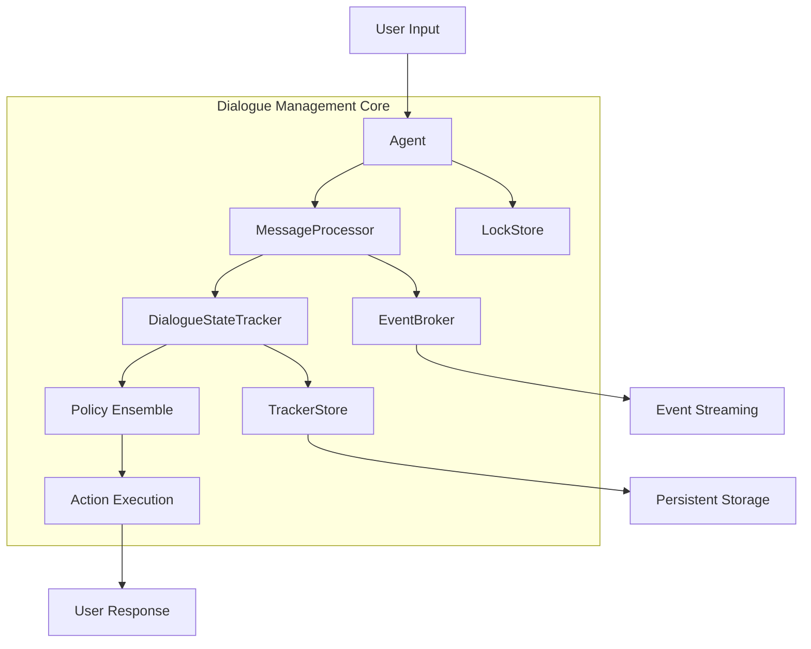
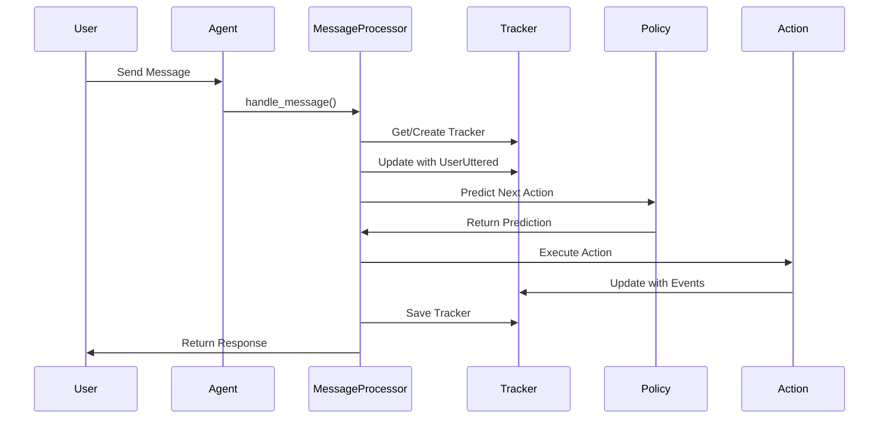

# Dialogue Management Core Module

## Overview

The Dialogue Management Core module is the central orchestrator of the Rasa conversational AI system. It manages the flow of conversations, maintains dialogue state, and coordinates between various components to provide intelligent responses to user inputs. This module serves as the backbone that connects natural language understanding, policy decision-making, action execution, and state persistence.

## Purpose and Core Functionality

The Dialogue Management Core module provides:

- **Conversation Orchestration**: Coordinates the entire conversation flow from user input to system response
- **State Management**: Maintains and updates the dialogue state throughout conversations
- **Action Execution**: Manages the execution of actions based on policy predictions
- **Message Processing**: Handles incoming messages and generates appropriate responses
- **Persistence**: Ensures conversation history is stored and can be retrieved
- **Concurrency Control**: Manages concurrent access to conversation trackers

## Architecture Overview

## Core Components

### 1. Agent (`rasa.core.agent.Agent`)
The Agent is the main entry point for the dialogue management system. It provides a high-level interface for:
- Loading and managing models
- Handling messages and conversations
- Coordinating between different components
- Managing the conversation lifecycle

**Key Responsibilities:**
- Model loading and management
- Message handling and routing
- Tracker management
- Action execution coordination

### 2. MessageProcessor (`rasa.core.processor.MessageProcessor`)
The MessageProcessor handles the core processing logic for incoming messages:
- Message parsing and NLU processing
- Action prediction and execution
- Event handling and tracker updates
- Conversation flow management

**Key Responsibilities:**
- Process incoming user messages
- Predict next actions using policy ensemble
- Execute actions and handle responses
- Manage conversation sessions

### 3. DialogueStateTracker (`rasa.shared.core.trackers.DialogueStateTracker`)
Maintains the complete state of a conversation:
- Event history management
- Slot tracking and updates
- Active loop management
- Conversation state reconstruction

**Key Responsibilities:**
- Track conversation events
- Manage slot values
- Handle conversation resets and replays
- Provide state information to policies

### 4. TrackerStore (`rasa.core.tracker_store.TrackerStore`)
Provides persistent storage for conversation trackers:
- Multiple storage backends (In-Memory, Redis, SQL, MongoDB, DynamoDB)
- Tracker serialization and deserialization
- Event streaming capabilities
- Conversation session management

**Key Responsibilities:**
- Persist conversation history
- Retrieve trackers for ongoing conversations
- Handle multiple conversation sessions
- Stream events to external systems

### 5. LockStore (`rasa.core.lock_store.LockStore`)
Manages concurrent access to conversation trackers:
- Ticket-based locking mechanism
- Multiple backend implementations
- Lock lifecycle management
- Concurrency control

**Key Responsibilities:**
- Prevent race conditions in conversations
- Manage distributed locks
- Handle lock timeouts and cleanup
- Ensure conversation consistency

### 6. EventBroker (`rasa.core.brokers.broker.EventBroker`)
Handles event streaming and publishing:
- Multiple broker implementations (Pika, SQL, File, Kafka)
- Event publishing to external systems
- Real-time event streaming
- Event format standardization

**Key Responsibilities:**
- Stream conversation events
- Integrate with external systems
- Handle event broker connections
- Manage event publishing failures

## Data Flow

## Integration with Other Modules

### NLU Pipeline Integration
The Dialogue Management Core integrates with the [NLU Pipeline](NLU Pipeline.md) for:
- Intent classification and entity extraction
- Message parsing and understanding
- Feature extraction for dialogue policies

### Policy Integration
Works with [Dialogue Policies](Dialogue Policies.md) for:
- Action prediction and selection
- Conversation flow control
- Policy ensemble management

### Action System Integration
Coordinates with [Actions](Actions.md) for:
- Custom action execution
- Default action handling
- Action validation and rejection

### Domain Integration
Uses [Domain & Training Data](Domain & Training Data.md) for:
- Slot management and validation
- Intent and entity definitions
- Response templates and forms

## Key Features

### Conversation Session Management
- Automatic session handling with configurable expiration
- Session start and end events
- Multi-session conversation support
- Session metadata management

### Event Processing
- Comprehensive event system for tracking all conversation changes
- Event replay capabilities for state reconstruction
- Event streaming to external systems
- Event versioning and migration support

### Scalability and Performance
- Asynchronous processing for high concurrency
- Multiple storage backend options
- Distributed locking mechanisms
- Configurable event history limits

### Error Handling and Recovery
- Graceful degradation on component failures
- Fallback mechanisms for critical operations
- Comprehensive logging and monitoring
- Circuit breaker patterns for external services

## Configuration and Usage

The Dialogue Management Core module is typically configured through:
- Endpoint configurations for external services
- Domain files for conversation definitions
- Configuration files for component settings
- Environment variables for runtime behavior

For detailed configuration options and usage examples, refer to the individual component documentation:
- [Agent Documentation](Agent.md)
- [MessageProcessor Documentation](MessageProcessor.md)
- [TrackerStore Documentation](TrackerStore.md)
- [LockStore Documentation](LockStore.md)
- [EventBroker Documentation](EventBroker.md)

## Best Practices

1. **Tracker Store Selection**: Choose appropriate storage backend based on scalability needs
2. **Lock Store Configuration**: Configure distributed locks for multi-instance deployments
3. **Event Broker Setup**: Implement event streaming for real-time analytics and monitoring
4. **Session Management**: Configure appropriate session timeouts based on use case
5. **Error Handling**: Implement proper error handling and fallback mechanisms
6. **Performance Monitoring**: Monitor key metrics like response times and error rates

## Related Documentation

- [NLU Pipeline](NLU Pipeline.md) - Natural Language Understanding components
- [Dialogue Policies](Dialogue Policies.md) - Policy decision-making components
- [Actions](Actions.md) - Action execution components
- [Domain & Training Data](Domain & Training Data.md) - Domain and training data structures
- [Communication Channels](Communication Channels.md) - Input/output channel integration
- [Natural Language Generation](Natural Language Generation (NLG).md) - Response generation