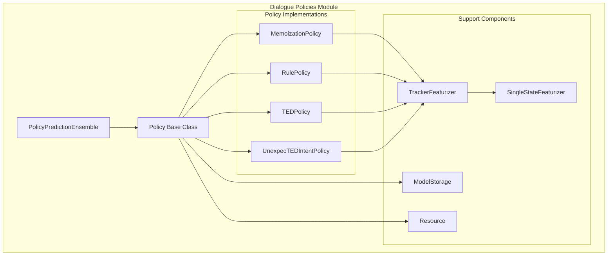
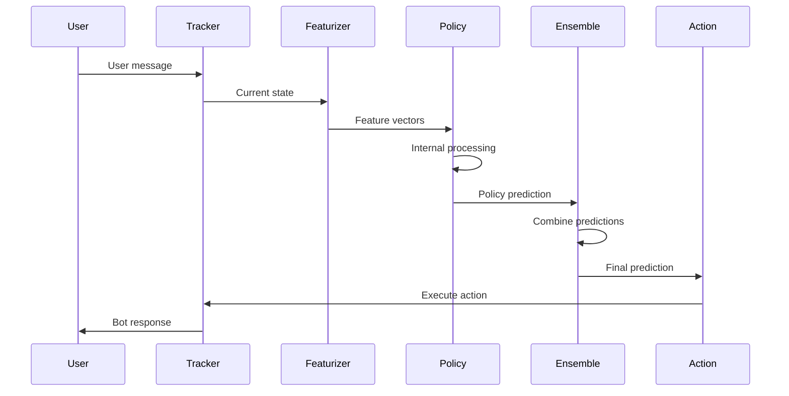

# Dialogue Policies Module

## Overview

The Dialogue Policies module is the core decision-making component of the Rasa conversational AI framework. It implements various machine learning and rule-based policies that determine the next best action a conversational assistant should take based on the current dialogue context. This module provides the intelligence behind conversation flow management, enabling bots to respond appropriately to user inputs and maintain coherent multi-turn conversations.

## Purpose and Core Functionality

The Dialogue Policies module serves as the brain of the conversational system, responsible for:

- **Action Prediction**: Determining the most appropriate next action based on conversation history and current context
- **Policy Management**: Coordinating multiple policies with different strategies and priorities
- **Context Understanding**: Processing dialogue state, user intents, entities, and conversation history
- **Rule Enforcement**: Implementing deterministic behavior through rule-based policies
- **Machine Learning Integration**: Leveraging neural networks for complex pattern recognition and generalization
- **Fallback Handling**: Managing uncertain situations and providing graceful degradation

## Architecture Overview

## Key Components and Relationships

### Base Policy Architecture

The module is built around a hierarchical architecture with the abstract `Policy` class serving as the foundation for all policy implementations. This design enables consistent interfaces while allowing specialized behavior for different policy types.

### Policy Ensemble System

The `PolicyPredictionEnsemble` coordinates multiple policies, applying sophisticated selection logic to combine predictions from different sources. It handles priority management, confidence scoring, and event aggregation to produce a single, coherent action prediction.

### Integration Points

The module integrates with several other Rasa components:

- **[Core Featurization](Core Featurization.md)**: Provides dialogue state representation through tracker featurizers
- **[Dialogue Management Core](Dialogue Management Core.md)**: Interfaces with the agent and message processor for execution
- **[Domain & Training Data](Domain & Training Data.md)**: Utilizes domain knowledge and training examples
- **[TensorFlow Model Components](TensorFlow Model Components.md)**: Leverages neural network architectures for ML-based policies

## Sub-modules

### Policy Base and Ensemble

The foundational components that define the policy interface and coordination mechanisms:

- **[Policy Base and Ensemble](Policy%20Base%20and%20Ensemble.md)**: Abstract base class and ensemble coordination system

### Memoization-based Policies

Policies that rely on exact pattern matching and memory-based learning:

- **[Memoization Policies](Memoization%20Policies.md)**: Exact matching and augmented memoization strategies

### Rule-based Policies

Deterministic policies that enforce explicit conversation rules:

- **[Rule Policies](Rule%20Policies.md)**: Rule enforcement and constraint management

### Machine Learning Policies

Advanced neural network-based policies for complex pattern recognition:

- **[TED Policy](TED%20Policy.md)**: Transformer-based dialogue policy with entity recognition
- **[UnexpecTED Intent Policy](UnexpecTED%20Intent%20Policy.md)**: Intent validation and anomaly detection

## Data Flow and Processing

## Training and Prediction Pipeline

The module supports both training-time learning and runtime prediction through a unified interface:

1. **Training Phase**: Policies learn from conversation examples, building internal models and memorization tables
2. **Prediction Phase**: Trained policies analyze current dialogue state and produce action probability distributions
3. **Ensemble Phase**: Multiple policy predictions are combined using priority and confidence-based selection
4. **Execution Phase**: The winning action is executed, updating the dialogue state

## Configuration and Extensibility

The module provides extensive configuration options for each policy type, allowing fine-tuning of behavior, performance characteristics, and integration parameters. The modular architecture supports easy extension with new policy types and ensemble strategies.

## Performance Considerations

Different policies offer various performance trade-offs:

- **Memoization Policies**: Fast prediction, high precision, limited generalization
- **Rule Policies**: Deterministic behavior, excellent for constrained scenarios
- **TED Policies**: High generalization, handles complex patterns, requires more computational resources
- **UnexpecTED Policies**: Anomaly detection capabilities, additional safety layer

The ensemble system allows combining these strengths while mitigating individual weaknesses through intelligent coordination and fallback mechanisms.