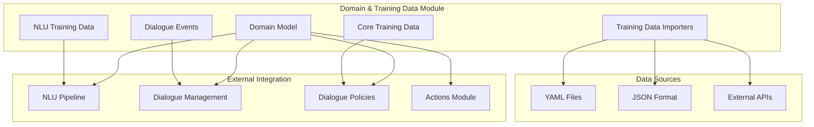
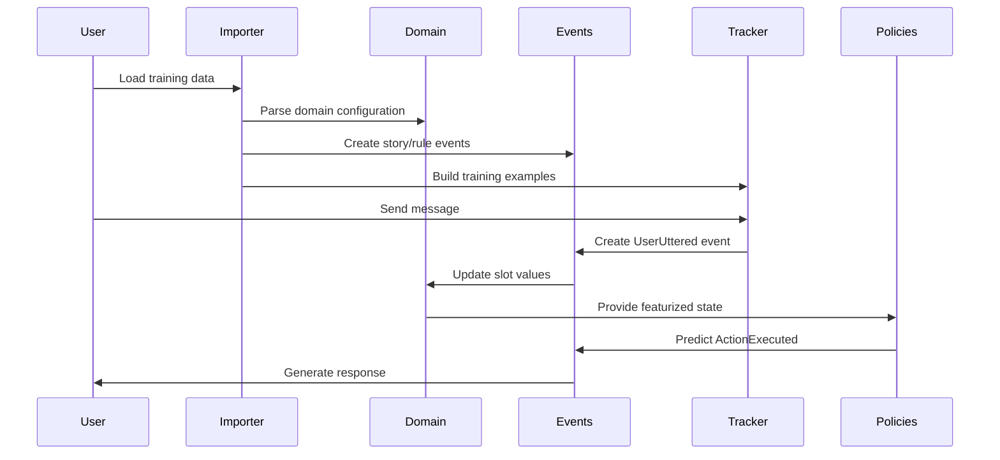

# Domain & Training Data Module

## Purpose

The **Domain & Training Data** module is the foundational layer of the Rasa conversational AI framework that defines the universe in which the bot operates. It serves as the single source of truth for all training data, domain configuration, and conversation state management. This module provides the essential data structures and interfaces that enable Rasa to understand user inputs, manage conversation context, and generate appropriate responses.

The module's primary responsibilities include:
- **Domain Definition**: Specifying the complete set of intents, entities, slots, actions, and responses the bot can handle
- **Training Data Management**: Organizing and validating NLU training examples, conversation stories, and rules
- **Event Tracking**: Recording every interaction and state change in conversations through an immutable event system
- **Data Import/Export**: Providing standardized interfaces for loading training data from various sources and formats

## Architecture

## Core Components

### 1. Domain Model (`rasa.shared.core.domain.Domain`)
The central configuration class that defines the bot's capabilities, constraints, and knowledge base. It manages:
- Intents and entities that the bot can recognize
- Slots for storing conversation state
- Available actions and responses
- Forms for structured data collection
- Session configuration and management

### 2. Dialogue Events (`rasa.shared.core.events.*`)
An immutable event-driven system that captures every interaction in conversations:
- **UserUttered**: User messages with NLU parsing results
- **ActionExecuted**: Bot actions and their execution context
- **SlotSet**: Conversation state updates
- **BotUttered**: Bot responses and rich content

### 3. Core Training Data Structures (`rasa.shared.core.training_data.structures.*`)
Data structures for managing conversational training data:
- **StoryStep**: Contiguous conversation segments between checkpoints
- **RuleStep**: Deterministic conversation patterns
- **StoryGraph**: Directed acyclic graph representation of all stories

### 4. NLU Training Data Structures (`rasa.shared.nlu.training_data.*`)
Components for handling natural language understanding training data:
- **TrainingData**: Container for NLU training examples, entity synonyms, and response templates
- **Message**: Individual training examples with features and metadata

### 5. Training Data Importers & Readers (`rasa.shared.importers.*`)
Standardized interfaces for loading training data:
- **TrainingDataImporter**: Abstract base for all importers
- **RasaFileImporter**: Default file-based data loader
- **YAMLStoryReader**: Parser for conversation stories and rules
- **RasaYAMLReader**: Parser for NLU training data

## Data Flow

## Key Features

- **Multi-format Support**: Handles YAML, JSON, and legacy formats
- **Data Validation**: Comprehensive validation for consistency and quality
- **Modular Design**: Supports splitting domain and training data across multiple files
- **Event Immutability**: Ensures conversation history integrity
- **Flexible Import**: Pluggable importer system for custom data sources
- **Training Data Generation**: Automatic generation of training examples from conversations

## References to Core Components

For detailed documentation of each sub-module, please refer to:

- **[Domain Model](Domain Model.md)**: Complete guide to domain configuration and management
- **[Dialogue Events](Dialogue Events.md)**: Detailed event system documentation
- **[Core Training Data Structures](Core Training Data Structures.md)**: Story and rule management
- **[NLU Training Data Structures](NLU Training Data Structures.md)**: NLU data handling
- **[Training Data Importers & Readers](Training Data Importers & Readers.md)**: Data loading and parsing

## Integration with Other Modules

The Domain & Training Data module serves as the foundation for all other Rasa modules:

- **NLU Pipeline**: Uses domain-defined intents and entities for training and prediction
- **Dialogue Management Core**: Relies on domain state space and event history
- **Dialogue Policies**: Learns from story patterns and rule definitions
- **Actions Module**: Executes domain-defined actions and responses
- **Core Featurization**: Uses domain structure for state representation

This module is essential for any Rasa deployment, providing the configuration and data foundation that enables sophisticated conversational AI capabilities.