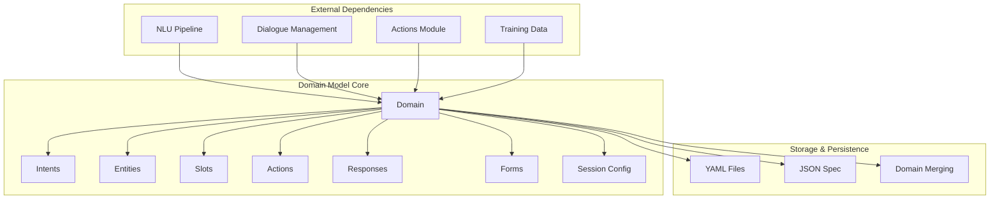
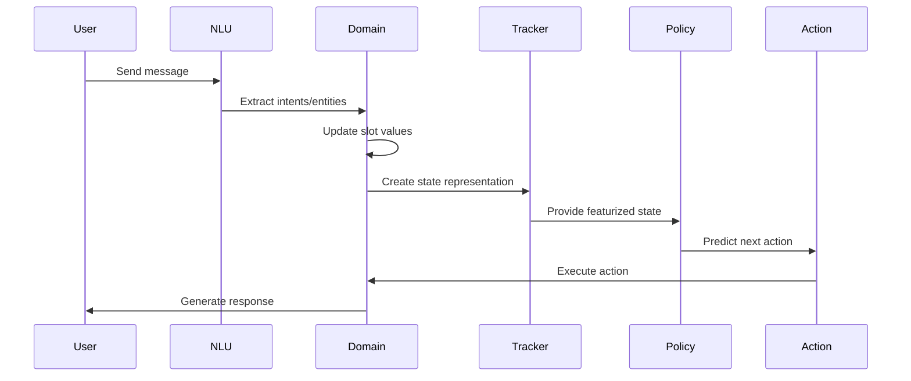

# Domain Model Module

## Overview

The Domain Model module is the foundational component of the Rasa conversational AI framework that defines the universe in which the bot operates. It specifies the complete set of capabilities, constraints, and knowledge that the bot can leverage during conversations with users. The domain acts as a central configuration hub that orchestrates all other components of the Rasa system.

## Purpose and Scope

The Domain Model serves as the single source of truth for:
- **Intents**: What user intentions the bot can recognize and understand
- **Entities**: What information the bot can extract from user messages
- **Slots**: How the bot stores and manages conversation state
- **Actions**: What the bot can do in response to user inputs
- **Responses**: How the bot communicates back to users
- **Forms**: Structured data collection workflows
- **Session Configuration**: How conversations are managed over time

## Architecture Overview



## Core Components

### 1. Domain Class (`rasa.shared.core.domain.Domain`)
The central class that encapsulates all domain configuration and provides the primary interface for domain operations.

**Key Responsibilities:**
- Load and parse domain configuration from YAML files
- Merge multiple domain files into a unified configuration
- Validate domain consistency and integrity
- Provide state representation for dialogue tracking
- Manage entity and intent properties
- Handle slot mappings and validation

**Key Methods:**
- `load()`: Load domain from file paths
- `from_dict()`: Create domain from dictionary representation
- `merge()`: Combine multiple domains
- `get_active_state()`: Generate current dialogue state
- `states_for_tracker_history()`: Create state history for training

### 2. Slot System (`rasa.shared.core.slots.Slot`)
Manages conversation state through typed slots that store information across dialogue turns.

**Slot Types:**
- **TextSlot**: Stores text values
- **FloatSlot**: Stores numeric values with min/max constraints
- **BooleanSlot**: Stores true/false values
- **ListSlot**: Stores list of values
- **CategoricalSlot**: Stores values from predefined categories
- **AnySlot**: Stores any type of value (non-featurized)

**Key Features:**
- Type-safe value storage
- Automatic featurization for machine learning
- Slot mappings for automatic value extraction
- Influence conversation behavior
- Persistence across conversation sessions

## Data Flow and Integration



## Sub-modules

### Domain Model (Current Module)
**Core Components:**
- `rasa.shared.core.domain.Domain`: Main domain configuration class
- `rasa.shared.core.slots.Slot`: Base slot class and implementations

**Documentation:** [Domain Model Details](Domain%20Model.md)

### Dialogue Events
**Core Components:**
- `rasa.shared.core.events.Event`: Base event class
- `rasa.shared.core.events.UserUttered`: User input events
- `rasa.shared.core.events.ActionExecuted`: Action execution events
- `rasa.shared.core.events.SlotSet`: Slot value updates

**Documentation:** [Dialogue Events](Dialogue%20Events.md)

### Core Training Data Structures
**Core Components:**
- `rasa.shared.core.training_data.structures.StoryGraph`: Story organization
- `rasa.shared.core.training_data.structures.StoryStep`: Individual story steps
- `rasa.shared.core.training_data.structures.RuleStep`: Rule-based training data

**Documentation:** [Core Training Data Structures](Core%20Training%20Data%20Structures.md)

### NLU Training Data Structures
**Core Components:**
- `rasa.shared.nlu.training_data.training_data.TrainingData`: NLU training data container
- `rasa.shared.nlu.training_data.message.Message`: Individual training messages

**Documentation:** [NLU Training Data Structures](NLU%20Training%20Data%20Structures.md)

### Training Data Importers & Readers
**Core Components:**
- `rasa.shared.importers.importer.TrainingDataImporter`: Training data import interface
- `rasa.shared.importers.rasa.RasaFileImporter`: File-based data importer
- `rasa.shared.core.training_data.story_reader.yaml_story_reader.YAMLStoryReader`: Story file parser
- `rasa.shared.nlu.training_data.formats.rasa_yaml.RasaYAMLReader`: NLU data parser

**Documentation:** [Training Data Importers & Readers](Training%20Data%20Importers%20&%20Readers.md)

## Related Modules

### NLU Pipeline
The Domain Model works closely with the [NLU Pipeline](NLU%20Pipeline.md) to define the vocabulary of intents and entities that the NLU components should recognize and extract from user messages.

### Dialogue Management Core
The Domain Model provides the state space and action definitions used by the [Dialogue Management Core](Dialogue%20Management%20Core.md) for making conversation flow decisions.

### Actions Module
The Domain Model defines the available actions that can be executed by the [Actions](Actions.md) module, including custom actions, forms, and response actions.

### Core Featurization
The Domain Model determines the featurization space used by [Core Featurization](Core%20Featurization.md) components to convert dialogue states into machine learning features.

## Key Features and Capabilities

### 1. Multi-file Domain Management
The domain supports loading and merging configuration from multiple files, enabling modular domain design and team collaboration.

### 2. Advanced Entity Handling
Supports entity roles and groups for sophisticated information extraction and conversation branching.

### 3. Intent Configuration
Flexible intent definitions with entity usage control and response triggering capabilities.

### 4. Form-based Data Collection
Structured slot filling through forms with validation and conditional logic.

### 5. Session Management
Configurable conversation sessions with slot carry-over and expiration policies.

### 6. Validation and Error Handling
Comprehensive validation of domain configuration with detailed error messages and warnings.

## Integration with Other Modules

### NLU Pipeline Integration
The domain provides the vocabulary of intents and entities that the NLU pipeline uses for training and prediction. It defines what the NLU components should recognize and extract from user messages.

### Dialogue Management Integration
The domain supplies the state space for dialogue policies, including all possible actions, slots, and their featurizations. Policies use this information to make action predictions.

### Action Execution Integration
The domain defines available actions and their configurations, which the action server uses to execute appropriate responses and business logic.

### Training Data Integration
The domain serves as the reference for validating training data consistency, ensuring that stories, rules, and NLU examples align with the defined domain vocabulary.

## Configuration Format

Domains are typically defined in YAML format with the following structure:

```yaml
version: "3.0"

intents:
  - greet
  - goodbye
  - inform

entities:
  - name
  - location
  - time

slots:
  name:
    type: text
    influence_conversation: true
    mappings:
    - type: from_entity
      entity: name

responses:
  utter_greet:
  - text: "Hello! How can I help you?"
  utter_goodbye:
  - text: "Goodbye!"

actions:
  - action_check_weather
  - action_book_hotel

forms:
  hotel_booking_form:
    required_slots:
      - name
      - location
      - check_in_date

session_config:
  session_expiration_time: 60
  carry_over_slots_to_new_session: true
```

## Best Practices

### 1. Modular Domain Design
- Split large domains into multiple files by functionality
- Use consistent naming conventions across files
- Document intent and entity purposes

### 2. Slot Design
- Choose appropriate slot types for your data
- Use categorical slots for branching conversations
- Minimize featurized slots to reduce state space

### 3. Entity Management
- Define clear entity roles and groups
- Use consistent entity naming
- Document entity extraction requirements

### 4. Validation and Testing
- Regularly validate domain configuration
- Test domain merging when using multiple files
- Monitor domain warnings during training

## Error Handling and Validation

The domain module provides comprehensive validation for:
- Duplicate definitions (intents, entities, actions, slots)
- Missing responses for utterance actions
- Invalid slot configurations
- Malformed entity and intent definitions
- Inconsistent form configurations

## Performance Considerations

- Large domains with many featurized elements can impact training time
- Categorical slots with many values increase state space exponentially
- Entity roles and groups add complexity to featurization
- Domain merging operations should be cached when possible

## Future Enhancements

- Dynamic domain updates during runtime
- Advanced slot validation rules
- Entity relationship definitions
- Conditional domain elements
- Domain versioning and migration support