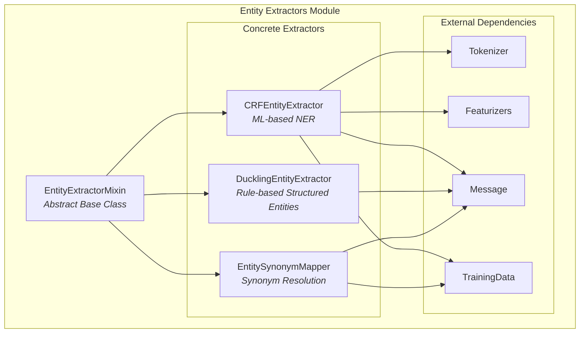
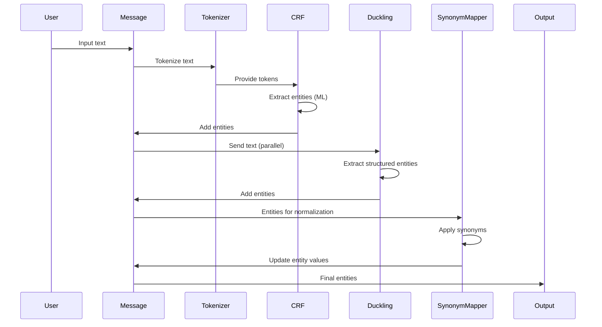
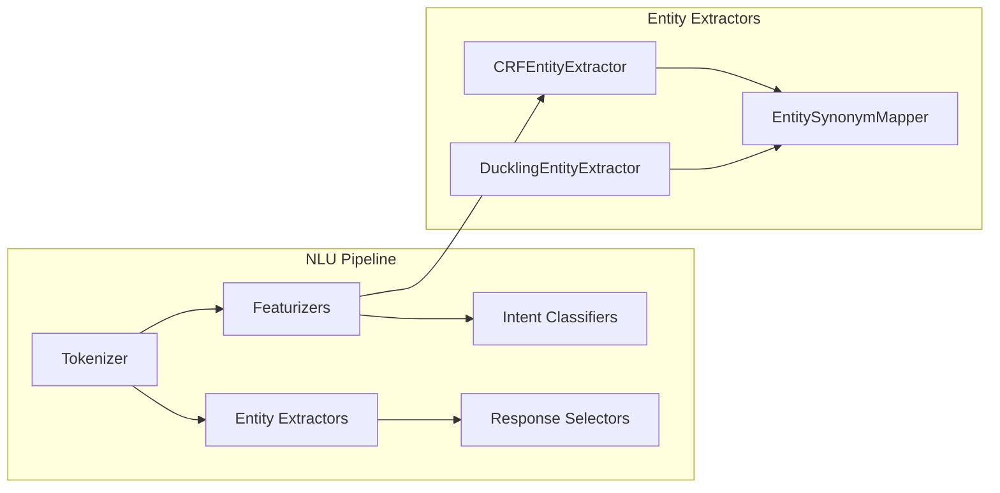

# Entity Extractors Module

## Introduction

The Entity Extractors module is a core component of Rasa's NLU pipeline responsible for identifying and extracting structured information from user messages. This module provides various algorithms and approaches to recognize entities such as names, locations, dates, and custom entity types from natural language text.

Entity extraction is a fundamental task in conversational AI that enables chatbots to understand and act upon specific pieces of information mentioned by users. The module offers multiple extraction strategies, from rule-based approaches to machine learning models, allowing developers to choose the most appropriate method for their use case.

## Architecture Overview

The Entity Extractors module follows a pluggable architecture where different extraction algorithms can be used independently or in combination. All extractors inherit from a common base class that provides shared functionality and interfaces.



## Core Components

### EntityExtractorMixin

The `EntityExtractorMixin` is the abstract base class that provides common functionality for all entity extractors. It defines the interface and shared utilities that concrete extractors use to process messages and extract entities.

**Key Responsibilities:**
- Entity annotation validation and alignment checking
- Conversion of predictions into standardized entity format
- BILOU (Begin-Inside-Last-Outside-Unit) tagging support
- Entity filtering and post-processing utilities
- Confidence score handling

**Core Methods:**
- `convert_predictions_into_entities()`: Transforms model predictions into standardized entity objects
- `find_entity()`: Validates entity boundaries against token positions
- `filter_trainable_entities()`: Filters entities based on extractor compatibility
- `check_correct_entity_annotations()`: Validates training data quality

### CRFEntityExtractor

The `CRFEntityExtractor` implements Conditional Random Fields for named entity recognition. This is a machine learning-based approach that learns patterns from training data to identify entities.

**Key Features:**
- Supports entity types, roles, and groups
- BILOU tagging for improved accuracy
- Configurable feature extraction (prefixes, suffixes, POS tags, patterns)
- Integration with dense features from featurizers
- Multi-level CRF training (entity type → role → group)

**Training Process:**
1. Converts training examples to CRF token format
2. Extracts features based on configuration (morphological, contextual, dense)
3. Trains separate CRF models for entity types, roles, and groups
4. Applies BILOU schema if enabled

**Configuration Options:**
- Feature windows (before, current, after tokens)
- Regularization parameters (L1, L2)
- Maximum training iterations
- BILOU flag for enhanced tagging

### DucklingEntityExtractor

The `DucklingEntityExtractor` provides rule-based extraction of structured entities like dates, times, numbers, and quantities using Facebook's Duckling library.

**Key Features:**
- HTTP-based communication with Duckling server
- Dimension filtering (dates, numbers, temperatures, etc.)
- Reference time support for relative date parsing
- High confidence scores (1.0) for extracted entities
- No training required

**Supported Dimensions:**
- Time expressions ("tomorrow", "next week")
- Numbers and quantities ("twenty", "5.5 kg")
- Temperatures ("72 degrees")
- Volumes, areas, distances
- Currency amounts

**Configuration:**
- Duckling server URL
- Locale and timezone settings
- Dimension filtering
- Request timeout configuration

### EntitySynonymMapper

The `EntitySynonymMapper` performs post-processing to normalize entity values by mapping them to canonical forms defined in training data.

**Key Features:**
- Case-insensitive synonym matching
- Automatic self-reference handling for case variations
- Conflict detection and resolution
- Training data integration

**Use Cases:**
- Mapping "NYC", "New York City" → "New York"
- Normalizing product names with variations
- Standardizing location references
- Handling abbreviations and acronyms

## Data Flow



## Integration with NLU Pipeline

Entity extractors integrate with the broader NLU pipeline through standardized interfaces:



**Dependencies:**
- **Tokenizer**: Required for token-based extraction (CRF)
- **Featurizers**: Optional for enhanced feature extraction (CRF)
- **Training Data**: Required for trainable extractors (CRF, SynonymMapper)

## Training and Configuration

### Training Process

For trainable extractors like CRFEntityExtractor:

1. **Data Preparation**: Validate entity annotations align with token boundaries
2. **Feature Extraction**: Convert tokens to feature representations
3. **Model Training**: Train CRF models for each entity attribute (type, role, group)
4. **Validation**: Check for misaligned entities and annotation quality
5. **Persistence**: Save trained models and configuration

### Configuration Examples

**CRFEntityExtractor Configuration:**
```yaml
pipeline:
- name: CRFEntityExtractor
  features:
    - [low, title, upper]
    - [bias, low, prefix5, suffix5, digit, pattern]
    - [low, title, upper]
  BILOU_flag: true
  max_iterations: 50
  L1_c: 0.1
  L2_c: 0.1
```

**DucklingEntityExtractor Configuration:**
```yaml
pipeline:
- name: DucklingEntityExtractor
  url: http://localhost:8000
  dimensions: ["time", "number", "temperature"]
  locale: en_US
  timezone: UTC
```

**EntitySynonymMapper Configuration:**
```yaml
pipeline:
- name: EntitySynonymMapper
```

## Entity Format

Extracted entities follow a standardized format:

```json
{
  "entity": "person",
  "start": 0,
  "end": 11,
  "value": "John Smith",
  "confidence": 0.95,
  "extractor": "CRFEntityExtractor",
  "role": "customer",
  "group": "primary",
  "processors": ["EntitySynonymMapper"]
}
```

**Fields:**
- `entity`: Entity type/category
- `start`/`end`: Character positions in original text
- `value`: Extracted text value
- `confidence`: Extraction confidence (0-1)
- `extractor`: Name of extracting component
- `role`: Entity role (optional)
- `group`: Entity group (optional)
- `processors`: List of post-processing components

## Error Handling and Validation

The module includes comprehensive validation mechanisms:

**Entity Annotation Validation:**
- Checks entity boundaries align with token positions
- Validates BILOU tag consistency
- Detects overlapping or misaligned entities
- Provides detailed error messages for training data issues

**Runtime Error Handling:**
- Graceful degradation when Duckling server is unavailable
- Fallback behavior for missing dependencies
- Warning messages for configuration issues
- Confidence-based filtering options

## Performance Considerations

**CRFEntityExtractor:**
- Training time scales with dataset size and feature complexity
- Inference is fast for individual messages
- Memory usage depends on model size and feature dimensions

**DucklingEntityExtractor:**
- Network latency to Duckling server
- Server capacity for high-volume applications
- Caching opportunities for repeated queries

**EntitySynonymMapper:**
- Minimal performance impact
- Efficient dictionary-based lookups
- Memory usage scales with synonym dictionary size

## Best Practices

1. **Choose Appropriate Extractors**: Use CRF for custom entities, Duckling for structured data
2. **Training Data Quality**: Ensure entity annotations align with token boundaries
3. **Feature Engineering**: Configure CRF features based on your domain characteristics
4. **Synonym Management**: Maintain consistent synonym mappings across training data
5. **Performance Monitoring**: Track extraction accuracy and confidence scores
6. **Pipeline Ordering**: Place synonym mapping after extraction components

## Related Documentation

- [Tokenizers](Tokenizers.md) - Required for token-based entity extraction
- [Featurizers](Featurizers.md) - Provide features for CRF entity extraction
- [NLU Training Data](NLU Training Data Structures.md) - Entity annotation format
- [Intent Classifiers](Intent Classifiers.md) - Parallel classification components
- [DIET Classifier](DIETClassifier.md) - Joint intent classification and entity extraction