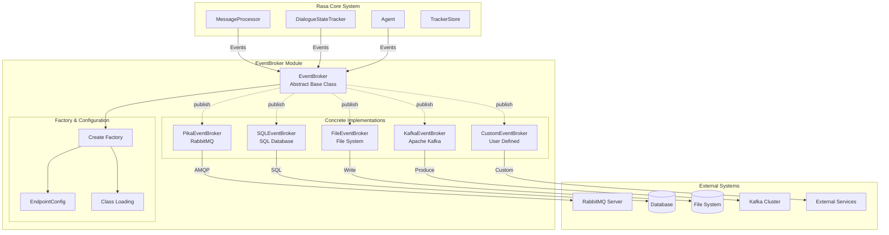
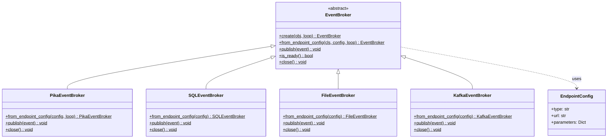
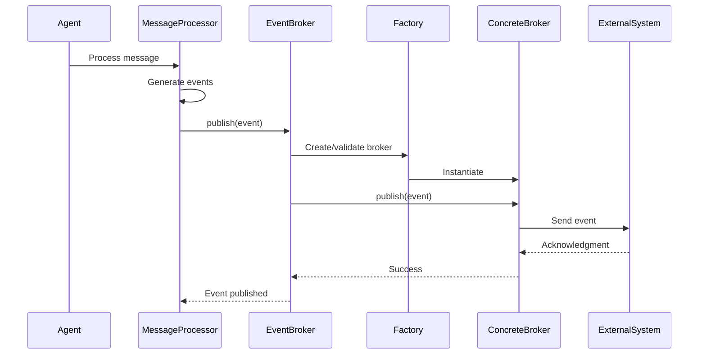
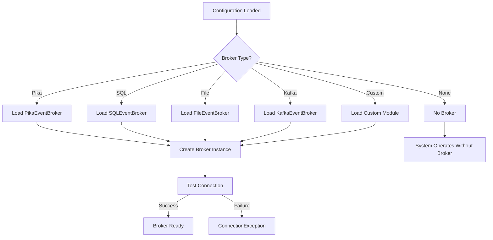

# EventBroker Module Documentation

## Introduction

The EventBroker module is a critical component in the Rasa dialogue management system, responsible for publishing and distributing events across the Rasa ecosystem. It acts as a central communication hub that enables real-time event streaming to external systems, facilitating monitoring, analytics, and integration with third-party services.

## Overview

The EventBroker provides a flexible, extensible architecture for handling Rasa Core events, supporting multiple backend implementations including RabbitMQ (Pika), SQL databases, file-based logging, Kafka, and custom brokers. This module ensures that important dialogue events are reliably published and can be consumed by external systems for various purposes such as conversation analytics, monitoring, and debugging.

## Architecture

### Core Architecture Diagram



### Component Relationships



## Core Components

### EventBroker Abstract Base Class

The `EventBroker` class serves as the foundation for all event broker implementations. It defines the contract that concrete implementations must fulfill:

- **Event Publishing**: The `publish()` method is the core interface for sending events to the configured backend
- **Lifecycle Management**: Provides `create()` factory method and `close()` for resource cleanup
- **Configuration**: Uses `EndpointConfig` for flexible broker configuration
- **Readiness Check**: The `is_ready()` method allows checking broker availability

### Factory Pattern Implementation

The module implements a sophisticated factory pattern through the `create()` method:

1. **Type Detection**: Automatically determines the appropriate broker type based on configuration
2. **Dynamic Loading**: Supports loading custom broker implementations via module paths
3. **Error Handling**: Comprehensive exception handling for connection failures
4. **Async Support**: Full async/await support for non-blocking operations

### Supported Broker Types

#### 1. PikaEventBroker (RabbitMQ)
- **Protocol**: AMQP
- **Use Case**: High-throughput, reliable message queuing
- **Features**: Message persistence, routing, clustering support

#### 2. SQLEventBroker
- **Protocol**: SQL
- **Use Case**: Event storage and querying
- **Features**: Structured data storage, SQL querying capabilities

#### 3. FileEventBroker
- **Protocol**: File I/O
- **Use Case**: Development, debugging, simple logging
- **Features**: Easy setup, human-readable format

#### 4. KafkaEventBroker
- **Protocol**: Kafka Protocol
- **Use Case**: Distributed streaming, high scalability
- **Features**: Partitioning, replication, stream processing

#### 5. CustomEventBroker
- **Protocol**: User-defined
- **Use Case**: Specialized requirements
- **Features**: Complete flexibility, custom logic

## Data Flow

### Event Publishing Flow



### Configuration and Initialization Flow



## Integration Points

### Dialogue Management Core Integration

The EventBroker integrates seamlessly with the [Dialogue Management Core](DialogueManagementCore.md) components:

- **Agent**: Publishes high-level dialogue events
- **MessageProcessor**: Publishes message processing events
- **DialogueStateTracker**: Publishes state change events
- **TrackerStore**: Coordinates event persistence and publishing

### Event Types

The broker handles various event types from the [Domain & Training Data](DomainTrainingData.md) module:

- **UserUttered**: User message events
- **ActionExecuted**: Action execution events
- **SlotSet**: Slot value changes
- **Custom Events**: Application-specific events

## Configuration

### Endpoint Configuration Format

```yaml
event_broker:
  type: pika  # pika, sql, file, kafka, or custom
  url: amqp://localhost:5672
  username: guest
  password: guest
  queue: rasa_events
  # Additional type-specific parameters
```

### Environment-based Configuration

The broker supports configuration through:
- YAML configuration files
- Environment variables
- Programmatic endpoint configuration
- Runtime parameter adjustment

## Error Handling and Resilience

### Connection Exception Handling

The module implements comprehensive error handling:

- **ConnectionException**: Base exception for broker connectivity issues
- **SQLAlchemy Errors**: Database connection failures
- **AMQP Errors**: RabbitMQ connection issues
- **Graceful Degradation**: System continues operation if broker is unavailable

### Retry and Recovery

- **Automatic Retry**: Built-in retry mechanisms for transient failures
- **Circuit Breaker**: Prevents cascading failures
- **Health Monitoring**: Continuous broker health checks
- **Fallback Strategies**: Alternative publishing mechanisms

## Performance Considerations

### Throughput Optimization

- **Async Operations**: Non-blocking event publishing
- **Batch Processing**: Support for bulk event publishing
- **Connection Pooling**: Efficient resource utilization
- **Load Balancing**: Distribution across multiple brokers

### Scalability Patterns

- **Horizontal Scaling**: Multiple broker instances
- **Partitioning**: Event distribution strategies
- **Caching**: Event buffering and queuing
- **Monitoring**: Performance metrics collection

## Security

### Authentication and Authorization

- **Broker-specific Auth**: Each implementation handles its own security
- **SSL/TLS Support**: Encrypted connections
- **Credential Management**: Secure configuration handling
- **Access Control**: Event-level permissions

### Data Protection

- **Event Sanitization**: Sensitive data filtering
- **Encryption**: Event payload encryption
- **Audit Logging**: Security event tracking
- **Compliance**: GDPR and privacy regulation support

## Monitoring and Observability

### Health Checks

- **Readiness Probes**: Broker availability monitoring
- **Liveness Checks**: Connection health validation
- **Metrics Collection**: Performance and error metrics
- **Alerting**: Failure notification systems

### Debugging Support

- **Detailed Logging**: Comprehensive operation logs
- **Event Tracing**: End-to-end event tracking
- **Performance Profiling**: Bottleneck identification
- **Configuration Validation**: Setup verification

## Best Practices

### Production Deployment

1. **Broker Selection**: Choose appropriate broker based on requirements
2. **High Availability**: Configure redundant broker instances
3. **Monitoring**: Implement comprehensive monitoring and alerting
4. **Security**: Enable encryption and authentication
5. **Capacity Planning**: Size broker infrastructure appropriately

### Development Guidelines

1. **Error Handling**: Always handle broker exceptions gracefully
2. **Resource Management**: Properly close broker connections
3. **Testing**: Test with different broker configurations
4. **Documentation**: Document broker setup and dependencies
5. **Performance**: Consider event volume and broker capacity

## Troubleshooting

### Common Issues

- **Connection Failures**: Check broker configuration and network connectivity
- **Performance Degradation**: Monitor broker load and optimize configuration
- **Event Loss**: Implement proper acknowledgment mechanisms
- **Configuration Errors**: Validate endpoint configuration syntax

### Diagnostic Tools

- **Health Check Endpoints**: Broker-specific health verification
- **Event Tracing**: Track event flow through the system
- **Performance Metrics**: Monitor publishing latency and throughput
- **Log Analysis**: Review broker and application logs

## Future Enhancements

### Planned Features

- **Cloud-native Brokers**: Native cloud service integrations
- **Enhanced Security**: Advanced authentication mechanisms
- **Performance Optimization**: Improved throughput and latency
- **Standardization**: Common event format specifications

### Extension Points

- **Custom Brokers**: Plugin architecture for new implementations
- **Event Transformation**: Middleware for event processing
- **Routing Rules**: Intelligent event distribution
- **Aggregation**: Event batching and summarization

## Related Documentation

- [Dialogue Management Core](DialogueManagementCore.md) - Core dialogue processing components
- [Domain & Training Data](DomainTrainingData.md) - Event definitions and structures
- [TrackerStore](TrackerStore.md) - Event persistence and state management
- [MessageProcessor](MessageProcessor.md) - Message processing and event generation

## API Reference

For detailed API documentation, refer to the source code in `rasa.core.brokers.broker` and specific broker implementations in the `rasa.core.brokers` package.