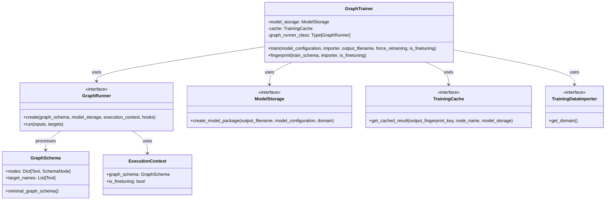
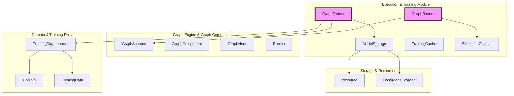
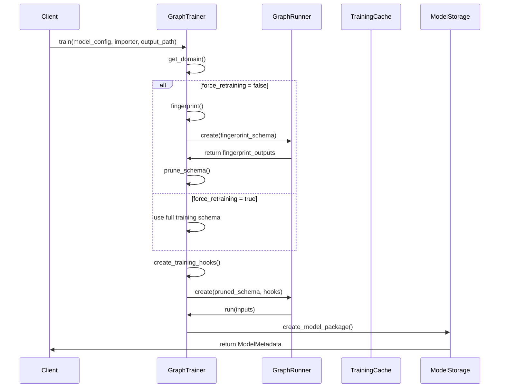
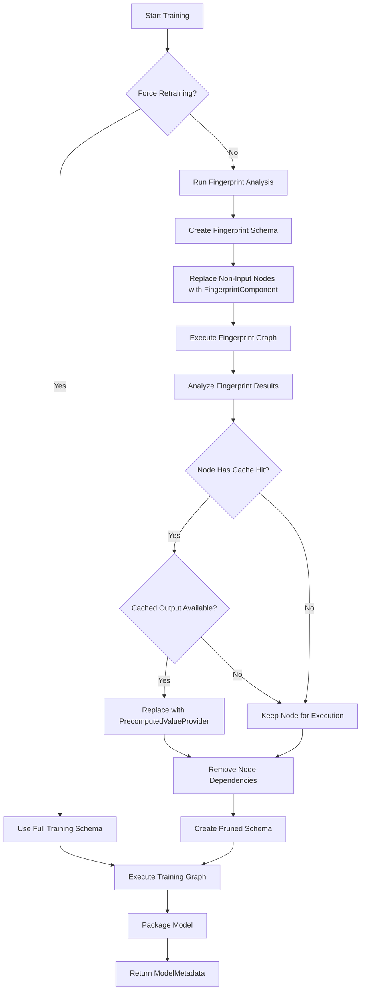
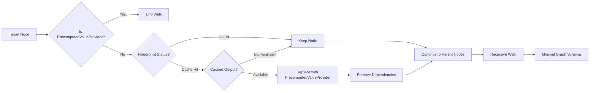
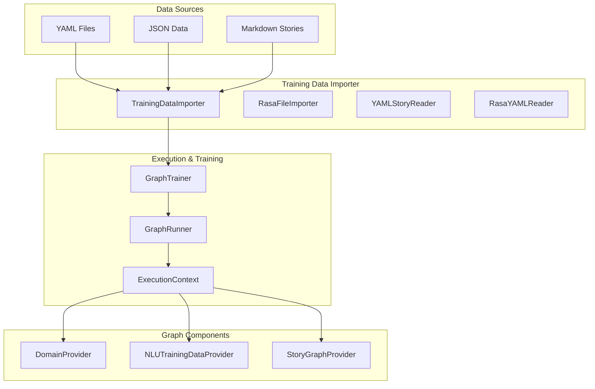
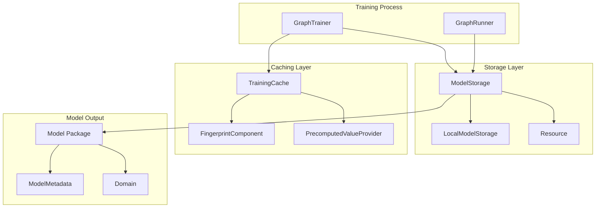

# Execution & Training Module

## Introduction

The Execution & Training module is the core orchestration layer of the Rasa framework, responsible for managing the execution of graph-based training pipelines and model inference. This module provides the fundamental infrastructure for running both training and prediction workflows through a sophisticated graph execution engine that supports caching, fingerprinting, and incremental training.

The module serves as the bridge between the declarative graph schemas (defined in the [Graph Engine & Graph Components](Graph Engine & Graph Components.md) module) and the actual execution of machine learning pipelines, ensuring efficient resource utilization and enabling advanced features like model caching and incremental updates.

## Architecture Overview

The Execution & Training module implements a sophisticated graph execution system with the following key architectural principles:

### Core Components



### System Integration



## Component Details

### GraphRunner Interface

The `GraphRunner` is the fundamental execution engine responsible for running graph schemas. It provides a pluggable interface that allows different execution strategies while maintaining a consistent API.

**Key Responsibilities:**
- Instantiate and execute graph schemas
- Manage execution context and hooks
- Handle input/output node mapping
- Support target node execution for selective computation

**Key Methods:**
- `create()`: Factory method for creating runner instances with proper initialization
- `run()`: Execute the graph with specified inputs and target outputs

### GraphTrainer

The `GraphTrainer` orchestrates the complete training pipeline, implementing sophisticated caching and fingerprinting mechanisms to optimize training performance.

**Key Features:**
- **Fingerprint-based Caching**: Determines which components need retraining based on input data changes
- **Incremental Training**: Supports fine-tuning scenarios with selective component updates
- **Graph Pruning**: Optimizes execution by removing unnecessary nodes from the training graph
- **Model Packaging**: Creates deployable model packages with metadata

**Training Workflow:**



## Training Process Flow

### Fingerprinting and Caching

The training process implements a sophisticated fingerprinting mechanism to optimize retraining:



### Graph Pruning Algorithm

The pruning mechanism walks the graph backwards from target nodes to optimize execution:



## Data Flow Architecture

### Training Data Flow



### Model Storage and Caching



## Integration with Other Modules

### Dependency on Graph Engine & Graph Components

The Execution & Training module heavily relies on the [Graph Engine & Graph Components](Graph Engine & Graph Components.md) module for:
- **GraphSchema**: Defines the structure and dependencies of the training pipeline
- **GraphComponent**: Base class for all trainable and inference components
- **GraphNode**: Represents individual nodes in the execution graph
- **Recipe**: Defines how to construct training and prediction graphs

### Integration with Domain & Training Data

The module interfaces with the [Domain & Training Data](Domain & Training Data.md) module through:
- **TrainingDataImporter**: Provides access to training data and domain information
- **Domain**: Contains the conversational AI domain definition
- **TrainingData**: Holds NLU training examples and labels
- **StoryGraph**: Represents conversational training stories

### Storage and Resource Management

Integration with the storage system from [Graph Engine & Graph Components](Graph Engine & Graph Components.md):
- **ModelStorage**: Abstract interface for model persistence
- **LocalModelStorage**: File-based model storage implementation
- **Resource**: Represents individual model components and artifacts

## Advanced Features

### Incremental Training

The module supports fine-tuning scenarios through the `is_finetuning` parameter, which:
- Modifies the execution context to indicate fine-tuning mode
- Affects fingerprinting behavior for pre-trained components
- Enables selective retraining of specific graph nodes

### Hook System

The execution system supports hooks for monitoring and intervention:
- **TrainingHook**: Manages caching and model storage during training
- **LoggingHook**: Provides execution logging and progress tracking
- **GraphNodeHook**: Allows pre/post execution hooks on individual nodes

### Error Handling and Recovery

The training process includes robust error handling:
- **Fingerprint Validation**: Ensures cache consistency across training runs
- **Graceful Degradation**: Falls back to full training if fingerprinting fails
- **Model Packaging**: Creates self-contained model packages with metadata

## Performance Optimizations

### Caching Strategy

The fingerprinting and caching system provides significant performance benefits:
- **Component-level Caching**: Individual graph nodes can be cached independently
- **Dependency Analysis**: Only re-executes nodes affected by input changes
- **Memory Efficiency**: Uses cached results instead of recomputing expensive operations

### Graph Optimization

The pruning mechanism optimizes execution by:
- **Removing Redundant Nodes**: Eliminates unnecessary computation
- **Dependency Minimization**: Reduces memory footprint and execution time
- **Target-focused Execution**: Only computes required outputs

## Usage Examples

### Basic Training

```python
# Initialize components
model_storage = LocalModelStorage(storage_path)
cache = TrainingCache()
graph_runner_class = DefaultGraphRunner

# Create trainer
trainer = GraphTrainer(model_storage, cache, graph_runner_class)

# Train model
model_metadata = trainer.train(
    model_configuration=config,
    importer=training_data_importer,
    output_filename=Path("model.tar.gz"),
    force_retraining=False
)
```

### Fine-tuning

```python
# Fine-tune existing model
model_metadata = trainer.train(
    model_configuration=config,
    importer=training_data_importer,
    output_filename=Path("fine_tuned_model.tar.gz"),
    force_retraining=False,
    is_finetuning=True
)
```

## Best Practices

### Training Optimization
- Use fingerprinting for faster iterative development
- Leverage caching for expensive preprocessing steps
- Implement proper resource cleanup in custom components

### Error Handling
- Always validate training data before starting training
- Monitor fingerprint status for debugging cache issues
- Use appropriate logging levels for training visibility

### Resource Management
- Configure appropriate cache sizes for your use case
- Use model storage abstraction for portability
- Consider memory implications of graph pruning

## Conclusion

The Execution & Training module represents the core orchestration layer of the Rasa framework, providing sophisticated graph-based execution capabilities with advanced caching and optimization features. Its design enables efficient training workflows, supports incremental learning scenarios, and provides the foundation for scalable conversational AI development.

The module's integration with the broader Rasa ecosystem through well-defined interfaces makes it a powerful and flexible component that can adapt to various deployment scenarios and performance requirements.