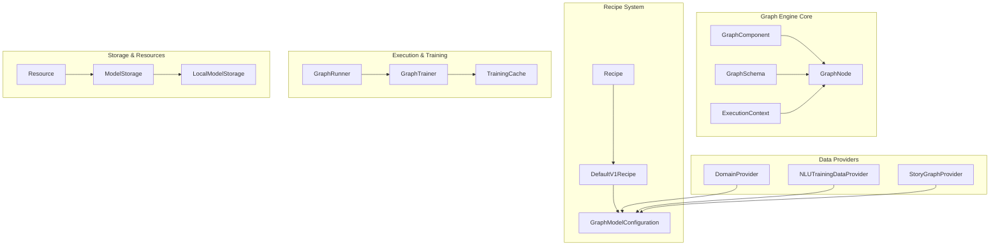
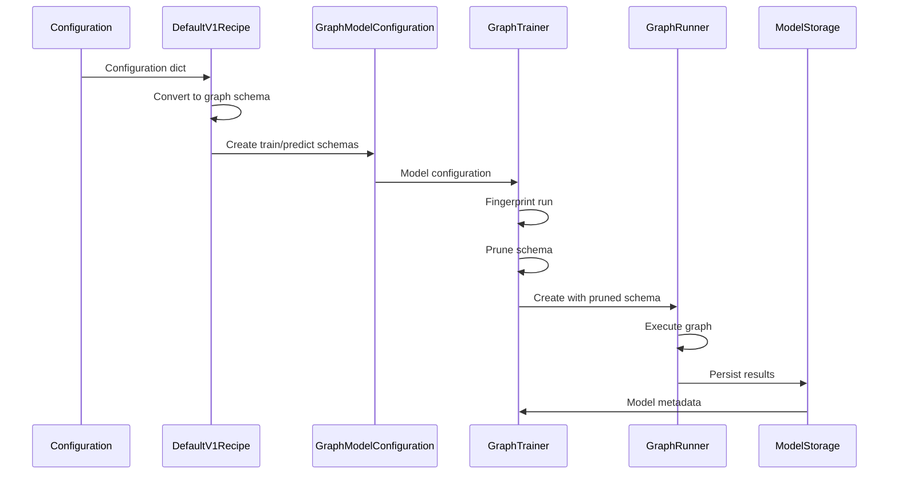

# Execution Engine & Graph Components

## Overview

The Execution Engine & Graph Components module is the core orchestration framework of Rasa Open Source. It provides a sophisticated graph-based execution system that manages the training and inference pipelines for conversational AI models. This module replaces the traditional linear pipeline approach with a dynamic, dependency-driven graph architecture that enables efficient caching, parallelization, and incremental training.

## Purpose and Core Functionality

The module serves as the backbone for:
- **Model Training**: Orchestrating complex training workflows with dependency management
- **Model Inference**: Managing prediction pipelines with optimized execution order
- **Resource Management**: Handling model persistence and caching for performance optimization
- **Component Integration**: Providing a unified interface for NLU, Core, and end-to-end components

## Architecture Overview

## Key Components

### Graph Engine Core
The foundation of the execution system, providing the basic abstractions for graph-based execution:

- **[GraphComponent](Graph%20Engine%20Core.md#graphcomponent)**: Base interface for all executable components
- **[GraphSchema](Graph%20Engine%20Core.md#graphschema)**: Defines the structure and dependencies of the execution graph
- **[GraphNode](Graph%20Engine%20Core.md#graphnode)**: Wraps components with execution logic and dependency management
- **[ExecutionContext](Graph%20Engine%20Core.md#executioncontext)**: Provides runtime context for graph execution

### Recipe System
Converts traditional configuration files into executable graph schemas:

- **[Recipe](Recipe%20System.md#recipe)**: Abstract base for configuration-to-graph conversion
- **[DefaultV1Recipe](Recipe%20System.md#defaultv1recipe)**: Default implementation handling NLU pipelines and policies
- **[GraphModelConfiguration](Recipe%20System.md#graphmodelconfiguration)**: Container for train/predict schemas and model metadata

### Execution & Training
Manages the actual execution of graphs with caching and optimization:

- **[GraphRunner](Execution%20&%20Training.md#graphrunner)**: Abstract interface for graph execution engines
- **[GraphTrainer](Execution%20&%20Training.md#graphtrainer)**: Specialized runner for training workflows with fingerprinting
- **[TrainingCache](Training%20Cache.md#trainingcache)**: Persistent caching system for training outputs

### Storage & Resources
Handles model persistence and resource management:

- **[ModelStorage](Storage%20&%20Resources.md#modelstorage)**: Abstract interface for component persistence
- **[LocalModelStorage](Storage%20&%20Resources.md#localmodelstorage)**: File-system based storage implementation
- **[Resource](Storage%20&%20Resources.md#resource)**: Represents persisted components with fingerprinting

### Data Providers
Supply training and inference data to the graph:

- **[DomainProvider](Data%20Providers.md#domainprovider)**: Provides domain information during training/inference
- **[NLUTrainingDataProvider](Data%20Providers.md#nlutrainingdataprovider)**: Supplies NLU training data
- **[StoryGraphProvider](Data%20Providers.md#storygraphprovider)**: Provides conversation training data

## Data Flow Architecture

## Integration with Other Modules

The Execution Engine integrates with all major Rasa modules:

- **[NLU Pipeline](NLU%20Pipeline.md)**: NLU components are wrapped as GraphComponents
- **[Dialogue Policies](Dialogue%20Policies.md)**: Policy components execute within the graph
- **[Actions](Actions.md)**: Action execution is orchestrated through the graph
- **[Domain & Training Data](Domain%20&%20Training%20Data.md)**: Data is provided through specialized providers

## Key Features

### Incremental Training
The fingerprinting system enables incremental training by:
- Computing fingerprints for each graph node based on inputs and configuration
- Caching outputs of unchanged nodes
- Only retraining nodes that have actually changed

### Parallel Execution
The graph structure enables:
- Identification of independent nodes that can run in parallel
- Optimized execution order based on dependencies
- Efficient resource utilization

### Flexible Configuration
The recipe system provides:
- Automatic configuration of missing components
- Backward compatibility with traditional pipeline configurations
- Extensibility for custom graph components

## Usage Patterns

### Training Workflow
1. Configuration is parsed and validated
2. Recipe converts config to train/predict graphs
3. GraphTrainer performs fingerprinting to optimize execution
4. Graph is executed with caching and parallelization
5. Results are persisted to ModelStorage
6. Model package is created with metadata

### Inference Workflow
1. Model package is loaded with ModelStorage
2. Predict graph is instantiated with trained components
3. GraphRunner executes prediction pipeline
4. Results are returned to calling system

## Performance Optimizations

- **Caching**: Training outputs are cached to avoid redundant computation
- **Fingerprinting**: Change detection minimizes retraining scope
- **Lazy Loading**: Components are instantiated only when needed
- **Resource Sharing**: Common resources are shared across components

## Error Handling

The module provides comprehensive error handling:
- Graph validation catches configuration issues early
- Component exceptions are wrapped with context information
- Graceful degradation when cache operations fail
- Detailed logging for debugging execution issues