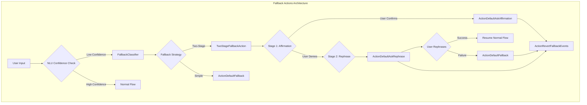
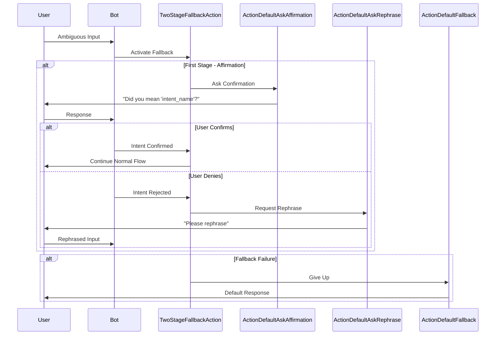
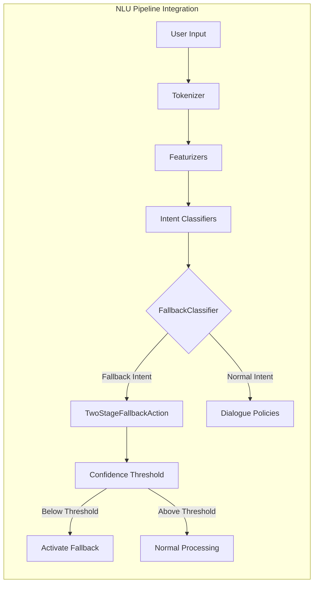
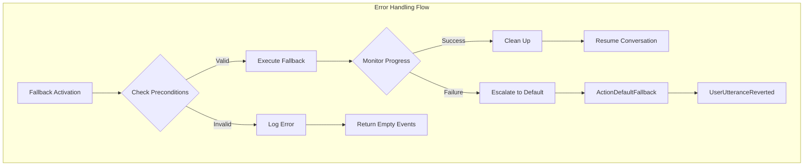

# Fallback Actions Module Documentation

## Introduction

The Fallback Actions module provides a comprehensive error handling and recovery system for Rasa conversational AI. When the NLU (Natural Language Understanding) component fails to confidently interpret user input or when the dialogue management system encounters unexpected situations, fallback actions ensure graceful degradation and user-friendly recovery mechanisms.

This module implements sophisticated fallback strategies including two-stage fallback, affirmation requests, and rephrase prompts, enabling bots to handle ambiguous or unclear user input effectively while maintaining conversational flow.

## Architecture Overview

The Fallback Actions module is built around a hierarchical action system that provides multiple layers of fallback mechanisms, from simple default responses to complex multi-turn clarification dialogs.



## Core Components

### TwoStageFallbackAction

The `TwoStageFallbackAction` is the centerpiece of the advanced fallback system, implementing a sophisticated two-stage clarification process that engages users in resolving understanding ambiguities.

**Key Features:**
- **Loop-based Architecture**: Extends `LoopAction` to maintain state across multiple turns
- **Intelligent Stage Detection**: Automatically determines whether to ask for affirmation or rephrasing
- **Context Preservation**: Maintains conversation context throughout the fallback process
- **Graceful Degradation**: Falls back to default actions when clarification fails

**Process Flow:**


### ActionDefaultAskAffirmation

This action implements the first stage of the two-stage fallback, asking users to confirm the system's interpretation of their intent.

**Capabilities:**
- **Intent Ranking Analysis**: Examines NLU intent rankings to suggest the most likely interpretation
- **Interactive Buttons**: Provides Yes/No button options for user confirmation
- **Smart Intent Selection**: Falls back to the second-ranked intent when the top intent is the fallback intent itself

### ActionDefaultAskRephrase

The second stage action that requests users to rephrase their input when affirmation fails.

**Features:**
- **Polite Rephrase Requests**: Uses configurable response templates
- **Context Maintenance**: Preserves conversation state during rephrasing
- **Retry Logic**: Allows multiple rephrasing attempts

### ActionRevertFallbackEvents

A utility action that cleans up the conversation state after successful fallback resolution, ensuring the dialogue tracker reflects the correct conversation history.

**Functions:**
- **Event Reversion**: Removes fallback-related events from the tracker
- **Intent Confidence Correction**: Sets confidence to 1.0 for successfully clarified intents
- **State Restoration**: Returns conversation to the appropriate state for continued interaction

## Integration with NLU Pipeline

The fallback actions integrate seamlessly with the NLU pipeline's confidence scoring and intent classification systems:



## Configuration and Customization

### Fallback Thresholds

The system uses configurable confidence thresholds to determine when to trigger fallback actions:

- **NLU Fallback Threshold**: Minimum confidence score for intent classification
- **Core Fallback Threshold**: Confidence threshold for dialogue policy predictions
- **Two-Stage Threshold**: Specific threshold for activating two-stage fallback

### Custom Action Integration

Developers can extend the fallback system by:

1. **Custom Affirmation Actions**: Override `ActionDefaultAskAffirmation` for domain-specific confirmation dialogs
2. **Custom Rephrase Actions**: Implement specialized rephrasing requests
3. **Custom Fallback Logic**: Create entirely new fallback strategies by extending `Action` base class

## Error Handling and Recovery

The module implements comprehensive error handling to ensure robust operation:



## Dependencies and Interactions

The Fallback Actions module interacts with several core Rasa components:

### Dialogue Management Core
- **DialogueStateTracker**: Maintains conversation state during fallback processes
- **MessageProcessor**: Coordinates fallback activation and execution
- **Domain**: Provides access to configured responses and actions

### NLU Pipeline
- **FallbackClassifier**: Triggers fallback actions based on confidence scores
- **Intent Classifiers**: Provide intent rankings for affirmation suggestions
- **NaturalLanguageInterpreter**: Processes user rephrasing attempts

### Action System
- **Action Base Classes**: Inherits from `Action` and `LoopAction` for consistent behavior
- **ActionBotResponse**: Provides response generation capabilities
- **RemoteAction**: Enables custom fallback action implementations

## Performance Considerations

### Optimization Strategies

1. **Event Efficiency**: Minimizes tracker events during fallback to reduce processing overhead
2. **State Management**: Uses efficient loop detection and state checking algorithms
3. **Memory Management**: Properly handles event reversion to prevent memory leaks

### Monitoring and Metrics

Key performance indicators for fallback actions:

- **Fallback Activation Rate**: Percentage of conversations requiring fallback
- **Two-Stage Success Rate**: Success rate of the two-stage clarification process
- **Resolution Time**: Average time to resolve fallback situations
- **User Satisfaction**: Post-fallback conversation quality metrics

## Best Practices

### Implementation Guidelines

1. **Threshold Tuning**: Carefully balance fallback sensitivity to avoid over-triggering
2. **Response Design**: Create clear, helpful affirmation and rephrase prompts
3. **Context Preservation**: Ensure conversation context is maintained across fallback turns
4. **Testing Strategy**: Test fallback scenarios extensively with diverse user inputs

### Common Patterns

```python
# Custom affirmation action example
class CustomAffirmationAction(ActionDefaultAskAffirmation):
    async def run(self, output_channel, nlg, tracker, domain):
        # Add domain-specific logic
        intent_name = self._get_friendly_intent_name(tracker)
        message = f"I think you want to {intent_name}. Is that correct?"
        # Custom button layout, response formatting, etc.
```

## Troubleshooting

### Common Issues

1. **Infinite Fallback Loops**: Usually caused by misconfigured confidence thresholds
2. **Context Loss**: Ensure proper event reversion in custom fallback actions
3. **Response Generation Failures**: Check NLG configuration and response templates
4. **Performance Degradation**: Monitor fallback activation rates and optimize thresholds

### Debug Information

Enable debug logging to trace fallback execution:
- `rasa.core.actions`: General fallback action execution
- `rasa.core.policies`: Policy prediction and fallback activation
- `rasa.shared.core.events`: Event processing and reversion

## Future Enhancements

The fallback actions module is designed for extensibility, with planned enhancements including:

- **Machine Learning Integration**: Adaptive fallback strategies based on conversation patterns
- **Multi-language Support**: Enhanced support for multilingual fallback scenarios
- **Contextual Affirmation**: More sophisticated intent suggestion based on conversation context
- **Analytics Integration**: Enhanced metrics and reporting for fallback performance analysis

## Related Documentation

- [Actions Module](Actions.md) - General action system documentation
- [Dialogue Policies](Dialogue_Policies.md) - Policy system that triggers fallback actions
- [NLU Pipeline](NLU_Pipeline.md) - NLU components that provide confidence scores
- [Dialogue Management Core](Dialogue_Management_Core.md) - Core dialogue processing system