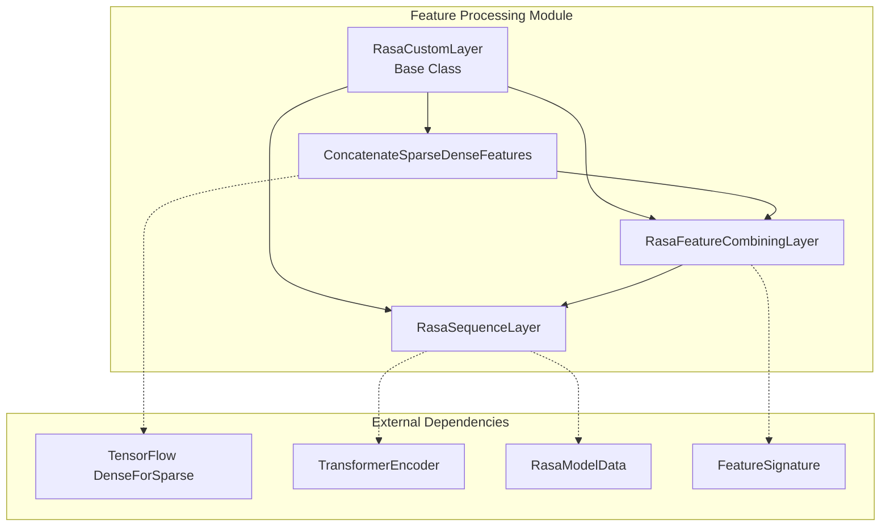
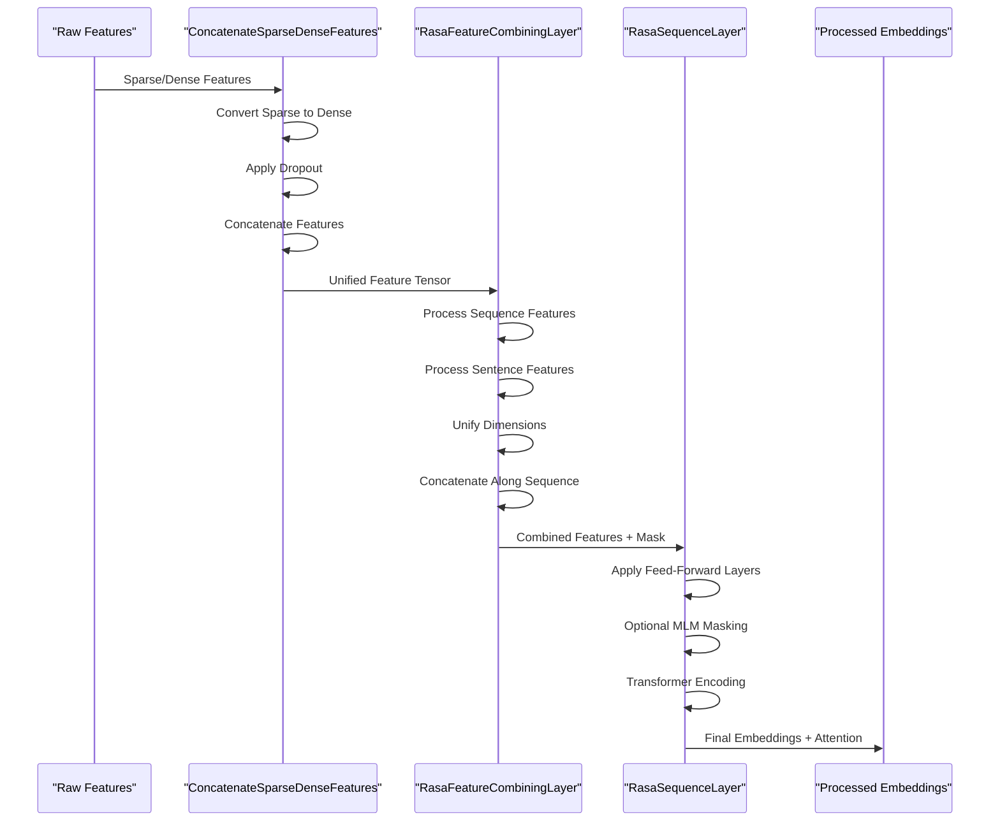
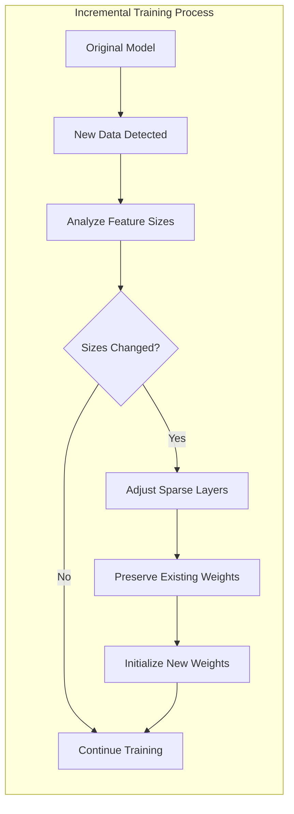

# Feature Processing Module

## Introduction

The Feature Processing module is a core component of Rasa's TensorFlow-based architecture that handles the transformation, combination, and processing of various types of features extracted from conversational data. This module provides sophisticated neural network layers designed to work with both sparse and dense features, enabling Rasa models to effectively process diverse input representations including text, intent, and entity features.

The module serves as a bridge between raw featurized data and the higher-level model components, offering flexible feature combination strategies, support for incremental training, and integration with transformer-based architectures for state-of-the-art conversational AI performance.

## Architecture Overview

The Feature Processing module implements a hierarchical architecture with specialized layers for different aspects of feature manipulation:



## Core Components

### RasaCustomLayer

The foundational base class that provides shared functionality for incremental training support. This abstract layer enables dynamic adjustment of sparse feature processing components when models are fine-tuned with new data that may have different feature dimensions.

**Key Responsibilities:**
- Manages sparse layer adaptation during incremental training
- Provides recursive layer traversal for feature size adjustments
- Handles kernel weight preservation and extension when feature sizes increase

**Architecture Integration:**
- Serves as parent class for all feature processing layers
- Integrates with [TensorFlow Model Components](TensorFlow%20Model%20Components.md) for model persistence
- Coordinates with [NLU Pipeline](NLU%20Pipeline.md) featurizers for feature validation

### ConcatenateSparseDenseFeatures

A specialized layer that harmonizes heterogeneous feature representations by converting sparse tensors to dense format and concatenating all features along the last dimension. This component is crucial for combining features from multiple featurizers that may produce different tensor types.

**Processing Pipeline:**
1. **Sparse Tensor Conversion**: Transforms sparse tensors to dense representation using configurable dense dimensions
2. **Dropout Application**: Optionally applies dropout to sparse tensors before and/or after conversion
3. **Feature Concatenation**: Combines all features along the final dimension
4. **Dimension Validation**: Ensures consistent tensor shapes across all inputs

**Configuration Parameters:**
- `DENSE_DIMENSION`: Controls output size for sparse feature conversion
- `SPARSE_INPUT_DROPOUT`: Enables dropout on sparse tensors pre-conversion
- `DENSE_INPUT_DROPOUT`: Enables dropout on dense tensors post-conversion
- `REGULARIZATION_CONSTANT`: L2 regularization for sparse-to-dense transformations

### RasaFeatureCombiningLayer

An advanced feature fusion layer that handles both sequence-level (token) and sentence-level features. This component implements sophisticated strategies for combining different granularities of features while maintaining proper sequence alignment and masking.

**Feature Combination Strategy:**
1. **Separate Processing**: Applies `ConcatenateSparseDenseFeatures` to sequence and sentence features independently
2. **Dimension Unification**: Optionally applies feed-forward networks to align feature dimensions
3. **Sequence Concatenation**: Appends sentence features at the first available position after sequence features
4. **Mask Generation**: Creates comprehensive masks for the combined feature tensor

**Advanced Features:**
- Dynamic dimension unification for heterogeneous feature sizes
- Intelligent sequence length calculation for mixed feature types
- Support for feature-type-specific processing pipelines

### RasaSequenceLayer

The most sophisticated layer in the module, designed specifically for sequence attributes like text, response, and action_text. This layer implements a complete processing pipeline from raw features to transformer embeddings, with optional masked language modeling support.

**Complete Processing Pipeline:**
1. **Feature Combination**: Utilizes `RasaFeatureCombiningLayer` for initial feature fusion
2. **Feed-Forward Processing**: Applies configurable dense layers for feature transformation
3. **Masked Language Modeling**: Optional masking for training-time regularization
4. **Transformer Encoding**: Reduces variable-length sequences to fixed-size embeddings
5. **Attention Weight Extraction**: Provides access to transformer attention patterns

**Masked Language Modeling Integration:**
- Token-level masking for text attributes during training
- Generation of unique token IDs for negative sampling
- Integration with transformer attention mechanisms
- Support for both dense and sparse token representations

## Data Flow Architecture



## Integration with Rasa Ecosystem

### NLU Pipeline Integration

The Feature Processing module serves as the computational backbone for [NLU Pipeline](NLU%20Pipeline.md) components, particularly:

- **Intent Classifiers**: Process combined text features for intent prediction
- **Entity Extractors**: Handle sequence-level features for entity recognition
- **Response Selectors**: Transform response text into embedding representations

### Core Featurization Support

Integrates with [Core Featurization](Core%20Featurization.md) to process:
- **Tracker Features**: Convert dialogue state representations
- **Action Features**: Process action text and metadata
- **User Message Features**: Transform user inputs for policy decisions

### Model Training Integration

The module provides essential support for [Execution Engine & Graph Components](Execution%20Engine%20&%20Graph%20Components.md):

- **Graph Component Integration**: Seamless integration with Rasa's graph execution framework
- **Training Cache Support**: Compatible with incremental training workflows
- **Model Storage**: Proper serialization for model persistence

## Advanced Features

### Incremental Training Support

The module implements sophisticated mechanisms for handling incremental training scenarios where new data may introduce different feature dimensions:



**Key Capabilities:**
- Dynamic layer replacement for changed sparse feature sizes
- Weight preservation for existing features
- Statistical weight initialization for new features
- Recursive layer traversal for complex architectures

### Multi-Level Feature Processing

The module excels at processing features at different granularities:

- **Sequence-Level Features**: Token-by-token processing for detailed analysis
- **Sentence-Level Features**: Global context representation
- **Hybrid Processing**: Intelligent combination of both granularities
- **Attention-Based Fusion**: Transformer-based feature integration

### Configuration Management

Extensive configuration options provide fine-grained control:

```yaml
# Example configuration structure
feature_processing:
  dense_dimension:
    text: 128
    intent: 64
    response: 128
  
  concat_dimension:
    text: 256
    intent: 128
  
  hidden_layers_sizes:
    text: [256, 128]
    intent: [128, 64]
  
  transformer_size: 256
  number_of_transformer_layers: 2
  
  dropout_rate: 0.2
  sparse_input_dropout: true
  dense_input_dropout: true
  
  masked_language_modeling: true
```

## Performance Optimizations

### Memory Efficiency

- **Sparse Tensor Operations**: Optimized sparse-to-dense conversions
- **Lazy Evaluation**: Deferred computation where possible
- **Gradient Checkpointing**: Memory-efficient backpropagation
- **Batch Processing**: Optimized batch-level operations

### Computational Efficiency

- **Vectorized Operations**: TensorFlow-optimized tensor manipulations
- **Parallel Processing**: Multi-threaded feature combination
- **Caching Strategies**: Intelligent caching of intermediate results
- **Hardware Acceleration**: GPU-optimized operations

## Error Handling and Validation

The module implements comprehensive error handling:

- **Feature Validation**: Ensures consistent feature signatures
- **Dimension Checking**: Validates tensor compatibility
- **Configuration Validation**: Verifies parameter consistency
- **Runtime Monitoring**: Tracks processing pipeline health

## Usage Examples

### Basic Feature Combination

```python
# Combine sparse and dense features for text processing
feature_combiner = ConcatenateSparseDenseFeatures(
    attribute="text",
    feature_type="sequence",
    feature_type_signature=feature_signatures,
    config=processing_config
)

# Process mixed feature types
combined_features = feature_combiner(
    (sparse_features + dense_features,),
    training=True
)
```

### Advanced Sequence Processing

```python
# Create complete sequence processing pipeline
sequence_processor = RasaSequenceLayer(
    attribute="text",
    attribute_signature=attribute_signatures,
    config=sequence_config
)

# Process with transformer and MLM support
outputs, features, mask, token_ids, mlm_mask, attention = sequence_processor(
    (sequence_features, sentence_features, sequence_lengths),
    training=True
)
```

### Incremental Training Setup

```python
# Handle new data with different feature sizes
layer.adjust_sparse_layers_for_incremental_training(
    new_sparse_feature_sizes=new_sizes,
    old_sparse_feature_sizes=old_sizes,
    reg_lambda=0.001
)
```

## Future Enhancements

The module is designed for extensibility with planned enhancements:

- **Multi-Modal Support**: Integration of visual and audio features
- **Advanced Attention Mechanisms**: Support for cross-attention and self-attention variants
- **Dynamic Architecture**: Adaptive layer selection based on data characteristics
- **Federated Learning**: Support for distributed feature processing
- **Quantum-Ready Features**: Preparation for quantum-enhanced processing

## Conclusion

The Feature Processing module represents a sophisticated approach to handling the complexity of modern conversational AI feature representations. By providing a flexible, efficient, and extensible framework for feature manipulation, it enables Rasa to process diverse input types while maintaining the performance and scalability required for production deployments. The module's integration with incremental training, transformer architectures, and comprehensive configuration management makes it a cornerstone of Rasa's machine learning infrastructure.