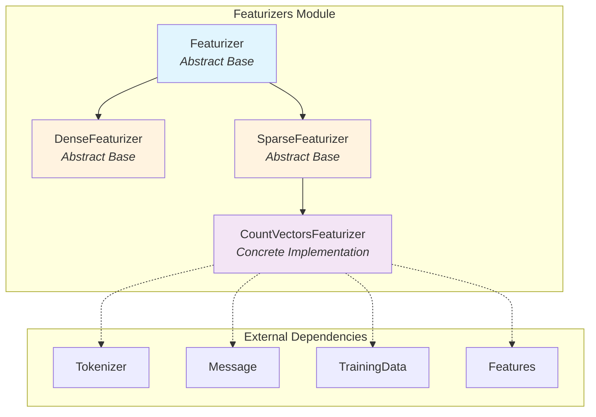
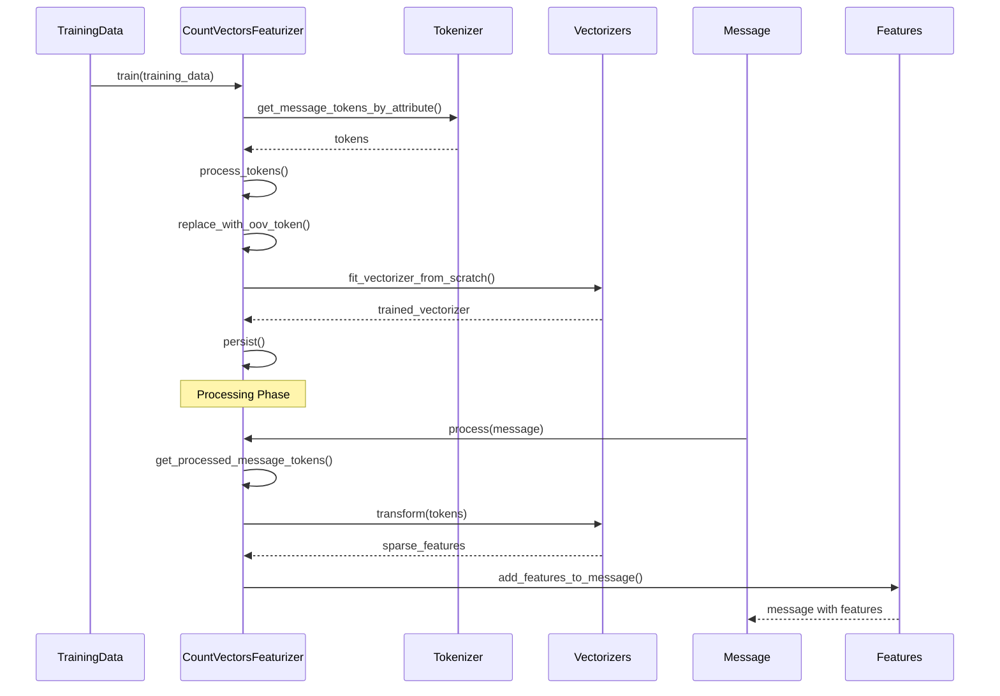
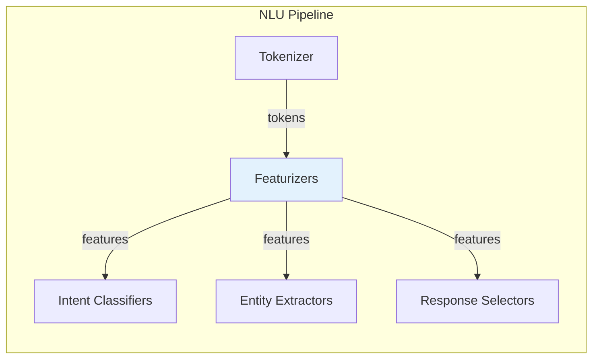
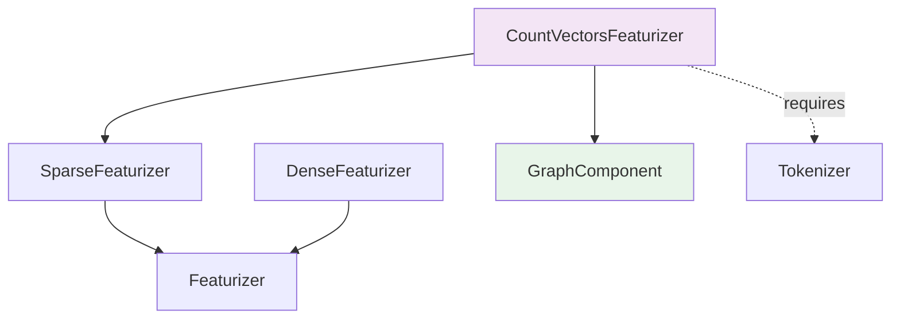
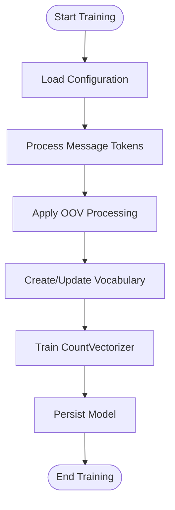
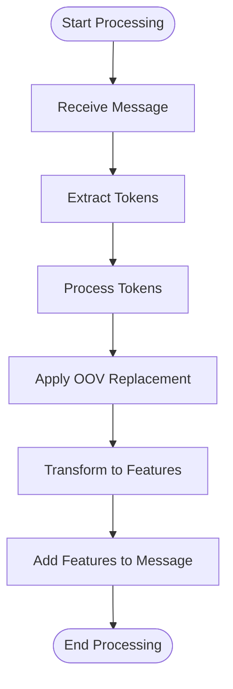

# Featurizers Module Documentation

## Introduction

The Featurizers module is a core component of Rasa's NLU pipeline responsible for converting raw text data into numerical feature representations that machine learning models can process. This module provides the bridge between natural language text and the mathematical representations required by classifiers and extractors in the NLU pipeline.

Featurizers transform text into feature vectors through various techniques including bag-of-words models, word embeddings, and subword tokenization. These features serve as the foundation for downstream NLU tasks such as intent classification, entity extraction, and response selection.

## Architecture Overview

The Featurizers module follows a hierarchical design pattern with clear abstraction layers:



## Core Components

### 1. Featurizer (Abstract Base Class)

The `Featurizer` class serves as the foundation for all featurizers in the system. It provides:

- **Generic Type Support**: Uses Python generics to support different feature types
- **Configuration Management**: Handles component configuration and validation
- **Feature Addition**: Provides standardized methods for adding features to messages
- **Compatibility Checking**: Ensures featurizer configurations are compatible within a pipeline

**Key Responsibilities:**
- Validate featurizer configurations
- Manage featurizer identifiers and aliases
- Add sequence and sentence features to messages
- Ensure compatibility between multiple featurizers

### 2. DenseFeaturizer (Abstract Base Class)

The `DenseFeaturizer` specializes in handling dense numerical representations (typically NumPy arrays). It provides:

- **Pooling Operations**: Supports mean and max pooling for sequence aggregation
- **Feature Aggregation**: Converts sequence features into sentence-level features
- **Dense Array Handling**: Optimized for continuous numerical representations

**Key Features:**
- Mean pooling for averaging sequence features
- Max pooling for extracting maximum activations
- Non-zero vector filtering for efficient processing

### 3. CountVectorsFeaturizer (Concrete Implementation)

The `CountVectorsFeaturizer` is a production-ready implementation that creates sparse bag-of-words features using scikit-learn's CountVectorizer. It supports:

- **Multiple Analysis Modes**: Word-level, character-level, and character n-gram analysis
- **Shared Vocabulary**: Optional vocabulary sharing across different message attributes
- **Out-of-Vocabulary Handling**: Configurable OOV token and word replacement
- **Incremental Training**: Support for fine-tuning and vocabulary expansion

**Advanced Capabilities:**
- Subword semantic hashing via character n-grams
- Configurable n-gram ranges for flexible feature extraction
- Lemma-based token processing when available
- Comprehensive vocabulary management and persistence

## Data Flow Architecture



## Component Interactions

### Pipeline Integration

The Featurizers module integrates with the broader NLU pipeline through well-defined interfaces:



### Dependency Relationships



## Configuration and Usage

### Basic Configuration

The Featurizers module supports extensive configuration options:

```yaml
pipeline:
- name: CountVectorsFeaturizer
  analyzer: word
  min_ngram: 1
  max_ngram: 2
  use_shared_vocab: false
  OOV_token: oov
  OOV_words: ["unknown", "unseen"]
```

### Advanced Configuration

For character-level analysis and subword processing:

```yaml
pipeline:
- name: CountVectorsFeaturizer
  analyzer: char_wb
  min_ngram: 3
  max_ngram: 5
  strip_accents: unicode
  lowercase: true
  max_features: 10000
```

## Process Flow

### Training Process



### Inference Process



## Key Features and Capabilities

### 1. Flexible Analysis Modes
- **Word-level analysis**: Traditional bag-of-words approach
- **Character-level analysis**: Character n-grams for subword processing
- **Character WB analysis**: Word-boundary character n-grams

### 2. Vocabulary Management
- **Shared vocabulary**: Consistent feature space across attributes
- **Independent vocabulary**: Attribute-specific feature spaces
- **Incremental updates**: Vocabulary expansion during fine-tuning

### 3. Text Preprocessing
- **Token normalization**: Lowercase conversion and accent removal
- **Number handling**: Special token replacement for numeric sequences
- **Lemma support**: Optional lemmatization when available

### 4. Out-of-Vocabulary Handling
- **OOV token replacement**: Configurable unknown token handling
- **OOV word lists**: Predefined lists of words to treat as OOV
- **Dynamic OOV detection**: Runtime detection of unseen words

## Integration with Other Modules

The Featurizers module serves as a critical bridge in the Rasa ecosystem:

- **[Tokenizers](Tokenizers.md)**: Provides tokenized input for featurization
- **[Intent Classifiers](Intent_Classifiers.md)**: Consumes features for intent prediction
- **[Entity Extractors](Entity_Extractors.md)**: Uses features for entity recognition
- **[Response Selectors](Response_Selectors.md)**: Leverages features for response selection

## Best Practices

### 1. Configuration Optimization
- Use word-level analysis for most intent classification tasks
- Consider character n-grams for handling typos and morphological variations
- Balance vocabulary size with model complexity

### 2. Vocabulary Management
- Enable shared vocabulary for consistent feature spaces
- Monitor vocabulary growth during incremental training
- Configure appropriate OOV handling for domain-specific terms

### 3. Performance Considerations
- Preprocess training data to reduce vocabulary noise
- Use appropriate n-gram ranges based on task requirements
- Consider memory implications of large vocabularies

## Error Handling and Validation

The module implements comprehensive error handling:

- **Configuration validation**: Ensures compatible featurizer configurations
- **Training data validation**: Verifies sufficient training examples
- **Vocabulary consistency**: Maintains vocabulary integrity across sessions
- **Runtime error handling**: Graceful handling of processing failures

## Conclusion

The Featurizers module provides a robust, flexible foundation for converting natural language text into machine-readable features. Its hierarchical design, extensive configuration options, and seamless integration with the broader Rasa ecosystem make it an essential component for building effective conversational AI systems. The module's support for both traditional bag-of-words approaches and modern subword techniques ensures compatibility with a wide range of NLU tasks and domains.