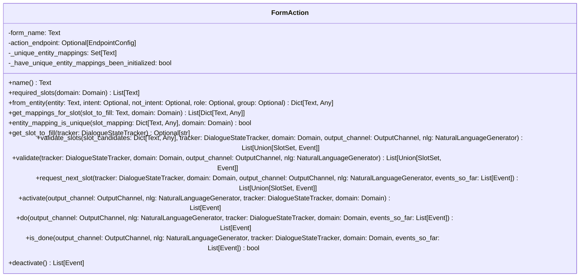
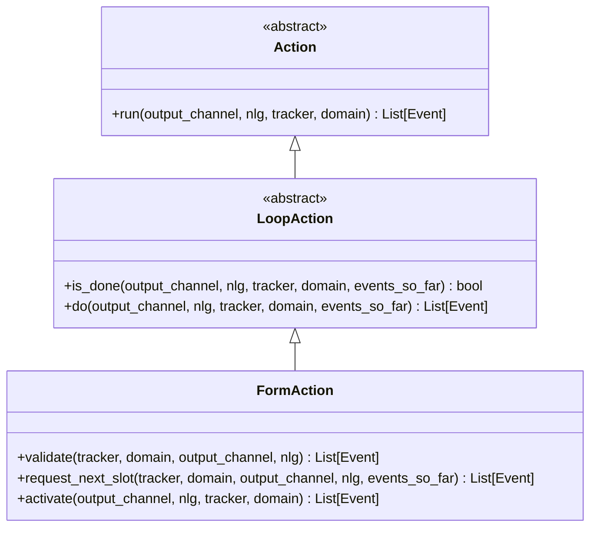
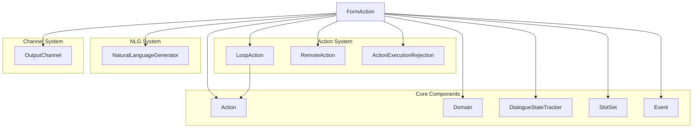
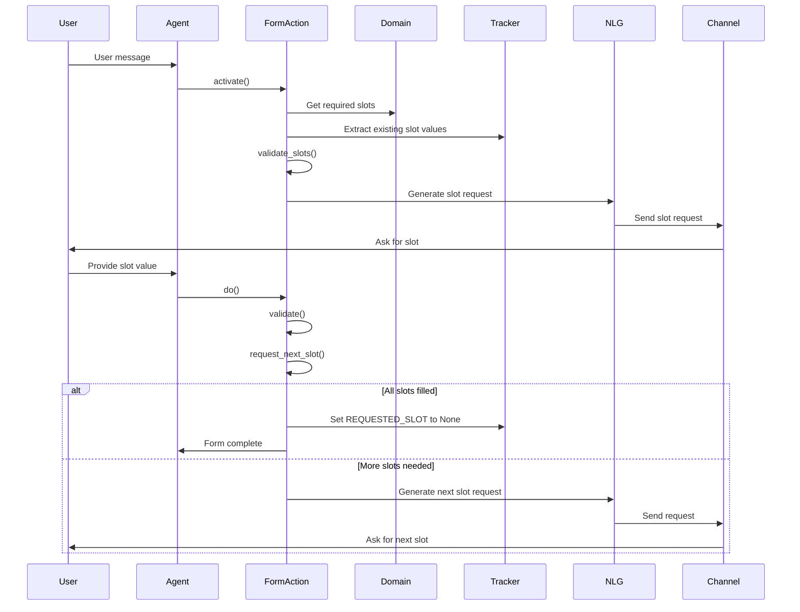
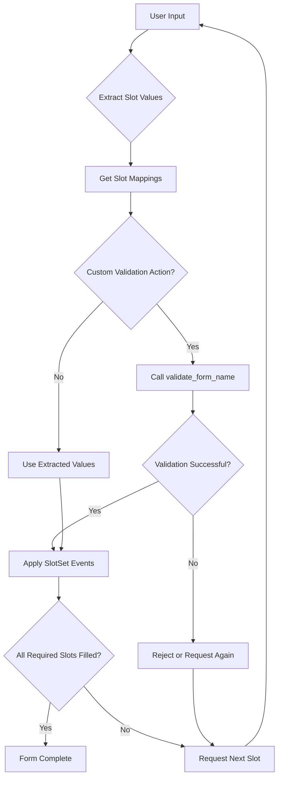
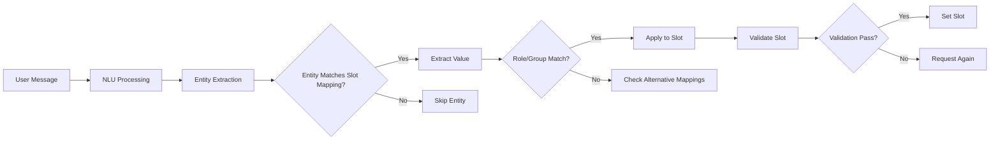

# Form Actions Module Documentation

## Introduction

The Form Actions module provides sophisticated form-filling capabilities within the Rasa dialogue management system. It enables developers to create conversational forms that can collect multiple pieces of information from users through natural dialogue, with support for slot validation, entity extraction, and dynamic form behavior.

## Overview

Form actions are specialized loop actions that implement structured data collection patterns in conversational AI. They extend the base `LoopAction` class to provide iterative slot-filling functionality, allowing bots to gather required information through multi-turn conversations while maintaining context and handling validation errors gracefully.

## Core Architecture

### FormAction Class

The `FormAction` class is the central component of this module, inheriting from `LoopAction` to provide form-specific functionality. It orchestrates the entire form-filling process including activation, slot extraction, validation, and deactivation.



## Component Relationships

### Inheritance Hierarchy



### Module Dependencies



## Data Flow Architecture

### Form Execution Flow



### Slot Validation Process



## Key Features

### Slot Mapping Support

The module supports multiple slot mapping types through the domain configuration:

- **FROM_ENTITY**: Extract slot values from entities
- **FROM_INTENT**: Set slots based on intent classification
- **FROM_TEXT**: Extract from user text input
- **FROM_TRIGGER_INTENT**: Set slots when specific intents trigger the form

### Entity Extraction and Validation



### Dynamic Form Behavior

Forms can adapt their behavior based on:
- **Conditional slot requirements**: Different slots required based on context
- **Dynamic validation**: Custom validation logic per form instance
- **Early termination**: Forms can be terminated early through validation actions
- **Cross-slot validation**: Validation considering multiple slot values

## Integration Points

### Domain Integration

Forms are defined in the domain file with slot mappings and required slots:

```yaml
forms:
  restaurant_form:
    required_slots:
      - cuisine
      - num_people
      - outdoor_seating
    cuisine:
      - type: from_entity
        entity: cuisine
    num_people:
      - type: from_entity
        entity: number
        intent: inform
    outdoor_seating:
      - type: from_intent
        intent: affirm
        value: true
      - type: from_intent
        intent: deny
        value: false
```

### Custom Validation Actions

Developers can create custom validation actions by implementing `validate_{form_name}`:

```python
# validate_restaurant_form would be called automatically
async def validate_restaurant_form(
    slot_dict: Dict,
    dispatcher: CollectingDispatcher,
    tracker: Tracker,
    domain: Domain
) -> List[Event]:
    # Custom validation logic
    return [SlotSet("slot_name", validated_value)]
```

### Tracker Store Integration

Forms maintain state through the [TrackerStore](TrackerStore.md) system, ensuring conversation continuity across sessions.

## Error Handling

### Validation Failures

When slot validation fails, the form can:
- Request the slot again with clarification
- Provide helpful error messages
- Offer alternatives or suggestions
- Defer to other policies through `ActionExecutionRejection`

### Entity Extraction Issues

The module handles cases where:
- No entities are extracted for required slots
- Multiple entities match the same slot mapping
- Entity extraction confidence is low
- Required entities are missing from user input

## Performance Considerations

### Optimization Strategies

1. **Unique Entity Mappings**: The module caches unique entity mappings to avoid redundant processing
2. **Temporary Tracker Creation**: Uses lightweight tracker copies for validation to avoid state pollution
3. **Event Filtering**: Efficiently filters events to process only relevant slot information
4. **Early Termination**: Supports early form termination to reduce unnecessary processing

### Scalability Features

- **Stateless Design**: Form actions don't maintain internal state between executions
- **Event-Driven**: All state changes are captured as events for reliable recovery
- **Parallel Validation**: Custom validation actions can be executed asynchronously
- **Memory Efficient**: Uses generator expressions and efficient data structures

## Testing and Debugging

### Debug Capabilities

The module provides comprehensive logging through:
- `structlog` for structured logging of form execution
- Debug logs for slot extraction and validation
- Event tracing for form lifecycle monitoring
- Entity mapping resolution logging

### Testing Support

Forms can be tested through:
- Unit tests for individual validation methods
- Integration tests with mock trackers and domains
- End-to-end tests using the [Agent](Dialogue_Management_Core.md) system
- Event sequence validation for form completion

## Related Documentation

- [Actions](Actions.md) - General action system documentation
- [Loop Actions](Loop_Actions.md) - Base loop action functionality
- [Domain & Training Data](Domain_Training_Data.md) - Form definition and slot configuration
- [Dialogue Management Core](Dialogue_Management_Core.md) - Core dialogue management system
- [Tracker Store](TrackerStore.md) - Conversation state management
- [NLU Pipeline](NLU_Pipeline.md) - Entity extraction and intent classification