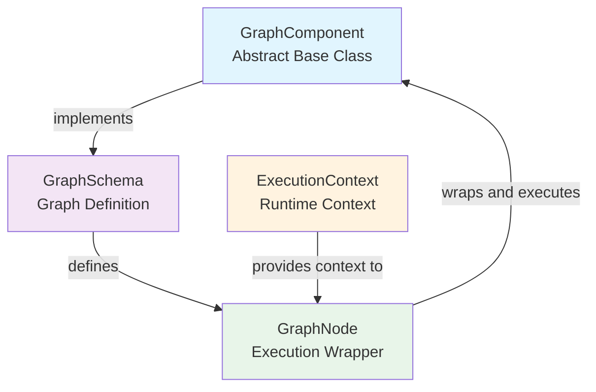
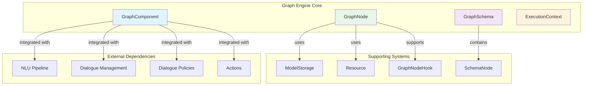
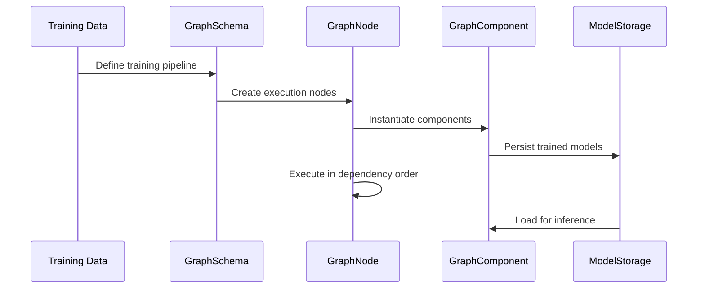
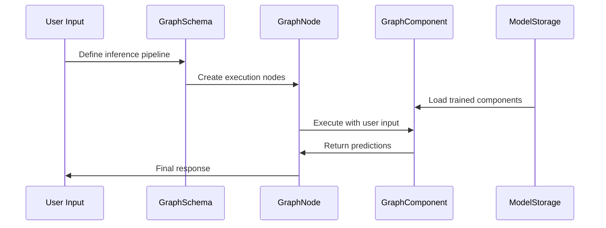
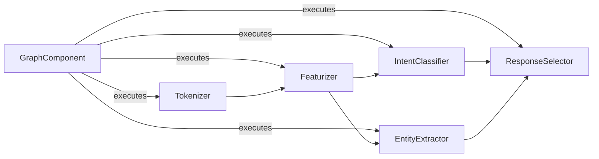
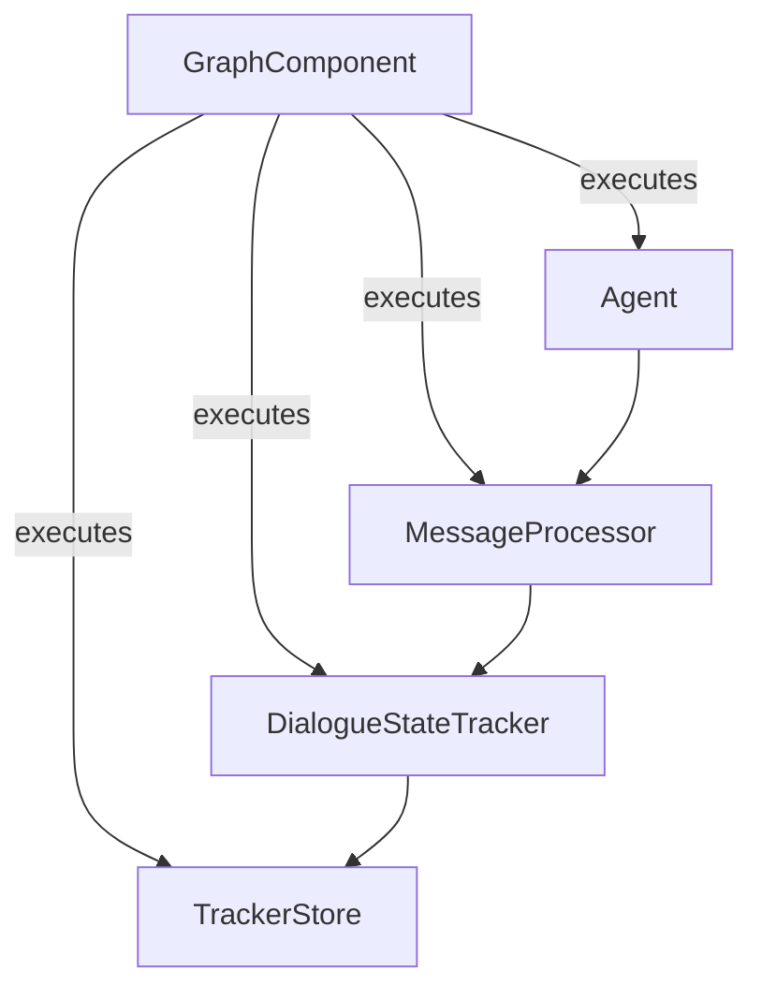
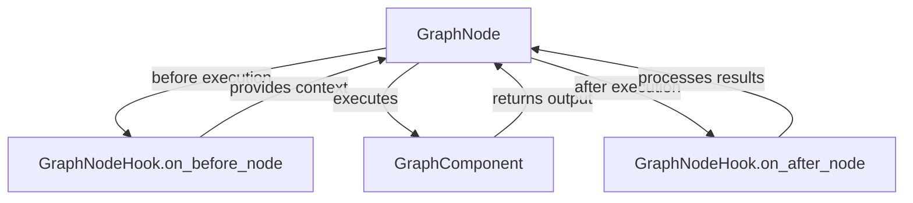
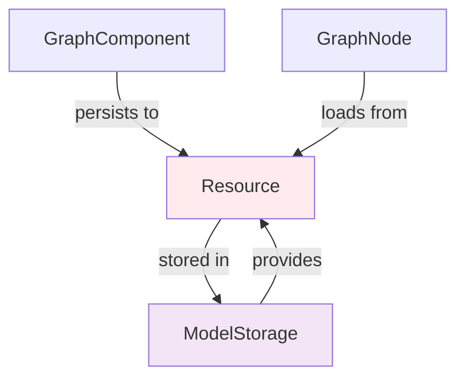
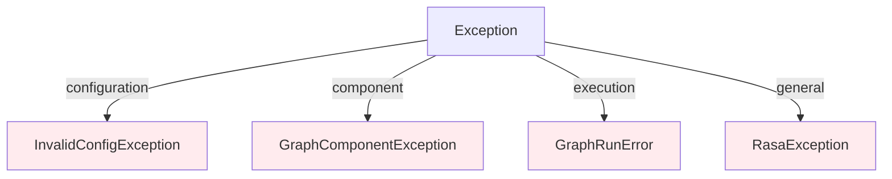

# Graph Engine Core Module

## Introduction

The Graph Engine Core module is the foundational execution framework of Rasa's conversational AI system. It provides a flexible, component-based architecture that enables the orchestration of complex machine learning pipelines through a directed acyclic graph (DAG) structure. This module serves as the backbone for both training and inference workflows, allowing components to be composed, executed, and cached efficiently.

The graph engine represents a paradigm shift from Rasa's previous monolithic architecture to a more modular, scalable system where each component can be independently developed, tested, and optimized while maintaining clear dependencies and execution order.

## Architecture Overview

### Core Components

The Graph Engine Core consists of four fundamental components that work together to provide a robust execution framework:



### System Architecture



## Component Details

### GraphComponent

The `GraphComponent` abstract base class defines the interface that all components in the graph must implement. It provides the foundation for creating reusable, configurable components that can be composed into complex pipelines.

**Key Responsibilities:**
- Component lifecycle management (creation, loading, configuration)
- Dependency declaration through `required_components()`
- Language support specification
- Package requirement definition
- Fingerprinting for caching and change detection

**Core Methods:**
- `create()`: Factory method for component instantiation
- `load()`: Method for loading persisted components
- `get_default_config()`: Provides default configuration parameters
- `supported_languages()` / `not_supported_languages()`: Language compatibility
- `required_packages()`: External dependency declaration

### GraphSchema

The `GraphSchema` class represents the complete structure of the execution graph, defining how components are connected and their execution order. It serves as the blueprint for both training and inference pipelines.

**Key Features:**
- Node definition and configuration storage
- Dependency resolution and validation
- Schema serialization and deserialization
- Target node identification for focused execution
- Minimal schema generation for optimization

**SchemaNode Structure:**
Each node in the schema contains:
- `needs`: Input parameter mapping from parent nodes
- `uses`: Component class to instantiate
- `constructor_name`: Instantiation method
- `fn`: Execution function name
- `config`: User configuration
- `eager`: Instantiation timing control
- `is_target`: Target node designation
- `is_input`: Input node designation
- `resource`: Resource loading specification

### GraphNode

The `GraphNode` class serves as the execution wrapper for GraphComponents, managing their lifecycle within the graph execution context. It handles component instantiation, input collection, execution, and output propagation.

**Execution Flow:**
1. Input validation and collection from parent nodes
2. Component instantiation (if not eager)
3. Pre-execution hook invocation
4. Component method execution
5. Post-execution hook invocation
6. Output propagation to child nodes

**Key Features:**
- Lazy and eager instantiation modes
- Comprehensive error handling and exception wrapping
- Hook system for monitoring and debugging
- Resource management for persistence
- Input validation and parameter mapping

### ExecutionContext

The `ExecutionContext` class provides runtime information to components during graph execution, enabling context-aware behavior and debugging capabilities.

**Context Information:**
- Graph schema reference
- Model identification
- Diagnostic data collection flag
- Fine-tuning mode indicator
- Current node name (set during execution)

## Data Flow Architecture

### Training Flow



### Inference Flow



## Component Integration

### NLU Pipeline Integration

The Graph Engine Core seamlessly integrates with the [NLU Pipeline](NLU%20Pipeline.md) module, providing the execution framework for natural language understanding components:



### Dialogue Management Integration

The graph engine also supports [Dialogue Management Core](Dialogue%20Management%20Core.md) components:



## Hook System

The GraphNodeHook interface enables monitoring, debugging, and extension of graph execution:



**Use Cases for Hooks:**
- Performance monitoring and profiling
- Input/output validation and logging
- Debugging and troubleshooting
- Custom metrics collection
- Execution tracing and visualization

## Resource Management

The graph engine provides sophisticated resource management capabilities through the Resource and ModelStorage systems:



**Resource Lifecycle:**
1. Components persist trained models to resources during training
2. Resources are stored in the model storage system
3. During inference, components load from persisted resources
4. Resource management ensures efficient memory usage and caching

## Configuration and Customization

### Component Configuration

Each GraphComponent supports configuration through a flexible system that merges default configurations with user-specified parameters:

```python
# Default configuration
config = GraphComponent.get_default_config()

# User configuration override
user_config = {"parameter": "value"}

# Merged configuration
final_config = override_defaults(config, user_config)
```

### Schema Customization

Graph schemas can be dynamically modified to support different execution patterns:

- **Target-focused execution**: Execute only nodes required for specific targets
- **Minimal schema generation**: Optimize execution by pruning unnecessary nodes
- **Input node designation**: Ensure critical nodes are always executed
- **Resource-based loading**: Load pre-trained components efficiently

## Error Handling and Resilience

The graph engine implements comprehensive error handling to ensure robust execution:



**Error Handling Strategy:**
- Configuration errors are passed through for granular handling
- Component exceptions are wrapped with context information
- Graph execution errors include dependency information
- Unexpected exceptions are caught and logged with detailed context

## Performance Optimization

### Caching and Fingerprinting

The graph engine supports sophisticated caching mechanisms:

- **Component fingerprinting**: Detect changes in components and their dependencies
- **Resource caching**: Avoid redundant training and loading operations
- **Schema optimization**: Generate minimal execution graphs for specific targets
- **Lazy instantiation**: Defer component creation until necessary

### Execution Optimization

- **Dependency resolution**: Execute independent nodes in parallel where possible
- **Target-focused execution**: Skip unnecessary nodes for specific use cases
- **Resource pre-loading**: Load frequently used resources efficiently
- **Hook overhead minimization**: Optional hook execution based on configuration

## Integration with Other Modules

The Graph Engine Core serves as the foundation for multiple Rasa modules:

- **[NLU Pipeline](NLU%20Pipeline.md)**: Executes natural language understanding components
- **[Dialogue Management Core](Dialogue%20Management%20Core.md)**: Orchestrates dialogue state management
- **[Dialogue Policies](Dialogue%20Policies.md)**: Executes policy decision-making components
- **[Actions](Actions.md)**: Manages action execution within the dialogue flow
- **[Domain & Training Data](Domain%20&%20Training%20Data.md)**: Provides data structures for component configuration

## Best Practices

### Component Development

1. **Implement proper configuration**: Provide sensible defaults and validation
2. **Handle resource management**: Implement persistence and loading capabilities
3. **Support language compatibility**: Specify supported languages explicitly
4. **Declare dependencies**: Use `required_components()` for dependency management
5. **Implement fingerprinting**: Enable efficient caching and change detection

### Schema Design

1. **Minimize dependencies**: Reduce coupling between components
2. **Use target nodes**: Enable focused execution for specific use cases
3. **Leverage eager instantiation**: Balance memory usage and execution speed
4. **Implement proper input validation**: Ensure robust error handling
5. **Consider resource usage**: Optimize for both training and inference

### Performance Optimization

1. **Enable caching**: Use fingerprinting to avoid redundant operations
2. **Optimize schema execution**: Generate minimal graphs for specific targets
3. **Monitor execution**: Use hooks for performance analysis
4. **Balance lazy/eager loading**: Choose based on usage patterns
5. **Profile resource usage**: Monitor memory and storage consumption

## Future Enhancements

The Graph Engine Core architecture supports several potential enhancements:

- **Distributed execution**: Support for multi-node graph execution
- **Dynamic schema modification**: Runtime graph structure changes
- **Advanced caching strategies**: Machine learning-based cache optimization
- **Component versioning**: Support for multiple component versions
- **Execution visualization**: Real-time graph execution monitoring
- **Automated optimization**: AI-driven schema optimization

## Conclusion

The Graph Engine Core module represents a fundamental architectural advancement in Rasa's conversational AI platform. By providing a flexible, component-based execution framework, it enables the creation of sophisticated, scalable dialogue systems while maintaining clear separation of concerns and supporting extensive customization. The graph-based approach facilitates both development and deployment optimization, making it easier to build, maintain, and scale conversational AI applications.