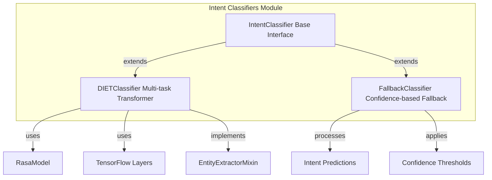
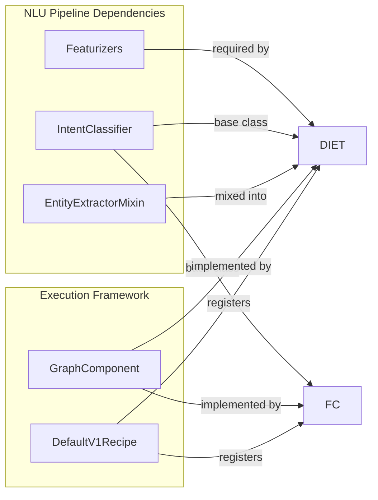
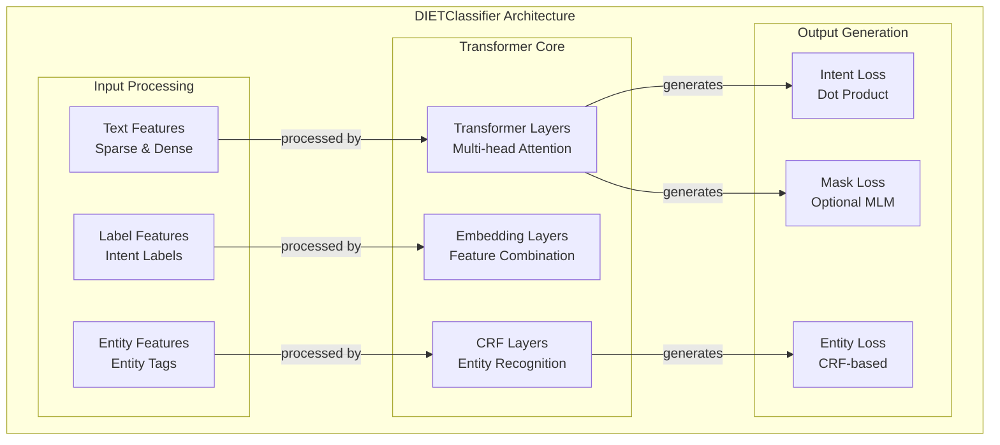
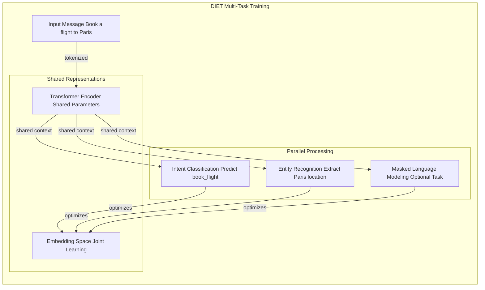
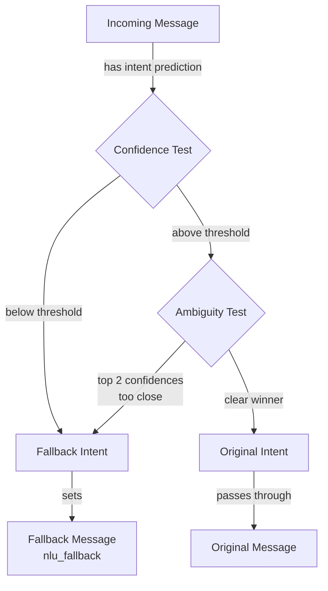
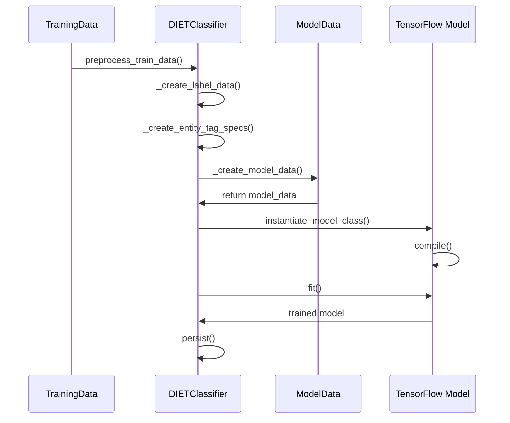
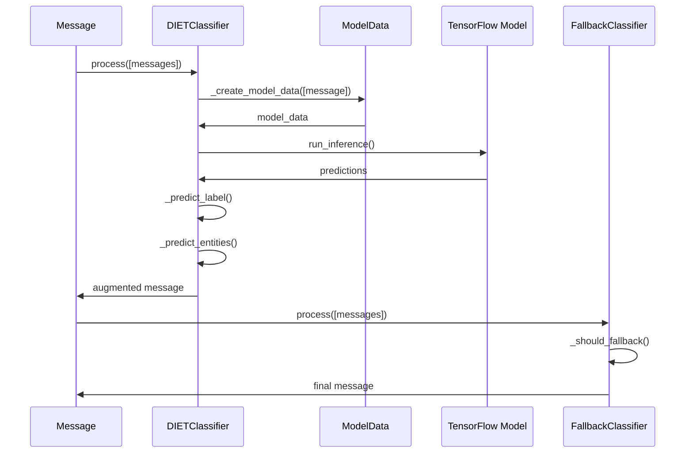
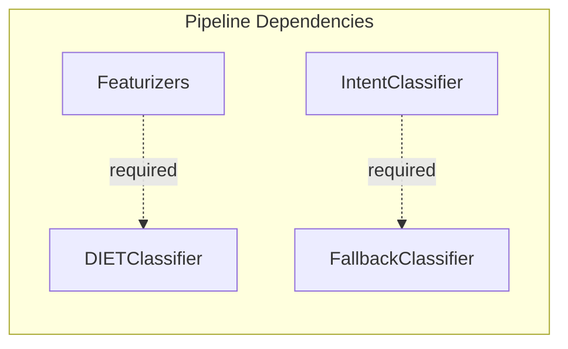

# Intent Classifiers Module

## Introduction

The Intent Classifiers module is a core component of Rasa's NLU (Natural Language Understanding) pipeline, responsible for analyzing user messages and predicting their underlying intent. This module provides the intelligence that enables conversational AI systems to understand what users want to achieve through their messages.

Intent classification is a fundamental task in conversational AI that transforms raw user input into structured intent predictions, complete with confidence scores and rankings. The module supports multiple classification strategies, from transformer-based models to fallback mechanisms, ensuring robust and reliable intent recognition across diverse conversational scenarios.

## Module Architecture

### Core Components Overview

The Intent Classifiers module consists of three primary components that work together to provide comprehensive intent classification capabilities:



### Component Relationships



## Component Deep Dive

### IntentClassifier - Base Interface

The `IntentClassifier` serves as the foundational interface for all intent classification components in Rasa. While minimal in implementation, it establishes the contract that all intent classifiers must fulfill within the NLU pipeline.

**Key Characteristics:**
- Abstract base class defining the intent classifier interface
- Provides structural foundation for concrete implementations
- Integrates with Rasa's component architecture through inheritance

### DIETClassifier - Multi-Task Transformer

The `DIETClassifier` (Dual Intent and Entity Transformer) represents the most sophisticated intent classification component in Rasa, implementing a multi-task learning approach that simultaneously handles intent classification and entity recognition.

#### Architecture Overview



#### Multi-Task Learning Capabilities



#### Key Features and Configuration

The DIETClassifier offers extensive configuration options to adapt to different use cases:

**Architecture Parameters:**
- `transformer_size`: Controls the dimensionality of transformer layers
- `num_transformer_layers`: Determines the depth of the transformer encoder
- `num_heads`: Configures multi-head attention mechanisms
- `hidden_layers_sizes`: Defines feed-forward network dimensions

**Training Configuration:**
- `epochs`: Number of training iterations (default: 300)
- `batch_sizes`: Dynamic batch sizing for efficient training
- `learning_rate`: Optimization learning rate
- `loss_type`: Choice between cross-entropy and margin-based losses

**Multi-Task Control:**
- `intent_classification`: Enable/disable intent prediction
- `entity_recognition`: Enable/disable entity extraction
- `masked_lm`: Optional masked language modeling

#### Advanced Capabilities

**Feature Processing:**
- Handles both sparse and dense feature representations
- Supports multiple featurizer inputs through configurable selection
- Implements sophisticated feature combination strategies

**Entity Recognition Integration:**
- Uses Conditional Random Fields (CRF) for sequence labeling
- Supports BILOU tagging scheme for entity boundaries
- Handles entity roles, groups, and types separately

**Training Optimizations:**
- Implements balanced batching strategies
- Supports incremental training and fine-tuning
- Includes comprehensive validation and checkpointing

### FallbackClassifier - Confidence-Based Safety Net

The `FallbackClassifier` provides a crucial safety mechanism for handling uncertain predictions, ensuring that the conversational AI can gracefully handle ambiguous or unclear user input.

#### Fallback Logic



#### Configuration Parameters

**Threshold-Based Fallback:**
- `threshold`: Minimum confidence required for intent acceptance
- `ambiguity_threshold`: Maximum allowed difference between top two predictions

**Fallback Behavior:**
- Replaces uncertain predictions with `nlu_fallback` intent
- Maintains original confidence structure
- Provides detailed logging for debugging

## Data Flow and Processing Pipeline

### Training Data Flow



### Inference Data Flow



## Integration with NLU Pipeline

### Required Dependencies



### Component Registration

Both classifiers integrate with Rasa's execution framework through the `DefaultV1Recipe`:

- **DIETClassifier**: Registered as both `INTENT_CLASSIFIER` and `ENTITY_EXTRACTOR` with trainable capability
- **FallbackClassifier**: Registered as `INTENT_CLASSIFIER` without training requirements

## Advanced Features and Capabilities

### Multi-Language Support

The DIETClassifier handles multiple languages through:
- Language-agnostic transformer architectures
- Configurable tokenization strategies
- Cross-lingual transfer learning capabilities

### Incremental Learning

Supports continuous improvement through:
- Fine-tuning mode for existing models
- Dynamic vocabulary expansion
- Progressive training data integration

### Diagnostic and Monitoring

Provides comprehensive insights through:
- Attention weight visualization
- Training metric logging
- Prediction confidence tracking
- Model checkpointing and recovery

## Configuration Examples

### Basic Intent Classification

```yaml
pipeline:
- name: "DIETClassifier"
  epochs: 100
  transformer_size: 256
  num_transformer_layers: 2
```

### Multi-Task Configuration

```yaml
pipeline:
- name: "DIETClassifier"
  epochs: 200
  intent_classification: true
  entity_recognition: true
  masked_lm: false
  num_heads: 4
  hidden_layers_sizes:
    text: [512, 256]
    label: [256, 128]
```

### Fallback Configuration

```yaml
pipeline:
- name: "DIETClassifier"
  epochs: 100
- name: "FallbackClassifier"
  threshold: 0.3
  ambiguity_threshold: 0.1
```

## Performance Considerations

### Training Optimization

- **Batch Strategy**: Balanced batching improves convergence
- **Feature Selection**: Configurable featurizer selection reduces noise
- **Regularization**: Multiple dropout and regularization options
- **Early Stopping**: Validation-based training termination

### Inference Optimization

- **Model Pruning**: Connection density controls for efficient inference
- **Batch Processing**: Efficient batch prediction capabilities
- **Caching**: Label embedding pre-computation for faster inference

## Error Handling and Robustness

### Training Error Handling

- Insufficient training data detection
- Configuration parameter validation
- Model architecture consistency checks
- Graceful degradation for missing features

### Runtime Error Handling

- Missing model fallback behavior
- Feature extraction error recovery
- Prediction confidence validation
- Entity annotation consistency checks

## Best Practices and Recommendations

### Training Data Preparation

1. **Balanced Dataset**: Ensure adequate representation of all intents
2. **Entity Annotation**: Consistent entity labeling for multi-task learning
3. **Feature Engineering**: Appropriate featurizer selection and configuration
4. **Validation Split**: Hold-out validation for model selection

### Model Configuration

1. **Architecture Tuning**: Match model complexity to data size
2. **Regularization**: Apply appropriate dropout and regularization
3. **Training Schedule**: Configure epochs and learning rate appropriately
4. **Multi-Task Balance**: Balance intent and entity task importance

### Production Deployment

1. **Fallback Integration**: Always include fallback classifier for robustness
2. **Confidence Calibration**: Monitor and adjust confidence thresholds
3. **Model Monitoring**: Track prediction quality and drift
4. **Incremental Updates**: Plan for continuous model improvement

## Related Documentation

- [Featurizers](Featurizers.md) - Feature extraction components that provide input to classifiers
- [Entity Extractors](Entity%20Extractors.md) - Entity recognition components that work with DIET
- [NLU Training Data Structures](Domain%20&%20Training%20Data.md#nlu-training-data-structures) - Training data format and structure
- [Execution Engine & Graph Components](Execution%20Engine%20&%20Graph%20Components.md) - Framework for component execution
- [TensorFlow Model Components](TensorFlow%20Model%20Components.md) - Underlying model architecture components