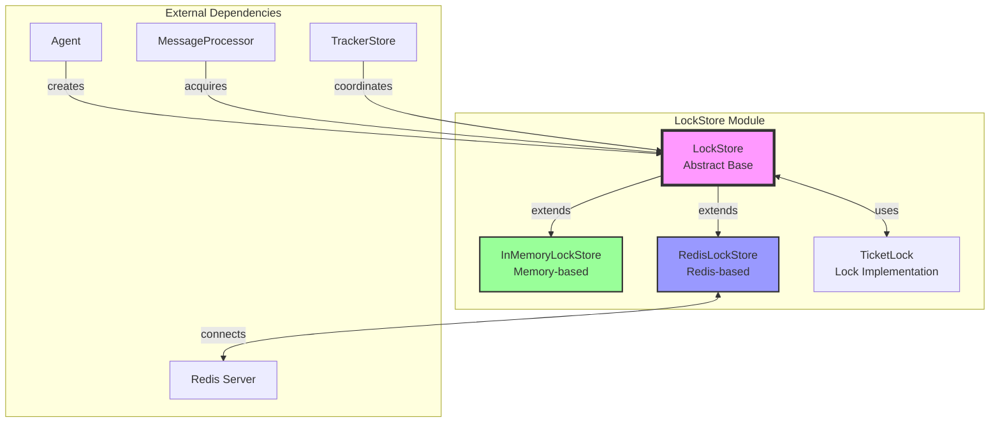
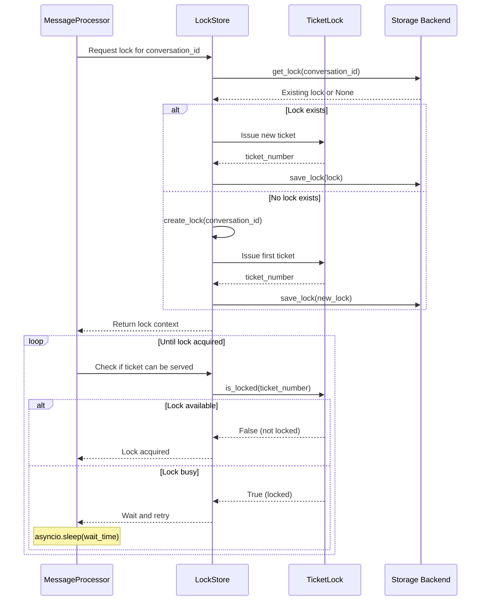
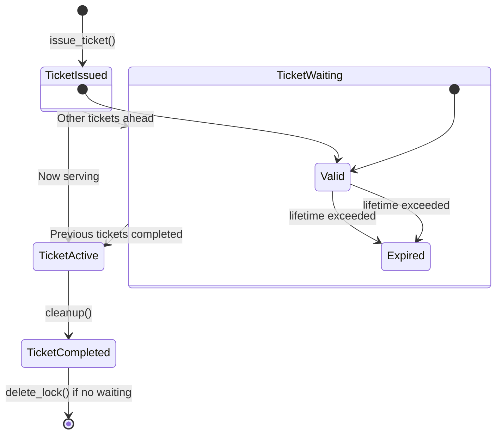
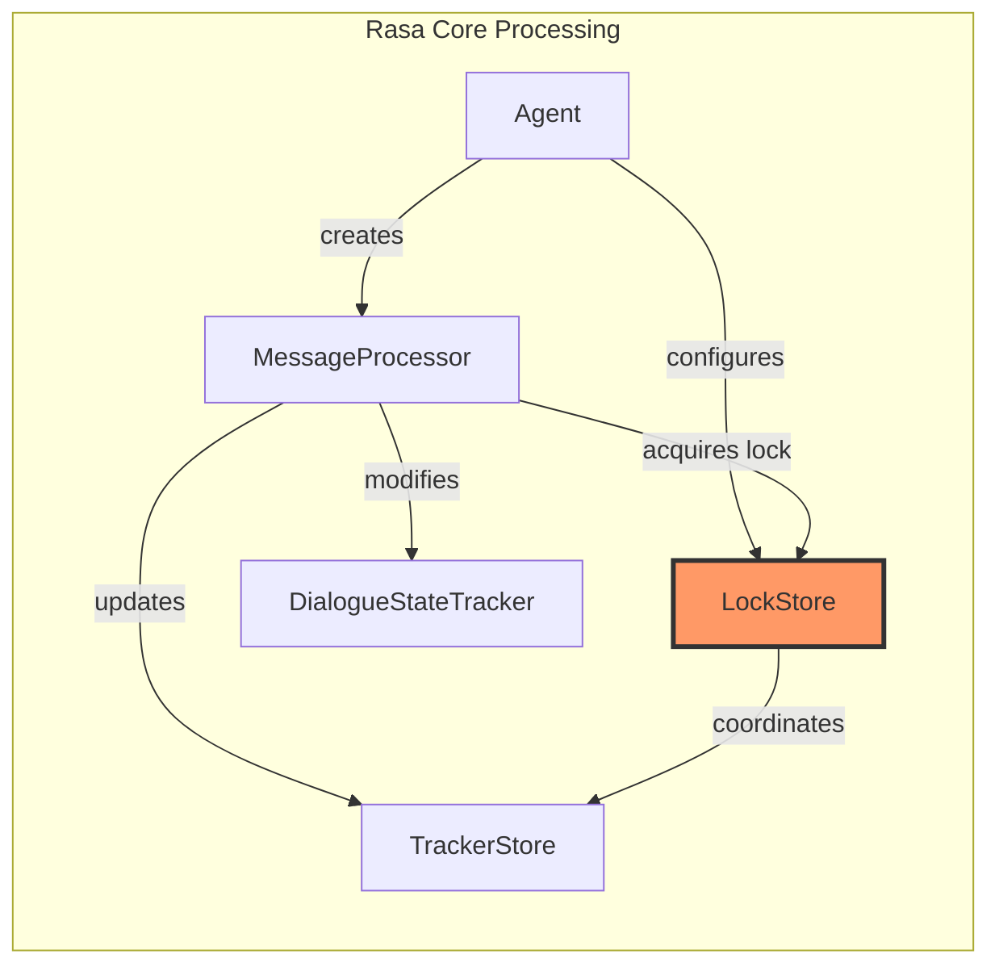

# LockStore Module Documentation

## Introduction

The LockStore module is a critical component of Rasa's dialogue management system that provides distributed locking mechanisms to ensure thread-safe and process-safe handling of conversation state. It prevents race conditions when multiple requests attempt to modify the same conversation simultaneously, which is essential for maintaining conversation integrity in multi-server deployments and concurrent processing scenarios.

The module implements a ticket-based locking algorithm that manages access to conversation IDs, ensuring that only one process can modify a conversation at any given time while allowing other processes to queue and wait for their turn.

## Architecture Overview

### Core Components

The LockStore module consists of three main components:

1. **LockStore** - Abstract base class defining the locking interface
2. **InMemoryLockStore** - In-memory implementation for single-instance deployments
3. **RedisLockStore** - Redis-backed implementation for distributed deployments

### System Architecture



## Component Details

### LockStore (Abstract Base Class)

The `LockStore` class serves as the foundation for all lock store implementations. It defines the contract for ticket-based locking operations and provides common functionality for lock management.

#### Key Responsibilities:
- **Lock Creation**: Creates new `TicketLock` instances for conversation IDs
- **Ticket Management**: Issues tickets and manages their lifecycle
- **Lock Acquisition**: Provides async context manager for acquiring locks
- **Cleanup**: Handles lock cleanup and expiration

#### Core Methods:

```python
# Factory method for creating lock store instances
LockStore.create(obj: Union[LockStore, EndpointConfig, None]) -> LockStore

# Ticket management
issue_ticket(conversation_id: Text, lock_lifetime: float) -> int

# Lock acquisition with async context manager
lock(conversation_id: Text, lock_lifetime: float, wait_time_in_seconds: float) -> AsyncGenerator[TicketLock, None]

# Lock persistence operations
get_lock(conversation_id: Text) -> Optional[TicketLock]
save_lock(lock: TicketLock) -> None
delete_lock(conversation_id: Text) -> None
```

### InMemoryLockStore

The `InMemoryLockStore` provides a lightweight, single-instance implementation suitable for development and testing environments. It stores all locks in a Python dictionary, making it fast but not suitable for distributed deployments.

#### Characteristics:
- **Storage**: Python dictionary in memory
- **Performance**: Fast access, no network overhead
- **Scalability**: Limited to single instance
- **Use Case**: Development, testing, single-server deployments

#### Implementation:
```python
class InMemoryLockStore(LockStore):
    def __init__(self) -> None:
        self.conversation_locks: Dict[Text, TicketLock] = {}
```

### RedisLockStore

The `RedisLockStore` provides a distributed locking solution using Redis as the backend storage. This enables multiple Rasa instances to coordinate locks across a cluster, making it suitable for production deployments.

#### Characteristics:
- **Storage**: Redis server
- **Performance**: Network overhead, but scalable
- **Scalability**: Supports multiple Rasa instances
- **Use Case**: Production, multi-server deployments

#### Configuration Options:
```python
RedisLockStore(
    host: Text = "localhost",
    port: int = 6379,
    db: int = 1,
    username: Optional[Text] = None,
    password: Optional[Text] = None,
    use_ssl: bool = False,
    key_prefix: Optional[Text] = None,
    socket_timeout: float = 10
)
```

## Data Flow and Process Flow

### Lock Acquisition Process



### Ticket Lifecycle



## Integration with Rasa Core

### Relationship with Agent and MessageProcessor

The LockStore is integrated into Rasa's core processing pipeline through the [Agent](Agent.md) and [MessageProcessor](MessageProcessor.md) components:



### Configuration and Usage

The LockStore is configured through Rasa's endpoint configuration:

```yaml
# endpoints.yml
lock_store:
  type: redis
  url: localhost
  port: 6379
  db: 1
  password: ${REDIS_PASSWORD}
  key_prefix: rasa
```

Or for in-memory usage:

```yaml
lock_store:
  type: in_memory
```

## Error Handling and Exception Management

### LockError Exception

The module defines a `LockError` exception that is raised when lock acquisition fails:

```python
class LockError(RasaException):
    """Exception that is raised when a lock cannot be acquired."""
    pass
```

### Common Error Scenarios:

1. **Lock Timeout**: When a lock cannot be acquired within the expected timeframe
2. **Connection Issues**: When Redis is unavailable (for RedisLockStore)
3. **Expired Tickets**: When tickets expire before being served
4. **Storage Failures**: When lock persistence operations fail

## Performance Considerations

### InMemoryLockStore Performance
- **Pros**: No network overhead, immediate access, minimal latency
- **Cons**: Not suitable for distributed deployments, memory usage grows with conversations

### RedisLockStore Performance
- **Pros**: Distributed coordination, persistent storage, scalable
- **Cons**: Network latency, Redis server dependency, serialization overhead

### Optimization Strategies:
1. **Lock Lifetime Tuning**: Adjust `LOCK_LIFETIME` based on processing time
2. **Wait Time Configuration**: Balance between responsiveness and CPU usage
3. **Redis Connection Pooling**: Use connection pooling for better Redis performance
4. **Key Prefix Optimization**: Use meaningful key prefixes for better organization

## Security Considerations

### Redis Security
- **Authentication**: Use username/password authentication for Redis
- **SSL/TLS**: Enable SSL for encrypted communication
- **Network Security**: Secure Redis server behind firewall
- **Access Control**: Limit Redis access to Rasa instances only

### Lock Store Security
- **Key Prefix Validation**: Ensure alphanumeric key prefixes
- **Input Validation**: Validate conversation IDs
- **Timeout Configuration**: Set appropriate socket timeouts

## Testing and Development

### Unit Testing
The LockStore module can be tested using both implementations:

```python
# Test with InMemoryLockStore for unit tests
lock_store = InMemoryLockStore()

# Test with RedisLockStore for integration tests
lock_store = RedisLockStore(host="localhost", port=6379)
```

### Mock Testing
Use async context managers for testing lock acquisition:

```python
async with lock_store.lock("test_conversation") as lock:
    # Perform operations under lock
    assert lock.conversation_id == "test_conversation"
```

## Migration and Deployment

### From InMemory to Redis
1. Update endpoint configuration
2. Ensure Redis server is available
3. Test lock acquisition in staging environment
4. Monitor performance and adjust timeouts

### Production Deployment Checklist
- [ ] Redis server configured with high availability
- [ ] Appropriate lock lifetime configured
- [ ] SSL/TLS enabled for Redis connections
- [ ] Monitoring and alerting configured
- [ ] Backup strategy for Redis data
- [ ] Performance testing completed

## Related Documentation

- [Agent](Agent.md) - Core agent that uses LockStore for conversation management
- [MessageProcessor](MessageProcessor.md) - Processes messages with lock acquisition
- [TrackerStore](TrackerStore.md) - Coordinates with LockStore for conversation state
- [DialogueStateTracker](DialogueStateTracker.md) - Conversation state managed under locks

## References

- [Rasa Documentation - Lock Stores](https://rasa.com/docs/rasa/lock-stores)
- [Redis Documentation](https://redis.io/documentation)
- [Ticket Lock Algorithm](http://pages.cs.wisc.edu/~remzi/OSTEP/threads-locks.pdf)