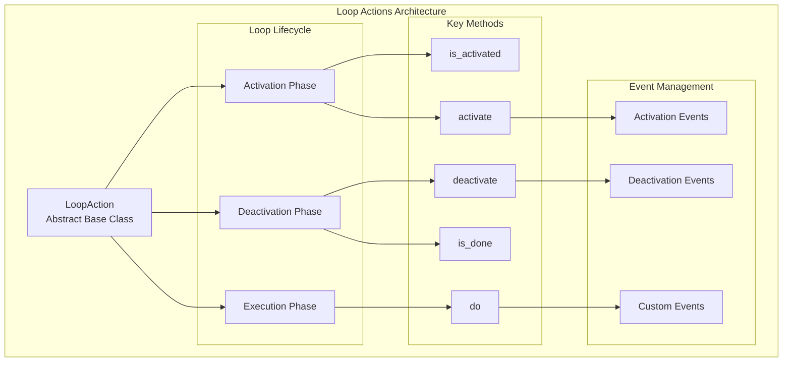
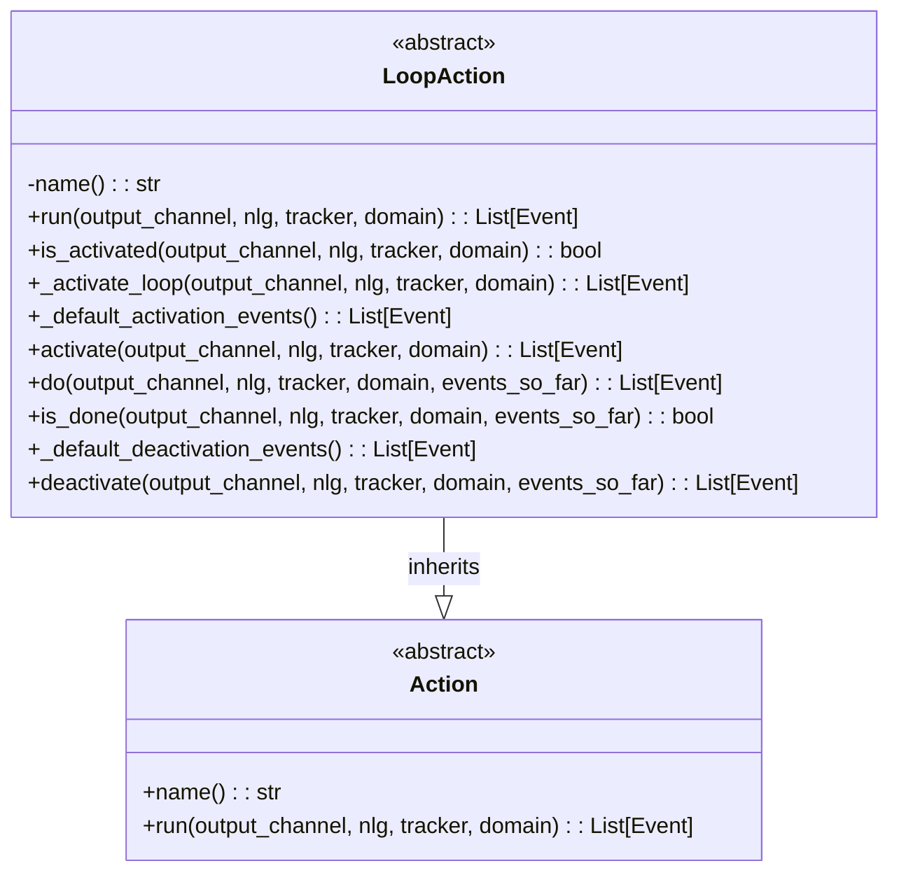
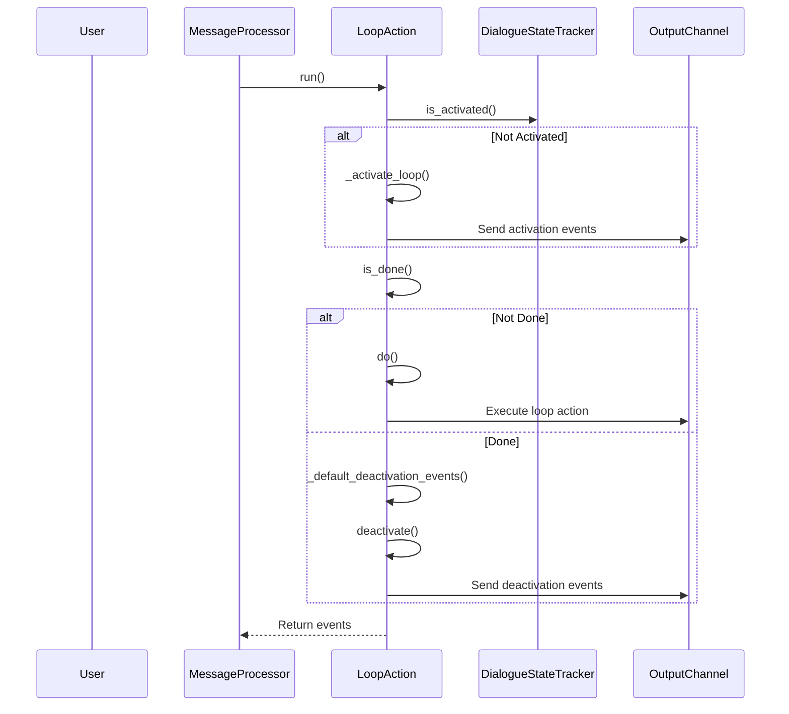
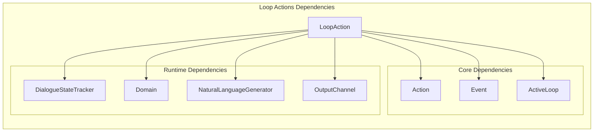
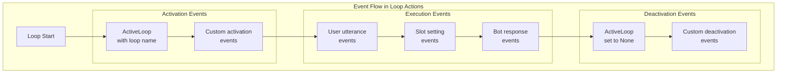
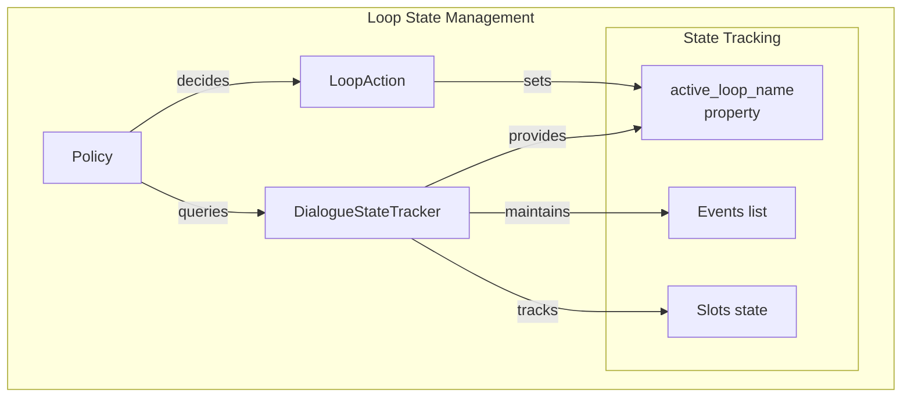

# Loop Actions Module Documentation

## Introduction

The Loop Actions module provides the foundational framework for implementing conversational loops in Rasa's dialogue management system. Loop actions are specialized actions that can maintain state across multiple conversation turns, enabling complex multi-step interactions like form filling, data collection, and iterative processes. This module defines the abstract base class `LoopAction` that serves as the blueprint for all loop-based conversational patterns in Rasa.

## Architecture Overview

The Loop Actions module is built around a state machine pattern that manages the lifecycle of conversational loops through distinct phases: activation, execution, and deactivation. The architecture provides a flexible framework for implementing various loop patterns while maintaining consistency with Rasa's action execution model.

## Core Components

### LoopAction Class

The `LoopAction` class is an abstract base class that extends the base `Action` class to provide loop functionality. It implements a sophisticated state management system that tracks whether a loop is active and manages the transition between different loop states.

## Loop Lifecycle Management

The loop lifecycle is managed through a well-defined sequence of method calls that determine the current state of the loop and appropriate next actions:

## Dependencies and Integration

The Loop Actions module integrates with several key components of the Rasa architecture:

## Key Methods and Functionality

### run() Method
The main entry point that orchestrates the entire loop lifecycle. It checks activation status, executes the loop body if needed, and handles deactivation when the loop is complete.

### is_activated() Method
Determines whether the loop is currently active by checking the tracker's active loop state. This method provides the default activation logic but can be overridden for custom activation conditions.

### do() Method
The abstract method that must be implemented by concrete loop actions. This method contains the core logic executed during each iteration of the loop.

### is_done() Method
An abstract method that determines when the loop should terminate. Concrete implementations define their own completion criteria.

### activate() and deactivate() Methods
Hook methods that can be overridden to provide custom logic during loop activation and deactivation phases.

## Event Management

Loop actions manage events through a structured approach that ensures proper state tracking:

## Integration with Dialogue Management

Loop actions integrate seamlessly with Rasa's dialogue management system through the `DialogueStateTracker`, which maintains the active loop state across conversation turns:

## Common Use Cases

Loop actions are particularly useful for implementing:

1. **Form Actions**: Multi-step data collection processes that require validation and slot filling
2. **Question-Answer Loops**: Iterative information gathering or clarification sequences
3. **Confirmation Loops**: Multi-turn confirmation processes with fallback mechanisms
4. **Data Collection Workflows**: Structured information gathering with validation steps

## Extension Points

The `LoopAction` class provides several extension points for custom implementations:

- **Custom Activation Logic**: Override `is_activated()` for non-standard activation conditions
- **Activation/Deactivation Hooks**: Override `activate()` and `deactivate()` for setup/cleanup logic
- **Loop Body Implementation**: Implement `do()` with custom loop execution logic
- **Completion Criteria**: Implement `is_done()` with domain-specific completion conditions

## Best Practices

When implementing custom loop actions, consider the following best practices:

1. **State Management**: Always check the tracker's active loop state to ensure proper loop continuation
2. **Event Consistency**: Ensure events are properly ordered and complete for reliable loop behavior
3. **Error Handling**: Implement robust error handling within the `do()` method to prevent loop breakage
4. **Completion Criteria**: Define clear, testable completion conditions in the `is_done()` method
5. **Resource Cleanup**: Use the `deactivate()` method to clean up any resources or state

## Relationship to Other Modules

The Loop Actions module serves as a foundation for more specialized action types:

- **[Form Actions](Form_Actions.md)**: Extends loop actions for structured form filling
- **[Fallback Actions](Fallback_Actions.md)**: Uses loop patterns for multi-turn fallback handling
- **[Built-in Actions](Built-in_Actions.md)**: Some built-in actions use loop patterns for complex behaviors

This modular approach allows Rasa to provide sophisticated conversational patterns while maintaining a clean, extensible architecture.

## References

- [Actions.md](Actions.md) - Base action framework
- [Domain & Training Data.md](Domain%20&%20Training%20Data.md) - Domain model and event system
- [Dialogue Management Core.md](Dialogue%20Management%20Core.md) - Tracker and dialogue state management
- [NLG.md](NLG.md) - Natural language generation
- [Communication Channels.md](Communication%20Channels.md) - Output channel interfaces
- [Form_Actions.md](Form_Actions.md) - Form-based loop implementations
- [Fallback_Actions.md](Fallback_Actions.md) - Fallback loop patterns
- [Built-in_Actions.md](Built-in_Actions.md) - Built-in action implementations