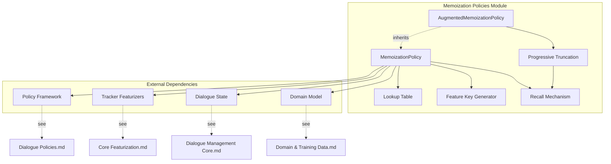
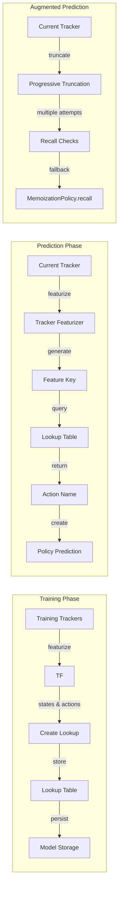
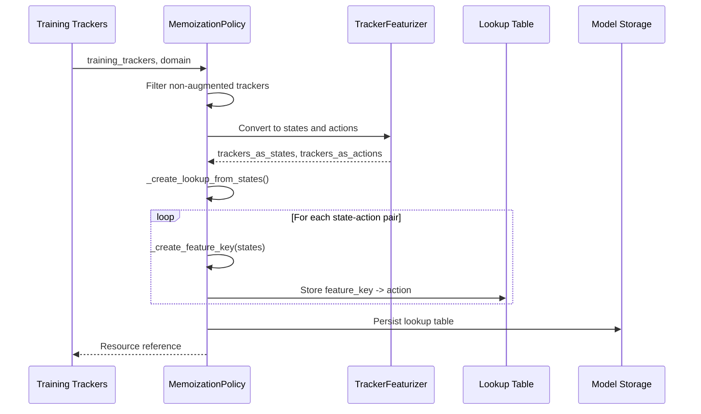
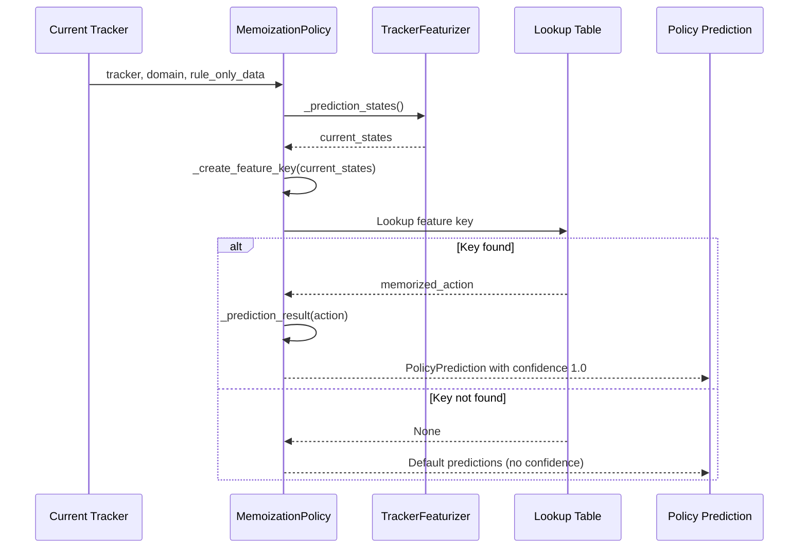
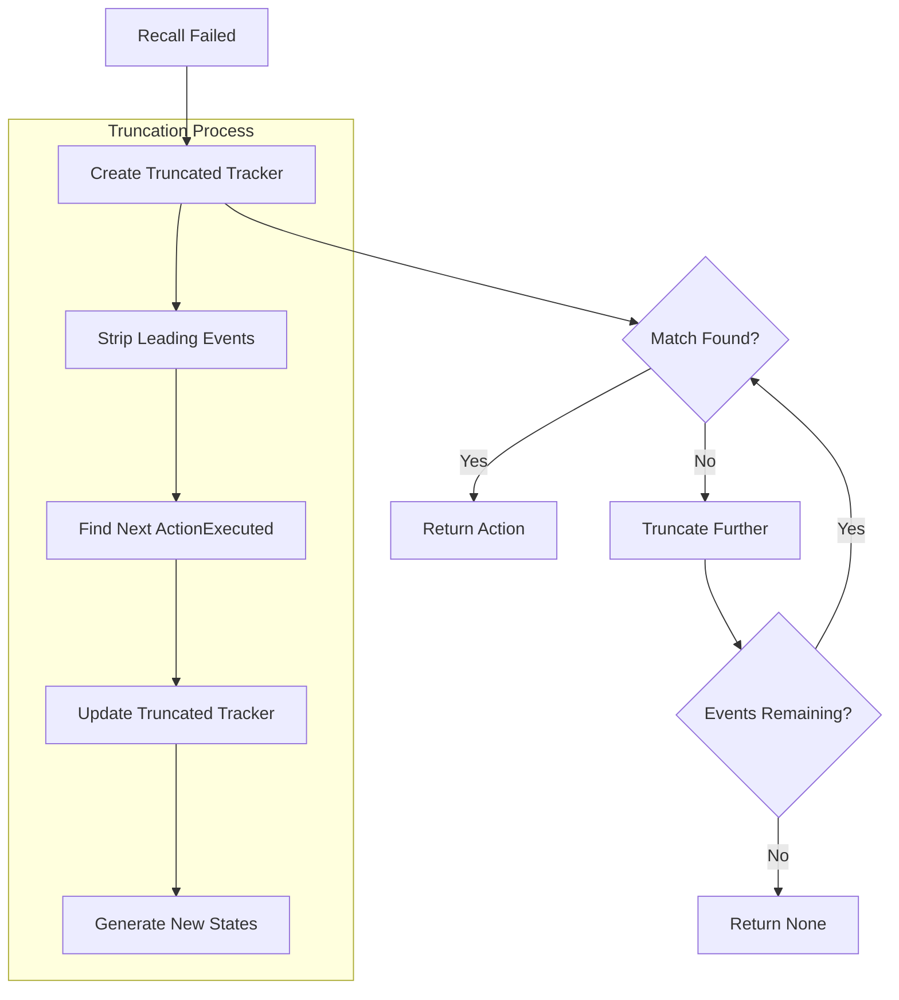
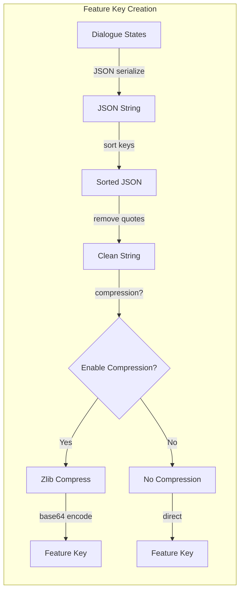
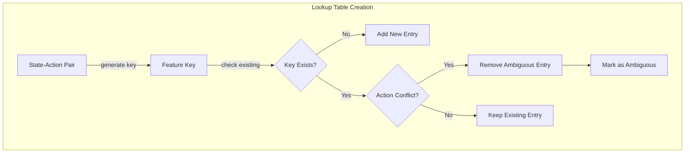
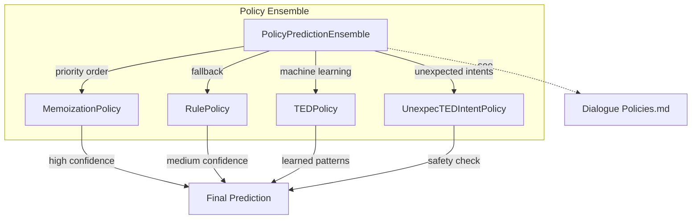
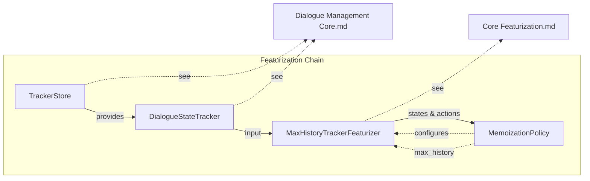

# Memoization Policies Module Documentation

## Introduction

The Memoization Policies module provides deterministic dialogue management capabilities for Rasa's conversational AI framework. This module implements policies that memorize exact conversation patterns from training data and reproduce them during prediction, ensuring consistent and predictable behavior for known dialogue flows.

The module consists of two main components: `MemoizationPolicy` for exact pattern matching and `AugmentedMemoizationPolicy` for enhanced recall with progressive truncation capabilities. These policies serve as the foundation for rule-based behavior in Rasa's dialogue management system, providing high-precision predictions for scenarios that match training examples exactly.

## Architecture Overview

### Core Components



### Component Relationships



## Detailed Component Analysis

### MemoizationPolicy

The `MemoizationPolicy` is the foundational class that implements exact pattern matching for dialogue management. It operates by memorizing complete conversation sequences from training data and reproducing the exact actions when identical patterns are encountered during prediction.

#### Key Features:
- **Exact Pattern Matching**: Only predicts when the current dialogue state exactly matches a memorized pattern
- **High Precision**: Achieves 100% precision on matching patterns by emitting confidence scores of 1.0
- **Configurable History**: Uses `max_history` parameter to control the number of dialogue turns considered
- **Feature Compression**: Optional compression of feature representations for efficient storage

#### Training Process:


#### Prediction Process:


### AugmentedMemoizationPolicy

The `AugmentedMemoizationPolicy` extends the base `MemoizationPolicy` with sophisticated fallback mechanisms for improved recall. When exact pattern matching fails, it employs progressive truncation to find partial matches by removing older events from the dialogue history.

#### Enhanced Features:
- **Progressive Truncation**: Iteratively removes events from tracker history to find partial matches
- **Back-to-the-Future Logic**: Attempts multiple historical perspectives of the same conversation
- **Fallback Chain**: Falls back from exact matching to progressively shorter history segments

#### Progressive Truncation Algorithm:


## Data Flow and Processing

### Feature Key Generation

The feature key generation process creates unique identifiers for dialogue states:



### Lookup Table Management

The lookup table stores state-action mappings with conflict resolution:



## Integration with Rasa Architecture

### Policy Ensemble Integration

Memoization policies integrate with the broader policy ensemble:



### Tracker Featurizer Dependency

Memoization policies rely on tracker featurizers for state representation:



## Configuration and Usage

### Default Configuration

```python
{
    "enable_feature_string_compression": True,
    "use_nlu_confidence_as_score": False,
    "priority": 3,  # MEMOIZATION_POLICY_PRIORITY
    "max_history": 5  # DEFAULT_MAX_HISTORY
}
```

### Key Parameters

- **`enable_feature_string_compression`**: Compresses feature keys for memory efficiency
- **`use_nlu_confidence_as_score`**: Uses NLU confidence instead of 1.0 for predictions
- **`priority`**: Policy priority in ensemble (higher = earlier evaluation)
- **`max_history`**: Number of dialogue turns to consider for pattern matching

## Performance Characteristics

### Strengths
- **High Precision**: 100% precision on matching patterns
- **Fast Prediction**: O(1) lookup time for memorized patterns
- **Deterministic**: Predictable behavior for known scenarios
- **Memory Efficient**: Optional compression reduces storage requirements

### Limitations
- **No Generalization**: Cannot handle unseen dialogue patterns
- **Exact Match Required**: Small variations prevent recall
- **Training Data Dependency**: Performance limited by training coverage
- **Priority Conflicts**: High confidence can override other policies

### Use Cases
- **Rule-based Flows**: Implementing deterministic conversation paths
- **Fallback Scenarios**: Providing reliable responses for known edge cases
- **Validation**: Ensuring consistent behavior for critical dialogue states
- **Hybrid Systems**: Combining with ML policies for comprehensive coverage

## Error Handling and Edge Cases

### Ambiguous Patterns
When multiple actions map to the same state, the policy removes the ambiguous entry to prevent conflicts.

### Missing Patterns
When no matching pattern is found, the policy returns default predictions, allowing other policies in the ensemble to provide predictions.

### Truncation Failures
The `AugmentedMemoizationPolicy` gracefully handles cases where progressive truncation cannot find any matches.

## Testing and Validation

### Unit Testing Strategy
- Test exact pattern matching with known state-action pairs
- Verify lookup table creation and conflict resolution
- Validate progressive truncation behavior
- Test integration with tracker featurizers

### Integration Testing
- Test policy ensemble integration and priority handling
- Validate interaction with different tracker stores
- Test persistence and loading of memorized patterns
- Verify behavior with various domain configurations

## Future Enhancements

### Potential Improvements
- **Fuzzy Matching**: Support for approximate pattern matching
- **Hierarchical Memoization**: Multi-level pattern recognition
- **Dynamic History**: Adaptive max_history based on context
- **Pattern Generalization**: Limited generalization within memorized patterns

### Scalability Considerations
- **Distributed Storage**: Support for distributed lookup tables
- **Incremental Learning**: Online updates to memorized patterns
- **Pattern Compression**: Advanced compression techniques for large datasets
- **GPU Acceleration**: Parallel processing for large-scale pattern matching

## Related Documentation

- [Dialogue Policies](Dialogue Policies.md) - Base policy framework and ensemble management
- [Core Featurization](Core Featurization.md) - Tracker featurization and state representation
- [Dialogue Management Core](Dialogue Management Core.md) - Tracker management and dialogue state handling
- [Domain & Training Data](Domain & Training Data.md) - Domain configuration and training data structures
- [Execution Engine & Graph Components](Execution Engine & Graph Components.md) - Model training and execution framework