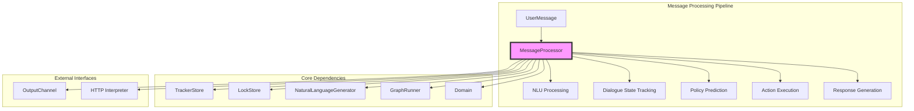
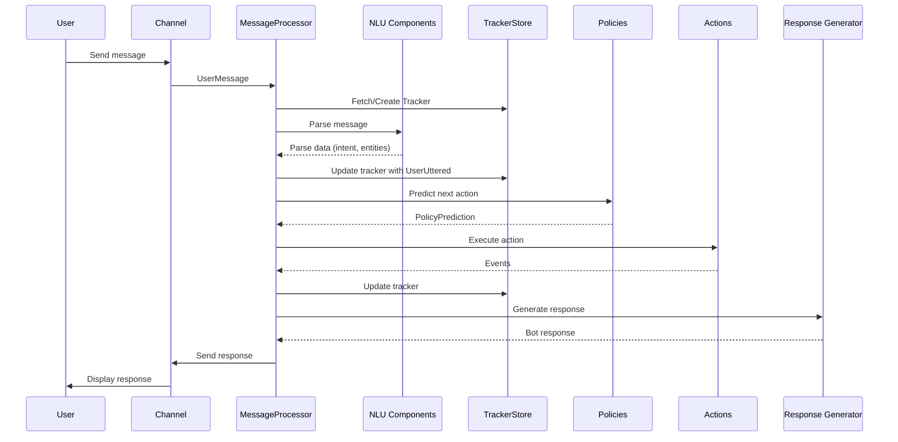
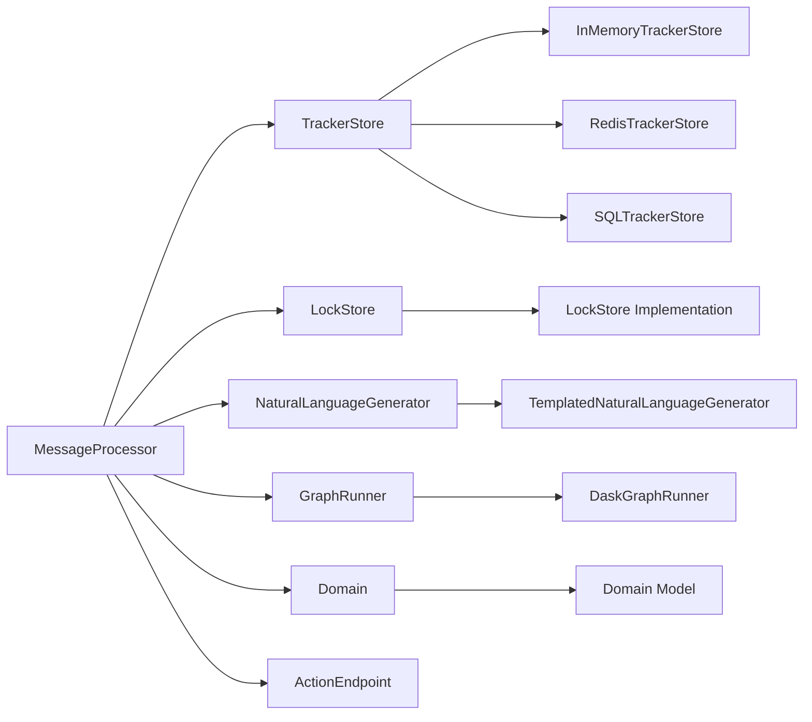
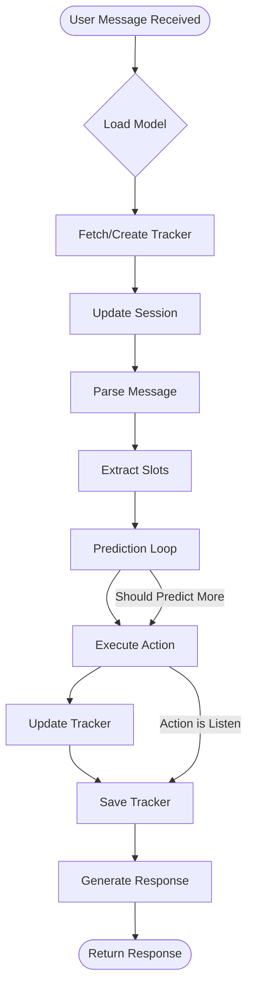
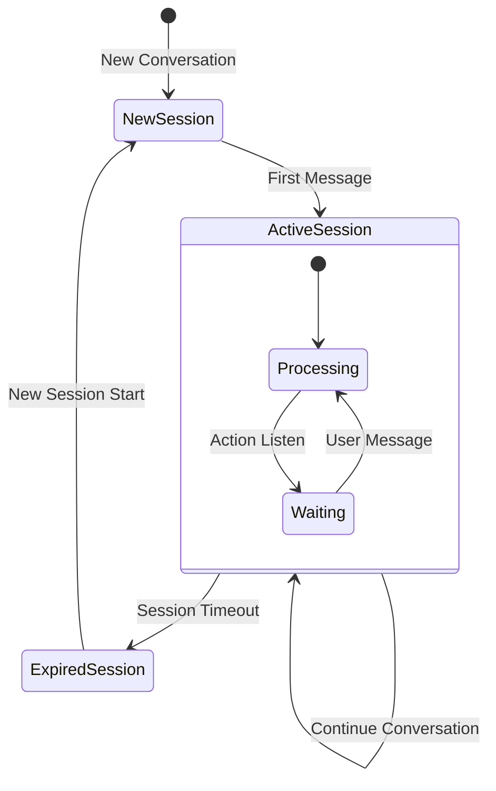
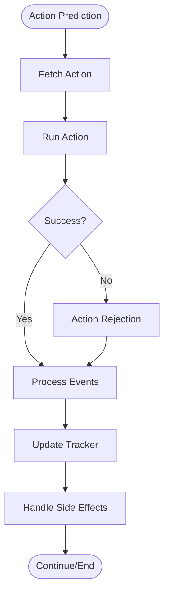
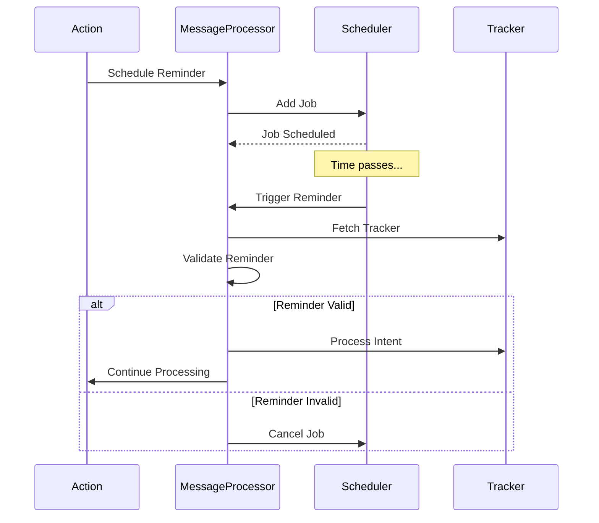
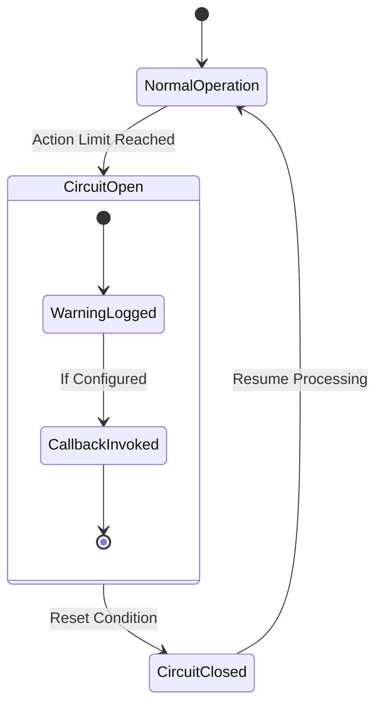

# MessageProcessor Module Documentation

## Introduction

The MessageProcessor module is the central orchestration component in Rasa's dialogue management system. It serves as the primary interface for processing user messages, managing conversation state, and coordinating between natural language understanding (NLU) and dialogue policies to generate appropriate responses. This module acts as the bridge between user inputs and the bot's decision-making process, handling the complete message processing pipeline from initial parsing to final response generation.

## Architecture Overview

The MessageProcessor operates as the core processing engine within the dialogue management system, integrating multiple Rasa components to handle conversational AI workflows. It manages the entire lifecycle of message processing, from initial user input through NLU parsing, dialogue state tracking, policy prediction, action execution, and response generation.

## Core Components

### MessageProcessor Class

The `MessageProcessor` class is the primary component that orchestrates message processing and conversation management. It provides a unified interface for handling user messages, managing conversation state, and executing actions based on policy predictions.

**Key Responsibilities:**
- Message parsing and NLU processing
- Conversation state management and tracking
- Policy prediction and action selection
- Action execution and response generation
- Session management and expiration handling
- Reminder scheduling and handling
- Tracker persistence and retrieval

## Data Flow Architecture

## Component Dependencies

### Core Dependencies

The MessageProcessor relies on several key components to function effectively:

### Integration Points

**TrackerStore Integration:**
- Manages conversation persistence across sessions
- Provides thread-safe access to conversation history
- Supports multiple storage backends (in-memory, Redis, SQL)

**LockStore Integration:**
- Ensures thread-safe message processing
- Prevents race conditions in concurrent conversations
- Manages distributed locking for scalability

**NaturalLanguageGenerator Integration:**
- Generates human-readable responses from bot actions
- Handles response templates and variable substitution
- Supports custom NLG implementations

**GraphRunner Integration:**
- Executes the model's computation graph for predictions
- Handles NLU parsing and policy predictions
- Supports distributed execution via Dask

## Message Processing Workflow

### Primary Message Handling

### Detailed Processing Steps

1. **Model Loading and Initialization**
   - Loads the trained model from specified path
   - Initializes GraphRunner for computation graph execution
   - Validates model metadata and assistant ID

2. **Tracker Management**
   - Retrieves existing tracker or creates new one
   - Updates conversation session if expired
   - Associates tracker with model ID and assistant ID

3. **Message Parsing**
   - Processes user message through NLU pipeline
   - Extracts intent, entities, and other parse data
   - Validates extracted features against domain

4. **Slot Extraction**
   - Runs slot extraction actions
   - Updates tracker with extracted slot values
   - Handles slot validation and mapping

5. **Action Prediction Loop**
   - Predicts next actions using policy ensemble
   - Executes actions until listening action is predicted
   - Handles action limits and circuit breaker logic

6. **Response Generation**
   - Generates bot responses from action events
   - Handles side effects (reminders, bot messages)
   - Updates tracker with all generated events

## Session Management

### Session Lifecycle

### Session Configuration

- **Session Expiration:** Configurable timeout for conversation sessions
- **Session Start:** Automatic session initialization for new conversations
- **Metadata Handling:** Support for session-specific metadata storage
- **Cleanup:** Proper cleanup of expired sessions and associated data

## Action Execution Framework

### Action Types and Processing

### Action Execution Features

- **Action Rejection Handling:** Graceful handling of failed actions
- **Event Processing:** Comprehensive event processing and tracker updates
- **Side Effect Management:** Bot messages, reminders, and other side effects
- **Error Recovery:** Exception handling and recovery mechanisms

## Reminder and Scheduling System

### Reminder Handling

### Reminder Features

- **Scheduled Execution:** Time-based reminder triggering
- **Validation:** Checks for conversation restarts and user messages
- **Cancellation:** Support for reminder cancellation events
- **External Triggers:** Integration with external scheduling systems

## Error Handling and Recovery

### Exception Management

- **Model Loading Errors:** Graceful handling of corrupted or missing models
- **Action Execution Failures:** Comprehensive action rejection handling
- **Prediction Limits:** Circuit breaker pattern for action prediction limits
- **Validation Errors:** Domain validation and feature checking

### Circuit Breaker Pattern

## Integration with Other Modules

### NLU Pipeline Integration

The MessageProcessor integrates with the [NLU Pipeline](NLU_Pipeline.md) for message understanding:

- **Message Parsing:** Delegates to NLU components for intent and entity extraction
- **Feature Validation:** Validates extracted features against domain configuration
- **Parse Data Processing:** Processes and enriches NLU parse results

### Dialogue Policies Integration

Coordinates with [Dialogue Policies](Dialogue_Policies.md) for action selection:

- **Policy Predictions:** Uses policy ensemble for action prediction
- **Prediction Processing:** Handles policy predictions and confidence scores
- **Follow-up Actions:** Manages follow-up action execution

### Action System Integration

Works with the [Actions](Actions.md) module for response generation:

- **Action Execution:** Coordinates action execution and event generation
- **Response Processing:** Handles bot responses and side effects
- **Form Processing:** Supports complex form-based conversations

### Tracker Store Integration

Leverages [TrackerStore](Dialogue_Management_Core.md#tracker-store) for conversation persistence:

- **Tracker Retrieval:** Fetches existing conversation trackers
- **Tracker Updates:** Saves conversation state changes
- **Session Management:** Handles conversation session lifecycle

## Performance and Scalability

### Optimization Strategies

- **Graph-based Execution:** Utilizes computation graphs for efficient processing
- **Distributed Processing:** Supports distributed execution via Dask
- **Caching:** Implements caching for model predictions and results
- **Async Processing:** Asynchronous message handling for improved throughput

### Scalability Features

- **Lock Management:** Distributed locking for concurrent conversation handling
- **Stateless Design:** Stateless processing with external state storage
- **Horizontal Scaling:** Support for horizontal scaling with shared storage
- **Resource Management:** Efficient resource utilization and cleanup

## Configuration and Customization

### Initialization Parameters

- **Model Path:** Path to trained model file or directory
- **Tracker Store:** Storage backend for conversation trackers
- **Lock Store:** Distributed locking mechanism
- **NLG Generator:** Response generation component
- **Action Endpoint:** External action server configuration
- **Prediction Limits:** Maximum number of consecutive predictions
- **Circuit Breaker:** Callback for prediction limit handling
- **HTTP Interpreter:** External NLU service configuration

### Extension Points

- **Custom NLG:** Pluggable natural language generation
- **Custom Actions:** External action server integration
- **Plugin System:** Support for custom plugins and extensions
- **Event Handling:** Custom event processing and handling

## Monitoring and Observability

### Logging and Debugging

- **Structured Logging:** Comprehensive structured logging with structlog
- **Event Tracking:** Detailed event tracking and debugging information
- **Performance Metrics:** Processing time and performance monitoring
- **Error Tracking:** Comprehensive error logging and tracking

### Debug Information

- **Parse Data Logging:** Detailed NLU parse data logging
- **Action Logging:** Action execution and prediction logging
- **Slot Logging:** Current slot values and changes
- **Tracker State:** Conversation state and event tracking

This comprehensive documentation provides a complete understanding of the MessageProcessor module's architecture, functionality, and integration within the Rasa dialogue management system. The module serves as the central orchestration point for all conversational AI processing, ensuring efficient and reliable message handling across the entire pipeline.