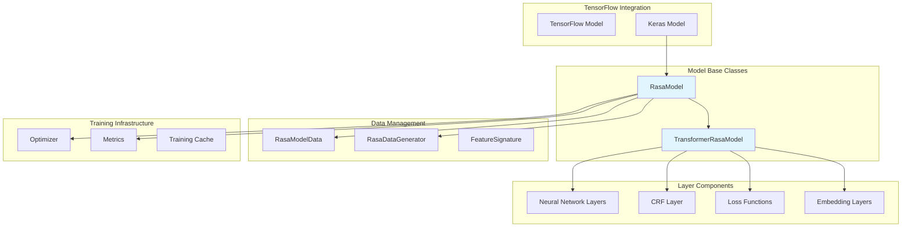
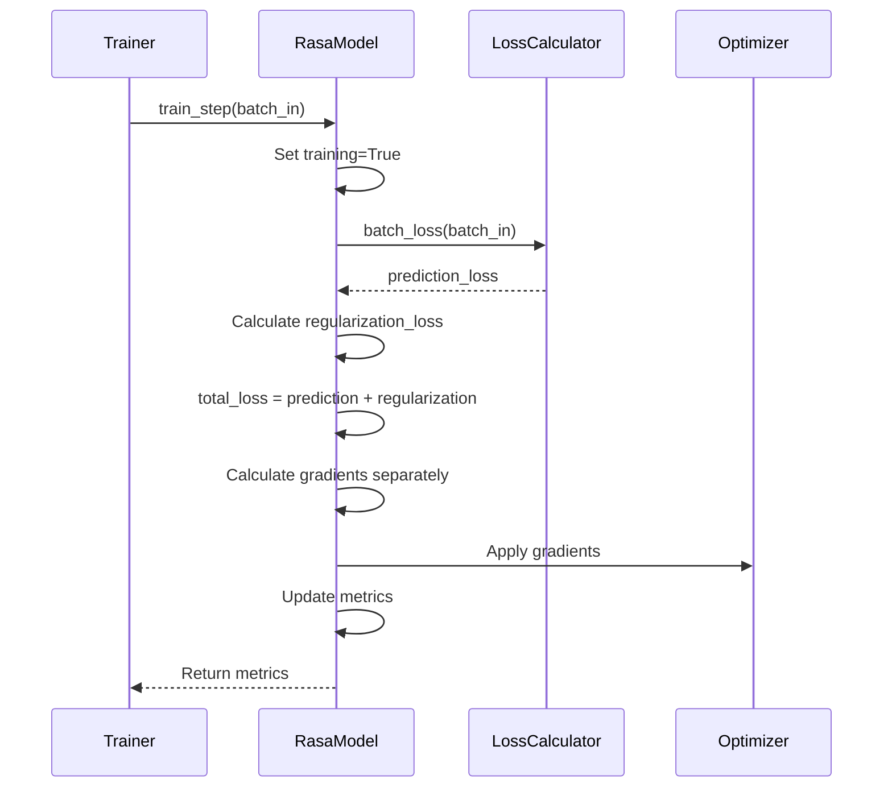
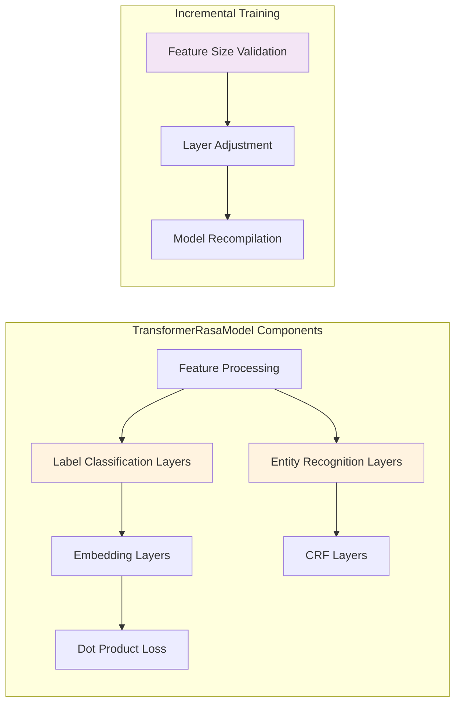
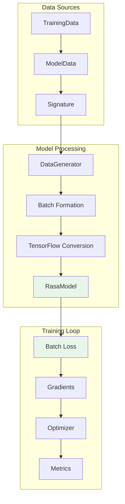
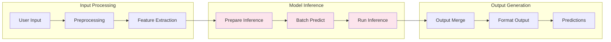
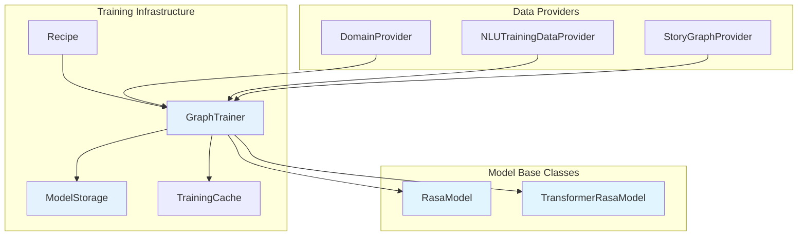

# Model Base Classes

The Model Base Classes module provides the foundational abstractions for all TensorFlow-based machine learning models in Rasa. It defines the core interfaces and base implementations that power the NLU and dialogue management components, serving as the backbone for the entire ML pipeline.

## Overview

This module contains two primary base classes that form the foundation of Rasa's machine learning architecture:

- **RasaModel**: The fundamental base class for all TensorFlow models in Rasa
- **TransformerRasaModel**: An extended base class specifically designed for transformer-based architectures

These classes provide standardized interfaces for training, prediction, loss calculation, and model persistence while handling complex scenarios like incremental training, sparse feature management, and multi-batch inference.

## Architecture



## Core Components

### RasaModel

The `RasaModel` class is the fundamental base class that extends TensorFlow's Keras Model to provide Rasa-specific functionality. It serves as the foundation for all machine learning models in the system.

#### Key Responsibilities

- **Training Management**: Implements custom training loops with separate supervision and regularization loss handling
- **Prediction Pipeline**: Provides optimized prediction methods with graph compilation and batch processing
- **Model Persistence**: Handles saving and loading of model weights with support for fine-tuning
- **Data Format Conversion**: Converts between Rasa's data format and TensorFlow tensors
- **Random Seed Management**: Ensures reproducible results across training runs

#### Core Methods

```python
# Training and validation
train_step(batch_in) -> Dict[Text, float]
test_step(batch_in) -> Dict[Text, float]

# Prediction
predict_step(batch_in) -> Dict[Text, tf.Tensor]
run_inference(model_data, batch_size, output_keys_expected) -> Dict[Text, Union[np.ndarray, Dict]]

# Loss calculation
batch_loss(batch_in) -> tf.Tensor

# Model persistence
save(model_file_name, overwrite)
load(model_file_name, model_data_example, finetune_mode) -> RasaModel
```

#### Training Architecture



### TransformerRasaModel

The `TransformerRasaModel` extends `RasaModel` to provide specialized functionality for transformer-based architectures, particularly those used in DIET (Dual Intent and Entity Transformer) and other transformer models in Rasa.

#### Key Features

- **Incremental Training Support**: Handles dynamic adjustment of sparse feature sizes during fine-tuning
- **Label Classification**: Provides specialized layers for intent classification and entity recognition
- **Entity Recognition**: Built-in CRF (Conditional Random Field) support for sequence labeling
- **Feature Processing**: Advanced handling of both dense and sparse features

#### Specialized Components



## Data Flow Architecture

### Training Data Flow



### Prediction Data Flow



## Integration with Rasa Ecosystem

### NLU Pipeline Integration

The Model Base Classes serve as the foundation for all NLU components that use machine learning:

- **Intent Classifiers**: [DIETClassifier](NLU Pipeline.md#intent-classifiers), [FallbackClassifier](NLU Pipeline.md#intent-classifiers)
- **Entity Extractors**: [CRFEntityExtractor](NLU Pipeline.md#entity-extractors)
- **Response Selectors**: [ResponseSelector](NLU Pipeline.md#response-selectors)

### Dialogue Management Integration

The base classes also support dialogue policy models:

- **TED Policy**: [TEDPolicy](Dialogue Policies.md#ted-policy)
- **UnexpecTED Intent Policy**: [UnexpecTEDIntentPolicy](Dialogue Policies.md#unexpected-intent-policy)

### Training Infrastructure Integration



## Key Features and Capabilities

### Incremental Training Support

The `TransformerRasaModel` provides sophisticated support for incremental training, allowing models to be fine-tuned with new data without starting from scratch:

1. **Feature Size Validation**: Ensures sparse feature sizes don't decrease (which would invalidate the model)
2. **Dynamic Layer Adjustment**: Automatically adjusts layer sizes when sparse features increase
3. **Model Recompilation**: Rebuilds the computation graph with updated architectures

### Multi-Batch Inference

The `run_inference` method provides efficient bulk inference with:

- **Batch Processing**: Automatically handles large datasets by processing in configurable batch sizes
- **Output Merging**: Combines results from multiple batches into coherent outputs
- **Memory Management**: Optimizes memory usage during large-scale inference

### Advanced Loss Handling

The training architecture separates prediction losses from regularization losses:

- **Gradient Separation**: Calculates gradients for supervision and regularization separately
- **Selective Regularization**: Only applies regularization gradients where prediction gradients exist
- **Loss Scaling**: Supports configurable loss scaling for different components

## Configuration and Customization

### Model Configuration

Models are configured through comprehensive configuration dictionaries that control:

- **Architecture Parameters**: Embedding dimensions, layer sizes, connection density
- **Training Parameters**: Learning rates, regularization constants, loss types
- **Feature Processing**: Similarity types, confidence mechanisms, constraint settings

### Layer Management

The base classes provide systematic layer management through:

```python
# Layer preparation methods
_prepare_embed_layers(name, prefix)
_prepare_ffnn_layer(name, layer_sizes, drop_rate, prefix)
_prepare_dot_product_loss(name, scale_loss, prefix)
_prepare_entity_recognition_layers()
```

## Error Handling and Validation

### Data Validation

The models implement comprehensive data validation:

- **Signature Validation**: Ensures input data matches expected formats
- **Feature Consistency**: Validates feature dimensions and types
- **Sparse Feature Monitoring**: Tracks changes in sparse feature sizes

### Exception Handling

Specialized exceptions for common failure scenarios:

- **Feature Size Decreases**: Prevents invalid incremental training scenarios
- **Data Format Mismatches**: Ensures compatibility between training and prediction data
- **Model Architecture Issues**: Validates layer configurations and connections

## Performance Optimizations

### Graph Compilation

The models implement sophisticated graph compilation strategies:

- **Dynamic Function Creation**: Creates optimized TensorFlow functions for prediction
- **Signature-based Compilation**: Uses data signatures to create efficient computation graphs
- **Eager Execution Control**: Supports both eager and graph execution modes

### Memory Management

Optimized memory usage through:

- **Resource Cleanup**: Proper management of TensorFlow sessions and resources
- **Batch Size Optimization**: Configurable batch sizes for different hardware constraints
- **Sparse Tensor Handling**: Efficient processing of sparse features

## Dependencies and Related Modules

### Direct Dependencies

- **[Data Management](Data Management.md)**: `RasaModelData`, `RasaDataGenerator`, `FeatureSignature`
- **[Neural Network Layers](Neural Network Layers.md)**: Custom layer implementations for CRF, embeddings, and transformers
- **[Training Utilities](Training Utilities.md)**: Training helpers and configuration management

### Integration Points

- **[NLU Pipeline](NLU Pipeline.md)**: All ML-based NLU components inherit from these base classes
- **[Dialogue Policies](Dialogue Policies.md)**: Policy models use the base classes for training and inference
- **[Execution Engine](Execution Engine.md)**: The graph execution engine manages model lifecycle

## Best Practices

### Model Development

1. **Inheritance Pattern**: Always extend `RasaModel` or `TransformerRasaModel` for new ML components
2. **Method Implementation**: Implement required abstract methods (`batch_loss`, `batch_predict`)
3. **Configuration Management**: Use the configuration dictionary pattern for model parameters
4. **Layer Registration**: Register all TensorFlow layers in the `_tf_layers` dictionary

### Training and Inference

1. **Data Preparation**: Ensure proper data signature creation and validation
2. **Incremental Training**: Validate feature size changes before attempting fine-tuning
3. **Memory Management**: Use appropriate batch sizes for available hardware
4. **Error Handling**: Implement proper exception handling for edge cases

This module forms the cornerstone of Rasa's machine learning capabilities, providing a robust, extensible foundation for all neural network-based components in the system.