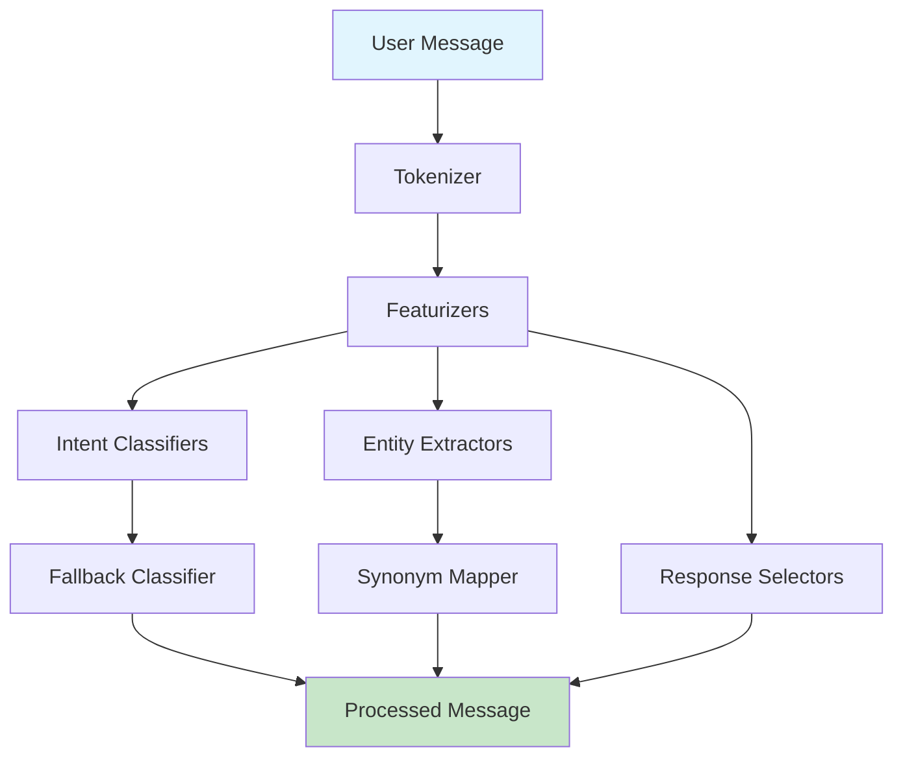
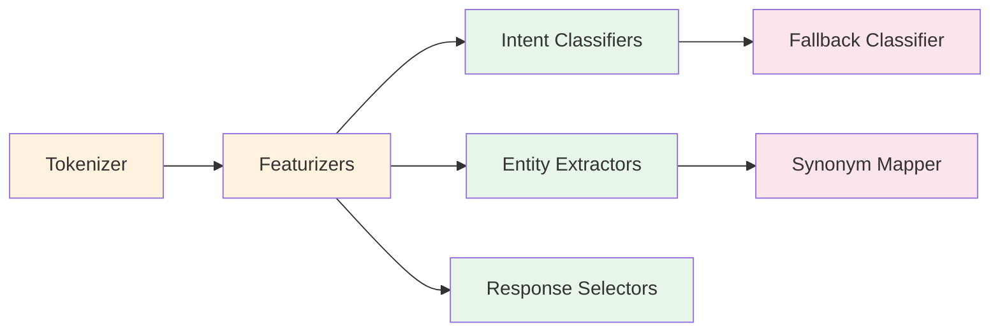

# NLU Pipeline Module Documentation

## Overview

The NLU (Natural Language Understanding) Pipeline is a core component of the Rasa framework responsible for processing and understanding user messages. It transforms raw text input into structured data containing intents, entities, and other linguistic features that enable conversational AI systems to comprehend user input effectively.

## Purpose and Core Functionality

The NLU Pipeline serves as the entry point for processing user messages in a Rasa chatbot system. Its primary responsibilities include:

- **Text Tokenization**: Breaking down user messages into individual tokens (words, subwords, or characters)
- **Feature Extraction**: Converting text into numerical representations (dense and sparse features)
- **Intent Classification**: Determining the user's intention or purpose behind the message
- **Entity Extraction**: Identifying and extracting specific pieces of information (entities) from the text
- **Response Selection**: Selecting appropriate responses based on the processed input
- **Synonym Mapping**: Normalizing entity values using predefined synonym mappings
- **Fallback Handling**: Managing low-confidence predictions and ambiguous inputs

## Architecture Overview

The NLU Pipeline follows a modular, configurable architecture where components are chained together to process messages sequentially. Each component performs a specific task and passes its output to the next component in the pipeline.

### Data Flow

1. **Input Processing**: Raw text messages enter the pipeline
2. **Tokenization**: Text is split into tokens with positional information
3. **Feature Generation**: Multiple featurizers create dense and sparse feature representations
4. **Classification & Extraction**: 
   - Intent classifiers predict user intent
   - Entity extractors identify relevant entities
   - Response selectors choose appropriate responses
5. **Post-processing**: 
   - Synonym mapping normalizes entity values
   - Fallback classifier handles low-confidence predictions
6. **Output**: Structured message with intents, entities, and metadata

## Core Components

### 1. Tokenizers
Tokenizers break down text into meaningful units (tokens) and provide positional information essential for downstream processing.

**Key Component**: [Tokenizer](Tokenizers.md)
- Base class for all tokenizers
- Handles intent tokenization and special token patterns
- Provides token position tracking and lemma information

### 2. Featurizers
Featurizers convert text into numerical representations that machine learning models can process.

**Key Components**:
- [Featurizer](Featurizers.md): Base class for all featurizers
- [DenseFeaturizer](Featurizers.md): Creates dense vector representations
- [CountVectorsFeaturizer](Featurizers.md): Creates sparse bag-of-words representations

### 3. Intent Classifiers
Intent classifiers determine the user's intention from the processed text and features.

**Key Components**:
- [IntentClassifier](Intent Classifiers.md): Base class for intent classification
- [DIETClassifier](Intent Classifiers.md): Multi-task transformer model for intent classification and entity extraction
- [FallbackClassifier](Intent Classifiers.md): Handles low-confidence and ambiguous predictions

### 4. Entity Extractors
Entity extractors identify and extract specific pieces of information from user messages.

**Key Components**:
- [EntityExtractorMixin](Entity Extractors.md): Base functionality for entity extraction
- [CRFEntityExtractor](Entity Extractors.md): Conditional Random Fields-based entity recognition
- [DucklingEntityExtractor](Entity Extractors.md): Rule-based extraction of structured entities (dates, numbers, etc.)

### 5. Response Selectors
Response selectors choose appropriate responses based on the processed input and available response templates.

**Key Component**: [ResponseSelector](Response Selectors.md)
- Uses supervised embeddings to match user input with appropriate responses
- Supports retrieval intents and response templates
- Can use transformer architectures for better performance

### 6. Supporting Components

**EntitySynonymMapper**: Maps extracted entities to their canonical forms using synonym definitions.

**NaturalLanguageInterpreter**: Legacy interface for NLU processing (being phased out).

## Component Dependencies

## Configuration and Extensibility

The NLU Pipeline is highly configurable through:

- **Pipeline Configuration**: Define the sequence and parameters of components
- **Component-Specific Settings**: Each component has its own configuration options
- **Custom Components**: Implement new components by extending base classes
- **Model Storage**: Persistent storage for trained models and component state

## Integration Points

The NLU Pipeline integrates with:

- **Core Training Data**: Uses NLU training data for model training
- **Execution Engine**: Part of the Rasa graph-based execution system
- **Model Storage**: Persists and loads trained models
- **Dialogue Management**: Provides processed user input to dialogue policies

## Performance Considerations

- **Feature Caching**: Components can cache features to avoid recomputation
- **Batch Processing**: Supports processing multiple messages simultaneously
- **Model Optimization**: TensorFlow-based models support various optimization techniques
- **Incremental Training**: Some components support fine-tuning on new data

## Error Handling and Robustness

- **Fallback Mechanisms**: Graceful handling of low-confidence predictions
- **Validation**: Input validation and configuration checking
- **Logging**: Comprehensive logging for debugging and monitoring
- **Exception Handling**: Robust error handling throughout the pipeline

## Related Documentation

- [Core Featurization](../Core%20Featurization.md) - Core-level feature extraction
- [Domain & Training Data](../Domain%20&%20Training%20Data.md) - Training data structures
- [Execution Engine & Graph Components](../Execution%20Engine%20&%20Graph%20Components.md) - Graph-based execution system
- [TensorFlow Model Components](../TensorFlow%20Model%20Components.md) - Deep learning model components

## Sub-module Documentation

For detailed information about specific sub-modules, refer to:

- [Tokenizers](Tokenizers.md) - Text tokenization components
- [Featurizers](Featurizers.md) - Feature extraction components
- [Intent Classifiers](Intent Classifiers.md) - Intent classification components
- [Entity Extractors](Entity Extractors.md) - Entity extraction components
- [Response Selectors](Response Selectors.md) - Response selection components