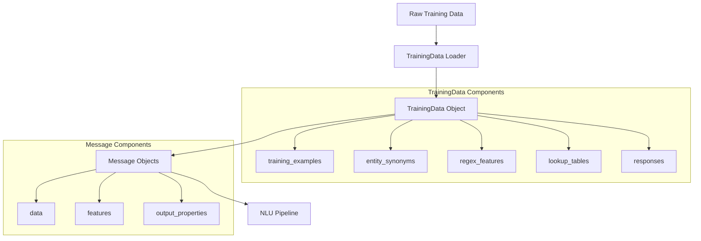
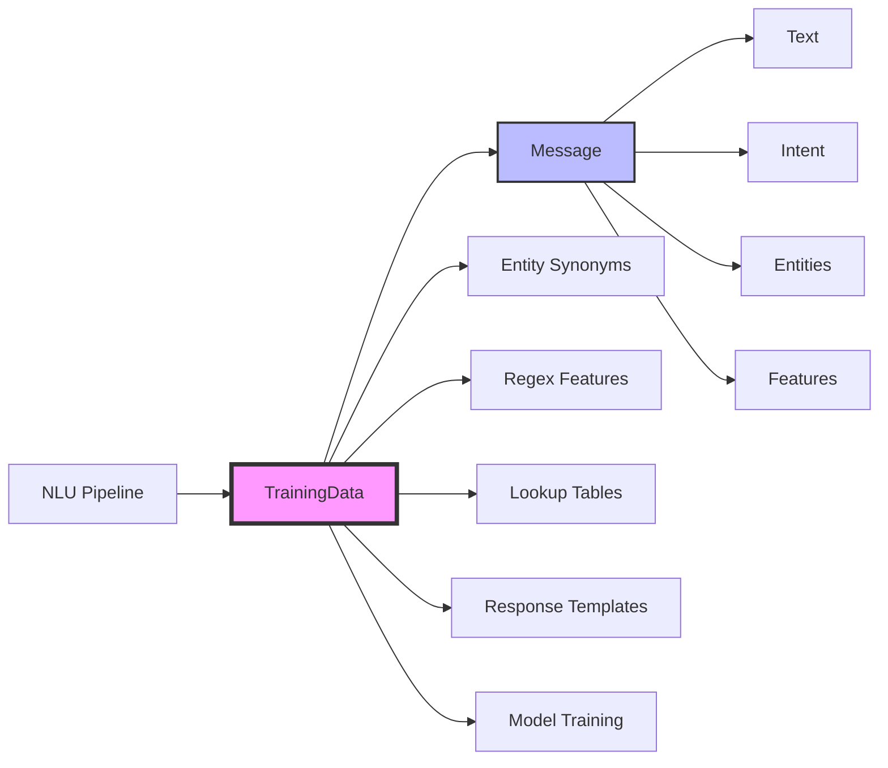
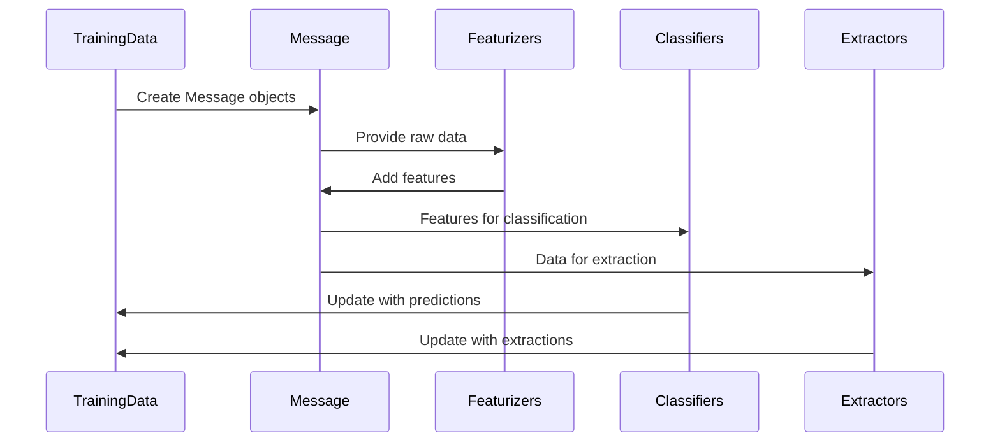

# NLU Training Data Structures Module

## Introduction

The NLU Training Data Structures module is a fundamental component of Rasa's Natural Language Understanding (NLU) system. It provides the core data structures and utilities for managing, validating, and processing training data used to train NLU models. This module serves as the foundation for handling intent classification, entity recognition, and response selection training data.

## Core Components

### TrainingData Class

The `TrainingData` class is the central component that holds loaded intent and entity training data. It provides a comprehensive container for all NLU training data including:

- **Training Examples**: Individual message examples with intent and entity annotations
- **Entity Synonyms**: Mappings for entity normalization
- **Regex Features**: Pattern-based features for entity extraction
- **Lookup Tables**: External reference data for entity extraction
- **Response Templates**: NLG (Natural Language Generation) responses for retrieval intents

### Message Class

The `Message` class serves as a container for data that describes a conversation turn. It encapsulates:

- **Raw Data**: Text, intent, entities, and other attributes
- **Features**: Vectorized representations from featurizers
- **Metadata**: Additional information about the message
- **Output Properties**: Properties that should be included in output

## Architecture

### Data Flow Architecture



### Component Relationships



## Key Features

### Data Validation

The module implements comprehensive validation mechanisms:

- **Minimum Examples Check**: Ensures sufficient training examples per intent (minimum 2) and entity (minimum 2)
- **Empty Intent/Response Detection**: Warns about empty intents or responses
- **Response Template Validation**: Ensures retrieval intents have corresponding response templates
- **Entity Overlap Detection**: Identifies overlapping entity annotations

### Data Processing Capabilities

- **Merging**: Combines multiple training data sources
- **Filtering**: Applies custom conditions to filter training examples
- **Splitting**: Performs stratified train/test splits preserving class distribution
- **Fingerprinting**: Generates unique identifiers for data versioning and caching

### Format Support

- **JSON**: Native JSON format support for NLU data
- **YAML**: YAML format support for both NLU and NLG data
- **Markdown**: Legacy markdown format support (being phased out)

## Integration with NLU Pipeline

### Training Data Flow



### Feature Management

The Message class provides sophisticated feature management:

- **Sparse Features**: Handles sparse vector representations (e.g., bag-of-words, n-grams)
- **Dense Features**: Manages dense vector representations (e.g., word embeddings)
- **Feature Combination**: Combines features from multiple featurizers
- **Feature Filtering**: Selects features based on featurizer names

## Data Structures

### TrainingData Structure

```python
TrainingData:
├── training_examples: List[Message]
├── entity_synonyms: Dict[str, str]
├── regex_features: List[Dict[str, str]]
├── lookup_tables: List[Dict[str, Any]]
├── responses: Dict[str, List[Dict[str, Any]]]
├── intents: Set[str] (lazy property)
├── entities: Set[str] (lazy property)
└── fingerprint: str (method)
```

### Message Structure

```python
Message:
├── data: Dict[str, Any]
│   ├── text: str
│   ├── intent: str
│   ├── entities: List[Dict]
│   ├── response: str
│   └── metadata: Dict
├── features: List[Features]
├── output_properties: Set[str]
├── time: int
└── fingerprint: str (method)
```

## Usage Patterns

### Creating Training Data

```python
# From existing data
training_data = TrainingData(
    training_examples=messages,
    entity_synonyms=synonyms,
    regex_features=patterns,
    lookup_tables=tables,
    responses=templates
)

# Merging multiple sources
combined_data = training_data1.merge(training_data2, training_data3)
```

### Message Creation and Manipulation

```python
# Building from components
message = Message.build(
    text="Hello there",
    intent="greet",
    entities=[{"entity": "person", "start": 6, "end": 11}]
)

# Adding features
message.add_features(sparse_features)
message.add_features(dense_features)
```

### Data Validation and Analysis

```python
# Validate training data
training_data.validate()

# Get statistics
training_data.print_stats()

# Check for issues
overlapping_entities = message.find_overlapping_entities()
```

## Dependencies

This module integrates with several other Rasa components:

- **[NLU Pipeline](NLU Pipeline.md)**: Provides training data to pipeline components
- **[Domain & Training Data](Domain & Training Data.md)**: Part of the broader training data ecosystem
- **[Execution Engine](Execution Engine & Graph Components.md)**: Used by graph components for data provisioning

## File Formats and Persistence

### Supported Formats

The module supports multiple file formats for data persistence:

- **Rasa YAML**: Primary format for NLU and NLG data
- **Rasa JSON**: Legacy JSON format
- **Markdown**: Legacy format (deprecated)

### Persistence Methods

```python
# Save NLU data
training_data.persist_nlu("nlu.yml")

# Save NLG data separately
training_data.persist_nlg("nlg.yml")

# Combined persistence
info = training_data.persist("data_directory", "training_data.yml")
```

## Best Practices

### Data Organization

1. **Consistent Intent Naming**: Use clear, consistent intent names
2. **Entity Annotation Quality**: Ensure accurate entity boundaries and types
3. **Balanced Data**: Maintain reasonable balance across intent classes
4. **Synonym Usage**: Leverage entity synonyms for normalization

### Validation Guidelines

1. **Minimum Examples**: Provide at least 2 examples per intent and entity
2. **Response Templates**: Ensure retrieval intents have corresponding responses
3. **Entity Consistency**: Avoid overlapping entities when possible
4. **Data Quality**: Regular validation using built-in validation methods

### Performance Considerations

1. **Lazy Properties**: Utilize lazy-loaded properties for efficient memory usage
2. **Fingerprinting**: Leverage fingerprints for caching and change detection
3. **Feature Caching**: Message features are cached for performance
4. **Stratified Splitting**: Use built-in splitting for representative train/test sets

## Error Handling

The module includes comprehensive error handling for:

- **File Loading**: Graceful handling of missing or corrupted files
- **Data Validation**: Clear warnings for data quality issues
- **Format Conversion**: Robust conversion between formats
- **Entity Processing**: Detection and reporting of annotation issues

## Future Enhancements

The module is designed to evolve with:

- **Enhanced Validation**: More sophisticated data quality checks
- **Format Support**: Additional training data formats
- **Performance Optimization**: Improved handling of large datasets
- **Integration**: Deeper integration with ML pipeline components