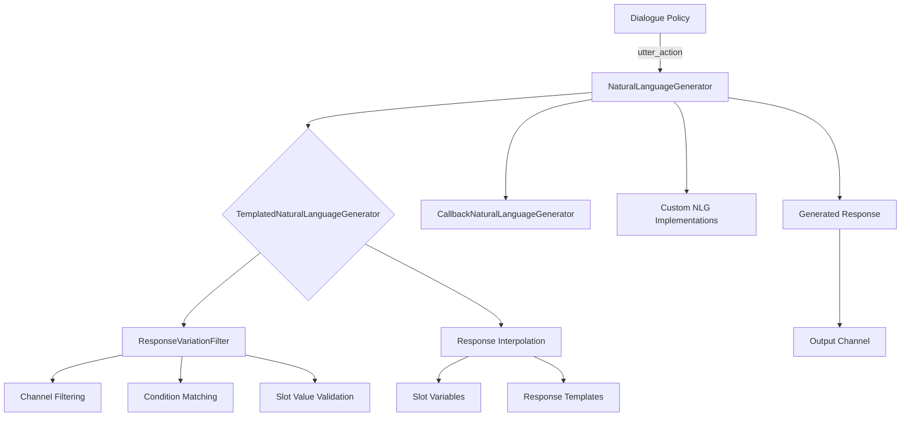
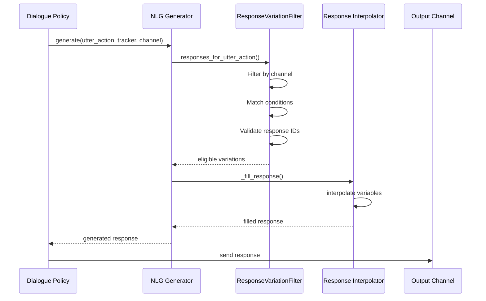
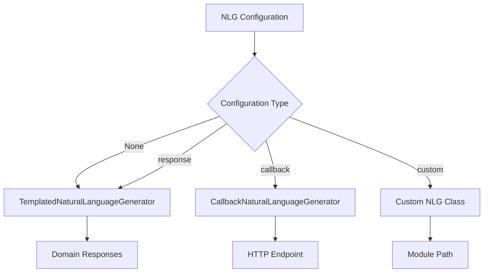

# Natural Language Generation (NLG) Module

## Overview

The Natural Language Generation (NLG) module is responsible for converting structured dialogue actions into human-readable natural language responses. It serves as the final component in the Rasa dialogue pipeline, transforming the assistant's internal representation of responses into actual text that users can understand.

## Purpose

The NLG module provides a flexible framework for generating bot responses based on:
- Pre-defined response templates with variable interpolation
- Conditional responses based on dialogue state and slot values
- Channel-specific response variations
- Custom NLG implementations through pluggable architectures

## Architecture



## Core Components

### NaturalLanguageGenerator
The abstract base class that defines the interface for all NLG implementations. It provides:
- Factory method for creating appropriate NLG instances
- Abstract `generate()` method for response generation
- Support for different NLG types (template-based, callback, custom)

### TemplatedNaturalLanguageGenerator
The default implementation that generates responses based on pre-defined templates:
- Random selection from available response variations
- Variable interpolation using slot values
- Channel-specific response filtering
- Conditional response selection based on dialogue state

### CallbackNaturalLanguageGenerator
An implementation that delegates response generation to external endpoints:
- HTTP-based NLG service integration
- JSON request/response format with validation
- Support for response ID fetching from domain
- Timeout and error handling for remote calls

### ResponseVariationFilter
A utility class that filters response variations based on:
- Output channel compatibility
- Slot value conditions
- Response ID validation
- Priority ordering of conditional vs. default responses

### Interpolator
A utility module for variable substitution in response templates:
- Text interpolation with slot values and custom variables
- Recursive processing of complex response structures (dict, list)
- Safe handling of missing variables with fallback behavior
- Support for nested data structures and rich content

## Response Generation Process



## Integration with Rasa Ecosystem

The NLG module integrates with several other Rasa components:

- **[Dialogue Policies](Dialogue%20Policies.md)**: Policies determine which utter action should be executed, and the NLG module generates the actual response text
- **[Domain & Training Data](Domain%20&%20Training%20Data.md)**: Response templates are defined in the domain file, and the NLG module uses these templates for generation
- **[Dialogue Management Core](Dialogue%20Management%20Core.md)**: The MessageProcessor coordinates between policies and NLG to handle user messages
- **[Communication Channels](Communication%20Channels.md)**: Different channels may require different response formats, which the NLG module handles through channel-specific variations

## Response Template Structure

Responses in the domain can include:
- **Text messages**: Simple text responses with variable placeholders
- **Rich content**: Images, buttons, quick replies, attachments
- **Custom payloads**: Platform-specific response formats
- **Conditional variations**: Different responses based on slot values
- **Channel-specific variations**: Different responses for different channels

## Variable Interpolation

The interpolator module supports variable interpolation in response templates using:
- **Text interpolation**: `{slot_name}` syntax with safe regex replacement
- **Recursive processing**: Handles nested dictionaries and lists
- **Error handling**: Graceful fallback when variables are missing
- **Format safety**: Prevents code injection and handles special characters

### Interpolation Examples
- Simple text: `"Hello {user_name}!"` → `"Hello John!"`
- Nested structures: Buttons, custom payloads with interpolated values
- List processing: Arrays of responses with variable substitution

## Callback NLG Integration

The CallbackNaturalLanguageGenerator enables integration with external NLG services:

### Request Format
```json
{
  "response": "utter_greet",
  "id": "response_variation_id",
  "arguments": {},
  "tracker": { /* dialogue state */ },
  "channel": { "name": "webchat" }
}
```

### Response Validation
- JSON schema validation for external responses
- Support for all response types (text, buttons, custom, etc.)
- Timeout handling and error management
- Response ID fetching from domain for consistency

## Error Handling

The NLG module includes robust error handling:
- Graceful fallback when no responses are found
- Validation of response IDs to prevent duplicates
- Warning messages for configuration issues
- Safe handling of missing slot values

## Extensibility

The NLG architecture supports custom implementations:
- Callback-based NLG for external services
- Custom NLG classes loaded from module paths
- Integration with machine learning-based NLG models
- Plugin architecture for specialized response generation

## Configuration

NLG can be configured through:
- Domain responses: Default template-based approach
- Endpoint configuration: For callback or custom NLG
- Environment variables: For external NLG service endpoints
- Training data: Response variations and conditions

## Factory Pattern

The NLG module uses a factory pattern to create appropriate generator instances:



### Configuration Options
- **Default**: `TemplatedNaturalLanguageGenerator` with domain responses
- **Callback**: `CallbackNaturalLanguageGenerator` with endpoint configuration
- **Custom**: User-defined NLG class loaded from module path
- **Response**: Explicit template-based generation

## Response Variation Selection Logic

The ResponseVariationFilter implements a priority-based selection algorithm:

1. **Conditional Channel-Specific**: Responses with conditions matching current slots AND specific to the channel
2. **Default Channel-Specific**: Responses without conditions BUT specific to the channel  
3. **Conditional Generic**: Responses with conditions matching current slots but no channel specified
4. **Default Generic**: Responses without conditions and no channel specified

This ensures the most specific and relevant response is selected for each context.

This modular design allows Rasa assistants to generate natural, contextual, and channel-appropriate responses while maintaining flexibility for different deployment scenarios and use cases.