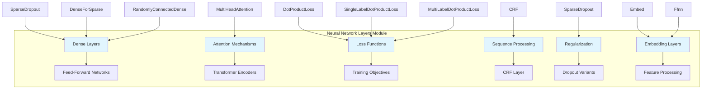
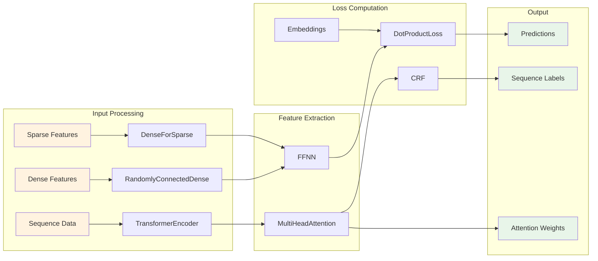
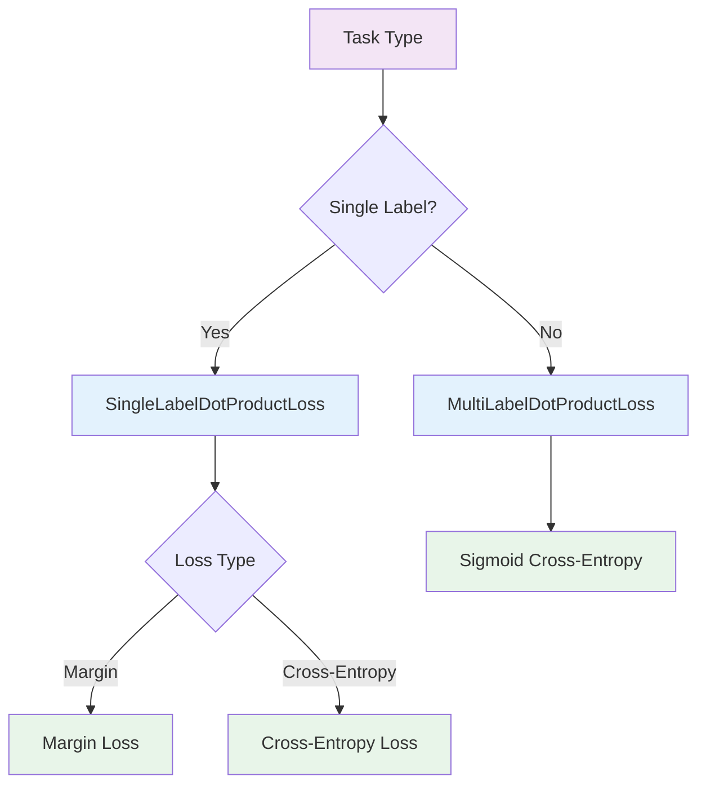

# Neural Network Layers Module

## Introduction

The Neural Network Layers module provides the core neural network building blocks for Rasa's TensorFlow-based models. This module implements specialized layers that are essential for building conversational AI models, including transformer encoders, CRF layers, loss functions, and various dense layer variants optimized for different types of input data.

The module serves as the foundation for Rasa's deep learning capabilities, providing reusable components that power intent classification, entity recognition, dialogue policy learning, and response selection across the Rasa framework.

## Architecture Overview

The Neural Network Layers module is organized into several key component categories that work together to provide comprehensive neural network functionality:



## Core Components

### Dense Layer Variants

#### DenseForSparse
A specialized dense layer designed to handle sparse input tensors efficiently. This layer is crucial for processing high-dimensional sparse features common in NLP tasks like bag-of-words representations or TF-IDF features.

**Key Features:**
- Direct sparse tensor operations using `tf.sparse.sparse_dense_matmul`
- Automatic feature type detection based on layer naming conventions
- Support for both sequence and sentence-level features
- L2 regularization support

**Usage Pattern:**
```python
# Processes sparse features into dense representations
sparse_features -> DenseForSparse -> dense_features
```

#### RandomlyConnectedDense
An innovative dense layer that implements random connectivity patterns to reduce the number of trainable parameters while maintaining full connectivity between inputs and outputs.

**Key Features:**
- Configurable density (fraction of trainable weights)
- Guaranteed connectivity: every output connects to at least one input
- Useful for creating efficient neural networks with fewer parameters
- Maintains performance while reducing computational complexity

**Architecture Benefits:**
- Reduces overfitting through parameter reduction
- Maintains expressiveness through strategic connectivity
- Scales well to large input dimensions

### Feed-Forward Networks (FFNN)

The `Ffnn` class implements multi-layer feed-forward networks with advanced regularization and connectivity options.

**Components:**
- Multiple hidden layers with configurable sizes
- GELU activation function
- Dropout between layers
- Random connectivity support via `RandomlyConnectedDense`
- L2 regularization

**Architecture:**
```
Input -> Dense -> Dropout -> Dense -> Dropout -> ... -> Output
```

### Attention Mechanisms

#### MultiHeadAttention
A comprehensive multi-head attention implementation that forms the core of transformer architectures in Rasa.

**Advanced Features:**
- Relative position embeddings (key and value)
- Configurable attention dropout
- Support for unidirectional (causal) attention
- Head-specific or shared relative embeddings
- Optimized dense layers with random connectivity

**Attention Computation:**
```
Q, K, V -> Split Heads -> Scaled Dot-Product -> Combine Heads -> Output
```

### Transformer Encoder

The `TransformerEncoder` provides a complete transformer implementation optimized for conversational AI tasks.

**Key Components:**
- Multi-layer encoder stack with configurable depth
- Positional encoding using sinusoidal functions
- Layer normalization and residual connections
- Attention weight extraction for interpretability
- Support for both bidirectional and unidirectional processing

**Architecture:**
```
Input -> Embedding + Positional Encoding -> Encoder Layer × N -> Layer Norm -> Output
```

Each encoder layer consists of:
```
Input -> Self-Attention -> Feed-Forward -> Output
   ↓         ↓              ↓
Residual  Residual      Residual
```

### Loss Functions

#### DotProductLoss Family
A sophisticated family of loss functions based on the StarSpace paper, designed for learning embeddings in conversational AI.

**Core Concept:**
- Learns similarity between inputs and labels in embedding space
- Supports both single-label and multi-label scenarios
- Configurable similarity metrics (cosine, inner product)
- Advanced negative sampling strategies

**SingleLabelDotProductLoss:**
- Assumes one correct label per input
- Supports margin-based and cross-entropy losses
- Implements sophisticated negative sampling
- Configurable similarity constraints

**MultiLabelDotProductLoss:**
- Handles multiple correct labels per input
- Uses sigmoid cross-entropy loss
- Maintains label padding for variable-length sequences
- Efficient candidate sampling

### Sequence Processing

#### CRF (Conditional Random Fields)
A CRF layer for structured prediction tasks, particularly useful for entity recognition and slot filling.

**Capabilities:**
- Sequence-level label optimization
- Transition parameter learning
- Viterbi decoding for optimal sequence prediction
- F1 score computation for training evaluation
- Configurable loss scaling

**Processing Flow:**
```
Logits -> CRF -> Predicted Sequence + Confidence Scores
```

### Regularization Components

#### SparseDropout
Specialized dropout for sparse tensors that maintains sparsity while providing regularization.

**Mechanism:**
- Randomly drops values from sparse tensors
- Preserves sparse tensor structure
- Maintains gradient flow through remaining values

## Data Flow Architecture



## Integration with Rasa Ecosystem

The Neural Network Layers module integrates extensively with other Rasa components:

### TensorFlow Model Components
- **RasaModel**: Base class that utilizes these layers for model construction
- **RasaModelData**: Provides data formatting for layer consumption
- **RasaDataGenerator**: Generates training data compatible with layer requirements

### NLU Pipeline Integration
- **DIETClassifier**: Uses transformer encoders and CRF layers
- **ResponseSelector**: Employs transformer architectures for response ranking
- **Entity Extractors**: Utilize CRF layers for sequence labeling

### Dialogue Management
- **TEDPolicy**: Transformer encoder for dialogue policy learning
- **UnexpecTEDIntentPolicy**: Uses transformer layers for intent prediction

## Training and Optimization

### Loss Function Selection
The module provides multiple loss functions optimized for different tasks:



### Regularization Strategies
- **L2 Regularization**: Applied to kernel weights
- **Dropout**: Multiple variants including sparse dropout
- **Random Connectivity**: Parameter reduction through strategic connections
- **Attention Dropout**: Specialized dropout for attention mechanisms

### Optimization Features
- **Loss Scaling**: Adaptive scaling based on prediction confidence
- **Negative Sampling**: Intelligent negative example selection
- **Gradient Management**: Proper gradient flow through complex architectures

## Advanced Features

### Relative Position Embeddings
The transformer implementation supports relative position embeddings, allowing the model to better understand token relationships regardless of absolute position.

### Attention Visualization
The module provides attention weight extraction, enabling:
- Model interpretability
- Debugging of attention patterns
- Analysis of what the model learns to focus on

### Flexible Architecture Configuration
All components support extensive configuration:
- Layer sizes and depths
- Dropout rates and regularization
- Similarity metrics and loss types
- Attention mechanisms and positional encoding

## Performance Considerations

### Memory Efficiency
- Sparse tensor operations reduce memory usage
- Random connectivity reduces parameter count
- Efficient attention implementations

### Computational Optimization
- Vectorized operations throughout
- Optimized TensorFlow operations
- Batch processing support

### Scalability
- Configurable layer complexity
- Support for large vocabulary sizes
- Efficient handling of long sequences

## Usage Patterns

### Typical Layer Stack
```
Input -> Embedding -> Transformer -> FFNN -> Loss -> Output
```

### Entity Recognition Pipeline
```
Token Features -> DenseForSparse -> TransformerEncoder -> CRF -> Entity Labels
```

### Intent Classification
```
Text Features -> TransformerEncoder -> DotProductLoss -> Intent Predictions
```

### Dialogue Policy Learning
```
Dialogue State -> TransformerEncoder -> FFNN -> Action Predictions
```

## Dependencies and References

This module is closely integrated with:

- **[TensorFlow Model Components](TensorFlow Model Components.md)**: Base model classes and data structures
- **[NLU Pipeline](NLU Pipeline.md)**: Uses these layers for intent classification and entity extraction
- **[Dialogue Policies](Dialogue Policies.md)**: TEDPolicy and other policies built on these layers
- **[Execution Engine & Graph Components](Execution Engine & Graph Components.md)**: Graph-based execution of layer computations

The Neural Network Layers module serves as the computational backbone of Rasa's machine learning capabilities, providing the essential building blocks that power conversational AI across the entire framework.