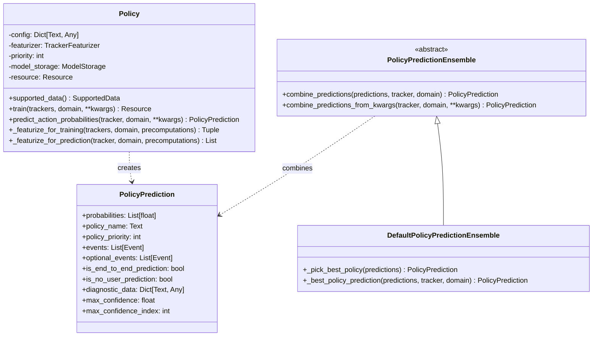
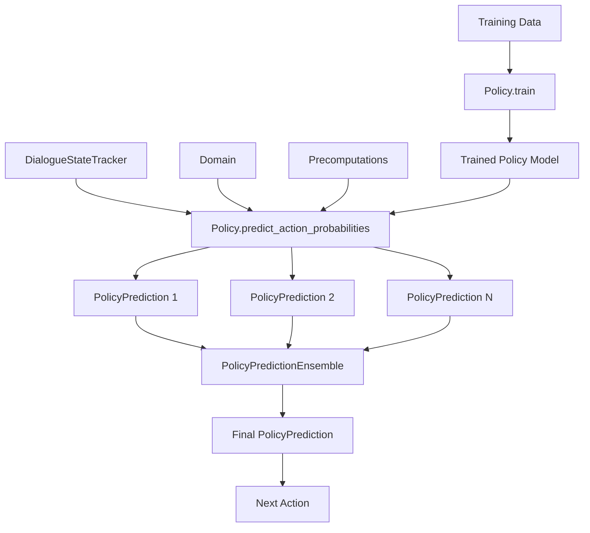
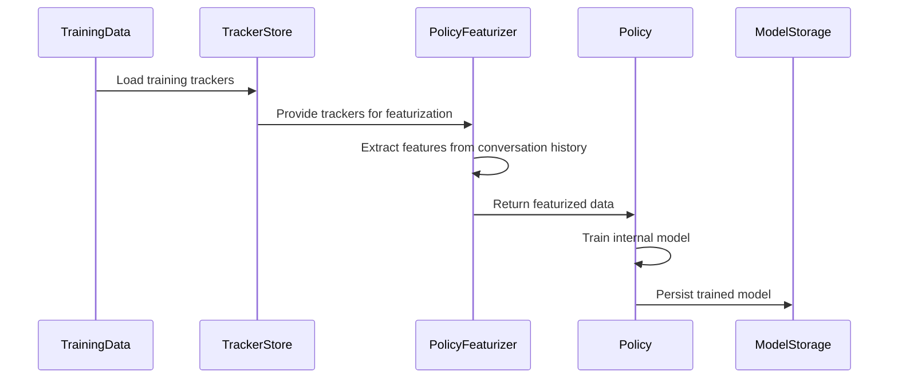
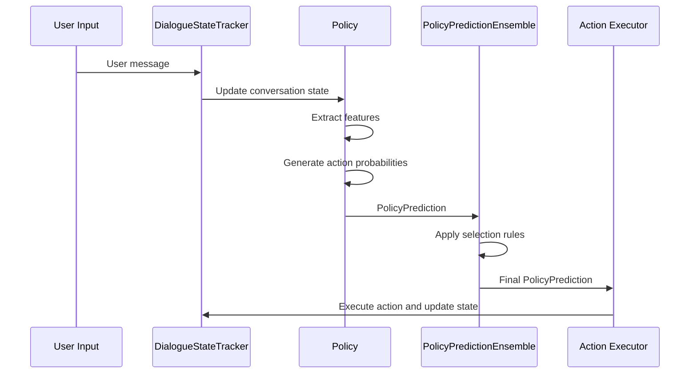
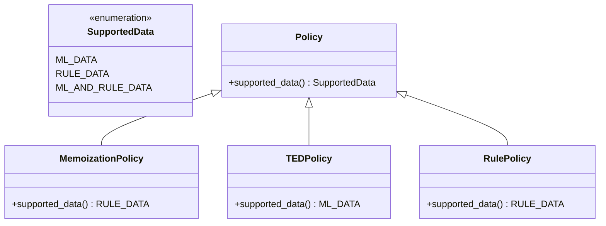

# Policy Base and Ensemble Module

## Introduction

The Policy Base and Ensemble module forms the foundation of Rasa's dialogue management system, providing the core abstractions and mechanisms for action selection in conversational AI. This module implements the base policy interface and ensemble mechanisms that coordinate multiple dialogue policies to make intelligent decisions about the next action a conversational assistant should take.

The module is essential for building robust dialogue systems that can handle complex conversation flows, combining different policy strategies (rule-based, machine learning-based, and hybrid approaches) into a unified decision-making framework.

## Core Architecture

### Policy Base Architecture

The module is built around two fundamental abstractions:

1. **Policy**: The base class that defines the interface for all dialogue policies
2. **PolicyPrediction**: A data structure that encapsulates policy predictions with metadata
3. **PolicyPredictionEnsemble**: An abstract interface for combining multiple policy predictions
4. **DefaultPolicyPredictionEnsemble**: The default implementation that applies priority-based selection rules

### Data Flow Architecture

## Core Components

### Policy Base Class

The `Policy` class serves as the abstract base for all dialogue policies in Rasa. It provides:

- **Training Interface**: Abstract `train()` method for policy training
- **Prediction Interface**: Abstract `predict_action_probabilities()` method for action selection
- **Featurization Support**: Built-in support for tracker featurization through configurable featurizers
- **Data Type Support**: Defines what types of training data the policy supports (ML data, rule data, or both)
- **Priority System**: Configurable priority system for ensemble decision making

Key responsibilities:
- Transform conversation trackers into feature representations
- Train machine learning models or encode rule-based logic
- Generate action probability distributions
- Handle different types of training data (stories vs rules)

### PolicyPrediction Class

The `PolicyPrediction` class encapsulates all information about a policy's prediction:

- **Action Probabilities**: Confidence scores for each possible action
- **Policy Metadata**: Name and priority of the policy making the prediction
- **Events**: Mandatory and optional events to be applied to the tracker
- **Prediction Type Flags**: Indicators for end-to-end vs intent-based predictions
- **Diagnostic Data**: Additional information for debugging and analysis

### PolicyPredictionEnsemble Interface

The ensemble interface defines how multiple policy predictions are combined:

- **Abstract Combination Method**: `combine_predictions()` must be implemented by concrete ensembles
- **Kwargs Support**: Convenience method for extracting predictions from keyword arguments
- **Flexible Architecture**: Allows for different ensemble strategies

### DefaultPolicyPredictionEnsemble

The default ensemble implements a sophisticated priority-based selection algorithm:

**Selection Rules (in order of precedence):**
1. **No-user predictions** overrule all other predictions (e.g., happy path loop predictions)
2. **End-to-end predictions** overrule intent-based predictions (when no no-user predictions exist)
3. **Maximum confidence** determines the winner when prediction types are equal
4. **Policy priority** breaks ties when confidence scores are equal

**Additional Features:**
- **Action Rejection Handling**: Sets probability to 0.0 for previously rejected actions
- **Event Combination**: Merges mandatory events from all policies and optional events from the winning policy
- **User Utterance Tracking**: Adds appropriate featurization events for user inputs

## Integration with Rasa Core

### Policy Training Pipeline

### Prediction Pipeline

## Policy Types and Specialization

The base policy architecture supports various specialized policy implementations:

### Supported Data Types

### Policy Priority System

Policies are assigned priorities that influence ensemble decisions:
- **Higher priority** policies win when confidence scores are tied
- **Configurable** through the `priority` parameter
- **Default priority** is 1, but can be adjusted per policy

## Key Features and Capabilities

### 1. Flexible Featurization

The policy base supports pluggable featurizers:
- **Tracker Featurizers**: Convert conversation history to feature representations
- **State Featurizers**: Handle individual conversation states
- **Configurable**: Policies can specify custom featurizer configurations
- **Precomputation Support**: Optimized feature computation for training

### 2. Multi-Policy Coordination

The ensemble mechanism enables:
- **Policy Diversity**: Different policies can specialize in different conversation aspects
- **Fallback Strategies**: Multiple policies provide robustness through redundancy
- **Confidence-based Selection**: Intelligent decision making based on prediction confidence
- **Event Coordination**: Proper handling of events from multiple policies

### 3. Training Data Flexibility

Policies can specialize in different training data types:
- **ML-based Training**: Stories and conversation flows
- **Rule-based Training**: Explicit rules and conditions
- **Hybrid Training**: Both stories and rules

### 4. Diagnostic and Debugging Support

Built-in support for:
- **Prediction Metadata**: Track which policy made each prediction
- **Diagnostic Data**: Store intermediate results for analysis
- **State Formatting**: Human-readable conversation state representation
- **Event Tracking**: Detailed event history for debugging

## Error Handling and Edge Cases

### Action Rejection

The ensemble handles action execution rejection by:
- **Zeroing Probabilities**: Setting rejected action confidence to 0.0
- **Re-prediction**: Allowing other policies to provide alternative actions
- **Logging**: Detailed logging of rejection events

### Empty Predictions

The system handles cases where:
- **No Policies Predict**: Raises appropriate exceptions
- **All Confidences Zero**: Falls back to default behavior
- **Policy Failures**: Graceful degradation with logging

## Performance Considerations

### Optimization Strategies

1. **Feature Precomputation**: Caching features during training
2. **Efficient Ensemble**: O(n) selection algorithm where n is number of policies
3. **Memory Management**: Proper cleanup of temporary data structures
4. **Batch Processing**: Support for batch prediction when applicable

### Scalability

- **Policy Count**: Linear scaling with number of policies
- **Action Space**: Efficient handling of large action spaces
- **Conversation Length**: Optimized for long conversation histories
- **Memory Usage**: Configurable history limits through max_history parameter

## Configuration and Customization

### Policy Configuration

Policies are configured through:
- **Priority Settings**: Adjust policy priority for ensemble behavior
- **Featurizer Configuration**: Specify custom featurizers
- **Max History**: Control conversation history consideration
- **Data Support**: Configure supported training data types

### Ensemble Customization

The ensemble behavior can be customized by:
- **Custom Ensemble Classes**: Implementing `PolicyPredictionEnsemble` interface
- **Selection Rules**: Defining custom prediction selection logic
- **Event Handling**: Custom event combination strategies
- **Logging**: Custom diagnostic and debugging information

## Dependencies and Integration

### Core Dependencies

- **[Dialogue Management Core](Dialogue Management Core.md)**: Integrates with `DialogueStateTracker` and `Domain`
- **[Core Featurization](Core Featurization.md)**: Uses `TrackerFeaturizer` and `SingleStateFeaturizer`
- **[Execution Engine](Execution Engine & Graph Components.md)**: Implements `GraphComponent` interface
- **[Domain & Training Data](Domain & Training Data.md)**: Works with `Domain`, `StoryGraph`, and training data structures

### Related Modules

- **[Memoization Policies](Memoization Policies.md)**: Rule-based policies built on this base
- **[TED Policy](TED Policy.md)**: Machine learning policy using this architecture
- **[Rule Policies](Rule Policies.md)**: Rule-based policies extending the base
- **[UnexpecTED Intent Policy](UnexpecTED Intent Policy.md)**: Specialized policy for intent handling

## Best Practices

### Policy Development

1. **Implement Required Methods**: Always implement `train()` and `predict_action_probabilities()`
2. **Use Proper Featurization**: Leverage the built-in featurization support
3. **Handle Edge Cases**: Consider action rejection and empty predictions
4. **Provide Diagnostic Data**: Include debugging information in predictions
5. **Set Appropriate Priorities**: Configure policy priorities based on importance

### Ensemble Configuration

1. **Policy Diversity**: Use policies with different strengths and specializations
2. **Priority Ordering**: Configure priorities to reflect policy reliability
3. **Testing**: Test ensemble behavior with various conversation scenarios
4. **Monitoring**: Monitor which policies are making predictions in production

## Conclusion

The Policy Base and Ensemble module provides a robust, extensible foundation for dialogue management in Rasa. Its architecture supports diverse policy implementations while providing sophisticated mechanisms for combining their predictions. The module's design enables both simple rule-based systems and complex machine learning models to work together seamlessly, making it suitable for a wide range of conversational AI applications.

The combination of the flexible Policy base class, comprehensive PolicyPrediction data structure, and intelligent ensemble mechanisms creates a powerful framework for building sophisticated dialogue systems that can handle complex, multi-turn conversations with high reliability and performance.