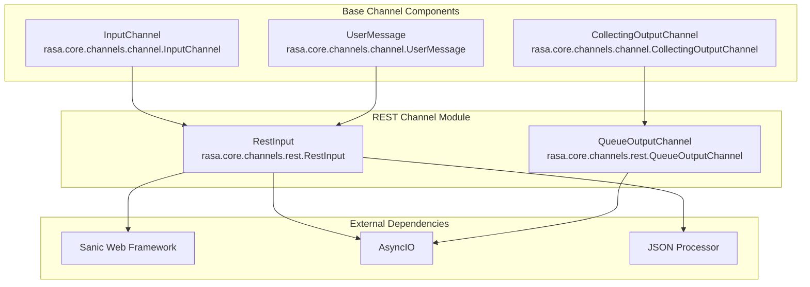
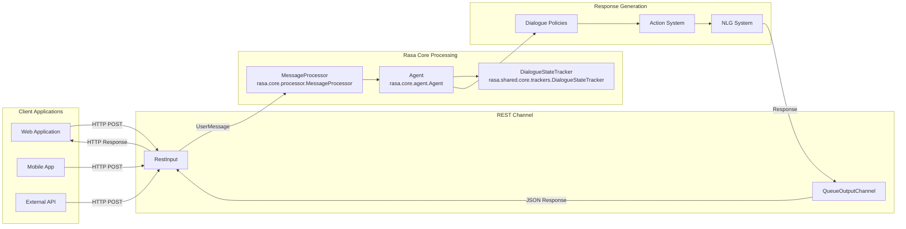
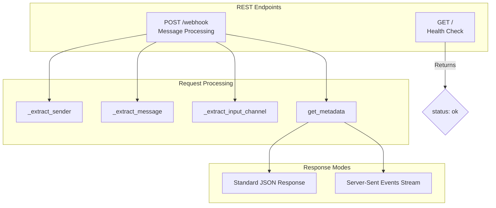
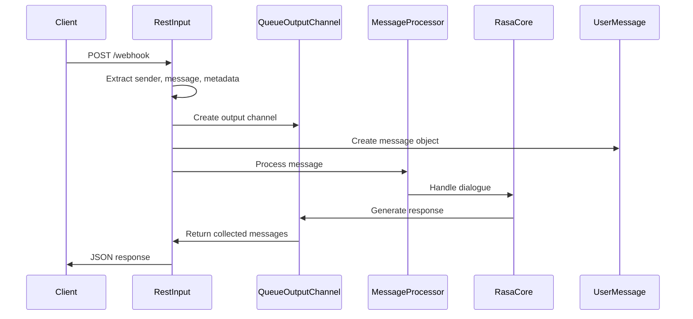
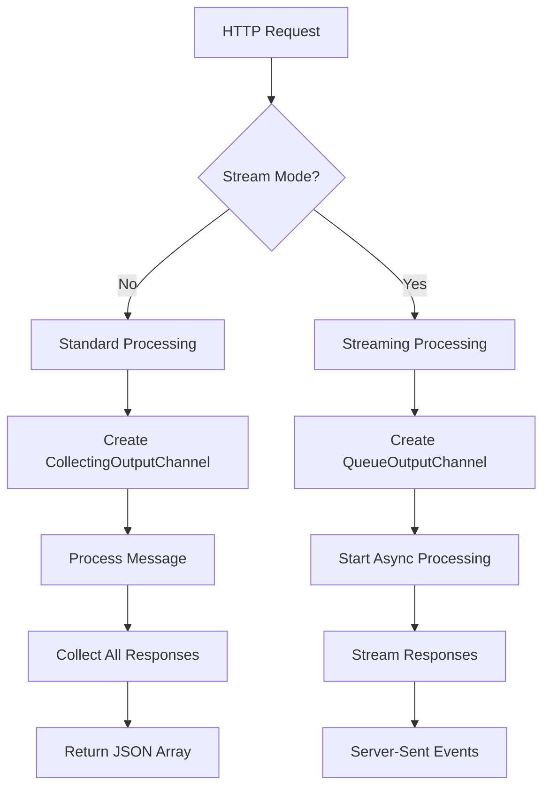
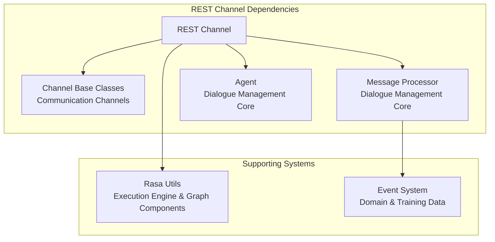
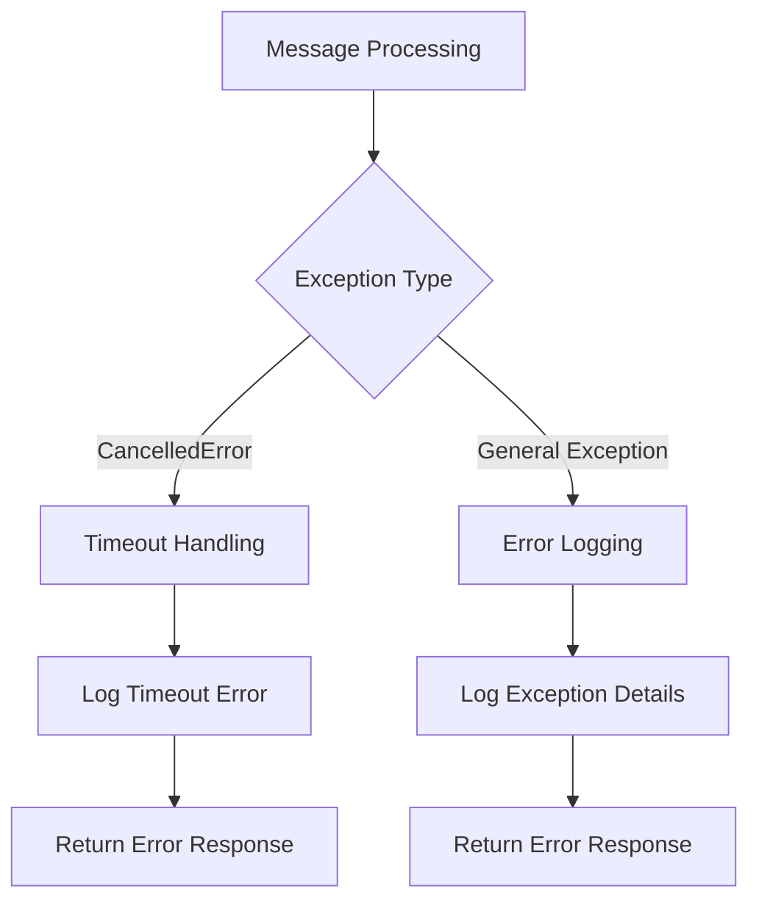

# REST Channel Module Documentation

## Introduction

The REST Channel module provides HTTP-based communication capabilities for Rasa assistants, enabling external applications and services to interact with Rasa through RESTful endpoints. This module implements a bidirectional communication channel that processes incoming messages and returns assistant responses via HTTP requests.

## Core Purpose

The REST Channel serves as the primary interface for integrating Rasa assistants with web applications, mobile apps, and other HTTP-based clients. It provides both synchronous and streaming response capabilities, making it suitable for real-time chat applications and batch processing scenarios.

## Architecture Overview

### Component Structure



### Integration with Rasa Core



## Core Components

### RestInput

The `RestInput` class is the primary component that implements the HTTP input channel functionality. It extends the base `InputChannel` class and provides RESTful endpoints for message processing.

#### Key Features:
- **HTTP Endpoint Management**: Creates and manages Sanic blueprint with webhook endpoints
- **Message Processing**: Extracts and validates incoming messages from HTTP requests
- **Streaming Support**: Provides both synchronous and streaming response capabilities
- **Metadata Extraction**: Handles additional context information from incoming requests

#### REST Endpoints:



#### Message Processing Flow:



### QueueOutputChannel

The `QueueOutputChannel` is a specialized output channel that collects messages in an asynchronous queue, enabling real-time streaming of responses.

#### Key Features:
- **Asynchronous Queue**: Uses AsyncIO Queue for non-blocking message collection
- **Streaming Capability**: Supports real-time response streaming
- **Message Persistence**: Temporarily stores messages before transmission
- **Thread Safety**: Handles concurrent message processing safely

## Data Flow Architecture

### Standard Request-Response Flow



### Message Format

#### Incoming Message Structure:
```json
{
    "sender": "user123",
    "message": "Hello, how are you?",
    "metadata": {
        "timestamp": "2024-01-01T12:00:00Z",
        "source": "web_chat"
    }
}
```

#### Response Message Structure:
```json
[
    {
        "recipient_id": "user123",
        "text": "I'm doing well, thank you!"
    },
    {
        "recipient_id": "user123",
        "text": "How can I help you today?"
    }
]
```

## Integration with Other Modules

### Dependency Relationships



### Configuration and Usage

The REST Channel is typically configured in the `credentials.yml` file:

```yaml
rest:
  # Basic configuration
  url: "http://localhost:5005"
  
  # Optional: Custom webhook path
  webhook_path: "/webhook"
  
  # Optional: CORS configuration
  cors_origins:
    - "*"
```

## Error Handling and Resilience

### Exception Management



### Logging and Monitoring

The module implements comprehensive logging using both standard logging and structured logging:
- **Timeout Events**: Logged when message processing exceeds time limits
- **Processing Failures**: Detailed exception logging for debugging
- **Message Flow**: Structured logging for message lifecycle tracking

## Performance Considerations

### Scalability Features
- **Asynchronous Processing**: Non-blocking message handling using AsyncIO
- **Queue-based Architecture**: Efficient message queuing for high-throughput scenarios
- **Streaming Support**: Reduces memory footprint for long-running conversations

### Optimization Strategies
- **Connection Pooling**: Reuse HTTP connections for better performance
- **Message Batching**: Efficient handling of multiple responses
- **Resource Management**: Proper cleanup of async tasks and queues

## Security Considerations

### Input Validation
- **JSON Schema Validation**: Ensures incoming data conforms to expected format
- **Sender ID Sanitization**: Prevents injection attacks
- **Metadata Filtering**: Removes potentially harmful metadata

### Best Practices
- **HTTPS Enforcement**: Always use secure connections in production
- **Authentication**: Implement proper authentication mechanisms
- **Rate Limiting**: Protect against abuse and DoS attacks
- **CORS Configuration**: Properly configure cross-origin resource sharing

## Testing and Development

### Local Development Setup
```bash
# Start Rasa with REST channel
rasa run --enable-api --cors "*" --port 5005

# Test the endpoint
curl -X POST http://localhost:5005/webhook \
  -H "Content-Type: application/json" \
  -d '{"sender": "test", "message": "Hello"}'
```

### Integration Testing
- **Unit Tests**: Test individual components in isolation
- **Integration Tests**: Verify end-to-end message flow
- **Load Testing**: Ensure performance under high load
- **Security Testing**: Validate input handling and security measures

## Future Enhancements

### Potential Improvements
- **WebSocket Support**: Real-time bidirectional communication
- **GraphQL Interface**: Modern API interface option
- **Enhanced Streaming**: Better streaming protocols and compression
- **Metrics Integration**: Built-in performance and usage metrics
- **Multi-tenancy**: Support for multiple assistant instances

## Related Documentation

- [Communication Channels](Communication Channels.md) - Overview of all channel types
- [Dialogue Management Core](Dialogue Management Core.md) - Message processing and agent logic
- [Execution Engine & Graph Components](Execution Engine & Graph Components.md) - System architecture and utilities
- [Domain & Training Data](Domain & Training Data.md) - Conversation context and event handling