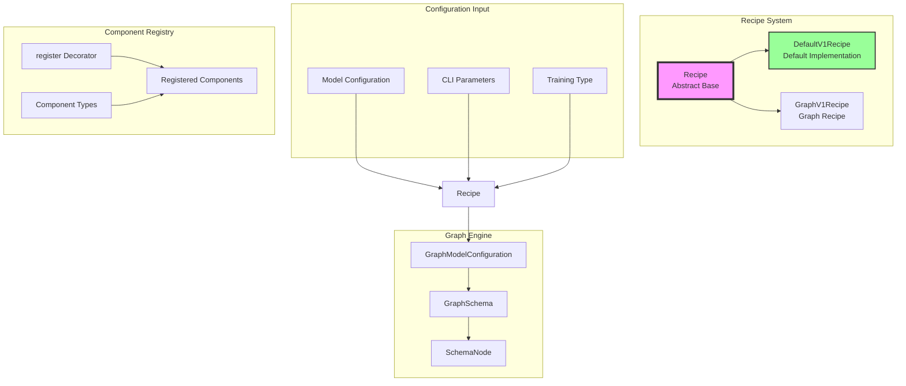
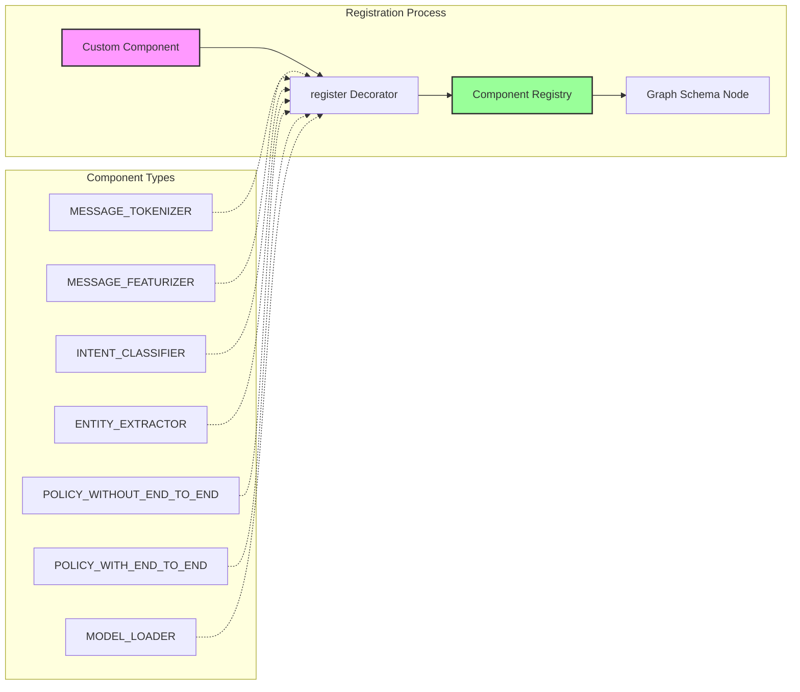
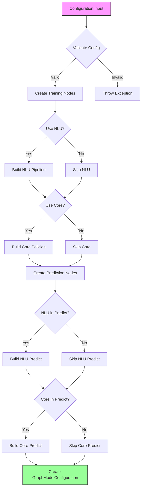
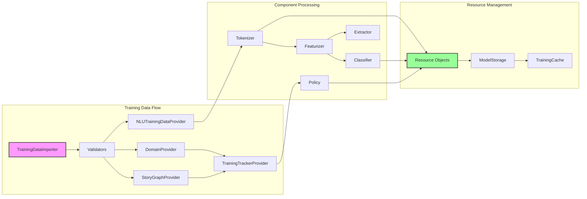
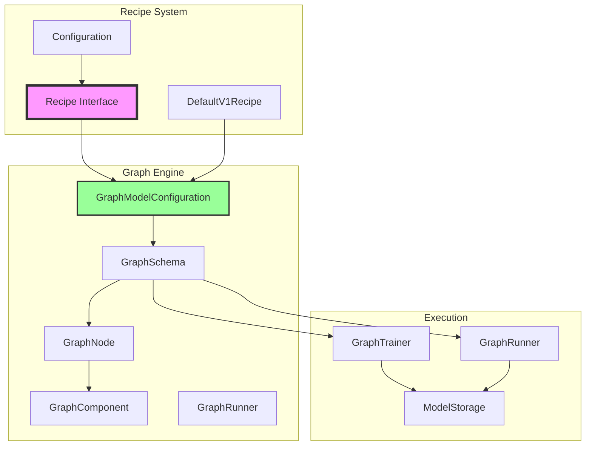

# Recipe System Documentation

## Introduction

The Recipe System is a core component of Rasa's execution engine that converts model configurations into executable graph schemas. It serves as the bridge between high-level configuration files and the low-level graph execution framework, enabling flexible and extensible model training and inference pipelines.

The Recipe System provides a pluggable architecture where different recipes can implement various strategies for converting configurations into graph structures. The default implementation (`DefaultV1Recipe`) handles the standard Rasa NLU and Core components, while allowing for custom recipes to extend functionality.

## Architecture Overview



## Core Components

### Recipe (Abstract Base Class)

The `Recipe` abstract base class defines the interface that all recipe implementations must follow. It provides:

- **Recipe Selection**: Static method to instantiate appropriate recipe based on name
- **Configuration Conversion**: Abstract method to convert config to graph schema
- **Auto-configuration**: Optional method to fill missing configuration with defaults

Key responsibilities:
- Convert model configurations into executable graph schemas
- Handle different training types (NLU, Core, End-to-End)
- Support fine-tuning scenarios
- Provide auto-configuration capabilities

### DefaultV1Recipe

The `DefaultV1Recipe` is the primary implementation that handles standard Rasa components. It provides:

- **Component Registration**: Decorator-based system for registering graph components
- **Graph Construction**: Builds training and prediction graphs from configurations
- **Auto-configuration**: Automatically fills missing configuration sections
- **End-to-End Support**: Handles combined NLU and Core training

Key features:
- Supports NLU pipeline components (tokenizers, featurizers, classifiers, extractors)
- Supports Core policy components (memoization, rule-based, TED, etc.)
- Handles model providers (Spacy, Mitie)
- Manages training vs. inference graph differences

## Component Registration System



### Component Types

The `DefaultV1Recipe.ComponentType` enum categorizes components for proper graph placement:

- **MESSAGE_TOKENIZER**: Tokenizes user messages
- **MESSAGE_FEATURIZER**: Creates features from messages
- **INTENT_CLASSIFIER**: Classifies user intents
- **ENTITY_EXTRACTOR**: Extracts entities from messages
- **POLICY_WITHOUT_END_TO_END_SUPPORT**: Core policies without e2e support
- **POLICY_WITH_END_TO_END_SUPPORT**: Core policies with e2e support
- **MODEL_LOADER**: Provides pre-trained models (Spacy, Mitie)

### Registration Process

Components are registered using the `@DefaultV1Recipe.register` decorator:

```python
@DefaultV1Recipe.register(
    component_types=DefaultV1Recipe.ComponentType.INTENT_CLASSIFIER,
    is_trainable=True
)
class MyIntentClassifier(GraphComponent):
    # Implementation
```

## Graph Construction Process



### Training Graph Construction

The training graph is built in several phases:

1. **Validation Phase**: Schema and finetuning validation
2. **Data Provider Phase**: NLU training data, domain, stories, forms
3. **NLU Training Phase**: Pipeline components in sequence
4. **Core Training Phase**: Policy training with trackers
5. **End-to-End Phase**: Optional e2e feature computation

### Prediction Graph Construction

The prediction graph mirrors the training graph but:
- Uses `load` instead of `create` for trained components
- Connects to different input sources (messages, trackers)
- Includes prediction ensemble for policy decisions

## Data Flow



## Auto-Configuration System

The Recipe System includes sophisticated auto-configuration capabilities:

### Configuration Completion
- Detects missing configuration sections
- Provides sensible defaults based on training type
- Preserves user-provided configurations
- Adds explanatory comments to config files

### Training Type Support
- **NLU Only**: Configures only NLU pipeline
- **Core Only**: Configures only policies
- **Both**: Configures complete system
- **End-to-End**: Enables e2e training features

### Default Configuration Sources
- Reads from `config_files/default_config.yml`
- Provides commented-out defaults in config files
- Handles different component requirements
- Supports plugin modifications

## Integration with Graph Engine



## Error Handling

The Recipe System implements comprehensive error handling:

### Configuration Errors
- `InvalidRecipeException`: Invalid recipe name specified
- `InvalidConfigException`: Missing or invalid configuration
- `DefaultV1RecipeRegisterException`: Invalid component registration

### Validation Errors
- Schema validation failures
- Missing required components
- Invalid component combinations
- Training type mismatches

### Runtime Errors
- Component loading failures
- Resource resolution issues
- Graph execution problems

## Extension Points

### Custom Recipes
Implement the `Recipe` interface to create custom configuration strategies:

```python
class CustomRecipe(Recipe):
    def graph_config_for_recipe(self, config, cli_params, training_type, is_finetuning):
        # Custom graph construction logic
        return GraphModelConfiguration(...)
```

### Component Registration
Register custom components using the decorator pattern:

```python
@DefaultV1Recipe.register(
    component_types=[DefaultV1Recipe.ComponentType.INTENT_CLASSIFIER],
    is_trainable=True,
    model_from="spacy_nlp_provider"  # Optional model dependency
)
class CustomClassifier(GraphComponent):
    # Implementation
```

### Plugin Integration
The Recipe System supports plugin hooks for graph modification:
- `modify_default_recipe_graph_train_nodes`
- `modify_default_recipe_graph_predict_nodes`

## Best Practices

### Configuration Management
- Always specify recipe explicitly (will be required in Rasa 4.0+)
- Use auto-configuration for quick prototyping
- Review and customize auto-generated configurations
- Keep configurations under version control

### Component Development
- Register components with appropriate types
- Implement proper `GraphComponent` interfaces
- Use model providers for external dependencies
- Handle both training and inference scenarios

### Recipe Extension
- Extend `DefaultV1Recipe` for incremental changes
- Implement `Recipe` interface for completely new strategies
- Maintain backward compatibility
- Document configuration requirements

## Related Documentation

- [Execution Engine & Graph Components](Execution%20Engine%20%26%20Graph%20Components.md) - Graph execution framework
- [NLU Pipeline](NLU%20Pipeline.md) - NLU component details
- [Dialogue Policies](Dialogue%20Policies.md) - Core policy components
- [Domain & Training Data](Domain%20%26%20Training%20Data.md) - Configuration and data structures

## Summary

The Recipe System is the configuration-to-execution bridge in Rasa, providing:

1. **Flexible Configuration**: Converts high-level configs to executable graphs
2. **Component Management**: Registration and lifecycle management for all components
3. **Auto-Configuration**: Intelligent defaults and configuration completion
4. **Extensibility**: Plugin system and custom recipe support
5. **Multi-Modal Support**: Handles NLU, Core, and End-to-End training scenarios

This system enables Rasa to maintain a clean separation between configuration concerns and execution details while providing powerful extensibility mechanisms for advanced use cases.