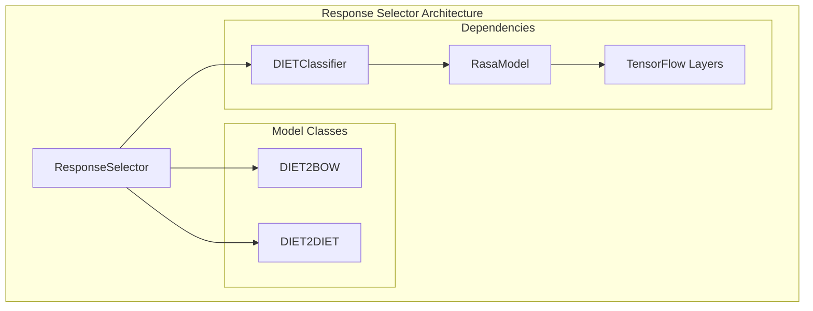
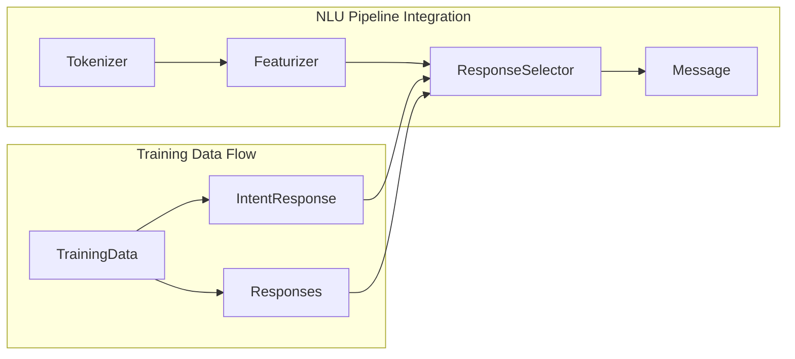
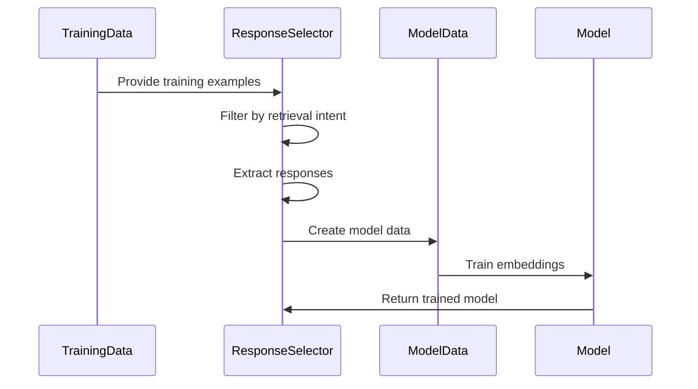
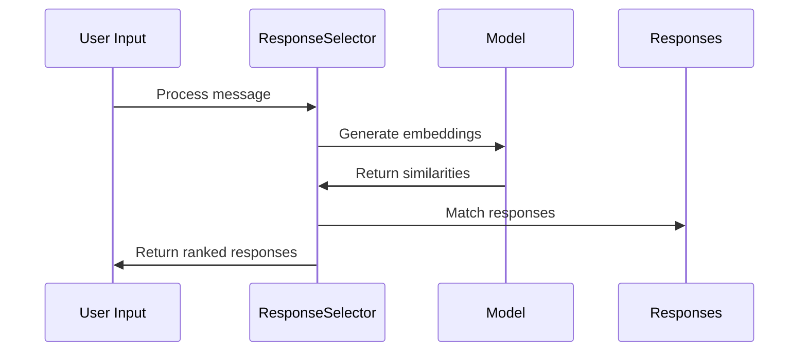
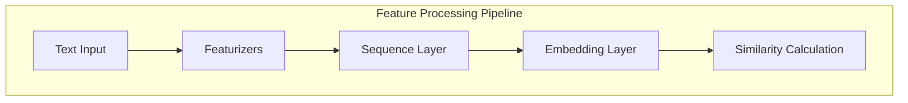

# Response Selectors Module

## Introduction

The Response Selectors module is a critical component of Rasa's NLU pipeline that handles response selection for retrieval-based conversational AI. It uses supervised embeddings to match user inputs with appropriate responses by embedding both user messages and candidate responses into the same vector space. This module is particularly useful for building FAQ bots, customer support systems, and other applications where responses can be pre-defined and retrieved based on user intent.

## Overview

ResponseSelector extends the DIETClassifier architecture to specifically handle response selection tasks. It trains supervised embeddings that maximize similarity between user inputs and their corresponding responses, while also providing rankings of alternative responses. The module supports both bag-of-words (DIET2BOW) and sequence-to-sequence (DIET2DIET) approaches for response matching.

## Architecture

### Core Components



### Component Relationships



## Key Features

### 1. Dual Model Architecture
- **DIET2BOW**: Uses bag-of-words approach for response matching
- **DIET2DIET**: Uses sequence-to-sequence transformer approach for more sophisticated matching

### 2. Supervised Embedding Training
- Embeds user messages and responses in the same vector space
- Maximizes similarity between matching pairs
- Supports both cosine and inner product similarity measures

### 3. Flexible Response Selection
- Can be trained on specific retrieval intents or all retrieval intents
- Supports using response text as labels or intent-response keys
- Provides confidence scores and rankings for multiple responses

### 4. Advanced Neural Architecture
- Transformer-based encoding with configurable layers and attention heads
- Support for relative position embeddings
- Optional masked language modeling for better representation learning

## Configuration

### Default Configuration
```yaml
ResponseSelector:
  # Architecture parameters
  hidden_layers_sizes:
    text: [256, 128]
    label: [256, 128]
  share_hidden_layers: false
  transformer_size: null
  num_transformer_layers: 0
  num_heads: 4
  
  # Training parameters
  batch_sizes: [64, 256]
  batch_strategy: balanced
  epochs: 300
  learning_rate: 0.001
  
  # Embedding parameters
  embedding_dimension: 20
  num_neg: 20
  similarity_type: auto
  loss_type: cross_entropy
  ranking_length: 10
  
  # Regularization
  regularization_constant: 0.002
  drop_rate: 0.2
  
  # Response selection specific
  retrieval_intent: null
  use_text_as_label: false
```

### Key Configuration Options

| Parameter | Description | Default |
|-----------|-------------|---------|
| `retrieval_intent` | Specific intent to train on | `null` (all intents) |
| `use_text_as_label` | Use response text as labels | `false` |
| `transformer_size` | Transformer hidden size | `null` |
| `num_transformer_layers` | Number of transformer layers | `0` |
| `ranking_length` | Number of top responses to return | `10` |
| `similarity_type` | Similarity measure (auto/cosine/inner) | `auto` |

## Data Flow

### Training Process



### Inference Process



## Integration with NLU Pipeline

### Required Components
- **Featurizer**: Must be present in the pipeline before ResponseSelector
- **Tokenizer**: Required for text processing
- **CountVectorsFeaturizer**: Recommended for feature extraction

### Pipeline Example
```yaml
pipeline:
  - name: SpacyNLP
  - name: SpacyTokenizer
  - name: CountVectorsFeaturizer
  - name: ResponseSelector
    epochs: 300
    retrieval_intent: faq
```

## Model Architecture Details

### DIET2BOW Model
- Treats responses as bag-of-words
- Simpler and faster training
- Suitable for shorter responses

### DIET2DIET Model
- Full sequence-to-sequence approach
- Better for complex, contextual responses
- Uses transformer architecture for encoding

### Feature Processing


## Training Process

### Data Preparation
1. **Intent Filtering**: Filters training examples based on `retrieval_intent`
2. **Label Extraction**: Extracts labels from either response text or intent-response keys
3. **Response Collection**: Gathers all available responses for matching

### Model Training
1. **Embedding Learning**: Trains embeddings to maximize similarity between user inputs and correct responses
2. **Negative Sampling**: Uses negative examples to improve discrimination
3. **Loss Optimization**: Supports both cross-entropy and margin-based loss functions

## Response Selection Process

### Inference Steps
1. **Input Processing**: Processes user message through the pipeline
2. **Embedding Generation**: Generates embeddings for the user input
3. **Similarity Calculation**: Computes similarities with all candidate responses
4. **Ranking**: Ranks responses by similarity/confidence scores
5. **Response Matching**: Maps predictions to actual response texts

### Output Format
```json
{
  "response_selector": {
    "default": {
      "response": {
        "responses": [{"text": "Response text"}],
        "confidence": 0.95,
        "intent_response_key": "faq/ask_price",
        "utter_action": "utter_faq/ask_price"
      },
      "ranking": [
        {"confidence": 0.95, "intent_response_key": "faq/ask_price"},
        {"confidence": 0.12, "intent_response_key": "faq/ask_features"}
      ]
    }
  }
}
```

## Error Handling and Validation

### Configuration Validation
- Checks for transformer and hidden layer conflicts
- Validates similarity type and loss function compatibility
- Ensures proper feature dimensions

### Training Data Validation
- Verifies presence of responses for all retrieval intents
- Checks consistency between intent-response keys and responses
- Handles missing or malformed training examples

### Runtime Error Handling
- Graceful fallback when responses are unavailable
- Warning messages for configuration issues
- Diagnostic data collection for debugging

## Performance Considerations

### Training Optimization
- **Batch Strategy**: Supports both sequence and balanced batching
- **Learning Rate**: Configurable with automatic adjustment
- **Regularization**: Multiple regularization techniques available

### Inference Optimization
- **Caching**: Embeddings can be cached for frequently used responses
- **Ranking Length**: Configurable number of top responses to consider
- **Model Confidence**: Softmax-based confidence calculation

## Dependencies

### Core Dependencies
- [DIETClassifier](Intent%20Classifiers.md): Base classifier architecture
- [Featurizer](Featurizers.md): Feature extraction components
- [RasaModel](TensorFlow%20Model%20Components.md): TensorFlow model base class
- [TrainingData](Domain%20&%20Training%20Data.md): Training data structures

### External Dependencies
- TensorFlow for neural network operations
- NumPy for numerical computations
- Rasa's shared utilities for data handling

## Best Practices

### Configuration
1. **Use appropriate featurizers**: CountVectorsFeaturizer is recommended
2. **Configure transformer layers**: Enable transformers for complex responses
3. **Set proper ranking length**: Balance between accuracy and performance
4. **Choose similarity type**: Use "auto" for most cases, "cosine" for normalized embeddings

### Training
1. **Provide diverse responses**: Ensure good coverage of possible user inputs
2. **Balance training data**: Avoid over-representation of certain intents
3. **Use appropriate epochs**: 300 epochs is default, adjust based on data size
4. **Monitor validation metrics**: Use evaluation parameters to prevent overfitting

### Deployment
1. **Test response coverage**: Ensure all expected responses are available
2. **Monitor confidence scores**: Set appropriate thresholds for response selection
3. **Handle fallbacks**: Implement fallback strategies for low-confidence predictions
4. **Regular retraining**: Update models as new responses are added

## Troubleshooting

### Common Issues
1. **Low response confidence**: Check training data quality and quantity
2. **Missing responses**: Verify response definitions in domain files
3. **Slow inference**: Consider reducing ranking length or model complexity
4. **Overfitting**: Adjust regularization parameters or reduce model capacity

### Diagnostic Information
- Attention weights for transformer models
- Text transformations during processing
- Similarity scores for debugging predictions
- Training metrics for performance monitoring

## Future Enhancements

### Potential Improvements
1. **Multi-language support**: Better handling of multilingual responses
2. **Contextual response selection**: Integration with dialogue context
3. **Dynamic response generation**: Hybrid retrieval-generation approaches
4. **Advanced similarity metrics**: Learned similarity functions
5. **Efficient large-scale retrieval**: Approximate nearest neighbor techniques

This documentation provides a comprehensive guide to understanding and using the Response Selectors module within the Rasa framework. For more specific implementation details, refer to the individual component documentation and configuration examples.