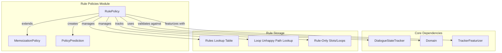
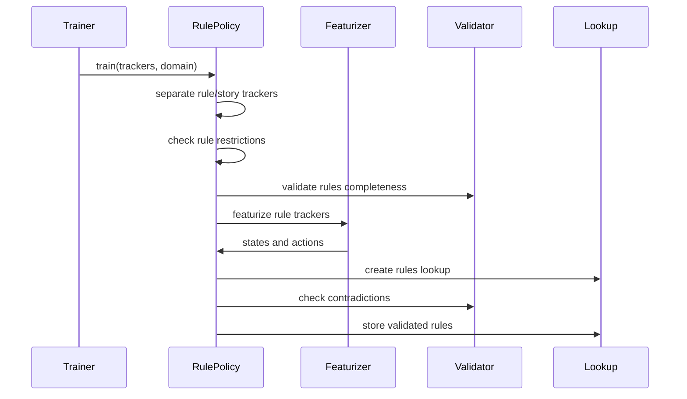
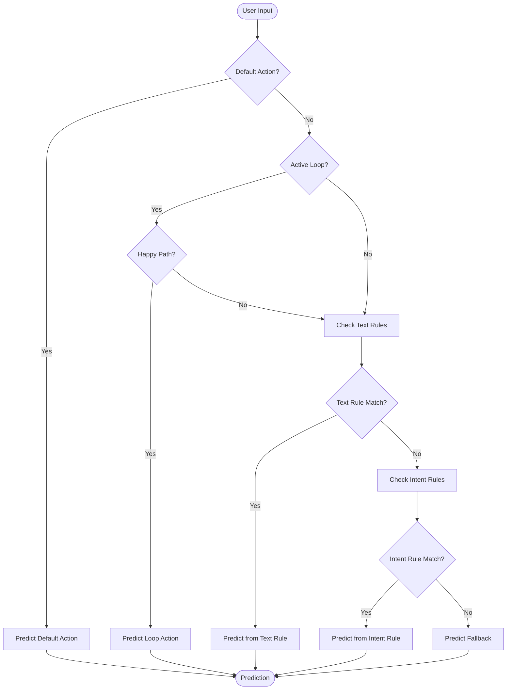
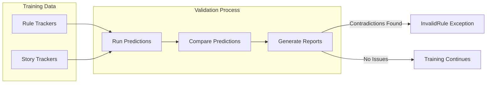
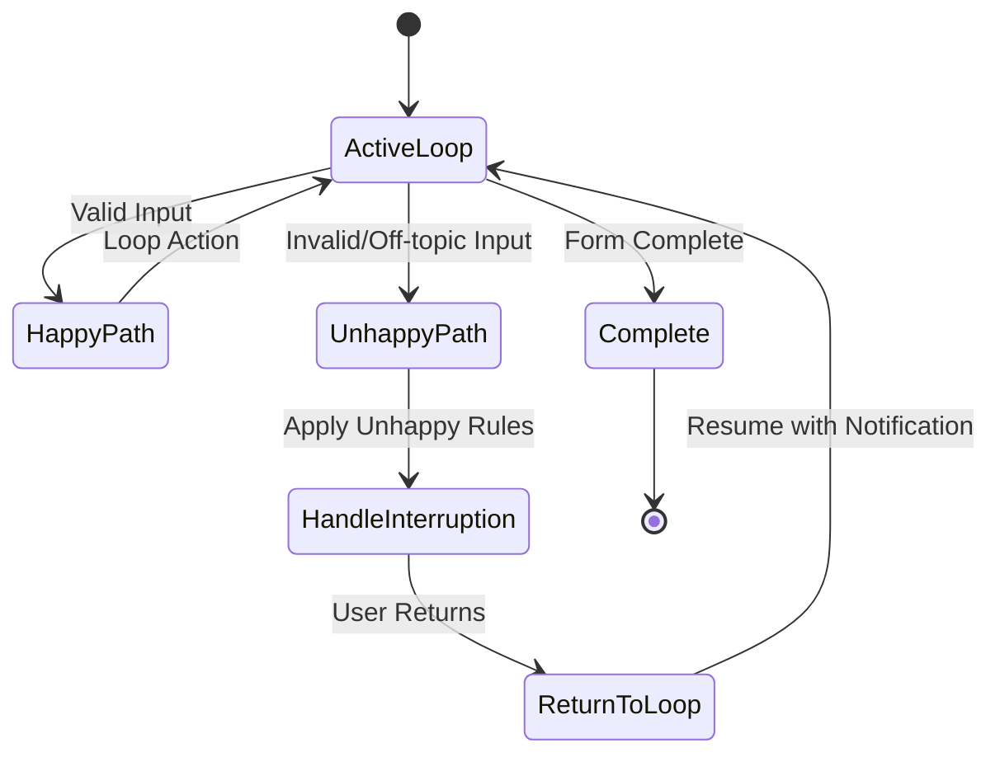

# Rule Policies Module Documentation

## Introduction

The Rule Policies module is a critical component of Rasa's dialogue management system that implements deterministic rule-based conversation handling. It provides a way to define and enforce specific conversation flows through explicit rules, ensuring predictable behavior in scenarios where machine learning policies might be insufficient or inappropriate.

Rule policies are particularly useful for handling:
- Standard conversation patterns (greetings, goodbyes)
- Form-based conversations with strict validation requirements
- Fallback scenarios when ML policies are uncertain
- Default system actions (restart, back, session management)
- Edge cases that require deterministic behavior

## Architecture Overview

The Rule Policies module is built around the `RulePolicy` class, which extends `MemoizationPolicy` to provide rule-based conversation handling capabilities. The architecture follows a hierarchical structure where rules are learned from training data and stored in lookup tables for efficient runtime prediction.



## Core Components

### RulePolicy Class

The `RulePolicy` class is the main component that implements rule-based conversation handling. It inherits from `MemoizationPolicy` and provides specialized functionality for rule processing, validation, and prediction.

**Key Responsibilities:**
- Rule learning and storage from training data
- Rule validation and contradiction detection
- Runtime prediction based on learned rules
- Loop handling for form-based conversations
- Fallback action prediction

**Configuration Options:**
- `core_fallback_threshold`: Confidence threshold for fallback predictions
- `core_fallback_action_name`: Action to predict when no rule matches
- `enable_fallback_prediction`: Whether to enable fallback predictions
- `restrict_rules`: Limit rules to maximum one user message
- `check_for_contradictions`: Validate rules against stories
- `use_nlu_confidence_as_score`: Use NLU confidence for rule scores

### Rule Learning Process

The rule learning process involves several stages to ensure rules are properly extracted, validated, and stored:



### Rule Prediction Flow

The prediction process follows a priority-based approach where different rule types are evaluated in a specific order:



## Rule Types and Priorities

### 1. Default Action Rules

Default action rules handle system-level intents that should always trigger specific actions regardless of conversation context:

- `restart` → `action_restart`
- `back` → `action_back`
- `session_start` → `action_session_start`

These rules have the highest priority and override all other rule types.

### 2. Loop Happy Path Rules

Loop rules handle form-based conversations where the system needs to maintain control over the conversation flow:

- Predict the active loop action when user provides valid input
- Predict `action_listen` after successful loop execution
- Handle loop interruption and resumption

### 3. General Conversation Rules

General rules handle specific conversation patterns defined by users:

- Intent-based rules: Match specific intents to actions
- Text-based rules: Match exact user text to actions
- Context-aware rules: Consider conversation history and slot values

### 4. Fallback Rules

Fallback rules provide default behavior when no specific rule matches:

- Predict configured fallback action with specified confidence
- Ensure the system always provides a response
- Handle out-of-scope user inputs

## Rule Validation and Contradiction Detection

The RulePolicy implements comprehensive validation to ensure rule consistency:

### Rule Restriction Checking

Rules are restricted to contain maximum one user message to prevent users from building state machines through rules. This ensures rules remain simple and predictable.

### Completeness Validation

The system checks that rules are complete by analyzing action fingerprints:

- **Slot Consistency**: Actions must set the same slots across all rules
- **Loop Consistency**: Forms must maintain consistent active loop settings
- **Action Completeness**: Rules must properly handle all expected outcomes

### Contradiction Detection

The system identifies contradictions between rules and stories:



## Loop Handling and Unhappy Paths

The RulePolicy provides sophisticated handling of form-based conversations, including support for unhappy paths where users deviate from the expected flow.

### Happy Path Handling

In the happy path scenario, the loop maintains control:

1. User provides valid input → Predict loop action
2. Loop action executes successfully → Predict `action_listen`
3. Process repeats until form is complete

### Unhappy Path Handling

When users deviate from the expected flow:

1. **Interruption Detection**: Identify when user asks unrelated questions
2. **Rule Application**: Apply specific rules for unhappy path scenarios
3. **Loop Notification**: Inform loop that it was interrupted
4. **Resumption**: Handle return to loop with appropriate validation



## Integration with Dialogue Management

The RulePolicy integrates with the broader dialogue management system through several mechanisms:

### Policy Ensemble Integration

RulePolicy works within the policy ensemble framework:

- **Priority-based Prediction**: Rules have specific priority levels
- **Confidence Scoring**: Provides confidence scores for predictions
- **Event Generation**: Can generate special events (e.g., `LoopInterrupted`)
- **Prediction Metadata**: Provides information about rule sources

### Tracker Integration

The policy interacts with dialogue state trackers:

- **State Featurization**: Converts tracker states to feature representations
- **History Analysis**: Examines conversation history for rule matching
- **Event Processing**: Updates internal state based on conversation events

### Domain Integration

Rule validation ensures compatibility with the domain:

- **Action Validation**: Confures configured actions exist in domain
- **Slot Validation**: Validates slot references in rules
- **Form Validation**: Ensures form names are valid

## Configuration and Usage

### Basic Configuration

```yaml
policies:
  - name: RulePolicy
    core_fallback_threshold: 0.4
    core_fallback_action_name: action_default_fallback
    enable_fallback_prediction: true
    restrict_rules: true
    check_for_contradictions: true
```

### Advanced Configuration

```yaml
policies:
  - name: RulePolicy
    core_fallback_threshold: 0.3
    core_fallback_action_name: custom_fallback_action
    enable_fallback_prediction: true
    restrict_rules: true
    check_for_contradictions: true
    use_nlu_confidence_as_score: false
```

### Rule Definition Examples

Rules are defined in the domain file or separate rule files:

```yaml
rules:
  - rule: Greeting rule
    steps:
      - intent: greet
      - action: utter_greet

  - rule: Form activation
    steps:
      - intent: request_info
      - action: info_form
      - active_loop: info_form

  - rule: Form completion
    steps:
      - active_loop: info_form
      - slot_was_set:
          - requested_slot: null
      - action: utter_submit
      - active_loop: null
```

## Error Handling and Debugging

### Common Issues

1. **Rule Contradictions**: Rules that conflict with stories or other rules
2. **Incomplete Rules**: Rules missing required slots or loop settings
3. **Invalid Actions**: Rules referencing non-existent actions
4. **Excessive User Turns**: Rules with too many user messages

### Debugging Tools

The RulePolicy provides extensive logging for debugging:

- Rule learning progress and statistics
- Prediction sources and reasoning
- Contradiction detection details
- Loop handling decisions

### Best Practices

1. **Keep Rules Simple**: Avoid complex multi-turn rules
2. **Use Stories for Complexity**: Prefer stories for complex flows
3. **Validate Regularly**: Run contradiction checks during development
4. **Document Rules**: Clearly document rule purposes and interactions
5. **Test Thoroughly**: Test rules with various conversation scenarios

## Performance Considerations

### Training Performance

- Rule learning is generally fast due to deterministic nature
- Contradiction checking can be time-consuming for large datasets
- Consider disabling contradiction checks for rapid prototyping

### Runtime Performance

- Rule prediction is highly efficient using lookup tables
- State matching is optimized with caching
- Loop handling adds minimal overhead

### Scalability

- Lookup tables scale well with rule complexity
- Memory usage increases with rule count
- Consider rule organization for large rule sets

## Dependencies and Related Modules

The RulePolicy module depends on several other Rasa components:

- **[Dialogue Policies](Dialogue%20Policies.md)**: Base policy framework and ensemble integration
- **[Dialogue Management Core](Dialogue%20Management%20Core.md)**: Tracker and domain integration
- **[Core Featurization](Core%20Featurization.md)**: State representation and feature extraction
- **[Domain & Training Data](Domain%20&%20Training%20Data.md)**: Rule definition and validation
- **[Execution Engine & Graph Components](Execution%20Engine%20&%20Graph%20Components.md)**: Training and execution framework

## Conclusion

The Rule Policies module provides a robust foundation for deterministic conversation handling in Rasa. By combining rule-based logic with machine learning policies, it enables developers to create reliable conversational AI systems that can handle both predictable scenarios and complex, context-dependent interactions. The module's comprehensive validation, sophisticated loop handling, and integration with the broader dialogue management system make it an essential component for production-ready conversational AI applications.