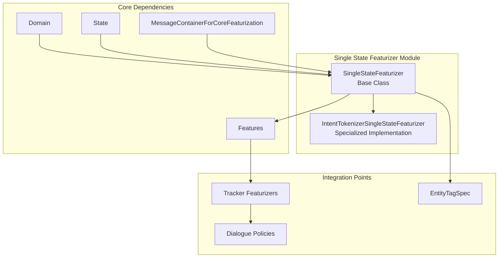
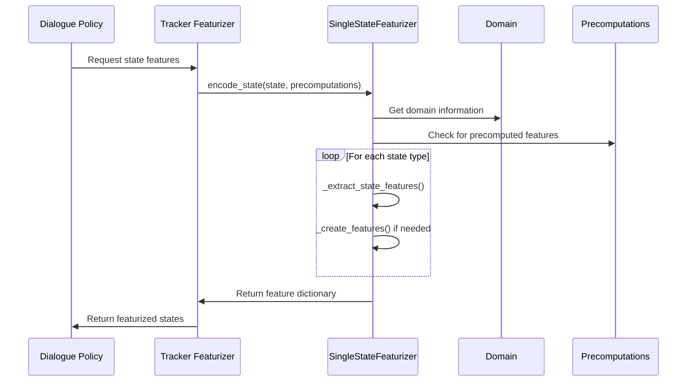
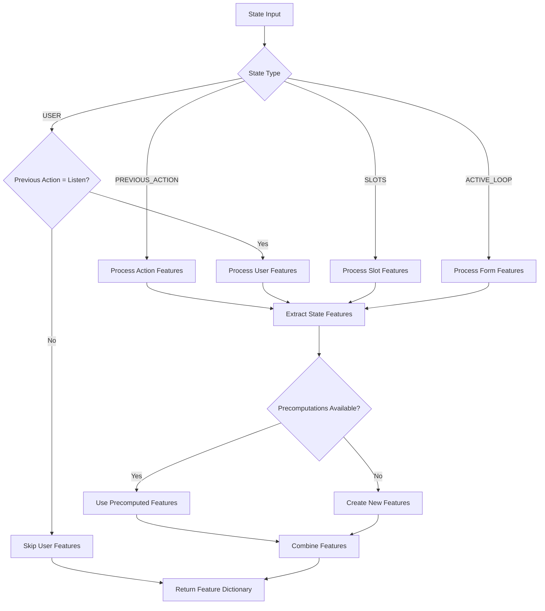
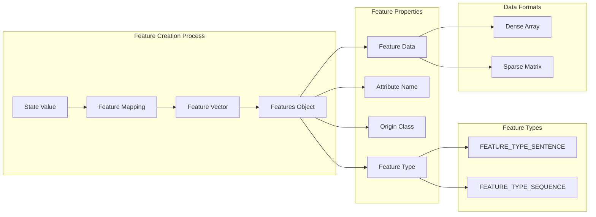
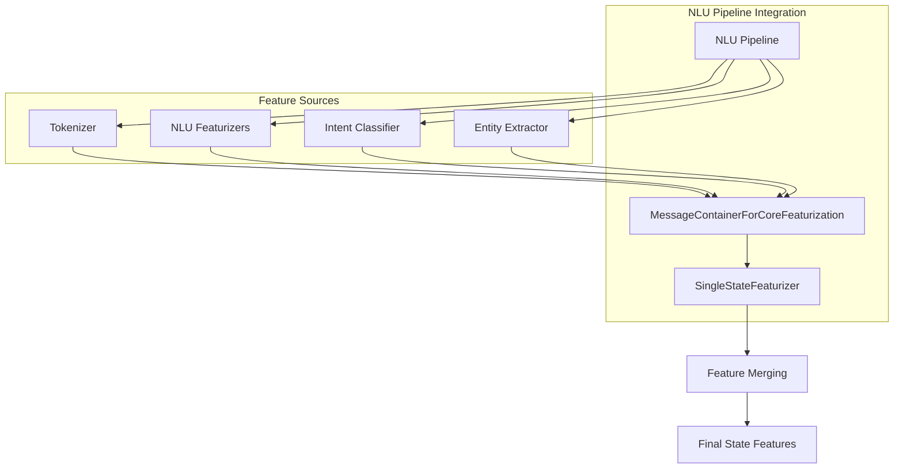
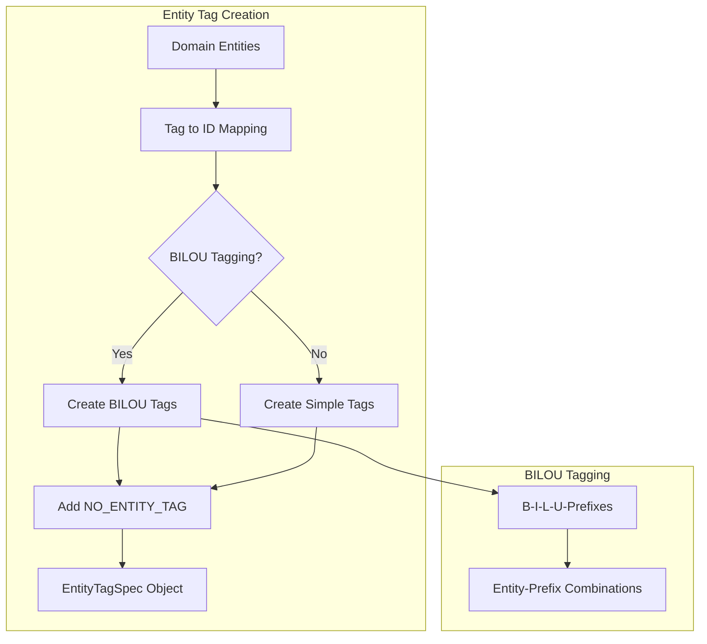
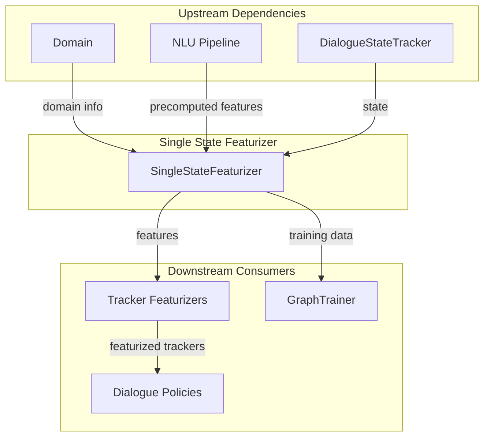

# Single State Featurizer Module

## Introduction

The Single State Featurizer module is a core component of Rasa's dialogue management system that transforms dialogue states into machine learning-compatible feature representations. It serves as a bridge between the symbolic dialogue state representation and the numerical features required by machine learning models in the Core pipeline.

This module is responsible for converting various aspects of the dialogue state - including user intents, actions, entities, slots, and active forms - into structured feature vectors that can be processed by dialogue policies. The featurization process is crucial for enabling machine learning models to understand and learn from conversational patterns.

## Architecture Overview

The Single State Featurizer module consists of two main components that work together to provide flexible state featurization capabilities:



## Core Components

### SingleStateFeaturizer

The `SingleStateFeaturizer` class is the base implementation that provides comprehensive state featurization capabilities. It handles the transformation of dialogue states into numerical features for all supported state attributes.

**Key Responsibilities:**
- Transform dialogue states into ML-compatible feature representations
- Support multiple state attributes: intents, actions, entities, slots, and active loops
- Handle both sparse and dense feature representations
- Manage entity tag specifications for entity recognition tasks
- Coordinate with NLU pipelines for precomputed features

**Core Attributes:**
- `_default_feature_states`: Dictionary mapping attributes to their possible values and indices
- `action_texts`: List of action text representations
- `entity_tag_specs`: List of entity tag specifications for entity recognition

### IntentTokenizerSingleStateFeaturizer

The `IntentTokenizerSingleStateFeaturizer` class is a specialized implementation designed for policies that predict intent labels rather than action labels. It extends the base class with intent-specific featurization capabilities.

**Key Differences:**
- Focuses on intent prediction rather than action prediction
- Overrides the `encode_all_labels` method to encode intents instead of actions
- Provides specialized intent encoding through `_encode_intent` method

## Data Flow and Processing

### State Featurization Process



### Feature Creation Workflow



## Feature Types and Attributes

The Single State Featurizer supports multiple types of state attributes, each with specific featurization logic:

### Supported Attributes

| Attribute | Description | Feature Type | Usage Context |
|-----------|-------------|--------------|---------------|
| `INTENT` | User intent classification | Sparse/Sentence | User turns after action_listen |
| `ACTION_NAME` | Bot action names | Sparse/Sentence | Previous action states |
| `ACTION_TEXT` | Bot action texts | Dense/Sentence | Text-based actions |
| `ENTITIES` | Extracted entities | Sparse/Sentence | User turns with entities |
| `SLOTS` | Slot values and states | Sparse/Sentence | All turns |
| `ACTIVE_LOOP` | Active form/loop | Sparse/Sentence | Form-based conversations |

### Feature Representation



## Integration with NLU Pipeline

The Single State Featurizer integrates closely with the NLU pipeline to leverage precomputed features:



## Entity Handling

The module provides sophisticated entity handling capabilities:

### Entity Tag Specifications



### Entity Encoding Process

The entity encoding process involves:
1. **Tag Mapping**: Creating mappings from entity labels to numerical IDs
2. **BILOU Support**: Optional BILOU (Begin-Inside-Last-Outside-Unit) tagging for entity boundaries
3. **Feature Creation**: Generating sparse feature vectors for entity presence
4. **Sequence Processing**: Handling entity sequences for token-level predictions

## Training and Persistence

### Preparation for Training

The `prepare_for_training` method initializes the featurizer with domain information:

```python
# Process includes:
1. Extract all possible feature states from domain
2. Create mappings for intents, actions, entities, slots, and forms
3. Initialize entity tag specifications
4. Store action texts for text-based actions
```

### Serialization Support

The module provides serialization capabilities through:
- `to_dict()`: Convert featurizer state to dictionary
- `create_from_dict()`: Restore featurizer from dictionary
- Support for persisting feature states, action texts, and entity tag specifications

## Usage Patterns

### Standard Usage

The Single State Featurizer is typically used by [Tracker Featurizers](Tracker%20Featurizers.md) to convert dialogue histories into feature representations:

```python
# Typical usage pattern
featurizer = SingleStateFeaturizer()
featurizer.prepare_for_training(domain, bilou_tagging=True)
state_features = featurizer.encode_state(state, precomputations)
```

### Policy Integration

Different policies use the featurizer in various ways:
- **TEDPolicy**: Uses full state featurization for transformer-based predictions
- **MemoizationPolicy**: Uses state features for exact matching
- **RulePolicy**: Combines state features with rule-based logic

## Dependencies and Relationships

### Core Dependencies

- **[Domain & Training Data](Domain%20&%20Training%20Data.md)**: Provides domain information and state definitions
- **[NLU Pipeline](NLU%20Pipeline.md)**: Supplies precomputed features and entity information
- **[Tracker Featurizers](Tracker%20Featurizers.md)**: Uses Single State Featurizer as core component
- **[Dialogue Policies](Dialogue%20Policies.md)**: Consumes featurized states for decision making

### Integration Points



## Configuration and Customization

### BILOU Tagging

The featurizer supports BILOU tagging for entity recognition:
- **Enabled**: Creates entity boundary tags (B-ENTITY, I-ENTITY, L-ENTITY, U-ENTITY)
- **Disabled**: Uses simple entity presence tags
- **Impact**: Affects entity tag specification creation and entity encoding

### Sparse vs Dense Features

The featurizer can produce both sparse and dense feature representations:
- **Sparse Features**: Used for categorical data (intents, actions, entities)
- **Dense Features**: Used for text-based data (action texts, user messages)
- **Configuration**: Determined by precomputed features and attribute type

## Error Handling and Edge Cases

### Feature Creation Fallbacks

When precomputed features are not available:
1. Check for name attributes (INTENT or ACTION_NAME)
2. Create sparse features using `_create_features`
3. Ensure at least basic features are available for ML models

### State Validation

The featurizer validates state inputs:
- Checks for supported attributes
- Handles missing state information gracefully
- Provides appropriate default values

## Performance Considerations

### Optimization Strategies

- **Feature Caching**: Leverages precomputed features from NLU pipeline
- **Sparse Representations**: Uses sparse matrices for efficiency
- **Vectorized Operations**: Employs NumPy for efficient feature creation
- **Memory Management**: Minimizes memory footprint through sparse representations

### Scalability Factors

- **Domain Size**: Performance scales with number of intents, actions, and entities
- **State Complexity**: More complex states require more processing time
- **Feature Dimensionality**: Higher-dimensional features impact memory usage

## Testing and Validation

### Unit Testing Approach

Key areas for testing include:
- Feature creation for each attribute type
- Entity tag specification accuracy
- Integration with precomputed features
- Serialization and deserialization
- Edge case handling

### Integration Testing

Integration tests should verify:
- Correct interaction with Tracker Featurizers
- Proper feature format for Dialogue Policies
- Consistency with NLU pipeline outputs
- Performance under various domain configurations

## Future Enhancements

### Potential Improvements

- **Enhanced Entity Modeling**: Better support for entity roles and groups
- **Feature Selection**: Intelligent feature selection based on policy requirements
- **Multi-modal Support**: Integration with non-textual features
- **Dynamic Feature Creation**: Runtime adaptation of feature creation strategies

### Technical Debt

Areas identified for future refactoring:
- Type safety improvements in state feature extraction
- Enhanced error handling for unsupported attributes
- Performance optimizations for large domains
- Better separation of concerns between featurization and encoding

## Conclusion

The Single State Featurizer module is a fundamental component that enables the transformation of symbolic dialogue states into machine learning-compatible representations. Its flexible architecture supports various dialogue policies and integrates seamlessly with both the NLU pipeline and Core dialogue management system. Understanding this module is essential for developing custom dialogue policies and optimizing conversational AI performance in Rasa applications.