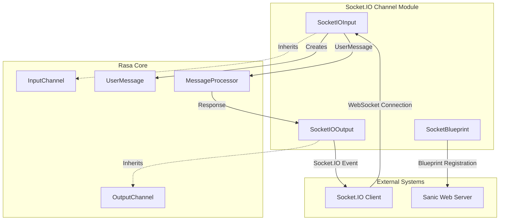
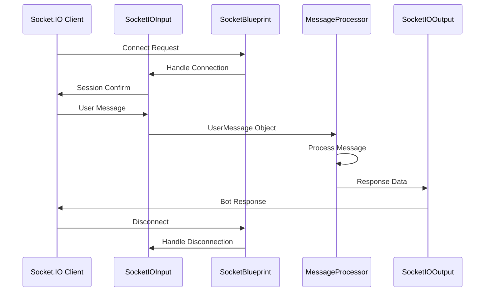
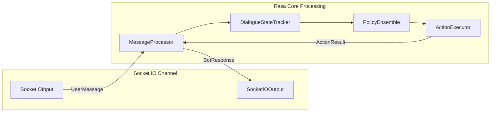
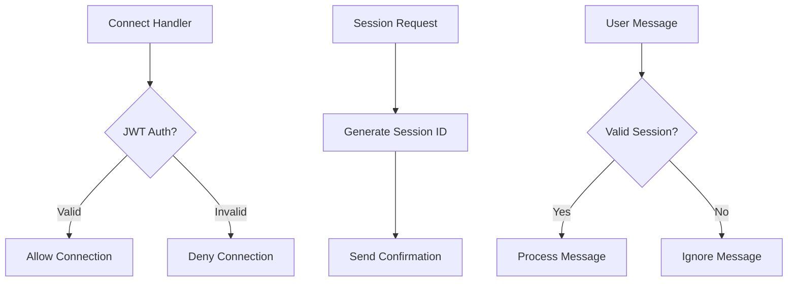

# Socket.IO Channel Module

## Introduction

The Socket.IO Channel module provides real-time bidirectional communication capabilities for Rasa chatbots, enabling WebSocket-based interactions between users and the Rasa assistant. This module implements the Socket.IO protocol, which offers reliable real-time communication with automatic reconnection, room-based messaging, and support for various data formats.

## Overview

The Socket.IO Channel module consists of three core components that work together to handle real-time communication:

- **SocketIOInput**: Handles incoming Socket.IO connections and messages
- **SocketIOOutput**: Manages outgoing messages to connected clients
- **SocketBlueprint**: Provides Sanic blueprint integration for Socket.IO routing

## Architecture

### Component Architecture



### Data Flow Architecture



## Core Components

### SocketIOInput

The `SocketIOInput` class is the main entry point for Socket.IO communication. It handles incoming connections, manages session persistence, and processes user messages.

**Key Features:**
- WebSocket connection management with automatic session handling
- JWT authentication support for secure connections
- Session persistence for maintaining conversation context
- Metadata extraction from incoming messages
- Integration with Rasa's message processing pipeline

**Configuration Options:**
- `user_message_evt`: Event name for user messages (default: "user_uttered")
- `bot_message_evt`: Event name for bot responses (default: "bot_uttered")
- `namespace`: Socket.IO namespace for connection isolation
- `session_persistence`: Enable session-based message routing
- `socketio_path`: URL path for Socket.IO endpoint (default: "/socket.io")
- `jwt_key`: JWT secret key for authentication
- `jwt_method`: JWT algorithm (default: "HS256")
- `metadata_key`: Key for extracting metadata from messages

### SocketIOOutput

The `SocketIOOutput` class handles outgoing messages from the Rasa assistant to connected clients. It supports various message formats including text, images, buttons, and custom JSON payloads.

**Supported Message Types:**
- Text messages with multi-part support
- Image URLs with attachment formatting
- Interactive buttons with quick replies
- Rich message elements (cards, templates)
- Custom JSON payloads
- File attachments

### SocketBlueprint

The `SocketBlueprint` class provides Sanic framework integration, creating a blueprint that can be registered with a Sanic application to handle Socket.IO routing.

**Responsibilities:**
- Socket.IO server attachment to Sanic applications
- Route configuration for Socket.IO endpoints
- CORS handling for cross-origin requests
- Health check endpoint provision

## Integration with Rasa Core

### Message Processing Flow



### Session Management

The Socket.IO channel supports two modes of operation:

1. **Session Persistence Mode**: Messages are routed based on session IDs, allowing multiple clients to maintain separate conversations
2. **Connection-based Mode**: Each WebSocket connection is treated as a separate conversation

## Security Features

### JWT Authentication

The module supports JWT-based authentication for secure Socket.IO connections:

```python
# Authentication flow
Client connects with JWT token → Token validation → Connection acceptance/rejection
```

**Security Benefits:**
- Token-based authentication prevents unauthorized access
- Configurable JWT algorithms and secret keys
- Payload validation for user identity verification

### CORS Protection

Built-in CORS handling ensures secure cross-origin communication:
- Configurable allowed origins
- Automatic CORS header management
- Protection against cross-origin attacks

## Configuration and Usage

### Basic Configuration

```yaml
# credentials.yml
socketio:
  user_message_evt: user_uttered
  bot_message_evt: bot_uttered
  session_persistence: true
  socketio_path: /socket.io
```

### Advanced Configuration with JWT

```yaml
# credentials.yml
socketio:
  user_message_evt: user_uttered
  bot_message_evt: bot_uttered
  session_persistence: true
  socketio_path: /socket.io
  jwt_key: your-secret-key
  jwt_method: HS256
  metadata_key: metadata
```

## Event Handling

### Client-Side Events

**Connection Events:**
- `connect`: Triggered when client connects
- `disconnect`: Triggered when client disconnects
- `session_request`: Request session establishment
- `session_confirm`: Server confirmation of session

**Message Events:**
- `user_uttered`: User message event (configurable)
- `bot_uttered`: Bot response event (configurable)

### Server-Side Event Handlers



## Dependencies

### External Dependencies

- **python-socketio**: Core Socket.IO implementation
- **sanic**: Web framework for HTTP server integration
- **PyJWT**: JWT token handling for authentication

### Rasa Dependencies

- **InputChannel**: Base class for input channels ([Communication Channels](Communication Channels.md))
- **OutputChannel**: Base class for output channels ([Communication Channels](Communication Channels.md))
- **UserMessage**: Message representation ([Dialogue Management Core](Dialogue Management Core.md))
- **MessageProcessor**: Core message processing ([Dialogue Management Core](Dialogue Management Core.md))

## Error Handling

### Connection Errors
- Automatic reconnection handling
- Graceful degradation for authentication failures
- Proper cleanup on unexpected disconnections

### Message Processing Errors
- Validation of incoming message format
- Error logging for debugging
- Graceful handling of malformed messages

## Performance Considerations

### Scalability
- Support for multiple Sanic workers (with limitations)
- Efficient room-based message routing
- Minimal memory footprint per connection

### Limitations
- Output channel recreation limitations with multiple workers
- Session persistence overhead for large-scale deployments
- WebSocket connection limits based on server capacity

## Best Practices

### Client Implementation
1. Always request session before sending messages when using session persistence
2. Implement proper reconnection logic with exponential backoff
3. Handle authentication tokens securely
4. Validate message formats before sending

### Server Configuration
1. Use JWT authentication for production deployments
2. Configure appropriate CORS settings
3. Monitor connection health and resource usage
4. Implement proper logging for debugging

### Deployment Considerations
1. Use load balancers with WebSocket support
2. Configure appropriate timeouts for long-lived connections
3. Monitor memory usage with many concurrent connections
4. Consider using Redis for session storage in multi-instance deployments

## Troubleshooting

### Common Issues

**Connection Failures:**
- Check CORS configuration
- Verify JWT authentication settings
- Ensure Socket.IO path configuration matches client

**Message Delivery Issues:**
- Validate session ID handling
- Check event name configuration
- Verify message format compliance

**Performance Issues:**
- Monitor connection count
- Check for memory leaks in long-running sessions
- Optimize message payload sizes

## Related Documentation

- [Communication Channels](Communication Channels.md) - General channel implementation patterns
- [Dialogue Management Core](Dialogue Management Core.md) - Message processing and conversation tracking
- [Actions](Actions.md) - Bot response generation and action execution
- [Domain & Training Data](Domain & Training Data.md) - Conversation domain and context management