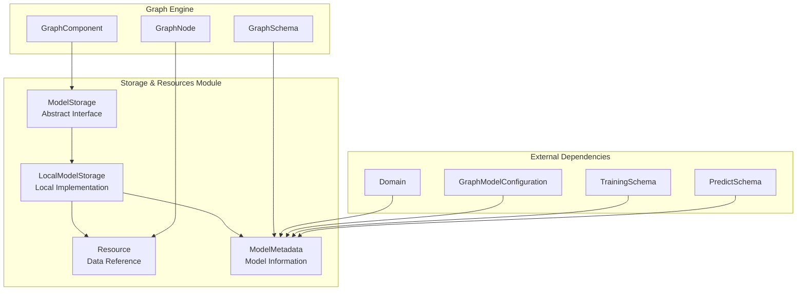
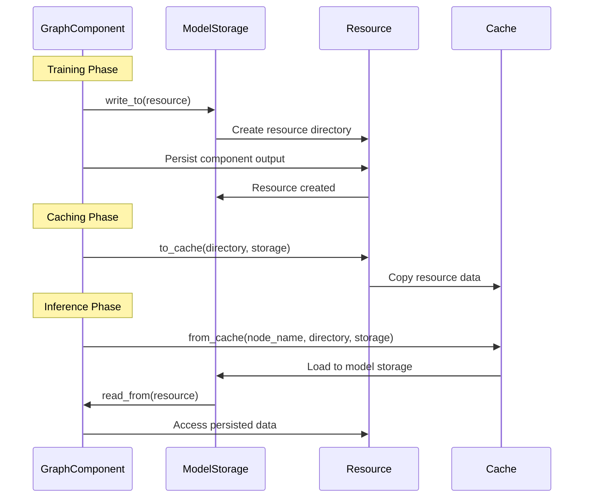
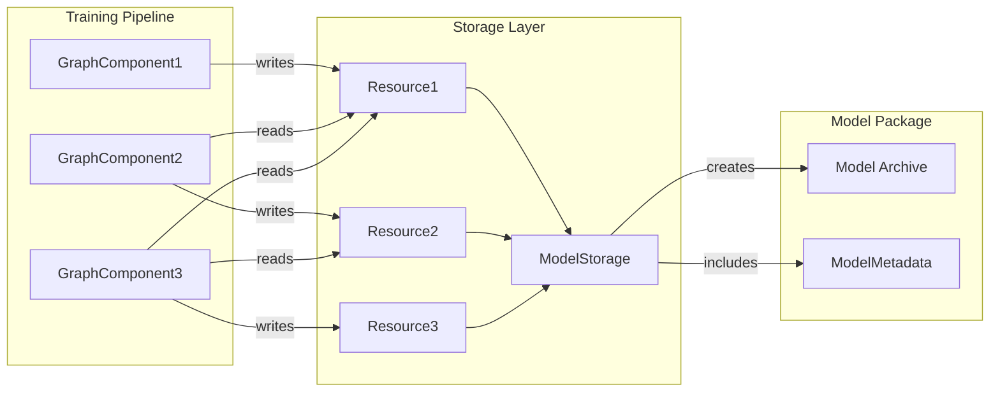
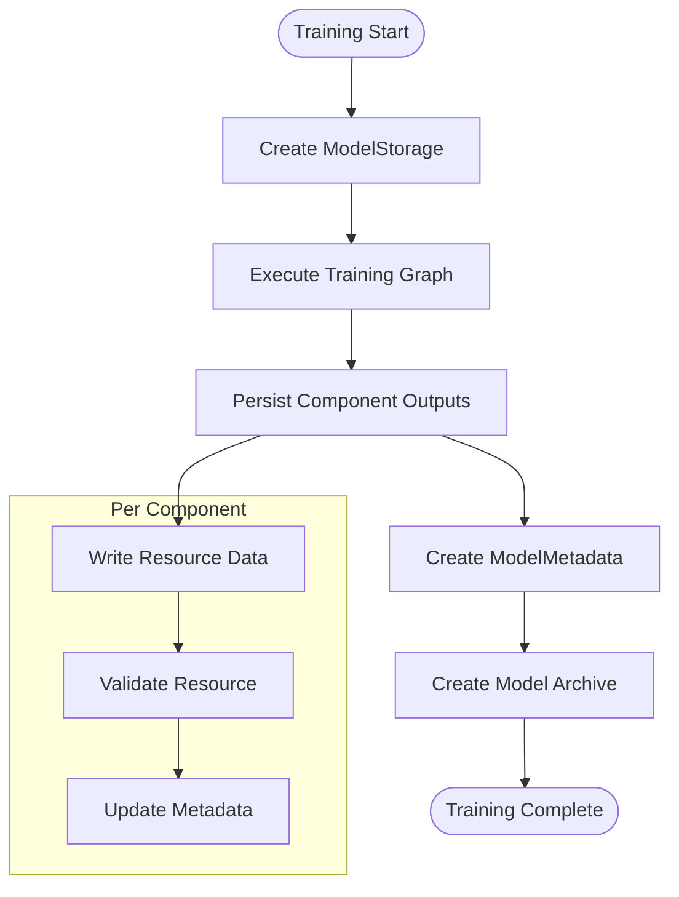
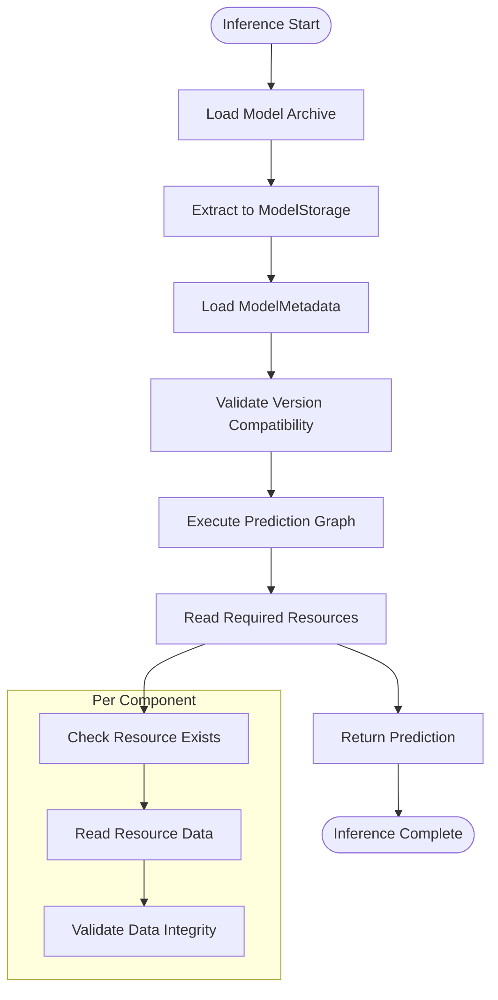

# Storage & Resources Module

## Introduction

The Storage & Resources module provides the persistence layer for Rasa's execution engine, enabling graph components to store and retrieve data during training and inference. This module is fundamental to Rasa's architecture, ensuring that trained models, intermediate results, and configuration data are properly managed throughout the system lifecycle.

## Architecture Overview

The Storage & Resources module implements a hierarchical storage system that supports both local and distributed model persistence. It provides a unified interface for graph components to persist their outputs and access dependencies, while maintaining version compatibility and model integrity.

## Core Components

### ModelStorage (Abstract Interface)

`rasa.engine.storage.storage.ModelStorage` serves as the abstract base class for all storage implementations. It defines the contract for persisting and retrieving graph component outputs, creating model packages, and managing model metadata.

**Key Responsibilities:**
- Abstract interface for storage operations
- Model package creation and extraction
- Version compatibility validation
- Resource lifecycle management

**Key Methods:**
- `create()`: Creates new storage instance
- `from_model_archive()`: Initializes storage from archived model
- `write_to()`: Provides write access to resources
- `read_from()`: Provides read access to resources
- `create_model_package()`: Creates deployable model archive

### LocalModelStorage (Implementation)

`rasa.engine.storage.local_model_storage.LocalModelStorage` provides the default local file system implementation of the ModelStorage interface. It handles model persistence on disk with support for Windows long path names and secure archive extraction.

**Key Features:**
- Local file system persistence
- Windows compatibility with long path support
- Secure tar archive handling using TarSafe
- Model metadata management
- Resource directory organization

**Implementation Details:**
- Uses temporary directories for safe archive operations
- Implements context managers for resource access
- Provides atomic operations for model packaging
- Validates model version compatibility during extraction

### Resource (Data Reference)

`rasa.engine.storage.resource.Resource` represents a persisted graph component output within the storage system. It acts as a reference to the actual data and enables caching mechanisms.

**Key Attributes:**
- `name`: Unique identifier for the resource
- `output_fingerprint`: Unique identifier for specific resource instantiation

**Key Methods:**
- `from_cache()`: Loads resource from cache into model storage
- `to_cache()`: Persists resource to cache
- `fingerprint()`: Provides resource fingerprint for identification

### ModelMetadata (Model Information)

`rasa.engine.storage.storage.ModelMetadata` encapsulates all metadata associated with a trained model, including training configuration, version information, and model identifiers.

**Key Attributes:**
- `trained_at`: Training timestamp
- `rasa_open_source_version`: Rasa version used for training
- `model_id`: Unique model identifier
- `domain`: Domain configuration
- `train_schema`: Training graph schema
- `predict_schema`: Prediction graph schema
- `language`: Model language
- `training_type`: Type of training performed

## Data Flow Architecture

## Component Interactions

## Process Flows

### Model Training and Persistence

### Model Loading and Inference

## Integration with Other Modules

### Execution Engine & Graph Components
The Storage & Resources module is tightly integrated with the [Execution Engine & Graph Components](Execution Engine & Graph Components.md) module:
- Graph components use ModelStorage to persist their outputs
- GraphSchema defines the resource dependencies between components
- GraphRunner orchestrates the storage operations during execution

### Dialogue Management Core
The module supports the [Dialogue Management Core](Dialogue Management Core.md) by:
- Storing trained policy models
- Persisting tracker stores and lock stores
- Managing dialogue state snapshots

### Domain & Training Data
Integration with [Domain & Training Data](Domain & Training Data.md) includes:
- Storing domain configurations in model metadata
- Persisting training data providers
- Managing NLU and Core training artifacts

## Key Design Patterns

### Abstract Factory Pattern
ModelStorage uses the abstract factory pattern to allow different storage implementations while maintaining a consistent interface.

### Context Manager Pattern
Resource access is implemented using context managers to ensure proper cleanup and resource management.

### Strategy Pattern
Different storage strategies (local, distributed, cached) can be plugged in without changing the core interface.

### Template Method Pattern
ModelMetadata provides template methods for serialization and validation that can be extended.

## Error Handling

### Version Compatibility
The module validates model version compatibility during archive extraction:
- Checks minimum compatible Rasa version
- Raises UnsupportedModelVersionError for incompatible models
- Provides clear error messages for version mismatches

### Resource Management
Comprehensive error handling for resource operations:
- Validates resource existence before access
- Provides meaningful error messages for missing resources
- Handles concurrent access scenarios

### Archive Operations
Secure archive handling with error recovery:
- Uses TarSafe for secure extraction
- Implements atomic operations for model packaging
- Provides Windows-specific path handling

## Performance Considerations

### Caching Strategy
The Resource component supports caching to avoid redundant storage operations:
- Fingerprint-based cache invalidation
- Efficient directory copying for cache operations
- Optional caching for fine-tuning scenarios

### Storage Optimization
LocalModelStorage implements several optimizations:
- Direct directory moves for efficient data transfer
- Temporary directory usage for atomic operations
- Windows long path support for scalability

### Metadata Management
ModelMetadata is designed for efficient serialization:
- Dataclass-based structure for optimal performance
- Lazy loading of complex objects
- Minimal memory footprint for metadata operations

## Security Considerations

### Archive Security
- Uses TarSafe library for secure tar archive handling
- Validates archive contents before extraction
- Prevents path traversal attacks

### Resource Isolation
- Each resource has isolated storage directory
- Prevents unauthorized access between resources
- Implements proper access controls

### Version Validation
- Strict version compatibility checks
- Prevents loading of potentially harmful legacy models
- Provides secure upgrade paths

## Future Extensibility

The modular design enables future extensions:
- **Distributed Storage**: Support for cloud-based storage backends
- **Encryption**: Built-in encryption for sensitive model data
- **Compression**: Advanced compression strategies for large models
- **Versioning**: Enhanced model versioning and rollback capabilities
- **Monitoring**: Built-in metrics and monitoring for storage operations