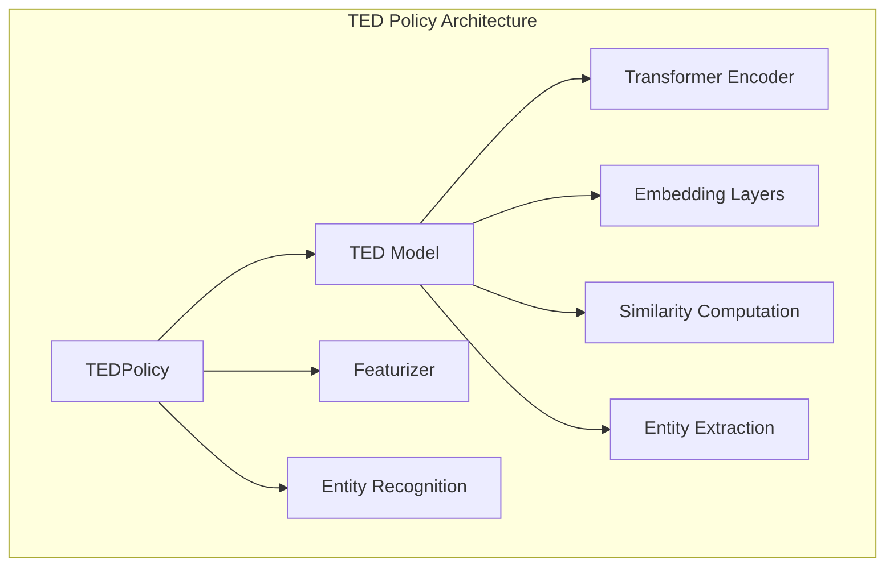
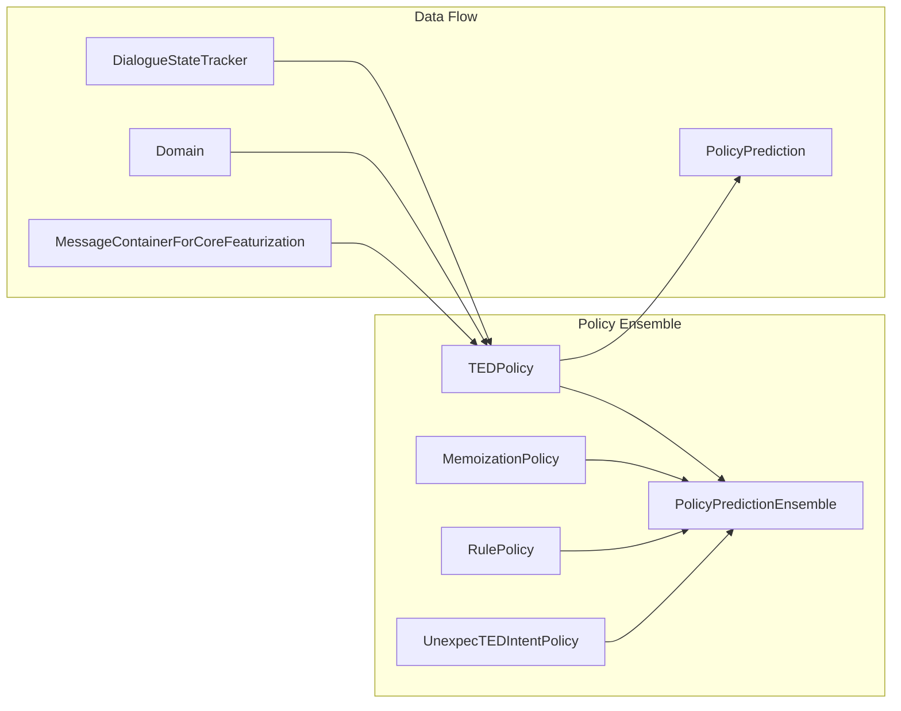
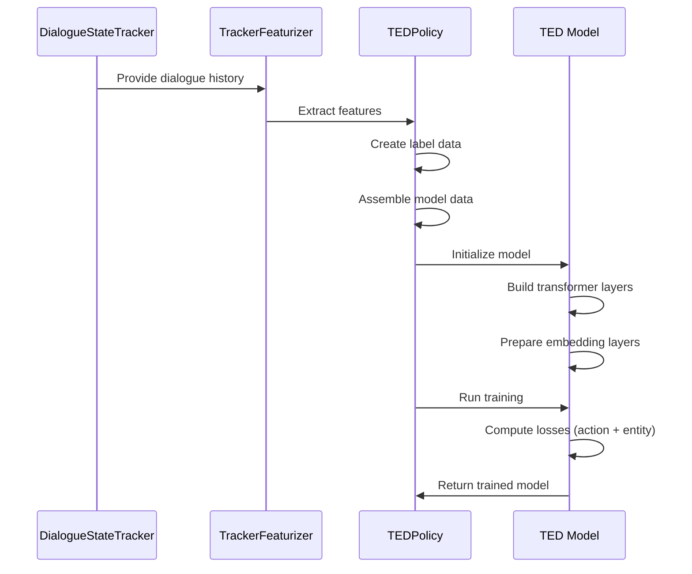
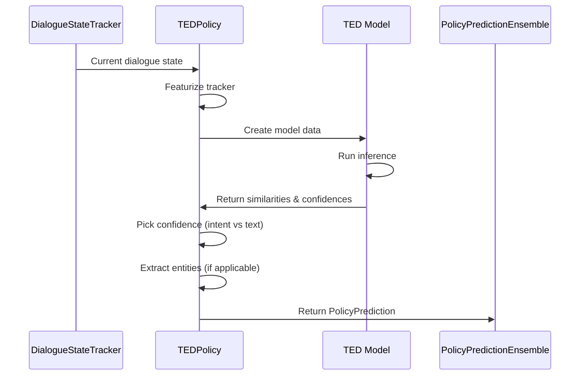
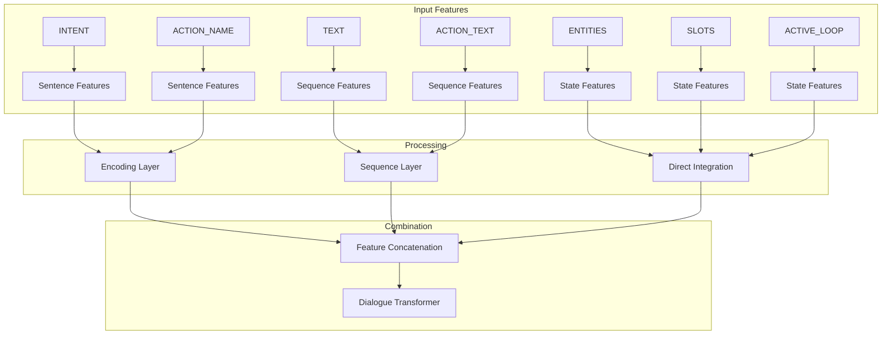
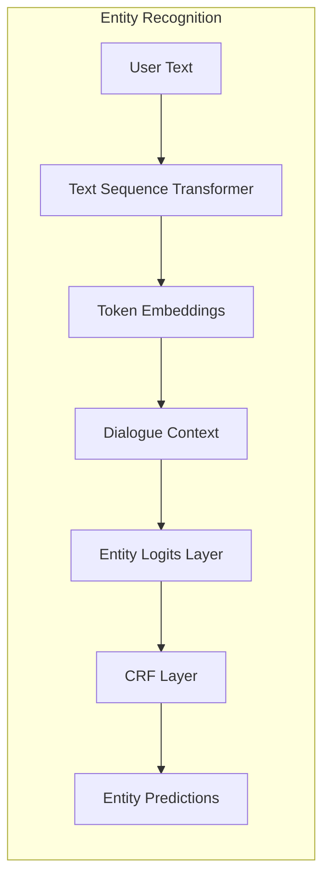
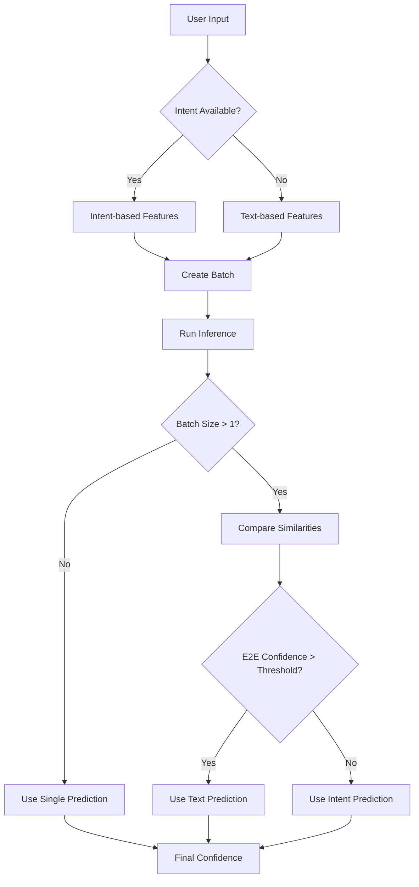
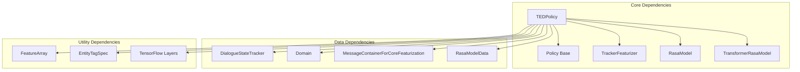

# TED Policy Module Documentation

## Introduction

The TED (Transformer Embedding Dialogue) Policy is a sophisticated machine learning-based dialogue policy in Rasa that uses transformer architectures to predict the next best action in conversational AI systems. Built on the Transformer architecture and StarSpace embedding techniques, TED Policy represents a state-of-the-art approach to dialogue management that can handle both intent-based and end-to-end text-based predictions.

## Overview

TED Policy is designed to learn complex dialogue patterns by encoding dialogue context into embeddings and finding the most similar action embeddings. It supports both traditional intent-based conversations and modern end-to-end text-based interactions, making it versatile for various conversational AI scenarios.

## Architecture

### Core Components

### System Integration

## Key Components

### TEDPolicy Class

The main policy class that implements the Policy interface and orchestrates the TED model for dialogue prediction.

**Key Responsibilities:**
- Model training and inference orchestration
- Feature extraction and preprocessing
- Entity recognition integration
- End-to-end prediction handling
- Model persistence and loading

**Configuration:**
- Extensive hyperparameter configuration for architecture and training
- Support for both intent-based and text-based predictions
- Configurable entity recognition capabilities
- Flexible transformer architecture settings

### TED Model Class

The core neural network architecture implementing the transformer-based embedding approach.

**Architecture Components:**
- Transformer encoders for dialogue processing
- Embedding layers for feature encoding
- Similarity computation using StarSpace approach
- Entity recognition layers with CRF
- Multi-head attention mechanisms

**Key Features:**
- Bidirectional transformer encoding
- Multi-attribute feature processing
- Label embedding generation
- Entity extraction capabilities
- Attention weight diagnostics

## Data Flow

### Training Process

### Prediction Process

## Feature Processing

### Feature Types

### Feature Encoding

The TED model processes different feature types through specialized layers:

1. **Sequence Features (TEXT, ACTION_TEXT):** Processed through sequence layers with transformers
2. **Sentence Features (INTENT, ACTION_NAME):** Processed through dense encoding layers
3. **State Features (ENTITIES, SLOTS, ACTIVE_LOOP):** Directly integrated into dialogue representation
4. **Label Features:** Encoded separately for similarity computation

## Entity Recognition

### Entity Processing Pipeline

**Entity Recognition Features:**
- BILOU tagging support for entity boundaries
- Context-aware entity prediction using dialogue history
- Confidence scoring for entity predictions
- Configurable entity extraction parameters

## Training Configuration

### Architecture Parameters

- **Transformer Sizes:** Configurable per attribute (TEXT, ACTION_TEXT, DIALOGUE)
- **Number of Layers:** Independent layer configuration for different components
- **Attention Heads:** Multi-head attention configuration
- **Embedding Dimensions:** Customizable embedding sizes
- **Dropout Rates:** Separate dropout for dialogue, labels, and attention

### Training Parameters

- **Batch Strategy:** Sequence or balanced batching
- **Learning Rate:** Configurable with Adam optimizer
- **Loss Functions:** Cross-entropy or margin-based losses
- **Similarity Types:** Auto, cosine, or inner product
- **Regularization:** L2 regularization and connection density

## End-to-End Prediction

### Dual Prediction Strategy

TED Policy implements a sophisticated approach for handling both intent-based and text-based predictions:

## Integration with Rasa Core

### Policy Ensemble Integration

TED Policy integrates with the broader Rasa policy ensemble:

- **Priority-based Selection:** Configurable policy priority for ensemble decisions
- **Supported Data Types:** Handles both ML_DATA and RULE_ONLY_DATA
- **Fallback Integration:** Works with fallback policies for low-confidence scenarios
- **Tracker Store Integration:** Persistent dialogue state management

### Dependencies

## Model Persistence

### Storage Format

TED Policy persists multiple components for complete model restoration:

- **TensorFlow Model:** Core neural network weights
- **Feature Data:** Training data examples and label information
- **Configuration:** Complete hyperparameter settings
- **Entity Specifications:** Entity tag mappings and configurations
- **Featurizer State:** Feature extraction parameters

### Checkpoint Support

- **Model Checkpointing:** Optional checkpoint saving during training
- **Fine-tuning Support:** Load models for continued training
- **Resource Management:** Efficient model storage and retrieval

## Performance Considerations

### Memory Management

- **GPU Memory:** Configurable GPU usage for training and inference
- **Batch Processing:** Efficient batch size management
- **Feature Caching:** Optimized feature storage and reuse

### Computational Efficiency

- **Max History Featurizer:** Limited history processing for efficiency
- **Attention Optimization:** Efficient attention computation
- **Similarity Computation:** Optimized embedding similarity calculations

## Error Handling

### Model Validation

- **Data Validation:** Comprehensive input data validation
- **Configuration Validation:** Parameter consistency checks
- **Model State Validation:** Training and inference state verification

### Exception Handling

- **Model Loading:** Graceful handling of missing or corrupted models
- **Feature Extraction:** Handling of incomplete or invalid features
- **Prediction Failures:** Fallback mechanisms for prediction errors

## Monitoring and Diagnostics

### Training Metrics

- **Loss Tracking:** Action loss and entity loss monitoring
- **Accuracy Metrics:** Action accuracy and entity F1 scores
- **TensorBoard Integration:** Comprehensive training visualization

### Diagnostic Data

- **Attention Weights:** Transformer attention visualization
- **Feature Analysis:** Input feature inspection capabilities
- **Prediction Confidence:** Detailed confidence scoring information

## References

- [Policy Base and Ensemble](Policy%20Base%20and%20Ensemble.md) - Core policy infrastructure
- [Core Featurization](Core%20Featurization.md) - Feature extraction components
- [TensorFlow Model Components](TensorFlow%20Model%20Components.md) - Neural network utilities
- [Dialogue Management Core](Dialogue%20Management%20Core.md) - Core dialogue system integration