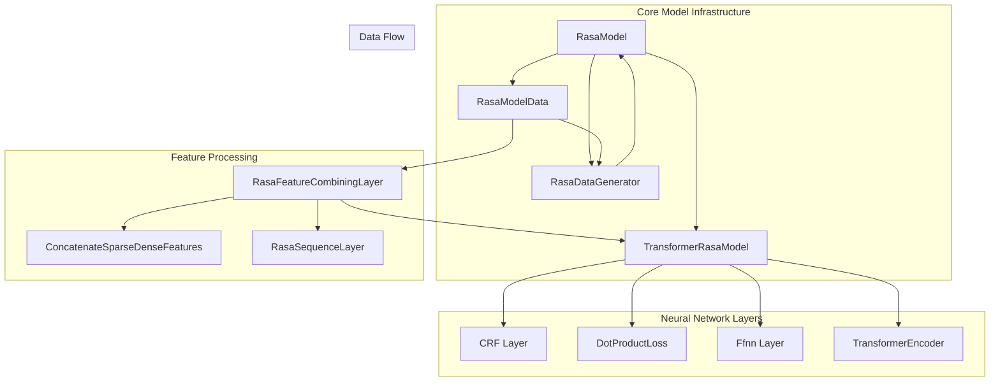

# TensorFlow Model Components

## Overview

The TensorFlow Model Components module provides the core deep learning infrastructure for Rasa's machine learning models. This module implements custom TensorFlow/Keras components specifically designed for conversational AI tasks, including intent classification, entity recognition, dialogue management, and response selection.

## Architecture

The module is built around a hierarchical architecture that combines multiple specialized components:



## Core Components

### 1. Model Base Classes

For detailed documentation, see [Model Base Classes](Model Base Classes.md)

#### RasaModel
The foundational abstract class that extends Keras Model with Rasa-specific functionality:
- Custom training, validation, and prediction loops
- Support for both dense and sparse input data
- Built-in regularization and loss calculation
- Model persistence and loading capabilities
- Random seed management for reproducibility

#### TransformerRasaModel
Extends RasaModel with transformer-based architecture capabilities:
- Support for transformer encoders with multi-head attention
- Incremental training support with dynamic layer adjustment
- Label classification and entity recognition layers
- Configurable similarity measures and loss functions

### 2. Data Management

For detailed documentation, see [Data Management](Data Management.md)

#### RasaModelData
Central data structure for managing training data:
- Handles both sparse and dense features
- Supports multiple feature types (sequence, sentence-level)
- Data balancing and stratified splitting
- Feature signature management for model input validation

#### RasaDataGenerator
Efficient data loading and batching:
- Support for variable batch sizes during training
- Sequence and balanced batching strategies
- Automatic data shuffling and balancing
- Handles 4D dialogue data with proper padding

### 3. Neural Network Layers

For detailed documentation, see [Neural Network Layers](Neural Network Layers.md)

#### CRF (Conditional Random Field)
Specialized layer for sequence labeling tasks:
- Implements CRF loss for entity recognition
- Viterbi decoding for optimal sequence prediction
- F1 score calculation for training evaluation
- Support for multi-tag entity recognition

#### DotProductLoss
Flexible loss layer for similarity-based learning:
- Single-label and multi-label variants
- Configurable similarity measures (cosine, inner product)
- Margin-based and cross-entropy loss options
- Negative sampling for efficient training

#### Ffnn (Feed-Forward Neural Network)
Configurable multi-layer perceptron:
- Variable layer sizes and dropout rates
- Randomly connected dense layers for regularization
- GELU activation and L2 regularization support

#### TransformerEncoder
Multi-layer transformer architecture:
- Multi-head self-attention mechanism
- Positional encoding for sequence modeling
- Configurable attention dropout and density
- Support for relative position embeddings

### 4. Feature Processing

For detailed documentation, see [Feature Processing](Feature Processing.md)

#### RasaFeatureCombiningLayer
Unified feature combination system:
- Handles both sparse and dense features
- Sequence and sentence-level feature integration
- Dimension unification for heterogeneous features
- Mask generation for variable-length sequences

#### ConcatenateSparseDenseFeatures
Low-level feature combination:
- Converts sparse tensors to dense representations
- Configurable dropout for regularization
- Maintains feature type consistency

#### RasaSequenceLayer
Sequence-specific feature processing:
- Transformer-based sequence embedding
- Optional masked language modeling
- Attention weight extraction for interpretability
- Support for variable-length sequences

## Key Features

### Incremental Training Support
The module supports incremental training through dynamic layer adjustment:
- Automatic detection of feature size changes
- Dynamic resizing of sparse-to-dense layers
- Preservation of learned weights during expansion
- Validation to prevent feature size reduction

### Multi-Task Learning
Components are designed for multi-task scenarios:
- Shared feature extraction across tasks
- Task-specific heads and loss functions
- Configurable similarity measures for different tasks
- Unified data format across all components

### Scalability and Performance
Optimized for production deployment:
- Efficient sparse tensor operations
- Configurable model density for regularization
- Batch processing with variable sizes
- GPU-optimized tensor operations

## Integration with Rasa Ecosystem

The TensorFlow Model Components module integrates with other Rasa modules:

- **NLU Pipeline**: Provides neural classifiers and extractors ([NLU Pipeline](NLU Pipeline.md))
- **Dialogue Policies**: Powers transformer-based dialogue management ([Dialogue Policies](Dialogue Policies.md))
- **Core Featurization**: Processes tracker featurization for dialogue models ([Core Featurization](Core Featurization.md))

## Usage Patterns

### Model Definition
```python
# Custom model extending RasaModel
class MyClassifier(TransformerRasaModel):
    def _prepare_layers(self):
        # Define model architecture
        self._prepare_label_classification_layers(TEXT)
        self._prepare_entity_recognition_layers()
    
    def batch_loss(self, batch_in):
        # Implement custom loss calculation
        return total_loss
```

### Data Preparation
```python
# Create model data with features
model_data = RasaModelData(
    label_key=INTENT,
    label_sub_key=IDS,
    data=features
)

# Generate training batches
data_generator = RasaBatchDataGenerator(
    model_data=model_data,
    batch_size=32,
    shuffle=True
)
```

### Feature Processing
```python
# Combine multiple feature types
feature_layer = RasaFeatureCombiningLayer(
    attribute="text",
    attribute_signature=feature_signatures,
    config=model_config
)

# Process features through the layer
combined_features, mask = feature_layer(
    (sequence_features, sentence_features, sequence_lengths),
    training=True
)
```

## Configuration

The module supports extensive configuration through model configs:

- **Transformer Settings**: Number of layers, attention heads, hidden units
- **Regularization**: Dropout rates, L2 regularization, connection density
- **Training Parameters**: Learning rates, loss functions, similarity measures
- **Feature Processing**: Dense dimensions, concatenation settings

## Performance Considerations

- **Memory Usage**: Sparse features reduce memory footprint significantly
- **Training Speed**: Configurable batch sizes and data loading strategies
- **Model Size**: Connection density controls the number of trainable parameters
- **Inference**: Optimized prediction paths with minimal overhead

This module serves as the foundation for all neural network-based components in Rasa, providing a flexible and extensible framework for building conversational AI models.