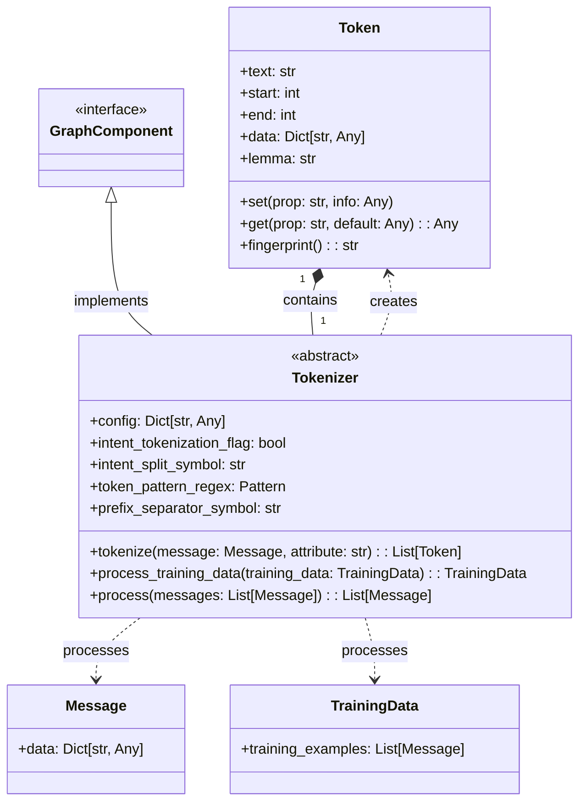
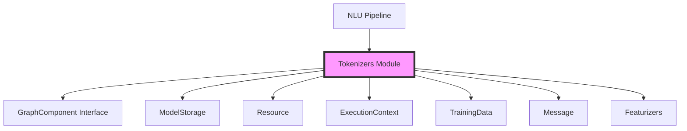
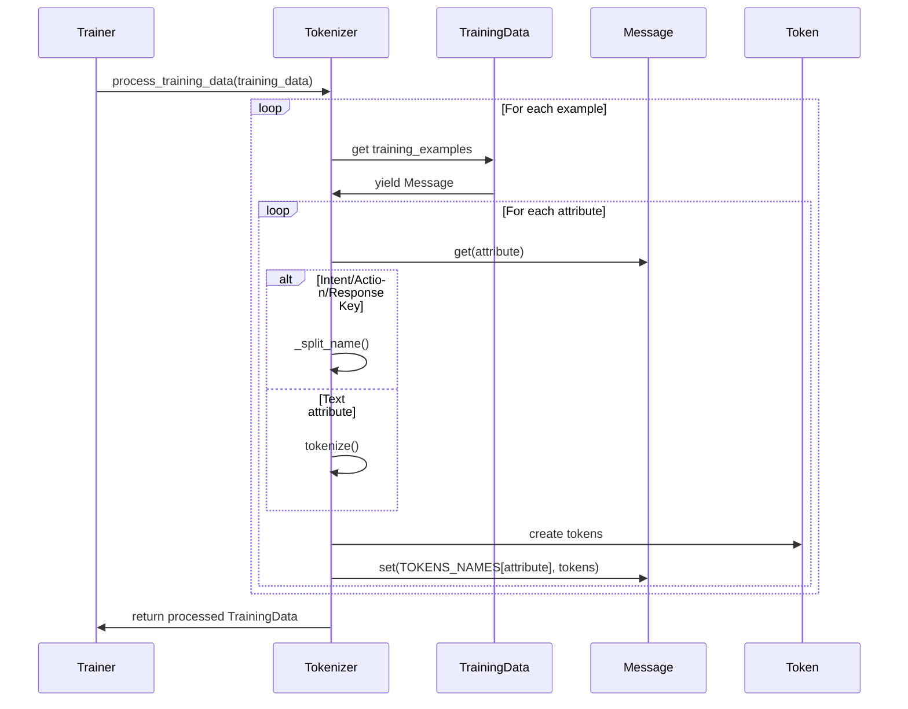
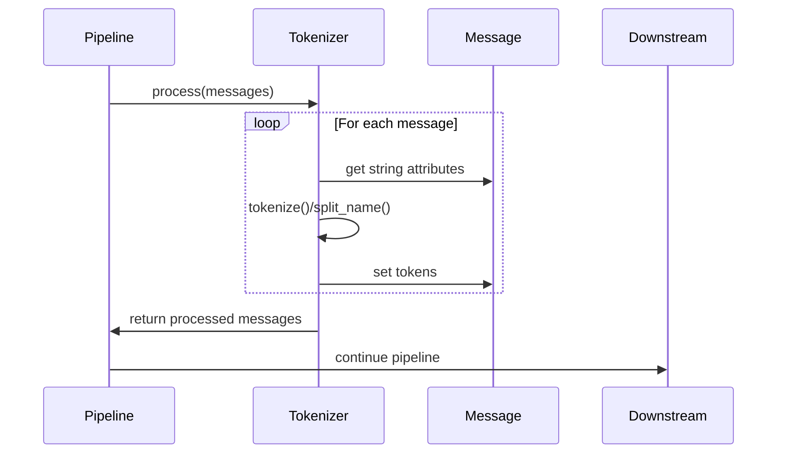
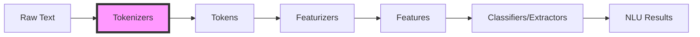

# Tokenizers Module Documentation

## Introduction

The Tokenizers module is a fundamental component of the Rasa NLU pipeline, responsible for breaking down text into smaller units called tokens. This process, known as tokenization, is the first step in natural language understanding and serves as the foundation for all subsequent NLP operations including featurization, intent classification, and entity extraction.

## Overview

Tokenizers transform raw text into structured token representations that preserve positional information and can carry additional metadata. The module provides a flexible framework for different tokenization strategies while maintaining a consistent interface for downstream components.

## Architecture

### Core Components



### Module Dependencies



## Component Details

### Token Class

The `Token` class represents individual text units with rich metadata support:

- **text**: The actual token text
- **start/end**: Character positions in the original text
- **data**: Additional properties (POS tags, entity labels, etc.)
- **lemma**: Lemmatized form of the token
- **fingerprint**: Stable hash for caching and comparison

### Tokenizer Base Class

The `Tokenizer` abstract base class provides:

- **Configuration management**: Handles tokenizer-specific settings
- **Intent tokenization**: Special handling for intent labels
- **Token pattern matching**: Regex-based token refinement
- **Prefix separation**: Support for hierarchical intent structures
- **Training data processing**: Batch processing of training examples
- **Message processing**: Real-time tokenization of incoming messages

## Data Flow

### Training Data Processing



### Message Processing



## Tokenization Strategies

### Intent Tokenization

The tokenizer handles intent labels with special logic:

1. **Intent splitting**: Breaks compound intents using configurable symbols
2. **Prefix separation**: Supports hierarchical intent structures (e.g., "greet.formal")
3. **Response key handling**: Processes intent-response key combinations

### Text Tokenization

Abstract method to be implemented by concrete tokenizers:

- **Language-specific rules**: Whitespace, punctuation, etc.
- **Subword tokenization**: BPE, WordPiece, SentencePiece
- **Custom patterns**: Regex-based token refinement

## Integration with NLU Pipeline



The Tokenizers module serves as the entry point for the NLU pipeline:

1. **Input**: Raw text messages and training examples
2. **Processing**: Converts text to structured tokens
3. **Output**: Token-enriched messages for downstream components
4. **Integration**: Works with [Featurizers](Featurizers.md) to convert tokens to numerical representations

## Configuration Options

### Common Settings

- **intent_tokenization_flag**: Enable intent label tokenization
- **intent_split_symbol**: Symbol for splitting intent labels
- **token_pattern**: Regex pattern for token refinement
- **prefix_separator_symbol**: Symbol for hierarchical intent separation

### Example Configuration

```yaml
pipeline:
- name: WhitespaceTokenizer
  intent_tokenization_flag: true
  intent_split_symbol: "+"
  token_pattern: "(?u)\\b\\w\\w+\\b"
  prefix_separator_symbol: "."
```

## Extension Points

### Custom Tokenizers

Implement the `Tokenizer` base class to create custom tokenization strategies:

```python
class CustomTokenizer(Tokenizer):
    def tokenize(self, message: Message, attribute: Text) -> List[Token]:
        # Implement custom tokenization logic
        text = message.get(attribute)
        # ... tokenization implementation
        return tokens
```

### Token Enhancement

Extend the `Token` class with additional metadata:

- Part-of-speech tags
- Entity labels
- Confidence scores
- Language-specific features

## Performance Considerations

### Caching

- Token fingerprints enable efficient caching
- Reuse tokens across pipeline components
- Reduce redundant processing

### Memory Management

- Stream processing for large datasets
- Efficient token representation
- Garbage collection of temporary objects

## Error Handling

### Validation

- Input text validation
- Configuration parameter validation
- Graceful handling of malformed text

### Recovery

- Fallback tokenization strategies
- Partial processing on errors
- Detailed error reporting

## Testing

### Unit Tests

- Token creation and manipulation
- Configuration handling
- Edge cases (empty text, special characters)

### Integration Tests

- Pipeline integration
- Performance benchmarks
- Cross-component compatibility

## Best Practices

### Configuration

- Choose appropriate tokenization strategy for your language
- Configure intent tokenization based on intent structure
- Use token patterns for domain-specific text processing

### Performance

- Profile tokenization performance on your dataset
- Consider caching strategies for large-scale deployments
- Monitor memory usage with large vocabularies

### Maintenance

- Regular updates for language model changes
- Monitor tokenization quality
- Version compatibility with downstream components

## Related Documentation

- [NLU Pipeline](NLU_Pipeline.md) - Overview of the NLU processing pipeline
- [Featurizers](Featurizers.md) - Components that consume tokens
- [Training Data Structures](Training_Data_Structures.md) - Data formats processed by tokenizers
- [Graph Components](Graph_Components.md) - Execution framework integration