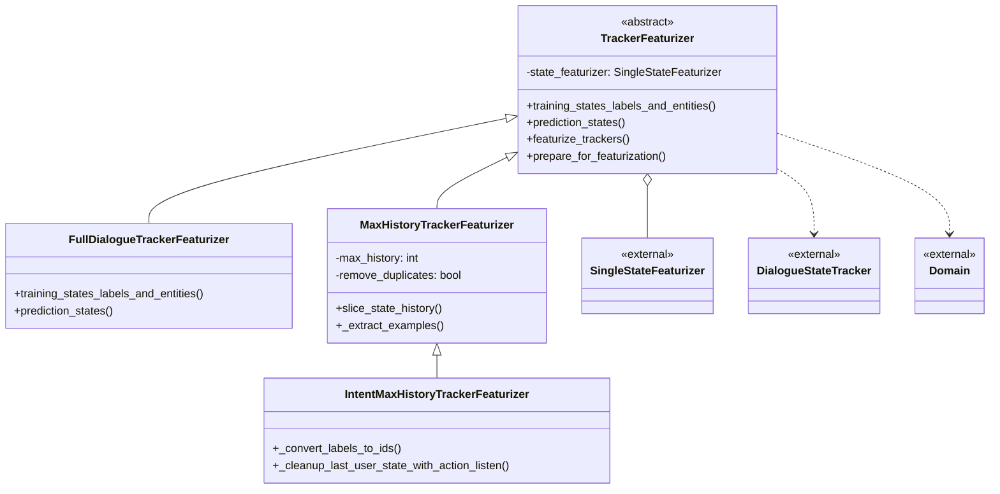
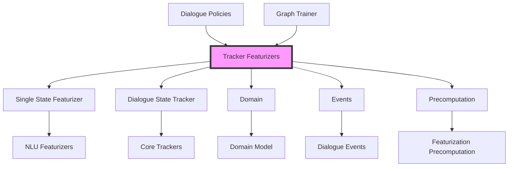
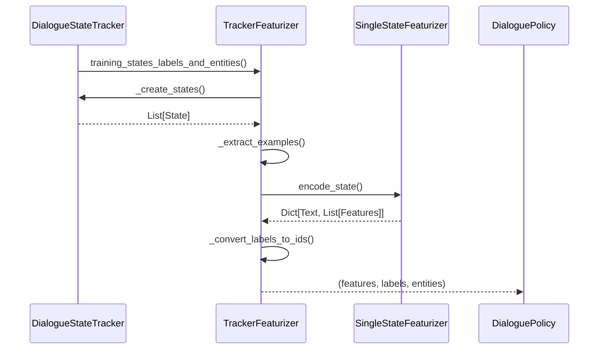
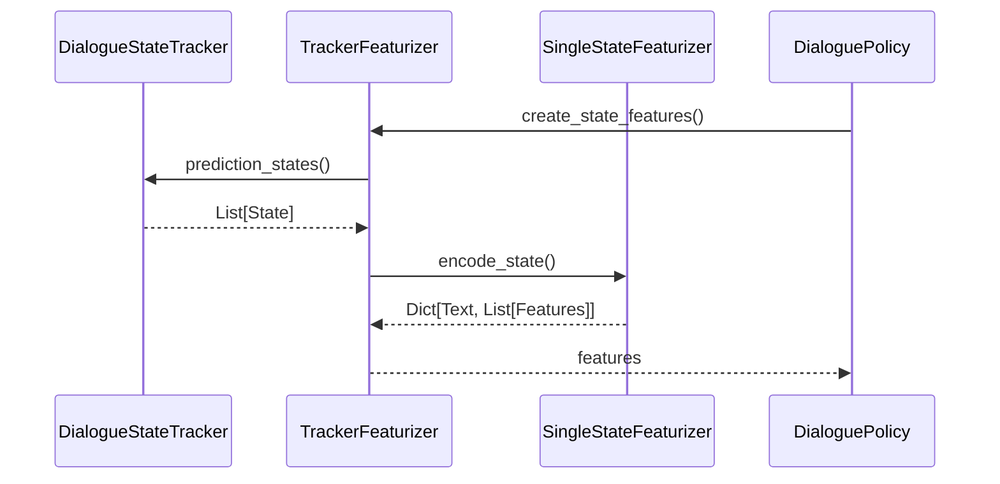
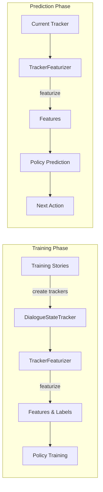

# Tracker Featurizers Module

## Introduction

The Tracker Featurizers module is a core component of Rasa's dialogue management system, responsible for converting conversation histories (trackers) into numerical feature representations that can be used by dialogue policies for training and prediction. This module bridges the gap between the symbolic representation of dialogue states and the numerical representations required by machine learning models.

## Overview

Tracker featurizers transform `DialogueStateTracker` objects into sequences of feature vectors that represent the conversation history. These features capture various aspects of the dialogue state including user intents, entities, slot values, previous actions, and active loops. The module provides different featurization strategies optimized for various dialogue policy architectures.

## Architecture

### Core Components



### Module Dependencies



## Component Details

### TrackerFeaturizer (Abstract Base Class)

The base class that defines the interface for all tracker featurizers. It provides common functionality for:

- **State Creation**: Converting trackers to state representations
- **Feature Extraction**: Using state featurizers to encode states
- **Label Conversion**: Converting action/intent names to numerical IDs
- **Entity Tagging**: Handling entity features for user inputs
- **Serialization**: Persisting and loading featurizer configurations

Key responsibilities:
- Registry pattern for dynamic featurizer instantiation
- Common preprocessing and postprocessing logic
- Abstract methods for training and prediction state extraction

### FullDialogueTrackerFeaturizer

Creates training data for time-distributed architectures where each time step produces a prediction. This featurizer:

- **Preserves Full History**: Uses the entire dialogue history for each prediction
- **Time-Distributed**: Suitable for RNN-based policies like TED
- **Action-Based Labels**: Predicts the next action for each dialogue turn

Use cases:
- Policies that need complete conversation context
- Sequence-to-sequence dialogue modeling
- End-to-end conversation flow prediction

### MaxHistoryTrackerFeaturizer

Truncates dialogue history to a fixed window size (`max_history`), creating training examples that:

- **Limit Context**: Only considers the last N states for prediction
- **Sliding Window**: Creates multiple training examples from long conversations
- **Action Prediction**: Predicts the next action based on recent context

Key features:
- Configurable history length
- Duplicate removal for efficient training
- Suitable for memory-efficient policies

### IntentMaxHistoryTrackerFeaturizer

Specialized version of MaxHistoryTrackerFeaturizer that:

- **Predicts Intents**: Instead of actions, predicts user intents
- **Multi-Label Support**: Handles multiple possible intents per state
- **Action Listen Filtering**: Removes states where the last action was `action_listen`

Primary use:
- [UnexpecTEDIntentPolicy](Dialogue Policies.md) for intent prediction
- Detecting unexpected user inputs
- Intent classification within dialogue context

## Data Flow

### Training Data Flow



### Prediction Data Flow



## Integration with Dialogue Policies

Tracker featurizers are essential components that dialogue policies depend on:



## Key Features

### Flexible State Representation
- Supports both intent-based and text-based user input featurization
- Handles entities, slots, and active loops
- Configurable history length for different policy requirements

### Efficient Training Data Generation
- Duplicate removal for memory efficiency
- Batch processing of multiple trackers
- Progress tracking for large datasets

### Multi-Label Support
- IntentMaxHistoryTrackerFeaturizer supports multiple labels per example
- Padding mechanism for variable-length label sequences
- Specialized for intent prediction policies

### Precomputation Support
- Integrates with [MessageContainerForCoreFeaturization](Featurization Precomputation.md)
- Avoids redundant feature computation
- Improves training performance

## Configuration and Usage

### Basic Configuration

```python
# Max history featurizer with 5-state history
featurizer = MaxHistoryTrackerFeaturizer(
    state_featurizer=SingleStateFeaturizer(),
    max_history=5,
    remove_duplicates=True
)
```

### Policy Integration

```python
# Used within a policy
policy = TEDPolicy(
    featurizer=FullDialogueTrackerFeaturizer(),
    # other policy parameters
)
```

### Serialization

```python
# Save featurizer
featurizer.persist("path/to/model")

# Load featurizer
loaded_featurizer = TrackerFeaturizer.load("path/to/model")
```

## Error Handling

The module includes specialized exceptions:

- **InvalidStory**: Raised when a story cannot be properly featurized
- **InvalidTrackerFeaturizerUsageError**: Raised when featurizer is misconfigured

## Performance Considerations

### Memory Efficiency
- MaxHistoryTrackerFeaturizer limits memory usage with fixed history windows
- Duplicate removal reduces training data size
- Streaming processing for large datasets

### Computational Efficiency
- Precomputation support avoids redundant calculations
- Batch processing of multiple trackers
- Optimized state slicing operations

## Related Modules

- [Single State Featurizer](Single State Featurizer.md): Handles individual state encoding
- [Dialogue Policies](Dialogue Policies.md): Use featurizers for training and prediction
- [Dialogue State Tracker](Dialogue Management Core.md): Provides conversation history
- [Domain Model](Domain & Training Data.md): Defines the conversation space

## Summary

The Tracker Featurizers module serves as the critical bridge between symbolic dialogue representations and numerical machine learning features. By providing multiple featurization strategies, it enables different dialogue policies to leverage conversation history in ways that best suit their architectural requirements. The module's flexibility, efficiency, and integration capabilities make it a foundational component of Rasa's dialogue management system.