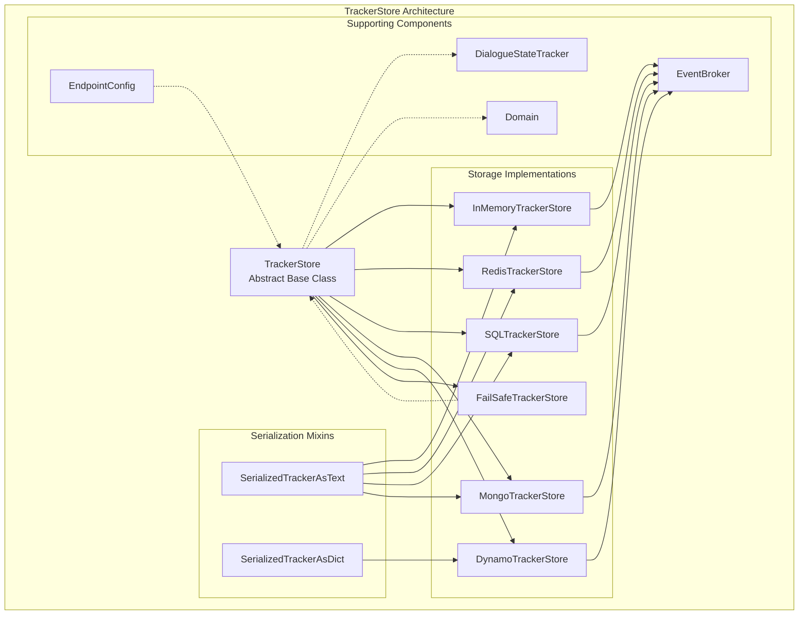
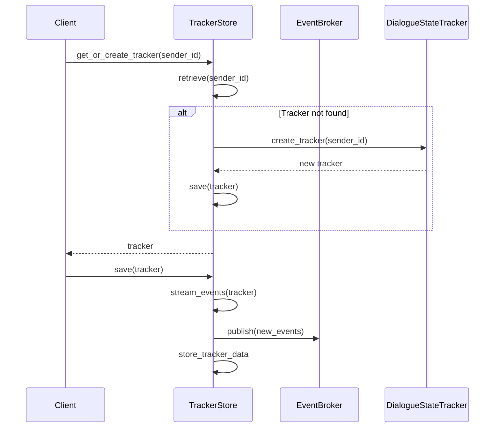
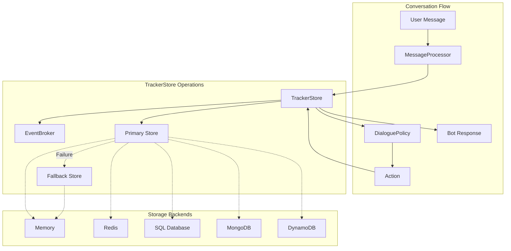
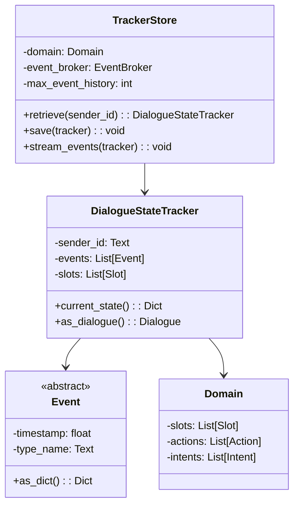
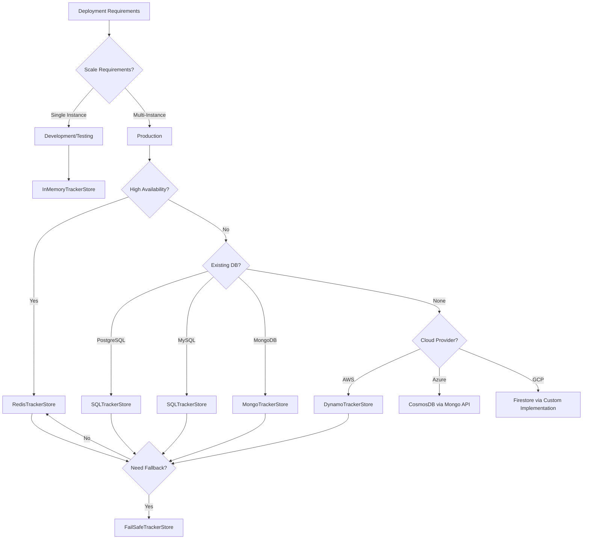
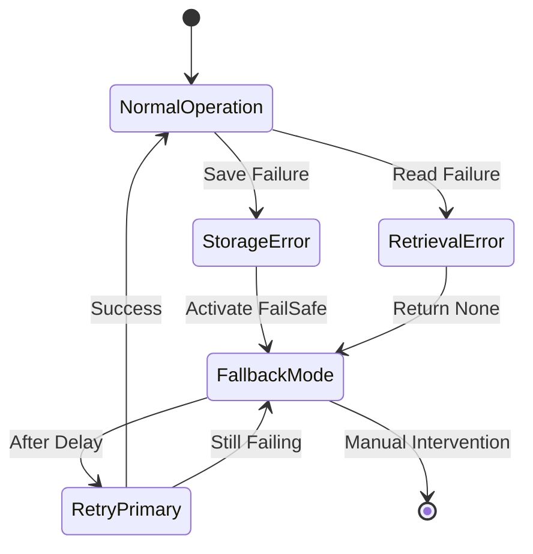
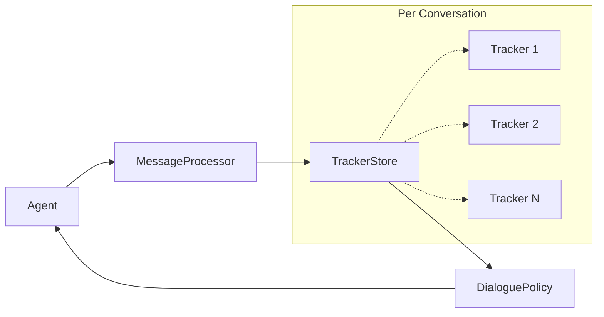

# TrackerStore Module Documentation

## Introduction

The TrackerStore module is a critical component of the Rasa Core dialogue management system, responsible for persisting and retrieving conversation state across different storage backends. It provides a unified interface for storing `DialogueStateTracker` objects that maintain the complete conversation history, including user messages, bot actions, slot values, and session information.

The module implements multiple storage strategies to accommodate different deployment scenarios, from in-memory storage for development to distributed databases for production environments. It serves as the persistence layer that enables Rasa assistants to maintain context across multiple conversation turns and sessions.

## Architecture Overview

The TrackerStore module follows a strategy pattern design, providing a common interface while allowing different storage implementations. The architecture consists of several key components working together to provide reliable conversation state management.



## Core Components

### TrackerStore (Abstract Base Class)

The `TrackerStore` class defines the common interface and shared behavior for all tracker store implementations. It provides the foundation for conversation state persistence with the following key responsibilities:

- **Tracker Lifecycle Management**: Handles creation, retrieval, and saving of dialogue state trackers
- **Event Streaming**: Coordinates with event brokers to publish conversation events to external systems
- **Domain Integration**: Maintains reference to the assistant's domain for proper tracker initialization
- **Serialization Support**: Provides base functionality for converting trackers to/from storage formats

The class implements several critical methods that form the core API:



### Storage Implementations

#### InMemoryTrackerStore

The `InMemoryTrackerStore` provides the simplest storage implementation, keeping all conversation data in Python dictionaries. This implementation is ideal for development and testing scenarios where persistence across application restarts is not required.

**Key Characteristics:**
- Ultra-fast read/write operations
- No external dependencies
- Data lost on application restart
- Suitable for single-instance deployments
- Thread-safe for concurrent access

The implementation uses JSON serialization for storing tracker states and provides full support for both single-session and multi-session retrieval patterns.

#### RedisTrackerStore

The `RedisTrackerStore` leverages Redis as a high-performance, distributed cache for conversation state. This implementation is optimized for production environments requiring fast access and horizontal scalability.

**Key Features:**
- Sub-millisecond read/write latency
- Built-in data expiration support
- Automatic failover and clustering
- SSL/TLS encryption support
- Key prefix customization for multi-tenant scenarios

The implementation includes sophisticated tracker merging logic to handle concurrent updates and provides configurable record expiration for automatic data cleanup.

#### SQLTrackerStore

The `SQLTrackerStore` provides enterprise-grade persistence using relational databases. It supports multiple database backends including PostgreSQL, MySQL, SQLite, and Oracle, making it suitable for organizations with existing database infrastructure.

**Advanced Capabilities:**
- ACID compliance for data integrity
- Schema migration support
- Connection pooling for high throughput
- PostgreSQL-specific optimizations
- Event-level granularity for detailed querying

The implementation uses SQLAlchemy ORM for database abstraction and includes sophisticated event filtering to efficiently retrieve conversation sessions.

#### MongoTrackerStore

The `MongoTrackerStore` utilizes MongoDB's document-oriented storage model, providing flexible schema evolution and powerful querying capabilities. This implementation excels in scenarios requiring complex conversation analytics.

**MongoDB Advantages:**
- Native JSON storage matching Rasa's event format
- Automatic index creation for optimal query performance
- Built-in support for complex data structures
- Horizontal scaling through sharding
- Rich query language for conversation analysis

The implementation uses MongoDB's update operations to efficiently append new events to existing conversations and provides comprehensive index management.

#### DynamoTrackerStore

The `DynamoTrackerStore` integrates with Amazon DynamoDB, providing a fully managed, serverless storage solution. This implementation is ideal for cloud-native deployments requiring automatic scaling and pay-per-use pricing.

**Cloud-Native Features:**
- Automatic table creation and management
- Built-in backup and restore capabilities
- Global tables for multi-region deployment
- Automatic scaling based on demand
- Integration with AWS IAM for security

The implementation handles DynamoDB's specific requirements such as decimal type conversion and provides efficient query patterns for conversation retrieval.

#### FailSafeTrackerStore

The `FailSafeTrackerStore` implements a circuit breaker pattern, providing resilience against storage failures. It wraps a primary tracker store with automatic fallback to a secondary store when errors occur.

**Reliability Features:**
- Automatic error detection and handling
- Configurable fallback strategies
- Graceful degradation during outages
- Error callback notifications
- Seamless recovery after failures

This implementation is crucial for production deployments where conversation state availability is critical to user experience.

## Data Flow Architecture

The TrackerStore module orchestrates complex data flows between various components to ensure reliable conversation state management:



## Component Interactions

The TrackerStore module integrates with multiple Rasa components to provide comprehensive conversation management:

### DialogueStateTracker Integration

The `DialogueStateTracker` represents the core conversation state object that TrackerStore implementations persist. The tracker maintains:

- **Event History**: Chronological sequence of all conversation events
- **Slot Values**: Current state of all defined slots
- **Session Information**: Metadata about conversation sessions
- **Active Loops**: Currently executing conversation forms or loops



### EventBroker Integration

The integration with [EventBroker](EventBroker.md) enables real-time event streaming to external systems:

- **Event Publishing**: Automatically publishes new conversation events
- **Event Filtering**: Only streams events that have changed since last save
- **Asynchronous Processing**: Non-blocking event streaming
- **Error Handling**: Graceful handling of broker connectivity issues

### Domain Integration

The Domain object provides the contextual framework for conversation state:

- **Slot Definitions**: Defines available slots and their types
- **Action Definitions**: Specifies available bot actions
- **Intent Definitions**: Defines recognized user intents
- **Validation**: Ensures tracker state consistency with domain constraints

## Configuration and Deployment

### Storage Selection Strategy

Choosing the appropriate tracker store depends on several factors:



### Configuration Examples

#### Basic In-Memory Configuration
```yaml
tracker_store:
  type: in_memory
```

#### Redis with Failover
```yaml
tracker_store:
  type: redis
  url: localhost
  port: 6379
  db: 0
  password: ${REDIS_PASSWORD}
  record_exp: 300  # 5 minute expiration
  key_prefix: "rasa:"
```

#### PostgreSQL with Connection Pooling
```yaml
tracker_store:
  type: SQL
  dialect: postgresql
  host: ${DB_HOST}
  port: 5432
  username: ${DB_USER}
  password: ${DB_PASSWORD}
  db: rasa_conversations
  login_db: postgres  # For database creation
```

#### MongoDB with Authentication
```yaml
tracker_store:
  type: mongod
  url: mongodb://mongo-cluster:27017
  db: rasa
  username: ${MONGO_USER}
  password: ${MONGO_PASSWORD}
  auth_source: admin
  collection: conversations
```

## Performance Considerations

### Storage Backend Comparison

| Backend | Read Latency | Write Latency | Throughput | Scalability | Persistence |
|---------|-------------|--------------|------------|-------------|-------------|
| In-Memory | <1ms | <1ms | Very High | Single Node | None |
| Redis | <5ms | <5ms | High | Horizontal | Configurable |
| PostgreSQL | 10-50ms | 10-50ms | Medium | Vertical/Horizontal | Permanent |
| MongoDB | 5-20ms | 5-20ms | High | Horizontal | Permanent |
| DynamoDB | 5-15ms | 5-15ms | High | Auto-scaling | Permanent |

### Optimization Strategies

1. **Connection Pooling**: Configure appropriate pool sizes for database connections
2. **Indexing**: Ensure proper indexes on sender_id and timestamp fields
3. **Event Filtering**: Implement efficient event diffing to minimize storage operations
4. **Batch Operations**: Group multiple events when possible to reduce I/O
5. **Caching**: Implement read-through caching for frequently accessed trackers
6. **Compression**: Enable data compression for large conversation histories

## Error Handling and Resilience

The TrackerStore module implements comprehensive error handling to ensure conversation continuity:



### Error Recovery Mechanisms

- **Automatic Retry**: Configurable retry logic with exponential backoff
- **Circuit Breaker**: Prevents cascading failures during outages
- **Graceful Degradation**: Continues operation with reduced functionality
- **Error Notifications**: Alerts operators about persistent issues
- **Data Recovery**: Attempts to recover lost conversation state

## Security Considerations

### Data Protection

- **Encryption at Rest**: Support for database-level encryption
- **Encryption in Transit**: SSL/TLS for all network communications
- **Access Control**: Database authentication and authorization
- **Data Masking**: Optional PII removal from stored conversations
- **Audit Logging**: Track all access to conversation data

### Compliance Features

- **Data Retention**: Configurable conversation lifecycle management
- **Right to Erasure**: Support for GDPR data deletion requests
- **Data Portability**: Export conversation history in standard formats
- **Access Logs**: Comprehensive audit trail for compliance reporting

## Monitoring and Observability

### Key Metrics

- **Storage Latency**: Track read/write operation times
- **Error Rates**: Monitor failed storage operations
- **Storage Size**: Track database growth and capacity
- **Connection Health**: Monitor database connection status
- **Event Throughput**: Measure events processed per second

### Health Checks

The module provides health check endpoints for monitoring system status:

```python
async def health_check() -> Dict[Text, Any]:
    """Perform comprehensive health check of tracker store."""
    try:
        # Test basic connectivity
        keys = await tracker_store.keys()
        
        # Test read/write operations
        test_tracker = await tracker_store.create_tracker("health_check")
        await tracker_store.save(test_tracker)
        retrieved = await tracker_store.retrieve("health_check")
        
        return {
            "status": "healthy",
            "store_type": type(tracker_store).__name__,
            "key_count": len(list(keys)),
            "read_success": retrieved is not None
        }
    except Exception as e:
        return {
            "status": "unhealthy",
            "error": str(e),
            "store_type": type(tracker_store).__name__
        }
```

## Integration with Rasa Ecosystem

The TrackerStore module serves as a central persistence layer that integrates with multiple Rasa components:

### Agent Integration

The [Agent](Agent.md) component uses TrackerStore to maintain conversation state across dialogue turns:



### Policy Integration

Dialogue policies rely on TrackerStore for historical context:

- **MemoizationPolicy**: Retrieves past conversations for exact matching
- **TEDPolicy**: Uses conversation history for transformer-based predictions
- **RulePolicy**: Applies rules based on conversation state

### Action Integration

Actions interact with TrackerStore to update conversation state:

- **Slot Setting**: Actions modify slot values stored in trackers
- **Event Creation**: Actions generate events that are persisted
- **Form Execution**: Forms maintain state across multiple turns

## Future Enhancements

The TrackerStore module continues to evolve with planned improvements:

### Performance Optimizations

- **Async I/O**: Full async/await support for all operations
- **Batch Processing**: Bulk operations for improved throughput
- **Compression**: Optional compression for large conversation histories
- **Caching Layer**: Multi-level caching for frequently accessed data

### New Storage Backends

- **Cloud Spanner**: Global consistency for distributed deployments
- **CockroachDB**: PostgreSQL-compatible distributed database
- **Apache Kafka**: Event streaming for real-time analytics
- **Elasticsearch**: Search and analytics capabilities

### Enhanced Features

- **Conversation Analytics**: Built-in analytics and reporting
- **Data Migration**: Tools for migrating between storage backends
- **Multi-tenancy**: Enhanced support for multi-tenant deployments
- **Versioning**: Track schema evolution and support rollbacks

## Conclusion

The TrackerStore module provides a robust, scalable foundation for conversation state management in Rasa applications. Its flexible architecture supports diverse deployment scenarios while maintaining consistency and reliability. By offering multiple storage backends and comprehensive error handling, the module enables organizations to choose the optimal storage strategy for their specific requirements while ensuring conversation continuity and data integrity.

The module's design emphasizes extensibility, allowing for custom storage implementations and integration with existing infrastructure. As conversational AI continues to evolve, the TrackerStore module remains a critical component that enables sophisticated dialogue management while providing the performance and reliability required for production deployments.