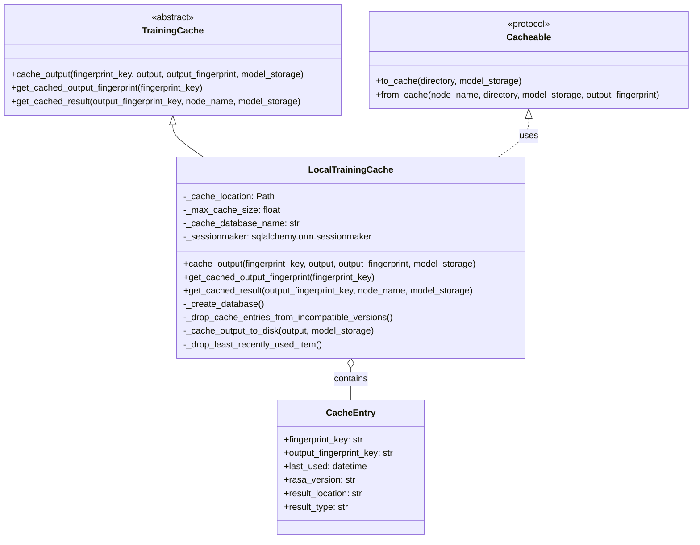
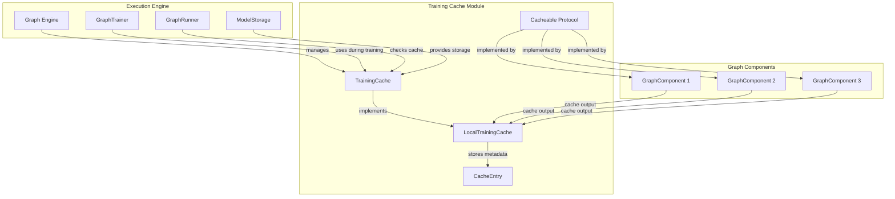
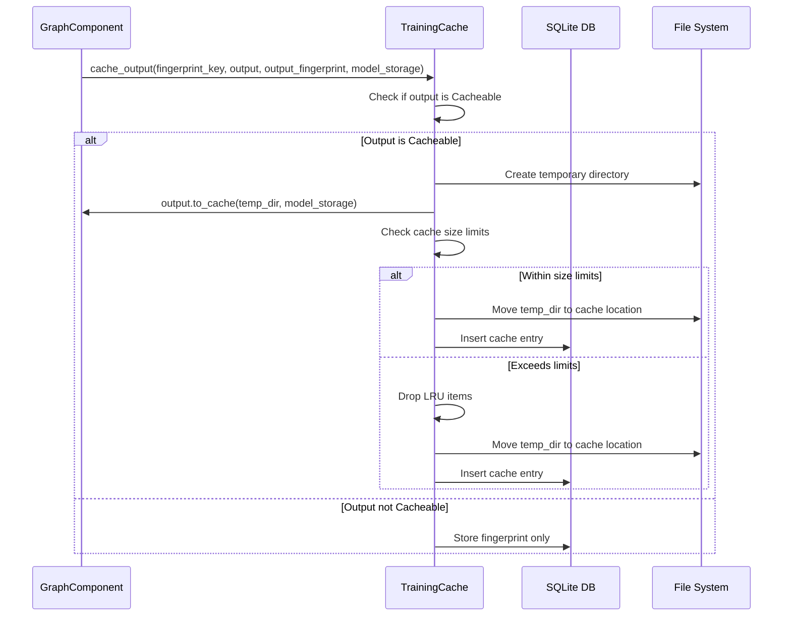
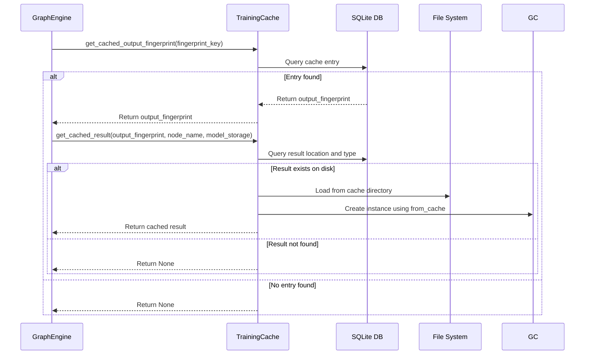
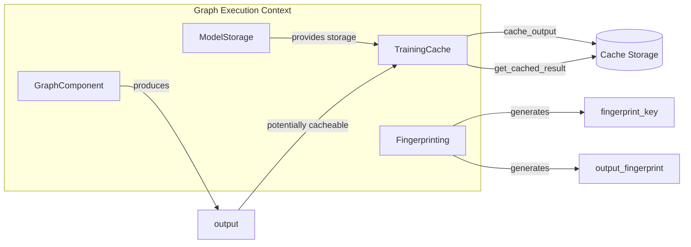

# Training Cache Module Documentation

## Introduction

The Training Cache module is a critical component of the Rasa execution engine that provides intelligent caching capabilities for training results. It minimizes redundant computation by storing and reusing training outputs when the underlying data or configuration hasn't changed between training runs. This module significantly improves training performance and resource utilization in Rasa's graph-based execution framework.

## Overview

The Training Cache module implements a sophisticated caching system that:
- Stores training results persistently on disk with metadata tracking
- Uses fingerprinting to detect when cached results can be reused
- Implements LRU (Least Recently Used) cache eviction policies
- Provides version compatibility checking to handle Rasa upgrades
- Integrates seamlessly with the graph execution engine

## Core Architecture

### Component Structure

### System Integration

## Key Components

### TrainingCache (Abstract Base Class)

The `TrainingCache` abstract class defines the interface for all caching implementations. It provides three core operations:

1. **cache_output**: Stores training results with their fingerprints
2. **get_cached_output_fingerprint**: Retrieves fingerprints for cache lookup
3. **get_cached_result**: Restores cached results when available

### LocalTrainingCache (Primary Implementation)

The `LocalTrainingCache` class implements the abstract interface using a SQLite database for metadata and local disk storage for cached results. Key features include:

- **SQLite-based metadata tracking**: Stores cache entries with fingerprints, timestamps, and version information
- **Disk-based result storage**: Persists actual training outputs to the filesystem
- **Version compatibility**: Automatically purges incompatible cache entries from older Rasa versions
- **Size-based eviction**: Implements LRU eviction when cache size exceeds configured limits
- **Environment configuration**: Supports customization via environment variables

### Cacheable Protocol

The `Cacheable` protocol defines the interface that graph component outputs must implement to be cacheable:

- **to_cache**: Persists the output to a specified directory
- **from_cache**: Restores the output from cache storage

## Data Flow

### Caching Process Flow

### Cache Retrieval Flow

## Configuration

The Training Cache module supports configuration through environment variables:

- `RASA_CACHE_DIRECTORY`: Custom cache location (default: `.rasa/cache`)
- `RASA_CACHE_NAME`: Custom database name (default: `cache.db`)
- `RASA_MAX_CACHE_SIZE`: Maximum cache size in MB (default: 1000 MB)

Setting `RASA_MAX_CACHE_SIZE=0` disables caching entirely.

## Version Compatibility

The cache implements version-aware storage:

1. Each cache entry stores the Rasa version that created it
2. Entries from versions older than `MINIMUM_COMPATIBLE_VERSION` are automatically purged
3. This ensures compatibility and prevents issues from breaking changes between versions

## Cache Eviction Strategy

The module implements a multi-level eviction strategy:

1. **Size-based eviction**: When adding a new entry would exceed the cache size limit
2. **LRU eviction**: Removes the least recently used items first
3. **Version-based cleanup**: Automatically removes incompatible version entries
4. **Orphan cleanup**: Removes entries with missing disk files

## Integration with Graph Engine

The Training Cache integrates seamlessly with Rasa's graph execution engine:

## Error Handling

The Training Cache implements robust error handling:

- **Database errors**: Gracefully handles SQLite operational errors
- **File system errors**: Manages disk space issues and permission problems
- **Version mismatches**: Automatically handles incompatible cache entries
- **Corruption detection**: Validates cached data integrity during restoration

## Performance Considerations

- **SQLite indexing**: Uses indexed columns for efficient fingerprint lookups
- **Lazy loading**: Only loads cached results when needed
- **Size monitoring**: Continuously monitors cache size to prevent disk space issues
- **Batch operations**: Groups database operations for better performance

## Dependencies

The Training Cache module depends on several key components:

- [Model Storage](Model%20Storage.md): For managing cached resources
- [Graph Engine](Execution%20Engine%20&%20Graph%20Components.md): For integration with the execution framework
- [Graph Components](Execution%20Engine%20&%20Graph%20Components.md): Components that implement the Cacheable protocol

## Best Practices

1. **Implement Cacheable protocol**: Ensure graph components that produce expensive outputs implement the `Cacheable` protocol
2. **Configure appropriate cache size**: Set cache size based on available disk space and training data size
3. **Monitor cache usage**: Regularly check cache hit rates and adjust configuration as needed
4. **Version compatibility**: Be aware that cache entries are invalidated across major Rasa versions
5. **Disk space management**: Ensure adequate disk space is available for cache operations

## Future Enhancements

Potential improvements to the Training Cache module include:

- **Distributed caching**: Support for distributed cache across multiple nodes
- **Compression**: Implement compression for cached results to reduce disk usage
- **Cache warming**: Pre-populate cache with common training configurations
- **Metrics and monitoring**: Enhanced metrics for cache performance analysis
- **Selective caching**: More granular control over what gets cached