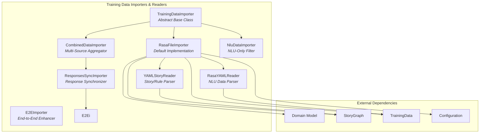
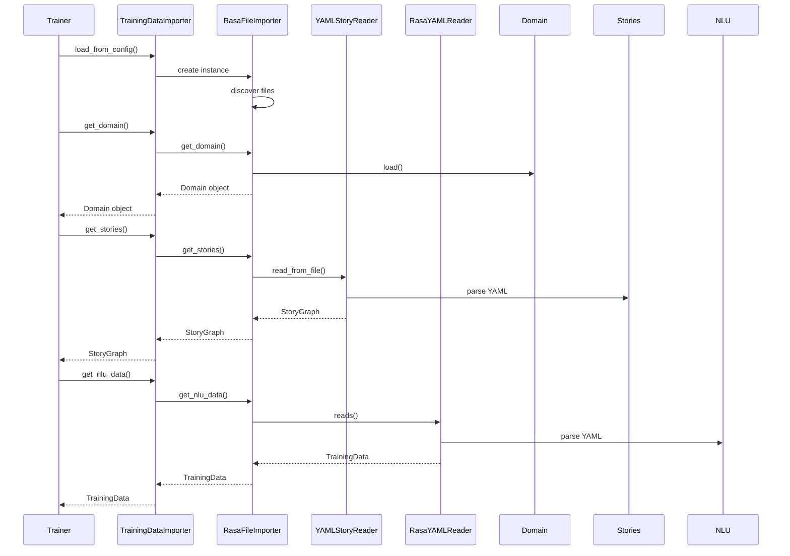
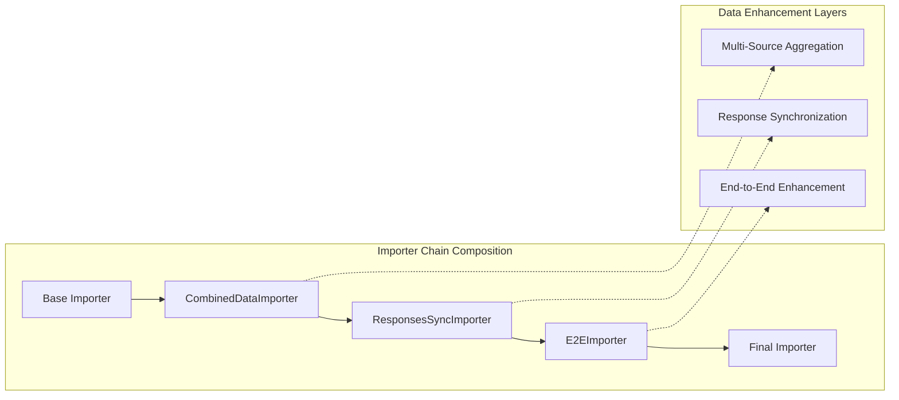
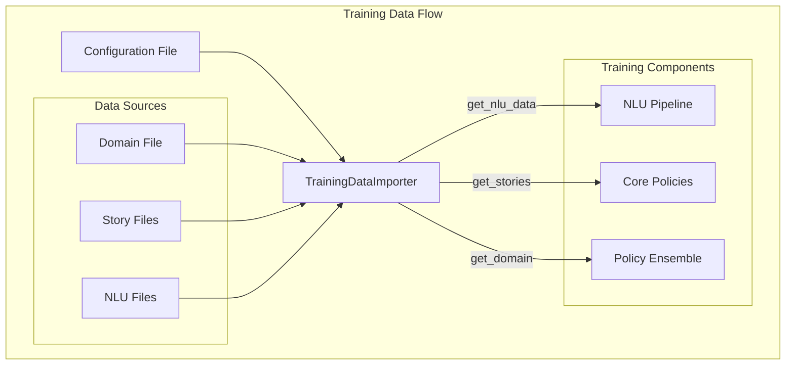

# Training Data Importers & Readers Module

## Introduction

The Training Data Importers & Readers module is a critical component of the Rasa framework that handles the loading, parsing, and validation of training data from various sources and formats. This module provides a unified interface for importing NLU training data, conversation stories, rules, and domain configurations, enabling flexible data ingestion for conversational AI model training.

The module implements a sophisticated importer architecture that supports multiple data sources, file formats, and data synchronization mechanisms, ensuring that training data from different origins can be seamlessly integrated into the Rasa training pipeline.

## Architecture Overview



## Core Components

### TrainingDataImporter (Abstract Base Class)

The `TrainingDataImporter` abstract base class defines the contract for all training data importers in the Rasa framework. It establishes a standardized interface for loading different types of training data including domain configurations, conversation stories, NLU training data, and model configurations.

**Key Responsibilities:**
- Define the importer interface with abstract methods for data retrieval
- Provide factory methods for creating importer instances from configuration
- Support specialized importer creation for NLU-only or Core-only training
- Enable composition of multiple importers through static methods

**Core Interface Methods:**
- `get_domain()`: Retrieves the bot's domain configuration
- `get_stories()`: Loads conversation stories and rules
- `get_nlu_data()`: Imports NLU training data
- `get_config()`: Retrieves model configuration
- `get_conversation_tests()`: Loads end-to-end test conversations

### RasaFileImporter (Default Implementation)

The `RasaFileImporter` serves as the default implementation of the `TrainingDataImporter` interface, providing file-based training data loading capabilities. This importer handles the standard Rasa project structure with separate files for domain, stories, NLU data, and configuration.

**Key Features:**
- Automatic file discovery and validation
- Support for YAML-based training data formats
- Integration with story readers and NLU data parsers
- Error handling and graceful degradation for missing files

**File Type Support:**
- Domain files (YAML format)
- Story files (YAML format with stories/rules)
- NLU training data (YAML format)
- Configuration files (YAML format)
- Conversation test files (YAML format)

### YAMLStoryReader

The `YAMLStoryReader` specializes in parsing conversation training data from YAML files, including both stories and rules. It provides comprehensive validation and parsing capabilities for conversational flow definitions.

**Parsing Capabilities:**
- Story definitions with user intents and bot actions
- Rule definitions with conditions and actions
- Entity extraction and slot setting
- Checkpoint definitions for story modularization
- End-to-end conversation testing support

**Validation Features:**
- Schema validation against defined story structures
- Intent validation against domain definitions
- Entity type validation
- Syntax error detection and reporting

### RasaYAMLReader

The `RasaYAMLReader` handles the parsing of NLU training data from YAML files, supporting various NLU training data components including intents, entities, synonyms, regex patterns, and lookup tables.

**Supported NLU Data Types:**
- Intent examples with entities
- Entity synonyms and mappings
- Regular expression features
- Lookup tables for entity extraction
- Response templates for retrieval intents
- Metadata support for training examples

## Data Flow Architecture



## Importer Composition Pattern



## Specialized Importers

### CombinedDataImporter

The `CombinedDataImporter` enables the aggregation of training data from multiple importer sources, providing a unified view of training data collected from different origins. This importer is essential for complex Rasa deployments that require data integration from multiple projects or data sources.

**Aggregation Capabilities:**
- Merge multiple domain configurations
- Combine story graphs from different sources
- Aggregate NLU training data
- Consolidate configuration parameters
- Handle data source prioritization

### ResponsesSyncImporter

The `ResponsesSyncImporter` specializes in synchronizing response data between domain configurations and NLU training data. It ensures consistency between response templates defined in the domain and retrieval intent responses in NLU data.

**Synchronization Features:**
- Automatic retrieval action generation
- Response template validation and merging
- Retrieval intent property management
- Cross-reference validation between domain and NLU data

### E2EImporter (End-to-End Importer)

The `E2EImporter` enhances training data by extracting additional training examples from conversation stories and incorporating end-to-end bot messages. This enrichment process improves model performance by providing more diverse training examples.

**Enhancement Capabilities:**
- Extract user utterances from stories as NLU training examples
- Add bot responses as action training data
- Generate end-to-end action definitions
- Enhance training data diversity
- Support for default action inclusion

### NluDataImporter

The `NluDataImporter` provides a filtered view of training data for NLU-only training scenarios. It excludes Core-related data while maintaining access to NLU training data and configuration.

**Filtering Features:**
- Return empty domain for NLU-only training
- Exclude stories and conversation tests
- Maintain NLU data access
- Preserve configuration integrity

## Integration with Training Pipeline



## Error Handling and Validation

The Training Data Importers & Readers module implements comprehensive error handling and validation mechanisms to ensure data integrity and provide meaningful error messages for troubleshooting.

**Validation Layers:**
- File format validation (YAML syntax)
- Schema validation against defined structures
- Domain consistency validation
- Cross-reference validation between data types
- Semantic validation of training examples

**Error Recovery:**
- Graceful handling of missing files
- Partial data loading with warnings
- Fallback to default configurations
- Detailed error reporting with documentation links

## Performance Optimizations

The module incorporates several performance optimizations to handle large training datasets efficiently:

**Caching Mechanisms:**
- Cached method results for expensive operations
- Lazy loading of training data components
- Reuse of parsed data structures
- Memory-efficient data streaming for large files

**Scalability Features:**
- Support for incremental data loading
- Parallel processing capabilities for multiple files
- Memory-conscious data structure design
- Efficient data merging algorithms

## Extension Points

The modular architecture of the Training Data Importers & Readers module provides several extension points for custom implementations:

**Custom Importers:**
- Implement `TrainingDataImporter` interface
- Support for custom data sources (databases, APIs, etc.)
- Integration with external data management systems
- Custom data transformation and validation logic

**Custom Readers:**
- Extend base reader classes for new formats
- Support for legacy data formats
- Custom parsing logic for specialized data types
- Integration with domain-specific data sources

## Dependencies and Integration

The Training Data Importers & Readers module integrates with several other Rasa modules:

**Core Dependencies:**
- [Domain Model](Domain%20Model.md): For domain configuration loading and validation
- [NLU Training Data Structures](NLU%20Training%20Data%20Structures.md): For NLU data representation
- [Core Training Data Structures](Core%20Training%20Data%20Structures.md): For story and rule representation

**Integration Points:**
- [Execution Engine & Graph Components](Execution%20Engine%20&%20Graph%20Components.md): For training pipeline integration
- [NLU Pipeline](NLU%20Pipeline.md): For NLU training data provision
- [Dialogue Policies](Dialogue%20Policies.md): For conversation training data provision

## Best Practices

**Data Organization:**
- Maintain consistent file naming conventions
- Separate training data by type (NLU, stories, rules)
- Use version control for training data management
- Implement data validation in CI/CD pipelines

**Performance Optimization:**
- Leverage caching for repeated data access
- Use appropriate data formats for large datasets
- Implement incremental data loading for large projects
- Monitor memory usage during training data loading

**Error Handling:**
- Implement comprehensive logging for data loading issues
- Use validation tools to check data consistency
- Provide fallback mechanisms for missing data
- Document data requirements and constraints clearly

## Configuration and Usage

The Training Data Importers & Readers module is typically configured through the main Rasa configuration file, which specifies the importer class and associated parameters:

```yaml
# config.yml
importers:
  - name: "RasaFileImporter"
  - name: "CustomImporter"
    parameter1: "value1"
    parameter2: "value2"
```

For advanced use cases, multiple importers can be chained together to create sophisticated data loading pipelines that handle complex data integration requirements.

The module's flexibility and extensibility make it suitable for a wide range of deployment scenarios, from simple file-based projects to enterprise-scale conversational AI systems with complex data management requirements.